# 挖坟：进阶实践

:::warning 阅读提醒
这一页集中放高危站点、复杂路线和进阶技巧，不适合完全新人直接照抄。建议先看完 [挖坟：开始之前](./getting-started.md) 和 [挖坟：入门正文](./basics.md)。
:::

:::danger 核心生存法则
- 进高危站点前先处理好高价值物品，能放移动机库就不要硬带在身上。
- 需要二次进场、换装、回收残骸或拉怪的场景，优先记位标再操作。
- 本地、倒计时、炮塔、冲击波和“再贪一箱”冲突时，优先撤离。
- 看不懂当前站点状态时，宁可先跳走，也不要盲进轨道、穿红线或硬顶未知伤害。
:::

:::tip 配套查表
产出、伤害、推荐配装和气云星座统一整理在 [补充内容](./supplemental-content.md)。
:::

以下内容默认以钢板小白或同级别配置为参考；如果你驾驶中白、T3 或其他更高有效配置，可以按自己的续航和抗性自行变通。

## 幽灵坟 Ghost Sites

幽灵坟一共有 4 种，均为 III 级数据信号；新八区版本按 I 级战斗信号处理。超级隐秘坟只存在于虫洞中。

常见命名形式：`Lesser/Standard/Improved/Superior + 势力 + Covert Research Facility`

幽灵坟一共有 4 个箱子，呈正方形或者半圆弧布置。老攻略常把它写成“从跃迁开始计算的纯隐藏计时器”，这在现在已经不够准确。按 2025 之后的机制，守卫到达前仍有一段随机等待时间；守卫到达后，界面会出现可见倒计时，固定为 30 秒，时间结束后剩余箱子会爆炸。

这意味着跑幽灵坟不能再只靠音乐判断，也不要把“点跃迁后还能贪多久”当成固定数值。更实用的做法是：守卫没到之前尽快完成最值钱的 1-2 箱；守卫一到场，就按界面倒计时决定是否立刻撤离。

箱子破解失败或被打会直接爆炸并造成大量爆炸伤害，等级越高伤害越大，要想抗住只能堆爆抗。除了超隐其他的破解难度通常不算离谱，但因为容错极低，仍建议使用 T2 数据分析仪。因为危险度极高，所以萌新请使用廉价飞船如 Heron，在进入前使用移动机库把所有值钱的东西都保存好。

### 具体流程

注意：幽灵坟里不要把“先点分析仪试试看，不行就直接跳走”当成保底。中途离场往往意味着你已经浪费了当前窗口，而且很容易和守卫到场或箱子爆炸重叠。切记开推子的时候不要环绕，会冲出破解范围，也等于白白损失当前箱子。

1. 把所有物资包括姐妹会发射器放进移动机库（把甲修覆膜和损控换成爆抗）
2. 隐身状态下起跳，在总览出现箱子的时候解除隐身，落地正好可以锁定（没有隐秘行动时，跃迁至离坟点最近的点，把飞船朝向坟点，再跃迁）
3. 观察总览里四个箱子的名称，先靠近（不需要环绕，保持距离 2100m）名字不一样的那个箱子，记得开一轮推子
4. 在靠近的这段时间内，先启用 3 个爆抗，然后锁定所有的箱子并使用货柜扫描，确定最值钱的那个；建议先在 [补充内容页的“挖坟产出”部分](./supplemental-content.md#挖坟产出-loot) 里记下幽灵坟常见高价值物品
5. 破解完成以后，如果守卫已经到场并出现倒计时，请按剩余时间决定是否立刻离开。大多数护卫和普通小白配置都不该把判断建立在“再贪一箱也来得及”上
6. 守卫到场后，爆抗小白通常也应优先点隐身并离开；中白这类更耐打的船可以视位置和倒计时决定是否把当前箱子收完

守卫到场后留给你撤离的窗口很短，而且剩余箱子会在倒计时结束时爆炸，不要停留到最后一秒。

### 小技巧

1. 钢板小白换上 3 个主动爆抗，可以抗住超隐爆炸，看到总览来怪，先点隐身后马上跳走。
2. 可以放出一个无人机，来怪后怪会优先去打无人机，能争取一点时间
3. 可以直接跃迁到 10km 处，能离箱子更近一些

隐秘坟数据统计：

| 项目 | 低隐 | 标隐 | 高隐 | 超隐 |
| --- | --- | --- | --- | --- |
| 出现区域 | 高安 | 低安 | 00 | 虫洞 |
| 纯爆炸伤（半径 10km） | 6000 | 8000 | 10000 | 12000 |
| 刷怪数量（种类随机，伤害见 [补充内容页的伤害数据库](./supplemental-content.md#伤害数据库-damage-data-base)） | 4 | 6 | 8 | 10 |

箱子类型及数量见下表，对应产出可对照 [补充内容页的“挖坟产出”部分](./supplemental-content.md#挖坟产出-loot)：

| 箱子类型 | 低隐 | 标隐 | 高隐 | 超隐 |
| --- | --- | --- | --- | --- |
| Secure Depot | 3 |  |  |  |
| Secure Lab | 1 | 3 |  |  |
| Secure Databank |  | 1 | 3 |  |
| Secure Mainframe |  |  | 1 | 3 |
| Secure Vault |  |  |  | 1 |

爆伤计算公式：

实际伤害=坟的爆炸伤害值X（1-船的爆伤抗性）

例子：高隐炸爆伤抗性 88 的小白

实际伤害=10000 X（1 - 0.88）= 1200

也就是说你的护甲值大于 1200，就不会被炸死，当然你也可以把盾和结构计算进去。

## 气云考古 Gas Sites

部分低安与 00 区域（热点星系大概率出现气云信号，全星域会小概率出现气云信号；具体热点见 [补充内容页的“气云星座”部分](./supplemental-content.md#气云星座-gas-cloud-regions)）会出现增效剂对应的气云采集和战斗站点，一般情况下是应该清怪后再开箱子，但是因为箱子不上锁，所以可以做到拉怪去开，主要收益是开出技能书和药丸图。低安的用钢板小白可以不拉怪，直接跳进去开，00 区域必须拉怪。

### 具体流程

1. 跳 0km 点，在显示距离 2000-8000km 的时候，Ctrl+B 保存位置
2. 落地后，扫描，标记值钱的箱子（00 的话，落地马上朝向保存点开推子，再扫描，并把怪拉到离箱子 40km 以上）
3. 跳到刚才保存的点，修满甲，再跳箱子 0m 位置开箱
4. 重复步骤3，直到开完

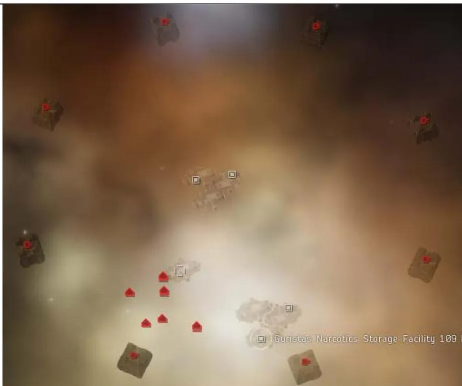
低安

| 站点 | 等级 | 产出 |
| --- | --- | --- |
| Gas Processing Site | III 级信号 | 出产技能书、脑插、标准图、普通反应配方，小概率出加强图和加强配方。 |
| Chemical Lab | III 级信号 | 出产技能书、脑插、标准图、普通反应配方，小概率出加强图和加强配方。 |

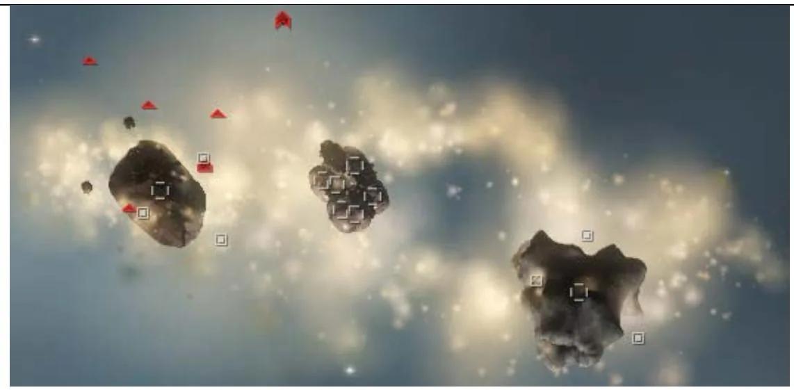

| 站点 | 等级/区域 | 说明 |
| --- | --- | --- |
| Distribution Base | IV 级信号；00 区域 | 包含 3-9 个箱子。隐身状态下，部分箱子会隐藏。这个站点的箱子多在角落，容易卡建筑损；跳 0 后先调整位置并环绕 500m 观察，确认不会卡住再去开箱。有时会刷两艘货运舰，可能掉落蓝图，可以先用货柜扫描。出产技能书、脑插、标准和加强图、普通和加强反应配方，小概率出超强图和超强配方。 |
| Production Facility | IV 级信号（可能为战斗信号）；00 区域 | 包含 3-9 个箱子，有 2 座毁电塔（毁点范围 50km）。小白会被一下毁光，还有精英护卫上反跳，所以请务必拉怪挖；开推子把怪拉离箱子 50km 即可。有时会刷出名字唯一的小 BOSS（巡洋或战列），可能掉 50-200 流程的蓝图，可以先用货柜扫描；有些 BOSS 有电子战免疫，会无法被扫描。出产技能书、脑插、标准/加强/超强图，以及普通/加强/超强反应配方。 |
| Digital 'Site' | III/IV 级信号（可能为战斗信号） | `Digital`（数字）打头的战斗气云信号，包含多个轨道，整体约 6/10 难度，毒蜥可打，能开不少箱子；后文会单独展开。 |

III 级气云信号以及战斗气云，被打开过后 1 个小时就会消失，IV 级气云会一直保存 3 天，在每天 DT 之后站内的箱子会全部刷新，所以就有了养气云的说法，DT 之前扫一遍后做好位标，DT 之后马上去开。挖气云的确是新人来钱比较快的途径，但是也比较看脸，很多时候扫了一个星域也没有一本书。

### 战斗气云 Combat Gas Sites

战斗气云名称及分布地区

| 名称 | 地区 |
| --- | --- |
| Digital Matrix | Feythabolis |
| Digital Network | Wicked Creek |
| Digital Complex | Delve |
| Digital Plexus | Vale of the Silent |
| Digital Convolution | Tenal |
| Digital Circuitry | Catch |
| Digital Compound | Fountain |
| Digital Tessellation | Cloud Ring |

各地区的战斗气云的结构基本相似，这里以特纳的 Digital Convolution 为例，介绍小白如何挖战斗气云。感谢 EVO 3016 和 784 fvtr 提供的思路和资料。

整体难度 6/10 差不多，毒蜥就可以全清，T3C 能扛怪挖掉。

#### 第一层

激活轨道后，你在第一层可以看到左右有两个轨道，分别通往第二第三层，第二层出产技能书，第三层出产标准药丸蓝图。直接开推子冲第二层轨道即可。如果觉得抗不住，可以隐身开推子一轮再慢慢爬过去，注意空间实体，手动控制方向折返一下。

#### 第二层

落地后环绕红圈中的箱子，并迅速扫描，除了中间 4 个箱子，左右两边单独标出的箱子，去挖后对应的怪会暴动， 也就差不多低安气云的伤害，注意看本地信息这里可能刷增援，4 个反跳护卫和 4 个战巡，小白可以直接放无人机捏掉反跳护卫，但是会触发暴动，需要跳出去再回来，就只有四个战巡在打你，轻松抗。那个 3 层轨道基本无视，小白建议从 1 层过去。

如果你是蓝药，黄药以及电容药的区域，可以去第三层看看，其他药丸区域挖了书层就够了。

#### 第三层

落地后边上就是一群怪，需要马上开推子反向拉怪，这层的护卫也有反跳，把大部分的怪拉至远离落地点 30km 以上，跳出去再回来，开推子靠近箱子，扫描，开箱子。如果你是上述的 3 种药丸之一，推荐你去第四层，大概率出超强蓝图。激活第四层的轨道需要把第三层的怪清光，怪物数量和第三层近似，也有反跳护卫。

PS：开了箱子 1 小时后信号才消失，DT 之前清掉的怪不会刷新，所以可以养。

## 受限的冬眠者储藏站 Limited Sleeper Caches

受限的冬眠者储藏站是一个四级数据站点，只限制护卫等级船只进入，收益在 20m 左右，需要 `85+`（拢针）的扫描强度，大部分为红色难度核心，整体难度较为简单。

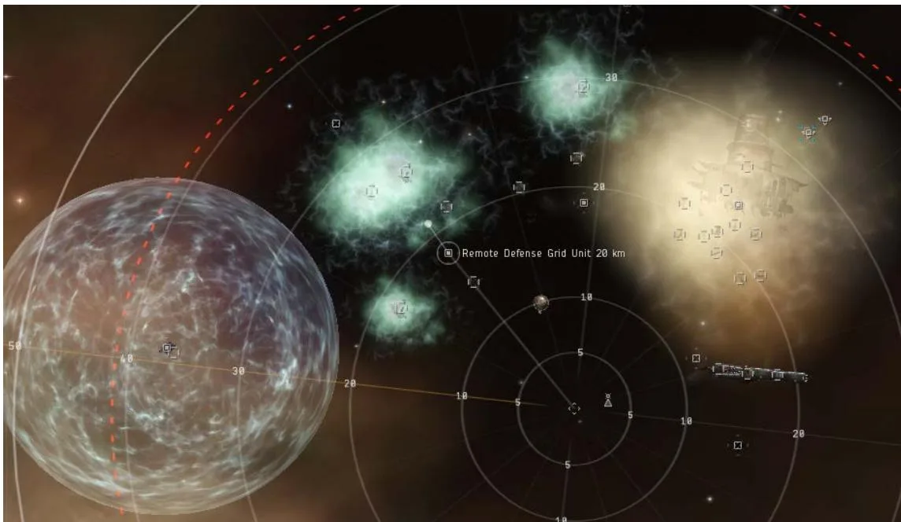

上图为限冬的整体俯视图，绿的和黄的云是有伤害的，对无抗性的船是100DPS。左下的球状立场会阻止你靠近箱子。

| 名称 | 注解 | 成功 | 失败 |
| --- | --- | --- | --- |
| Remote Defense Grid Unit | 远处 | 关闭球状立场 | 1. 什么都没有发生 2. 爆炸，造成 1225 伤害 |
| Remote Pressure Control Unit | 身边那个 | 关闭黄云伤害，持续 2-3 分钟 | 造成 200 伤害 |
| 2x Unstable Plasma Chambers | 外观是一个罐子；高速靠近（`>100m/s`）到 7-10km 时可能爆炸，造成 500 伤害，并生成一片新的毒云 | - | - |

### 具体流程

小心开船即可

## 标准的冬眠者储藏站 Standard Sleeper Caches

标准的冬眠者储藏站是一个四级数据站点，收益在 60m-200m 之间，需要 `95+`（拢针）的扫描强度，大部分为红色难度核心，除了物品箱子其他均需要数据分析仪，建议使用 T2 分析仪。新手如果暂时开不了，最稳妥的做法是先记下坐标，换更高强度配置后再回来，或者交给更熟练的朋友处理。标冬被人开过的应对方法请看本节末尾。

### 新手流程 Basic Guide

#### 流程概览

1. 破解超浪发生器，进门扫一下3 个箱子，除了最远处那个，有值钱的可以开掉，然后破解 Remote Defense Grid Unit 把炮台移过来
2. 破解 3 个坐标箱子，放到高能盒子里面，激活轨道前往后部
3. 落地后，环绕并破解边上的 Remote Defense Grid Unit，成功后放无人机打掉远处的炮台，然后开箱子
4. 保存当前位置，跃迁出去再跳回来，回到物流区，破解远处的那个MangledStorage Depot，然后破解刷出来的警报单元

破解成功：开掉那个完整的盒子，前往牵引光束区

破解失败：马上垂直向下开推子，至 120km 处离开毒雾范围。然后避开毒雾前往牵引光束边上的轨道，进入第二层，看第 6 步

5. 切向靠近牵引光束区的炮塔，并用无人机打掉，破解 Remote Defense GridUnit 并手动失败，直到触发警报。垂直向下开推子，至 80km 处离开毒雾范围。出现轨道后进入第二层

6. 到达第二层，靠近信标，直到看见 10km 外的 Remote Defense Grid Unit，破解。扫描刷出来的箱子，先破解最值钱的 2 个，然后去破解 Self-DestructCan，成功破解后可以去破解另 2 个箱子

### 各区域介绍 Sections Introduction

说明：下面这一节是按区域拆开的详细解法，建议和前面的新手流程对照着看。

超浪发生器 Hyperfluct Generator

需要：数据分析仪

成功：出现轨道

失败：2 分钟倒计时，结束之前没能成功破解，自毁（没有伤害）

进门之前先介绍一下警报机制

警报等级：破解失败会提升一个警报等级。警报等级分1-5 级每一级都可能出

现守护者，上升到第 5 级一定出现守护者。

守护者Guardian：不是怪，是一种范围伤害的毒雾。出现前本地聊天框会有提示，一旦出现右图红字中的30s 倒计时，请马上垂直向下打开推子离开。毒雾出现时范围30km，30s 后扩散，扩散后范围70km 左右，伤害

Alarmraised to level 5.Guardianscan activate when alarm level rises. Elevated alarmGuardians willdeptoy in 30 seconds to clear out area The Guardian Extermination Units have deployed.They have started discharging corrosive materials to clean up the area. Be very careful when maneuvering close to them and note that the corrosive materials will build up over time. The clouds of corrosive material are about to expand. One of the Guardian Extermination Units seemsto be malfunctioning.

4x100/s 全伤，扩散后 4x250/s 全伤。攻击建筑 Sleeper Enclave 会马上触发警报刷守护者，任何情况刷毒雾后，在牵引光束位置都会出现前往第二层的轨道，并且跃迁进入点会移动到靠近轨道的毒雾外部。

#### 第一层

分 3 个区域 1.物流区 2.牵引光束区 3.后部

#### 物流区

红圈为 3 个坐标盒子，蓝圈为高低能量盒，右下为最远处的 MangledStorage Depot

| 名称 | 注解 | 成功 | 失败 |
| --- | --- | --- | --- |
| Mangled Storage Depot | 图片右下角，推荐去二层前再开 | 刷出一个报警单元，必须在 1 分钟内破解，否则会刷守护者；开了这个后高低能轨道会失效 | 无惩罚 |
| Defense Alarm Unit | 1 分钟时限 | 刷出一个完整的箱子 | 触发警报 |
| Mangled Storage Depot | - | 顺利打开 | 无惩罚 |
| Dented Storage Depot | - | 冬眠信号消失；离开站点或隐身 2 分钟后，这个坟会消失 | 无惩罚 |
| Remote Defense Grid Unit | - | 将远处的一个炮台关闭，并启动牵引光束旁的一个炮台 | 提升一个警报等级 |
| 3x Coordinate Plotting Devices | 坐标盒子，破解后不需要打开 | `Z-Axis Calibration Coordinate` `Y-Axis Calibration Coordinate` `X-Axis Calibration Coordinate` | 可能提升一个警报等级 |
| Low Power can | 放入 3 个坐标 | 激活通向牵引光束的轨道 | - |
| High Power can | 放入 3 个坐标；推荐优先使用 | 激活通向后部的轨道 | - |

后部

通过高能轨道来到后部，图中目前锁定的是要开的控制单元，远处是要打的炮台，右边上是隐藏箱子。

| 名称 | 注解 | 成功 | 失败 |
| --- | --- | --- | --- |
| Remote Defense Grid Unit | 落地后环绕，马上破解 | 关闭左侧靠近的那个炮台，激活牵引光束区域的炮台 | 提升一个警报等级 |
| 3x Sentry Tower（Restless / Vigilant / Wakeful） | - | 基本打不中；关闭一个后，开推子切向靠近远的那个，环绕并用无人机打掉 | - |
| 6x Impenetrable Storage Depots | 靠近后出现 | 顺利打开 | 无惩罚 |

#### 牵引光束区

前往第二层的轨道会出现在牵引光束的边上

如果你是通过低能量轨道来的，会激活附近的一个炮塔

| 名称 | 注解 | 成功 | 失败 |
| --- | --- | --- | --- |
| Remote Defense Grid Unit | - | 关闭附近的那个炮台 | 提升一个警报等级 |
| Restless Sentry Tower | 靠近会触发的炮塔 | - | - |
| Tractor Beam Unit | - | 把后部隐藏的箱子拉过来 | 无惩罚 |

#### 第二层

这里的自毁和势力坟是一样的，不会造成伤害！

| 名称 | 注解 | 成功 | 失败 |
| --- | --- | --- | --- |
| Remote Defense Grid Unit | 靠近信标 `<2km` 出现 | 刷出 4 个盒子和 1 个自毁重置盒子，并开始 3 分钟自毁倒计时 | 无惩罚 |
| 4x Storage Depot | - | 顺利打开 | 无惩罚 |
| Self-Destruct Can | 自毁，但没有伤害 | 自毁时间重置为 3 分钟 | 自毁时间重置为 1 分钟 |

### 进阶流程 Advanced Walkthrough

:::details 特殊技巧：标冬强开（含旧机制）
中白/钢板小白强开流程，速度快，但依赖旧机制与一定的有效血量，不适合作为第一次进标冬时的默认做法。

1. 进门扫一下先开最值钱的箱子，再开远处的 Mangled Storage Depot，然后开 Defense Alarm Unit 以及刷出来的 Pristine Storage Depot
2. 开 Remote Defense Grid Unit，并手动失败触发警报，躲开毒雾
3. 到中点，扛着炮台快速打开 Remote Defense Grid Unit 然后进入第二层
4. 开完第二层后保存位置，跳出去再回来，去开牵引光束 Tractor Beam Unit，再开拉过来的箱子，炮塔不会打你（会打刚才开掉的那个防御单元）
:::

### 养标冬

不开 Dented，Intact 和 Mangled 的箱子信号不会消失，DT 后用牵引拉过来的 6个后部箱子会刷新，你就能多开6 个箱子，同样第二层的箱子也会刷新。

### 标冬被人开过后怎么处理

跳进去后，看中点是否被毒云覆盖，如果有毒云，说明这个标冬开爆过了一个维护期，里面的毒云是没有伤害的，可以按照正常的标冬程序开。如果没有毒云覆盖，说明这个标冬是当天开爆的，毒云不能进，但是可以用上方的强开流程来，开掉后部的箱子然后去2 层。近点的箱子就不要想了。

## 超级的冬眠者储藏站 Superior Sleeper Caches

超级的冬眠者储藏站是一个五级数据站点，收益在 120m-300m 之间，需要

105+（拢针）的扫描强度，几乎全部为红色难度核心，除了物品箱子其他均需

要数据分析仪，强烈建议使用黑镜+T2 分析仪。新手如果扫到该信号但没有把握，

最好先记位标，换装或换船后再回来，不要拿普通练手船硬顶。

超冬可分为 4 部分，电离室风险较大。超冬被人开过的应对方法请看本节末尾。

### 新手流程 Basic Guide

#### 流程概览

1. 破解超浪发生器，无论落在哪个位置都回电厂近点开始
2. 破解中点的 Solray Observational Unit，将获得的盘子放到对应名字的盒子里
3. 扫描气云中的盒子，开掉值钱的，去近点轨道前往炮塔层
4. 用保持距离，先破解左边的防御单元（失败请马上离开），成功后马上开推子到右边破解维修单元
5. 待所有炮塔都消失后，再过去开那 9 个盒子
6. （电离室有一个箱子可以无风险开）

#### 可选

7. 回到电厂，放下移动机库把货舱东西全部放入以及姐妹会的发射器，换上爆抗，别忘了带上甲修材料，并保存位置
8. 前往远点破解修正单元，回到中点前往地雷区，起跳之前启用爆抗
9. 地雷区攻略请看下方“地雷区 Mine Room”

10. 雷区破解完后跳出去，再跳回来，保存好刚才开出的东西后，前往炮塔层，破解超浪发射器，前往电离室，轨道如需要充能请看下方“炮塔层 Sentries on Duty”
11. 电离室攻略请看下方“电离室 The Archive”

说明：下面开始是超冬各区域的分拆说明，建议和上面的“新手流程 Basic Guide”对照阅读。

### 入口 Entry

超浪发生器 Hyperfluct Generator

需要：数据分析仪

成功：出现轨道

失败：2 分钟倒计时，结束之前没能成功破解，自毁（没有伤害）

激活轨道可能会跃迁到以下 3 个位置，请激活边上的轨道，返回恒星能量发电厂近点处开始挖坟流程

1. 电厂近点
2. 电厂远点，激活边上的轨道回到近点
3. 炮塔层，激活边上的轨道回到电厂近点

### 恒星能量发电厂 Solray Power Plant

电厂分为 3 个点：近点、中点、远点。各点都被黄色毒雾包围，稳定前约为 `600/s` 的纯 EM 伤害。

| 区域 | 名称 | 注解 | 成功 | 失败 |
| --- | --- | --- | --- | --- |
| 近点 | Solar Grammar Alignment Unit | - | 对应放入 `Modulate Disc` | - |
| 近点 | Spatial Rift | 近点 | 前往“炮塔层” | - |
| 中点 | Dented Storage Depot | - | 冬眠信号消失；离开站点或隐身 2 分钟后，这个坟会消失 | 无惩罚 |
| 中点 | Solray Observational Unit | 需要打开 | 获得任意一个 `Modulate Disc`：`Infrared` / `Radio` / `Gamma` | 无惩罚 |
| 中点 | Solar Grammar Infrared Unit | - | 对应放入 `Infrared Modulate Disc` | - |
| 中点 | Spatial Rift | 中点 | 前往远点；远点校准后前往“地雷区” | - |
| 中点 | 6x Storage Depot | - | 放入对应 `Alignment Discs` 后，毒雾伤害会降低至 `25/s`，毒雾范围 `13-17km`；破解失败无惩罚 | - |
| 远点 | Solray Radio Alignment Unit | - | 对应放入 `Radio Modulate Disc` | - |
| 远点 | Remote Reroute Unit | - | 校准中点轨道 `Spatial Rift` | 无惩罚 |
| 远点 | Spatial Rift | 远点 | 校对单元成功：回到中点；校对单元失败：到达炮塔层中心并触发炮塔 | - |

### 炮塔层 Sentries on Duty

在敌方的炮塔全部消失之前，不要过红线，也不要放无人机过线，防御单元一旦失败炮塔层就开废了。

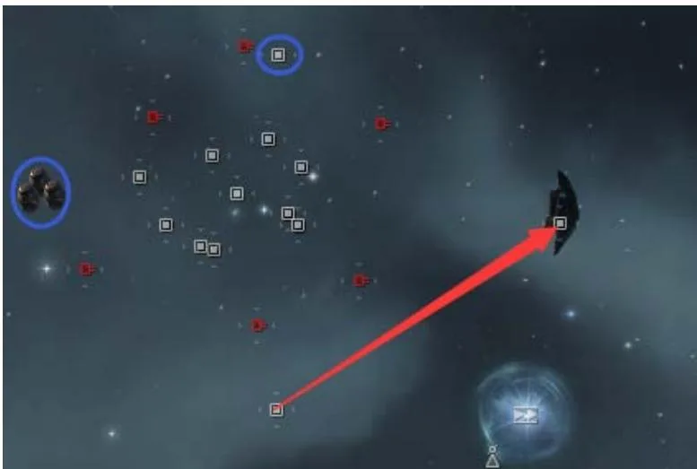

| 名称 | 注解 | 成功 | 失败 |
| --- | --- | --- | --- |
| Spatial Rift | - | 回到电厂中点 | - |
| 2x Wakeful + Vigilant + Restless Sentry Tower | 不要超过防御单元与维修单元之间的红线，否则就会攻击你；单炮塔伤害约 `400-700`，暴击会到 `1500+` | - | - |
| Remote Defense Grid Unit | 这个一旦开失败，炮塔层通常就只能放弃 | 离你最近的炮塔会变成友方，帮你打其他炮塔；这个炮塔只能被维修单元修，不能被玩家修 | 本地显示 `45s` 倒计时，时间到后会再刷 `16` 个炮台，无论是否破解成功 |
| Sentry Repair Station | 可以不破解 | 为友方炮塔维修；高有效船在成功破解维修单元后，可以过线硬抗两轮伤害，随后所有炮塔会立刻自毁 | 无惩罚 |
| 9x Storage Depot | - | 顺利打开 | 无惩罚 |
| 3x Unstable Plasma Chambers | 蓝圈 | 被攻击会爆炸，为轨道充能；`100000` 点爆炸伤害，爆炸后还会产生毒云，并在 `60s` 后刷炮台 | - |
| Hyperflux Generator | 位于盒子中间 | 1. 出现前往“电离室”的轨道。2. 无法直接开启，轨道需要充能；引爆那 3 个罐子即可为轨道充能 | 无惩罚 |
| Vessel Rejuvenation Battery | 蓝圈 | 为你提供 `10s` 无敌，可配合攻击引爆罐子来给轨道充能 | 无惩罚 |

:::details 特殊技巧：炮塔层旧机制
备注：炮塔层也可以使用那个空箱子旧机制。即使被开爆了，如果你能硬抗炮塔开掉一个箱子，跃迁出去再回来，你会发现所有炮塔都只会打那个箱子。

三层轨道充能思路：先放出无人机，这边破解恢复单元，点出核心别急着点掉，让无人机去攻击罐子，在飞到半路时点掉核心。充能轨道后，这时你只有 60 秒时间去重新破解超浪轨道，成功与否 60 秒后都会刷出 16 个炮台。这个维护打开后会大幅减低罐子的伤害至 400 点左右，无法用来炸别人船。
:::

### 地雷区 Mine Room

雷区如果你有 3w+的有效可以趟过去，但是需要 10W+有效才能抗住破解失败在落地之前可能会吃到伤害。如果操作得当，可以无伤开。

地雷区机制：落地之后，靠近隐藏的防御单元，破解后会显示部分地雷，滚轮放大并移动视角才能看见显示的地雷，存在隐藏的地雷，地雷的位置是固定

的。同时也会显示部分盒子，雷区一共 3 个盒子，位置是固定的，没有显示的盒子，手动驾驶飞船靠近 10km 内就会出现，位置请参考后图。

靠近地雷 10km 内会触发爆炸，单颗伤害分为 2000，3000，4500，5500，

6000，7500 这几种，纯爆炸伤害，一次触发会引爆 1-3 颗地雷，速度过快的情况下会出现连续触发 2 次的情况（4 颗雷）。钢板小白如果能稳定维持 `88%+` 爆抗，一般不会被直接炸死。3 个箱子的位置如后图所示，以信标为原点，手动控制飞船就能把箱子撞出来。

| 名称 | 注解 | 成功 | 失败 |
| --- | --- | --- | --- |
| Remote Defense Grid Unit | 10km 内出现 | 显示 `1-3` 个盒子，并显示部分地雷位置 | 引爆所有地雷 `20-25` 颗 |
| 3x Storage Depot | - | 顺利打开 | 无惩罚 |

### 地雷区攻略方法

无伤雷区路线：

注意：从信标处起跳，避免吃到地雷，撞出箱子及时停船。

落地后靠近信标，刷出防御单元后靠近并破解（非必须，失败必死）。

撞 Dented 箱子沿刻度线开 1 轮推子即可。

撞 Pristine 箱子，调整视角到 100KM 刻度线在最外围，双击低槽第四个位置的右下方为舰船方向，开 2 轮推子。

撞 Intact 箱子，需要在信标处先垂直上升至 5700m-6100m，然后调整视角到100KM 刻度线在最外围，双击右侧 30KM 刻度数字为舰船方向，开 2 轮推子。

注意3 个箱子离信标的距离，一旦发现自己到了这个距离还没撞出箱子，请立刻停船原路返回信标处，再重新尝试。

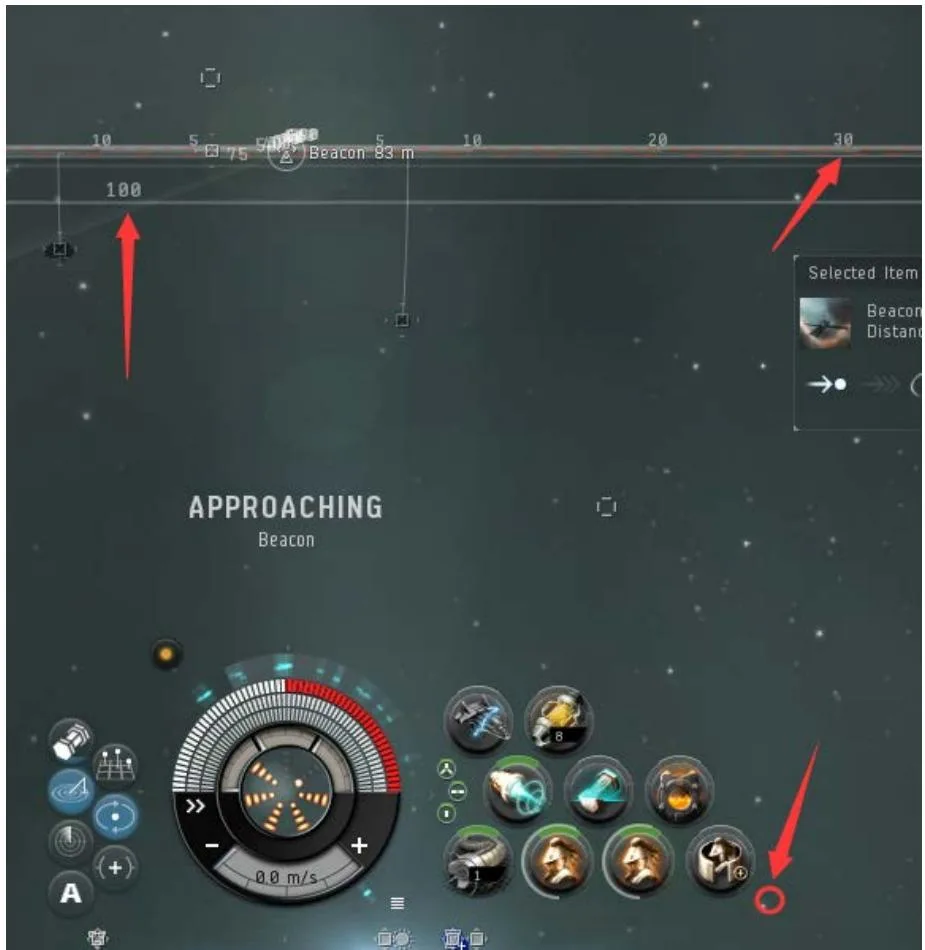
操作示意图

小白抗地雷方法

注意： 技能不足的情况下 55 爆抗只能超载 4 轮，如果装备双 64 爆抗，不需要超载。全部使用保持距离。被雷炸到后马上停船维修好血量再前进。

上双爆抗，低槽请按右图所示摆放，确保4 次超载不会超坏其他装备，点击图

示的小圆圈能直接将低槽全部预超载，并在下一次循环开始超载。

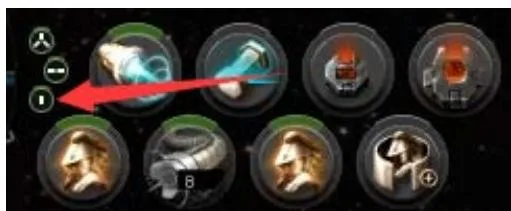

雷区箱子分布图

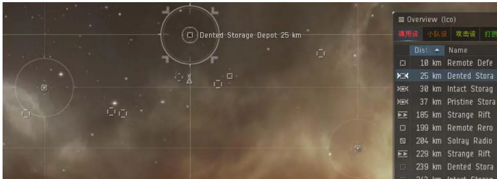
上俯视图
下侧视图

### 电离室 The Archive

电离室分布着很多残骸，残骸被毒云包裹靠近会造成伤害（全伤 4x100/s），可

能会出现暴击 800 伤害，小白不要靠近，直线前往 Defense Targeting

Augmentation 不会碰到废墟毒云

| 名称 | 注解 | 成功 | 失败 |
| --- | --- | --- | --- |
| Defense Targeting Augmentation | - | 大幅降低炮塔的命中率 | 刷炮塔 |
| 3x Cerebrum Maintenance Chambers | - | 顺利打开 | 刷炮塔 |
| 4x Impaired Archive Sentry Tower | 出现条件：1. 破解失败；2. 激活 `Cerebrum` 后 | 每个炮塔伤害在 `700` 左右，`12s` 一轮 | - |
| Central Archive Cerebrum | - | 放入 `3` 个 `Intravenous Oscillation Fluid` 激活；建议先放入另外两种物品各 `3` 份 | - |
| 10x Storage Depot | - | 顺利打开 | 无惩罚 |
| 3x Vessel Rejuvenation Battery | - | 顺利打开，刷 `90s` 恢复云，`1s` 修满 | 无惩罚 |

电离室的机制：在 `Cerebrum` 激活之后就会开始倒计时，90 秒后第一波冲击到达。之后随着逗留时间越长，冲击波出现得越频繁，每次持续 5 秒。

除了第一波是“本地提示出现后 90 秒到达”，后续冲击波的时间间隔并不固定，前几波常见为 20-40 秒，也可能出现多波冲击波（最多 3 波）同时到达的情况。前 3 波大概率仍是单冲击波。

激活 6 分 30 秒后会出现 `colossal wave`，伤害约为普通冲击波的 3 倍。普通冲击波每秒造成四属性总计约 `2400/s`，持续 5 秒，总伤约 `12000`。

激活后会逐渐刷出箱子，半分钟后 9 个箱子全部出现，激活同时也会出现恢复单元，一共有 3 个恢复单元，第二个恢复单元大概在 2m20s 出现，第三个大概在 4m30s 出现，单元破解成功后会提供 90s 的无敌，但是范围只有 5000m。目

注：目前资料显示只有区域①的恢复单元有效。

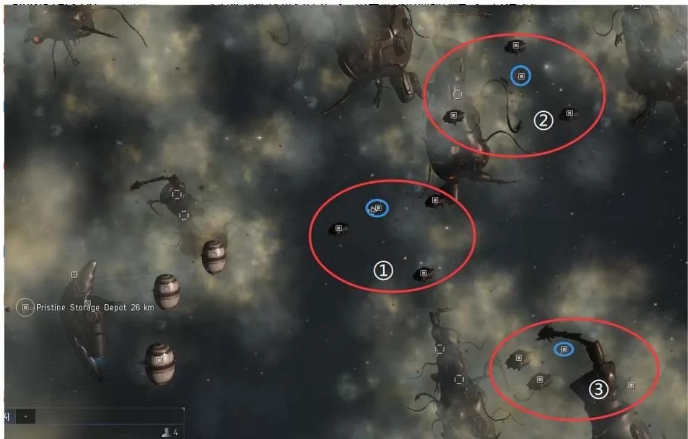

箱子的分布图示：每 3 个箱子（红圈）围绕 1 个恢复单元（蓝圈），另有 1 个箱子刷在远处废墟旁。有一定几率某个箱子被炮塔替换，也有一定几率某个箱子变成空箱子。

三个区域的风险大致如下：

1. 区域 1：无明显地形风险，靠近任何箱子都相对安全。
2. 区域 2：最外侧的箱子和维护单元较安全，内部 2 个箱子紧贴废墟。
3. 区域 3：最外侧箱子较安全，维护单元和内部 2 个箱子都紧贴废墟。

另外，在 3 个区域外，远处废墟里的那个箱子距离废墟空间实体不到 500m

### 电离室的攻略方法

在电离室内使用推子请小心，务必提前停船，防止冲进废墟

:::details 特殊技巧：电离室旧机制
激活之前：在进来后先去破解那个远处防御单元，破解成功后，先手动失败一个罐子刷出炮塔，环绕罐子炮塔是打不中小白的，再成功破解那个箱子，这时会刷一个完整箱子，可以去开掉。然后跳出去再回来（注意：如果你在炮塔层充能了，那么炮塔层会刷出炮塔，不能再进入），你会发现炮塔全部在打刚才破解的防御单元（和之前标冬是同一个旧机制）。
:::

一共丢 3 个液体到端脑内就能够将其完全激活，建议先丢 3 个齿轮再丢 3 个纳米，能大概率不刷新的炮塔和空箱子，不是每次都有足额的另外两种材料，可以提前备好。

在激活之前，把保持距离设置为2200m，环绕半径设置为1000m，关闭推子的自动循环。

#### 激活之后

风险提示：确保你在激活之前，把身上所有值钱的东西都保存到移动机库中。如果本地出现 15s 倒计时，没时间去开维护，请果断离开。

1. 只开 2-3 个最值钱的（风险系数中）：在激活之后，开一轮推子靠近区域 1 的箱子，保持距离即可（如果新刷了炮塔，请环绕），同时扫描区域 1 的箱子，并开掉最值钱的那个，然后破解维护单元，不急着点掉核心。此时扫描剩下的箱子标记 2 个值钱的，本地出现冲击波提示后点掉核心，等待冲击波结束后马上靠近标记的盒子开掉，注意本地的冲击波提示，开掉后返回区域 1 的维护单元，待第二波冲击波过去后，再去开另一个盒子。

#### 抗冲击波开

使用双钢板小白/钢板中白（有效超过 12060 即可硬吃一波冲击波，小白上 2 个T2 三角插，修换成钢板。以下操作均基于前 3 波冲击波为单冲击波，一旦出现双冲击波请躲在维护云中或是马上离开）

2. 最大化开箱（风险系数大）：在激活之后，马上开推子靠近最近的维护单元，保持距离即可（如果之前没处理掉炮塔，环绕维护单元 1000m），同时扫描单元边上的 3 个箱子，确定最值钱的。开完那个箱子后，马上锁定区域 2 的箱子并确定最值钱的，先开推靠近那个安全箱子，等速度降下来后再靠近目标箱子并保持距离，这里会需要硬吃第一波冲击波。开完这个箱子后马上回区域 1 的维护单元并开掉，如果在维护开掉之前本地出现新的冲击波倒计时请马上离开。在维护云里面扫描区域 3 的箱子并确定值钱的 2 个，如果区域 1 的箱子还有值钱的可以在此时开掉。算好时间等第二波冲击波过去后，马上开推靠近区域 3 的维护单元并保持距离，先破解目标的 2 个箱子后，再去拾取物品。如果是两个内侧箱子，在捡完一个后必须先返回区域 3 的外侧箱子再去另一个，否则会吃到废墟伤害。同时注意本地的冲击波提示，抗完第三波冲击波就要离开了。一共可以开区域 1 的 2 个、区域 2 的 1 个、区域 3 的 2 个，共计 5 个。

3.小白全开（未成功实践，推荐先用全 T2 装测试，熟悉手法，第一位成功者，赠送 10 罐大脑浆）

激活后先开推靠近区域 1 边上的废墟，距离 13km 时停船减速，靠近并破解区域 1 的第一个箱子，然后靠近（不是保持距离）区域 2 的安全箱子，破解后再

去破解上方的内侧箱子并保持距离，注意你和箱子的距离稳定后再打开箱子，不然超过 2500m 打开箱子，系统会自动给出靠近指令，导致冲入废墟。这里硬抗第一波冲击波。手速快且第一个冲击波还没来时，你可以把下方另一个内侧箱子也直接开掉，随后马上回到区域 1 的维护单元并开掉，再开推靠近区域 3 的安全箱子，之后保持距离并破解右侧箱子，中间需要硬吃第二波冲击波。到这里为止，如果经验和手速都到位，通常可以稳开 `1 + 3 + 2 = 6` 个；剩下的 3 个就更看运气了。

如果此时维修云已经结束，注意第三波冲击波的同时去开区域 3 最后那个箱子。如果你的开箱速度够快，可以快速回到区域 1 的维修云修满血，开掉区域 1 最后那个箱子（维护需要坚持到第三个冲击波），然后再靠近区域 3 最后那个箱子保持距离。如果运气好第四波仍是单冲击波，你就有机会完成小白挖穿超冬的打法。从激活到第五个冲击波提示一般只有 250-300 秒左右，你需要在这段时间内开掉共 10 个箱子。

#### 4. 金鹏全开

有效抗：核心思路是在 6 分 30 秒的大冲击波来之前挖光，而在此之前的冲击波总数基本不会超过 8 个，所以将船只的有效堆到 10W 以上，就能硬抗大冲击波之前的所有冲击波。

普通装：皮中 A，皮 C 全抗，皮 X 电抗，大盾扩，可以抗下冲击波，在下一波来之前修好，出现多冲击波适度超载修盾，在大冲波来之前离开。

### 最效率流程 Fast Walkthrough

1. 远点：破解防御单元，激活轨道，到近点，激活轨道。

近点：激活轨道

炮塔层：不动

2. 炮塔层，放下移动机库保存位置，开防御和维护单元，然后走轨道回到电厂中点，
3. 破解观测单元，拿盘子，扫描气云中的箱子并标记
4. 盒子在边上，放好盘子，并开掉气云里面的箱子盒子在远点，盒子在近点，继续按流程
5. 激活中点轨道（远点放盘子），并破解防御单元，然后激活轨道回到近点（近点放盘子）
6. 激活轨道去炮塔层，换上双爆抗，然后开箱，之后激活轨道回到中点（开气云里面的箱子 ），前往雷区
7. 开完雷区，跳出去后回来，到炮塔层换装，前往 3 层电离室，触发炮塔，并开掉那个完整箱子
8. 3 层开完后，跳出去，再跳回来回收移动机库

### 超冬被人开过后怎么处理

请不要盲目进入轨道，可能会被秒。建议先去 [zKillboard](https://zkillboard.com/) 按星系查询最近几天的击毁记录；如果近期明显有人被炮塔击毁，通常说明炮塔层已经被开爆了，请看情况二。极小可能有人开爆炮塔层后幸存，最保险的方法仍是维护以后再进入。

1. 电厂被人开错了

萌新可能会搞错对应盘子的位置，检查一下 3 个放盘子的盒子，如果名字都为Unaligned 那么就是盘子被放错了，小白只能放弃，或者用中白顶着毒云开

#### 2. 炮塔层被人开爆了

看门口的超浪发生器是不是满的，如果满的说明已经过了一个维护周期，炮塔层的警戒炮塔会隐藏。注意，你一旦进入就会触发警报 3-5s 刷出炮塔，但是你可以马上激活身边的轨道回到电厂，开那儿的箱子（如果上个人还没开掉的话）。或者再次破解超浪，刷一个到电厂的轨道。如果超浪是空的，那么就不要进去了，22 个秒锁炮塔在等着你，总之炮塔层肯定是开不了的。（8500+有效的小白，一般不会被秒，冒险可以尝试进入，落地起跳回电厂）

## 进阶技巧 Advanced Tips

为了提升挖坟效率，本章节将介绍一些进阶技巧。

### 一针判定信号 One Probing

by 十月

以 120 强度为例，用 `8AU` 针扫完之后看信号强度。

信号强度在 `8.6+` 时，一般为 II 级及以下信号。

信号强度在 `5-8.5` 时，一般为 III 级信号。

信号强度在 `3-5` 时，一般为 IV 级信号。

信号强度在 `2%` 以下时，多半是冬眠者储藏站信号。

如果碰上两点，则按当前强度大致乘 `2` 估算；碰上圆圈按 `4` 估算。若碰上球形且强度低于 `1%`，就重新定位一次再判断。

#### 我们常见的信号

III 级信号常见为隐秘研究设施（`Covert Research`）、气云（含部分带炮塔气云）和 `Nebula` 星云。

IV 级信号为 2 个冬眠者储藏站（Sleeper Cache）、1 个气云（低安无炮台，00有毁电），还有普通势力小船坞（Shipyard、Den）跟 1 个普通势力遗迹（采矿场）

V 级信号只有一种超冬，以及虫洞里的寂静战场。

在国际服把考古玩熟以后，很多人只重点扫这 3 种信号，对 I、II 级信号就直接忽略。常见做法是进一个星系后先扔一次 `8AU` 针，把 `8.6` 以上的结果右键清掉，再继续扫剩下的信号。高安赶路时，也可以在星门之间顺手扔一次 `8AU` 针看看有没有幽灵坟或超冬。

#### 不用针判定信号

冬眠者储藏站一般在行星 6AU 外

隐秘研究设施一般在行星 5AU 左右

普通气云遗迹数据信号都在行星 4AU 内

所以一般来说，超高级的信号圆圈范围越大，而且这个圆圈经常不会包围行星。如果找多了你就能进星系一眼看出一个信号会是超冬。还有一种深空虫洞，经常离行星6AU 外。像下面这样一个8au 圈都杠不住,而且没包围行星，多半是超冬。

以后如果碰上扫死亡的定位IV 级信号，不能确定名字，叫他跳最近行星，看下距离，如果在 4AU 内，就是小船坞(shipyard)，如果是 5AU 外，一般是标冬。

左图为超冬信号大小，右图的两种方法都可以清除不需要的结果。

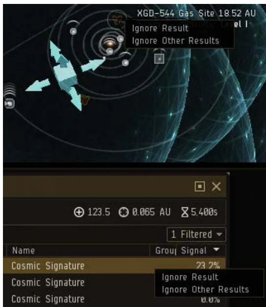

### 快捷键设置 Shortcut

这里罗列了挖坟常用的快捷键，并提供了推荐键位。熟练使用快捷键是高效挖坟的保证，也是小白挖穿超冬三层的必要前提。大部分快捷键是按住以后再用鼠标选择目标才能发挥作用。

Combat：

| 名称 | 功能 | 推荐键位 |
| --- | --- | --- |
| Approach | 靠近 | 无 |
| Directional Scan | 舰载扫描 | X |
| Dock/Jump/Activate gate | 停泊 / 跃迁 / 激活星门 | Alt |
| Keep at Range | 保持距离 | C |
| Lock target | 锁定目标，用鼠标可框选 | Ctrl |
| Unlock target | 解锁目标，用鼠标可框选 | Shift |
| Orbit | 环绕 | V |
| Refresh Probe Scan | 使用探针扫描，没探针会自动放 | Z |
| Tag item from sequence: 1 through 9 | 标记目标，从数字 `1-9` 顺序标记；需要开舰队 | 1 |
| Tag item as: A | 标记目标为 A，排除不值钱箱子 | 2 |

Navigation：

| 名称 | 功能 | 推荐键位 |
| --- | --- | --- |
| Save Location | 保存位置 | Ctrl-B |
| Stop Ship | 停船 | Ctrl-Space |

Modules：

| 名称 | 功能 | 推荐键位 |
| --- | --- | --- |
| Activate Medium High Slot 1 | 启用高槽 1，隐身 | Q |
| Activate Medium Power Slot 1 | 启用中槽 1，推子 | Space |
| Activate Medium Power Slot 2 | 启用中槽 2，货柜扫描 | A |
| Activate Medium Power Slot 3 | 启用中槽 3，数据 / 一体分析仪 | S |
| Activate Medium Power Slot 4 | 启用中槽 4，遗迹分析仪 | D |

### 界面布置 Interface

上图是我推荐的标准挖坟界面布置图，基于 1080p 分辨率显示器，如果是 768p分辨率可以把左侧的聊天框去掉，并把仪表盘移走。所有的窗口设置完成后，再次打开还会保存在固定的位置。

#### 要点

1. 把锁定目标栏移动到下方的仪表盘上部，找到右图所示的圆点即可拖动调整位置
2. 把舰扫和探针扫描窗口拿出来

找到右图这个正方形，点击后就会把这个窗口放在主界面上，然后点击边上的 pin 按钮，将其固定。

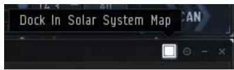

3. 把物品选择栏移动到一个位置，使那一排的按钮正好位于锁定栏的上方，破解界面的下方，看前图，方便破解后快速开箱捡取物品。

#### 快速捡取箱子设置

先打开背包，点击左上的小齿轮，勾选右图的这个选项，这样每次点开箱子不会自动打开背包。

然后把打开的箱子界面调整到右图所示的位置，并让 `Loot All` 的按钮尽量覆盖在物品选择栏的“打开箱子”按钮附近，这样就能做到开箱后快速拿走物品，而且拿完后这个窗口会自动关闭。

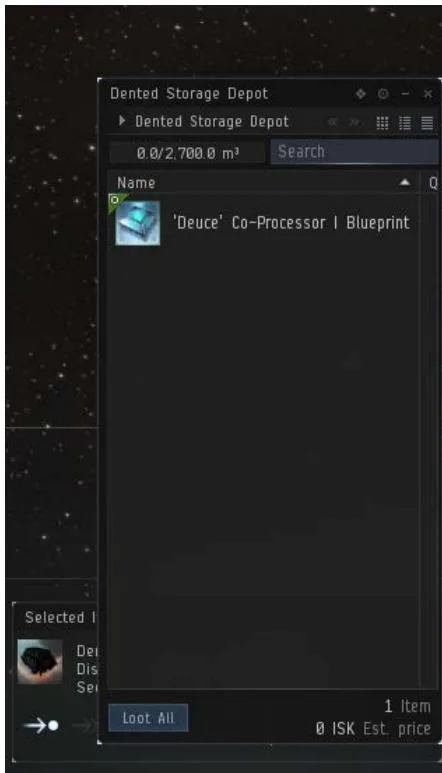

### 总览设置 Overview

普通挖坟直接使用一套你自己调过的探索总览即可，关键是稳定显示星门、天体、玩家舰船、探针、普通箱子、冬眠箱子与炮塔。

如何设置总览请自行百度。

总览需要设置 2 种，一是主界面中

的总览栏，二是直接显示目标的

brackets。

挖坟总览，推荐只显示可停泊建

筑，星门，太阳，玩家飞船以及普通箱子，冬眠箱子和炮塔。

然后再设置 brackets，日常我推荐用显示全部。

可选：小白挖穿超冬 3 层的时候为了提高锁定效率可以特别做一个专门的设置

只显示冬眠箱子和炮塔，然后直接 Ctrl+鼠标框选所有箱子，记得在起跳 3 层之前切换至这个配置。

#### 普通坟的箱子

#### 冬眠坟的箱子

#### 冬眠坟中的空间实体以及信标

#### 冬眠坟中的炮塔

#### 冬眠坟中可以放东西的箱子

### 终极小白 The Ultimate Astero

这里介绍本页“推荐配装”里“终极小白”的使用方法。使用这套配装前，确保你的 A 族护卫、扫描、甲抗、工程、盾抗等关键技能都在 IV 级以上，否则会出现续航或有效不足的问题；如果技能足够高，可以适当降低部分装备等级。

这套配置的优点在于，你不需要再换装爆抗，而且双超空间插大大提升跃迁速度，还能上高统一套达到 12AU/s 的跃迁速度。如果不打算硬抗超冬 3 层冲击波，除了爆抗都可以换成 T2 的，货舱里面的损控，盾扩，钢板也不需要带。

幽灵坟：启用爆抗后应该有 80%的爆抗，足够抗下高隐且不进结构，如果是超隐，解除隐身后先预超载爆抗，不启用，直到必要时，快捷键启用即可抗下。

低安气云：边修边开，不需要跳出去00 气云：照旧

限和标冬：无脑开，标冬可直接硬抗炮塔开牵引

超冬雷区：打开爆抗即可

超冬三层：把修和爆抗换装成损控和钢板，把回电换成盾扩。确保这里你有超过 12050 的有效。

备注：如果追求最极限，可以把那个

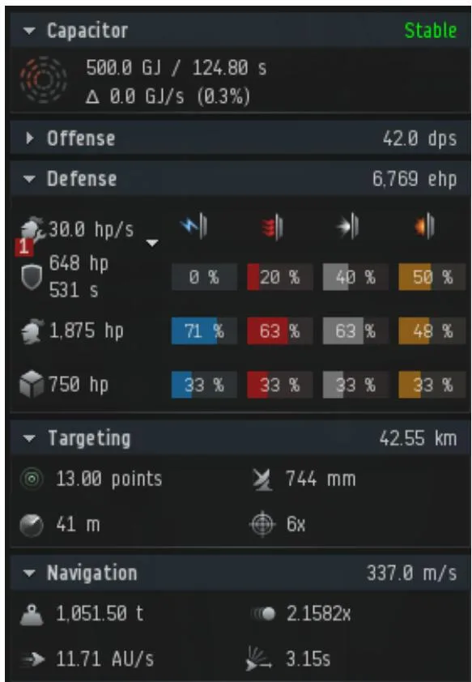

甲插也可以换成超空间，把联邦钢板换成深渊钢板；大致需要 `720+` 甲量和 `-0.2` 以上的 PG 余量。然后把货柜扫描换成盾扩，在 A 护卫 V 的技能下应该有 `12050+` 的有效血量。
