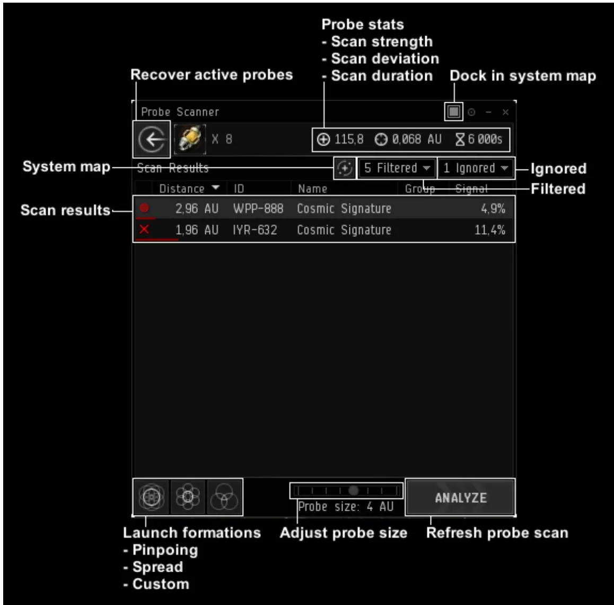
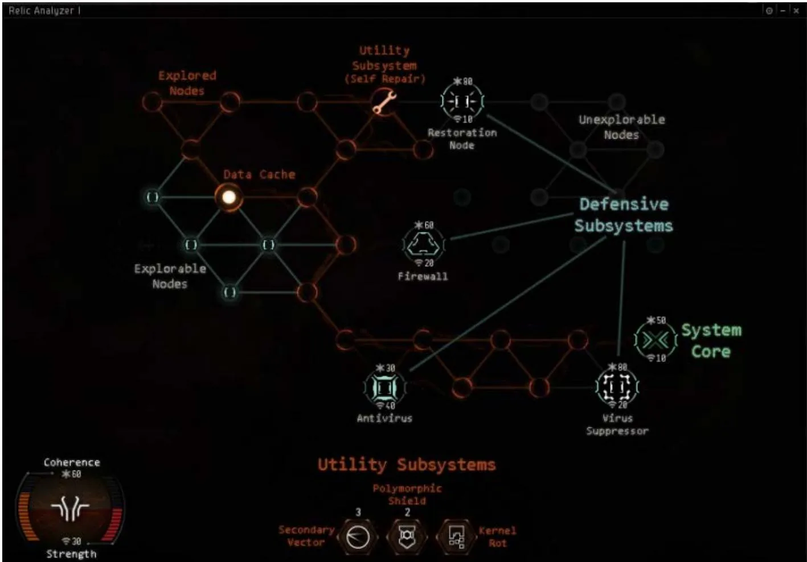
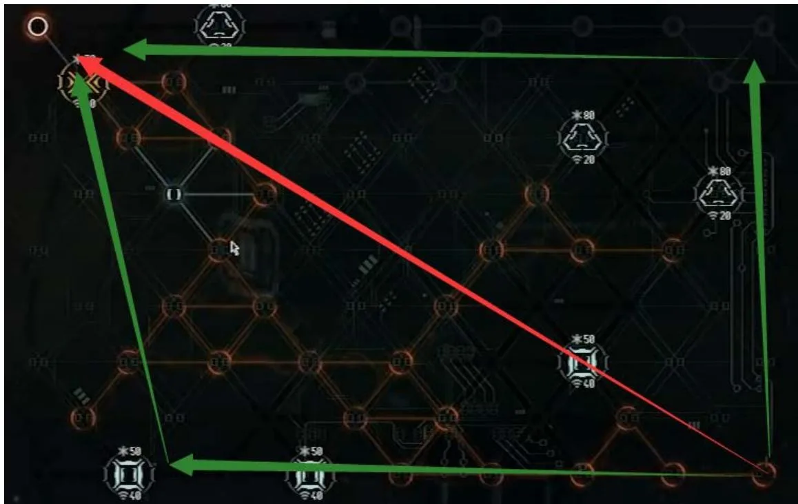
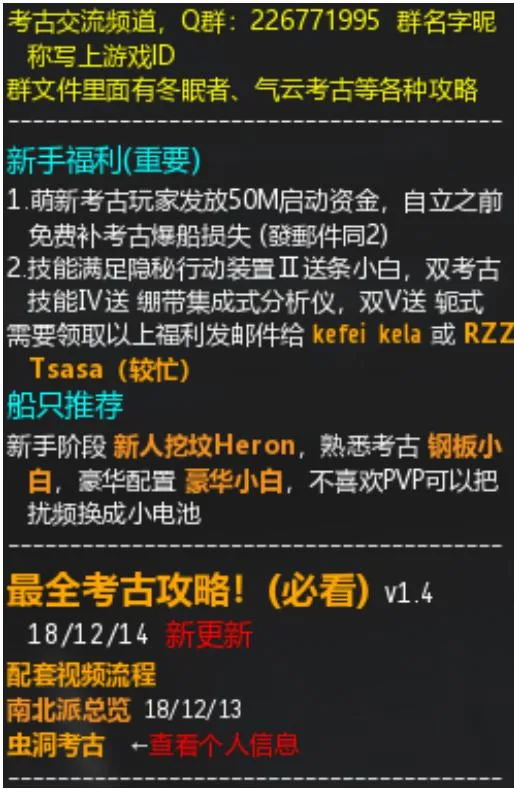
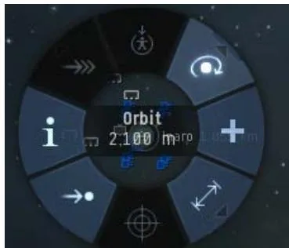
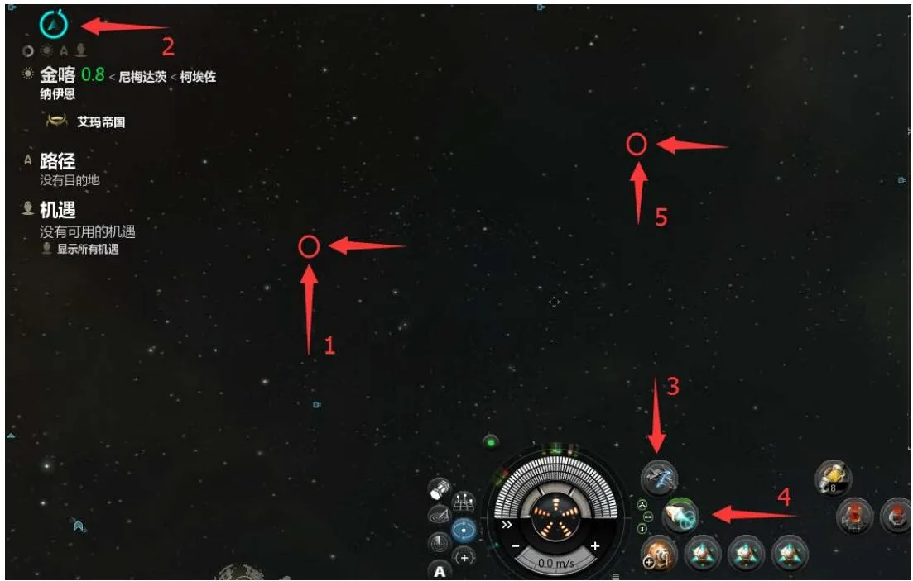

# 挖坟：入门正文

:::tip 页面说明
这一页是组织 wiki 里最适合长期挂在入门分类下的正文主干，重点覆盖扫描、破解、装备和生存。
:::

:::warning 生存优先
挖坟赚不赚钱，往往不是输在扫不出来，而是输在离场太慢。看到异常本地、作战探针、可疑舰船或门口蹲守时，优先保船。
:::

## 入门探索 Basic Exploration

:::info 本页内容
如果你只想先学会稳定开普通势力遗迹/数据站，这一页就是主线。虫洞、高级站点和高配装都可以先放到下一页再看。
:::

### 扫描操作 Probing

#### 首先界面布置

1. 按 `Alt + P` 你能打开上图窗口，
2. 点击右上角 Dock，将这个窗口固定在界面上
3. 在 Filtered 里面勾上 Cosmic signal
4. 熟悉界面上的图标及按钮，完成布置

接下来开始扫描，游戏新手教程有教，这里说一些有用的技巧

1. 使用第一种扫描模式，Pinpoint formations
2. 单击星图内红点，或者单击扫描界面的该信号，能够锁定视角
3. 在星图里双击能呈现水平视角，再次双击呈现垂直视角，非常方便锁定位置
4. 第一针用 8AU，如果你的探针强度超过 80，且信号已经分析 20%左右，第二针可以直接拉到 2AU。新手的话 8AU 下针，逐步缩减 4AU、2AU、1AU、0.25AU
5. 当信号呈现，球状和圆盘状时，请将你的扫描区域（最内部，仅仅是外部是不够的）全部包裹住它
6. 信号呈现两点时，看你上一针涨了多少，如果很多说明就是离你目前扫描位置近的点，如果不是就是远点（90%情况为远点）
7. 遇到信号即使把圈缩小到 0.25AU 还是扫描不出来，按住 Ctrl+滚轮拢针，拖动箭头缩小 8 个探针直至几乎重叠成一球形（但不能完全重叠）；还是不行就先记下信号编号和星系，回头换更高强度的配船、脑插，或让更熟练的人来开

8. 建立一个舰队 ， 就能使用数字键直接标记箱子，极大提高效率
9. 扫描度到 25% 可以看出信号类型，如战斗地点、气云地点、数据地点、遗迹地点；到 75% 才能看见扫描信号的具体名称，到 100% 就可以跃迁
10. 记得关闭分析仪的自动循环，右键分析仪，set off

### 信号类型 Site Types

- 战斗信号：普通异常、部分任务点，以及以 `Digital` 开头的战斗气云。
- 虫洞信号：名称常带 `Unstable Wormhole`，通往虫洞空间或其他地区。
- 气云信号：
  普通可采集气云常以 `Nebula` / `Perimeter` / `Frontier` / `Reservoir` 结尾。
  可控气云常以 `Base` / `Lab` / `Processing Site` / `Facility` 结尾。
  以 `Digital` 开头的是战斗气云，只在 00 出现。
- 势力数据/遗迹站：
  数据站名称常为 `Local/Regional/Central + 势力 + 站名`。
  遗迹站名称常为 `Crumbling/Decayed/Ruined + 势力 + 站名`。
  这是新人最常挖的站点，无怪，分布在各安等与 1-3 级虫洞。
- 幽灵坟（数据）：
  名称常为 `Lesser/Standard/Improved/Superior + 势力 + Covert Research Facility`。
  开箱失败会爆炸；守卫到场后会进入可见倒计时，倒计时结束剩余箱子爆炸。
- 冬眠者储藏站（数据）：
  名称常为 `Limited/Standard/Superior Sleeper Cache`。
  难度高、收益高，详细解法见 [进阶实践页](./advanced-practice.md)。
- 普通冬眠者数据/遗迹：
  只出现在虫洞中，常见前缀有 `Unsecured` / `Forgotten` 等。
  站内有怪，不建议新人直接碰。
- 无人机数据站：
  例如 `Abandoned Research Complex`。
  出产无人机组件、加强型无人机蓝图，并有几率触发无人机远征。
- 寂静的战场：
  `Silent Battleground`，只在破碎虫洞出现，极其稀有，产出体积大、性价比一般。

### 扫描地区 Areas

| 区域 | 常见种类 |
| --- | --- |
| 高安 | 冬眠者储藏站（`<=0.8`）、势力坟、低级幽灵坟 |
| 低安 | 冬眠者储藏站、势力坟、低级/标准幽灵坟、气云坟（特定） |
| 00 | 冬眠者储藏站、势力坟、高级幽灵坟、气云坟（特定） |
| 虫洞 | 普通冬眠者坟、势力坟（`1-3` 级和破碎洞）、超级幽灵坟、寂静战场（破碎洞） |

#### 虫洞 Wormhole

在这里简要介绍一下虫洞；更详细的资料建议结合 [EVE University 的 Wormholes 条目](https://wiki.eveuniversity.org/Wormholes) 与 [Anoik.is](http://anoik.is/) 一起看。

:::warning 虫洞提醒
1-3 级虫洞里会刷普通势力坟，但虫洞本地不显示玩家，也会有冬眠者站点和常驻猎人。不会做安全点、不会 D 扫撤离时，不建议把虫洞当成无脑练手区。
:::

虫洞简单理解就是一个可以通向虫洞空间或是其他任意位置的一个星门，虫洞

空间分为 1-6 级，在 1-3 级洞内会刷普通势力坟，而且数量多于高低安 00 地

区，不要去碰洞内的冬眠坟，有怪容易被秒。虫洞内部本地不显示玩家，意味着你需要时刻使用 ALT+D 舰载扫描来确认敌人，并做好逃跑准备。

当你靠近虫洞时能看到它们的名称，如果显示为K162，那么表示这个虫洞是从对面被打开的。

破碎洞的识别方法，随便点击一个星球如果显示是破碎的，那么这个洞即为破碎洞，破碎洞内可能会出现任意种类的信号，不受地区限制。

每当你进入虫洞时，Ctrl+B 保存当前地址，再看一下星系内如果含有许多建筑，说明这个洞住人了，不建议长时间逗留，如果洞内的信号少于 5 个，很大可能被人扫过了。

你可以使用 [Anoik.is](http://anoik.is/) 查询虫洞信息，把左上角的虫洞编号（例如 `J124051`）输入即可。

:::details 虫洞状态速查
也可以对照下表直接从虫洞介绍中获取信息。

This wormhole seems to lead into {important part} parts of space.

| Text | Meaning |
| --- | --- |
| Unknown | C1 / C2 / C3 |
| Dangerous Unknown | C4 / C5 |
| Deadly Unknown | C6 |
| High Security | 高安 |
| Low Security | 低安 |
| Null Security | 00 |

This wormhole has not yet begun its natural cycle of decay and should last at least another day

This wormhole is beginning to decay, and probably won't last another day This wormhole is reaching the end of its natural lifetime

| Text | Meaning |
| --- | --- |
| not yet begun | more than 24 hours |
| beginning to decay | between 4 and 24 hours |
| reaching the end | less than 4 hours |

:::

#### 无人机区 Drone Regions:

无人机区位于星图右上方，请看后面的附录页地图，由 8 个星域构成分别为 Cobalt Edge,Perrigen Falls, Malpais, Oasa, Kalevala Expanse, Outer Passage, Etherium Reach, TheSpire

在这些区域内会出现无人机坟。破解无人机坟中的箱子会能获得无人机组件以及加强无人机蓝图，破解成功有几率触发无人机远征（包括空箱子），无人机坟的远征就是再去挖一个新的无人机坟。

同时无人机区的所有隐秘坟信号都为I 级战斗信号，且不存在遗迹信号。

### 破解 Hacking

上图是一个破解小游戏的图解，Conherence 是你的血量，Strength 是你的攻击，按本页前面推荐的基础配置，你目前通常会有大约 70 血量、25 攻击，除了最高难度的红核心，其他难度的破解应该都比较容易。

每走一步会出现 1-5 这样的数字，表示离最近的无害点的距离（工具、隐藏节点、核心）的步数。超过五步也显示 5。 如果点到一个角落出现数字 5 那就不用点了 附近没有有益节点。在攻击力较低的时候推荐沿墙边走，虽然比较慢，但是不会被封死，攻击高了以后尽量走六边形正中间那个点，能快速发现周围的可用节点。

破解策略：系统核心出现在对角的可能性非常大，所以推荐两种走法，第一种红线直接杀对角，需要比较高的攻击，在你确定破解难度后可以马上使用这种

策略。第二种绿线，沿边缘走如果出现防御节点可以从另一个方向继续开始，适合没有时间限制的普通坟，而且还有个优点是能发现核心在近端两个对角的情况。碰到防御节点不需要马上点掉，请换一个方向继续，除非是回血节点。拿到加血道具尽快使用，其他道具妥善保留按下方图解说明使用。

破解的时候不要紧张，更不要手快，因为这个小游戏存在延迟，当你点出核心后可能手快点到后面出了一个防御节点把核心封死。发现自己的血量不够杀死核心时，别忘了多开其他的点，可能出道具。提升破解成功率的最好途径就是提高攻击力，使用 T2 分析仪加上黑镜脑插能到 60 攻，基本一下一个节点，所以请尽快挂出 T2 数据分析仪。

节点图示：

| 名称 | 作用 |
| --- | --- |
| Data Cache | 一个隐藏节点，可能会出现道具，也可能会出现防御节点；通常无路可走后再点开。 |

道具：

| 名称 | 作用 |
| --- | --- |
| Self Repair | 使用后，接下来的 3 步会随机恢复 `4-10` 点同步值；`Coherence` 没有上限，所以尽快使用。 |
| Kernel Rot | 使用后目标血量减半。 |
| Polymorphic Shield | 抵御两次伤害；如果你先杀死目标，这个效果会保留。 |
| Secondary Vector | 每回合造成 `20` 点伤害，持续 3 回合；使用时不算做攻击，点其他位置也能造成伤害。使用时先点一下工具，再点一下病毒，然后点其他任意地方两次。 |

防御节点：

| 名称 | 作用 |
| --- | --- |
| Firewall | 普通防御节点。 |
| Antivirus | 高攻节点，请配合 `Polymorphic Shield` 点掉。 |
| Restoration Node | 每回合会随机给一个节点回 `20` 血（捡工具也算），不会恢复自己和系统核心；一旦出现马上点掉。 |
| Virus Suppressor | 降低攻击力 `15` 点，会叠加，最低到 `10` 点。如果你起始只有 `25` 攻 `70` 血，点出后很可能杀不掉它，所以请留好 `Secondary Vector` 和 `Kernel Rot`。 |
| System Core | 你的目标。系统核心的颜色表明破解难度，难度会影响部分节点的血量和攻击：绿为简单，橙为中等，红为困难。 |

## 装备 Equipment

这里列举了和挖坟有关的装备，影响扫描的主要是探针强度和破解攻击力当然还有一些逃生用的装备，配合移动机库可以随时换装弥补技能点不足的短板。

### 飞船 Ships

| 舰船 | 说明 |
| --- | --- |
| `Heron` 苍鹭 | T1 探索护卫。破解攻击和血量各 `+5`，每级技能提供 `+7.5%` 探针强度。便宜、容错高，适合新人练手。 |
| `Astero` 小白 | 姐妹会护卫。破解攻击和血量各 `+10`，探针强度 `+37.5%`。能装隐秘行动，仍是本文主线里最通用的高级探索船。 |
| `Stratios` 中白 | 姐妹会巡洋。也是 `+10` 破解属性和 `+37.5%` 探针强度，能更稳地硬吃部分高危站点，但成本和操作门槛更高。 |
| `Tengu` 金鹏 | C 族 T3 巡洋。高投入、高上限路线，适合兼顾探索与更复杂 PvE 场景。 |

说明：推荐路线先按 `Heron -> Astero -> Stratios/Tengu` 这条常见升级路径理解。2025-2026 新增或回归视野的探索相关船只如 `Metamorphosis`、`Odysseus` 暂未展开，主要因为本文重点仍是通用挖坟流程，而不是新船全量评测。

### 高槽 High Slot

新人推荐优先走“普通发射器 + 姐妹会针”的便宜路线；强度不够时，再升级到更好的发射器。

- 探针发射器：
  `Core Probe Launcher I` 无额外加成；
  `Core Probe Launcher II` 提供 `+5%` 探针强度；
  `Sisters Core Probe Launcher` 提供 `+10%` 探针强度。
- 扫描探针：
  `Core Scanner Probe I` 基础强度 `40`；
  `Sisters Core Scanner Probe` 基础强度 `44`；
  常备 `16` 根以上更稳，掉线或长途扫描时不容易断针。
- 隐形装置：
  `Prototype Cloaking Device I` 便宜但减速明显；
  `Improved Cloaking Device II` 稍好一些，但仍不能隐身跃迁；
  `Covert Ops Cloaking Device II` 才能隐身跃迁，开小白基本以它为目标。

补充：解除隐形后会有锁定延迟；隐形状态下，2km 内有物体会被强制显形。

### 中槽 Medium Slot

挖坟四件套通常是：数据分析仪、遗迹分析仪、微型跃迁推进器、货柜扫描器。

- 推进：
  `5MN Microwarpdrive` 是最常见选择，靠箱、撤离、拉距离都离不开它。
- 货柜扫描：
  `Type-E Enduring Cargo Scanner` 够便宜；
  `Cargo Scanner II` 范围更远、激活更快。
- 数据分析仪：
  `Data Analyzer I` 为 `40 血 / 20 攻`；
  `Data Analyzer II` 为 `60 血 / 30 攻`，是优先级最高的升级之一。
- 遗迹分析仪：
  `Relic Analyzer I` 为 `40 血 / 20 攻`；
  `Relic Analyzer II` 为 `60 血 / 30 攻`。
- 二合一分析仪：
  `Ligature Integrated Analyzer` 与 `Zeugma Integrated Analyzer` 能省一个中槽位，配合技能双加成，常见于高配船。
- 扫描测距阵列：
  `Scan Rangefinding Array` 可临时换装，探针强度 `+5%`。

### 低槽 Low Slot

对新人来说，低槽优先服务两件事：更快起跳，以及在需要时临时堆抗性。

- 机动：
  `Nanofiber Internal Structure` 和 `Inertial Stabilizers` 都常用；
  前者更偏综合机动，后者更偏压低起跳时间，但会放大信号半径。
- 跃迁核心稳定器：
  适合跑路或回家时临时换装，但不能免疫泡泡，也会明显影响锁定与实战操作。
- 信号放大器：
  正确模块应为低槽的 `Signal Amplifier`，作用是增加锁定距离与锁定速度；它不能提高探针扫描强度，只是让货柜扫描和锁箱更舒服。
- 爆炸抗性：
  `Armor Explosive Hardener II`、`Dark Blood Armor Explosive Hardener`、`Corpus X-Type Armor Explosive Hardener` 都是幽灵坟与超冬雷区常见的关键模块。

### 船插 Rigs

新人扫描强度不够时，优先上 2 个 `Small Gravity Capacitor Upgrade I`。后期可以按需求替换成以下几类：

- `Small Gravity Capacitor Upgrade`：提高探针强度。
- `Small Ionic Field Projector`：增加锁定距离。
- `Small Signal Focusing Kit`：提高货柜扫描速度。
- `Small Low Friction Nozzle Joints`：进一步压缩起跳时间。
- `Small Hyperspatial Velocity Optimizer`：提高跃迁飞行速度。

补充：T2 船插会消耗更多校准值，上之前先在模拟器里确认。

### 脑插 Implants

- `Low-grade Virtue` / `Mid-grade Virtue`：主打探针强度。
- `High-grade Ascendancy`：主打跃迁速度。
- `Eifyr and Co. 'Rogue' Warp Drive Speed WS-618`：如果高统 6 太贵，可以用它过渡。
- `Poteque 'Prospector' Astrometric Acquisition AQ-702/706/710`：提高扫描速度。
- `Poteque 'Prospector' Astrometric Rangefinding AR-802/806/810`：提高探针强度。
- `Neural Lace 'Blackglass' Net Intrusion 920-40`：常说的“黑镜”，数据分析仪攻击 `+20`、血量 `-40`，需要 `Cybernetics V`。
- `Poteque 'Prospector' Environmental Analysis EY-1005`：数据和遗迹分析仪血量各 `+5`。

### 其他 Others

最推荐额外携带的两样东西是：

- `Mobile Depot`：
  可以换装、存货、减少高危站点里的损失；
  跑路回家时，也方便把船换成更偏逃生的配置。
- `Hornet EC-300`：
  ECM 无人机，被抓时有概率帮你争取脱离窗口。

### 相关技能 Skills

常用基础技能如下：

- `Cybernetics`：IV 级解锁 `+4` 脑插，V 级解锁黑镜和 `10%` 强度插。
- `Spaceship Command`：每级减少 `2%` 起跳时间。
- `Evasive Maneuvering`：每级减少 `5%` 起跳时间。
- `Target Management`：增加锁定目标上限，小白一般到 IV 就够用。
- `Long Range Targeting`：增加锁定距离。
- `Amarr Frigate`：提高 Astero 的装甲抗性。
- `Armor Layering`：减少钢附甲板对机动的负面影响。
- `Armor Compensation`：提高薄膜类抗性模块收益。

## 生存 Survival

### 基本设置 Setting

1.调整总览，至少准备一套“探索/旅行”和一套“PVP/警戒”过滤器。重点不是照抄某个频道预设，而是让你能稳定看到星门、泡泡、敌对舰船、探针与可破解目标。

2.调整环绕距离为 2100m，随便点击一个物体，在环绕按钮上右键，即可调整默认环绕距离，注意这个默认距离只能在，下图图示上使用，右键环绕并没有这个选项

3.设置快捷键，点击左上角 ， 打开设置 Setting，快捷键设置，调整常用的模块到顺手的按键，例如隐身推子探针扫描D 扫描，关键时刻可能救你一命

4.设置 D-扫描，Alt+D 打开 D-扫描界面，并将其固定在外部，调整角度为360°，注意 D-扫描的过滤选项是依据你的总览设置，也可独立设置

### 技巧 Tips&Tricks

#### 假隐跳 by 784 fvtr

过门后，对太空随意一个方向双击，如箭头 1。注意屏幕右上角的隐形图标，留意其是否消失，参考图中的箭头 2。隐形图标消失，立刻点开隐形装置，如箭头 3。点开隐形装置后，迅速激活微型跃迁推进器。完成以上操作后，再对太空随意一个方向双击。

（跃迁动作判定为当前船速的 70%即可达到跃迁状态，凭速度感觉跃迁时机）进阶

1. 隐跳操作有三种。第一种隐跳操作为“基础”中讲述的操作。
2. 第二种操作，与第一种操作相近，不同之处在于先激活微型跃迁推进器再点开隐形装置。
3. 第三种操作，先朝向一个卫星，然后激活微型跃迁推进器，再点开隐形装置。等待微型跃迁推进器接近循环过 3/4，关闭隐形，跃迁到目标卫星 0m。

4. 隐形装置要正常运作需要保证舰船 2 公里范围内没有其他物体。如果 2公里范围内有其他物体，不仅无法激活隐形，即使已经处于隐形状态，也会因此退出隐形。
5. 第一种操作和第二种操作适用于在 0.0 被堵门的情况如场景 1。网络状态不好，选择第一种操作。网络状态良好，选择第二种操作。第三种操作适用于没有机动跃迁扰断器和拦截探针的情况如场景 2。
6. 在场景 1,成功实施假隐跳操作后，在敌对不离场的情况下不建议显形。要离开，可以先缓慢飞出跃迁干扰范围，并至少距离敌对舰船 45 公里以上，再提前朝向好，最后，显形跃迁离场。

#### D-扫描的使用

点击 D-扫描面板上的

能够显示当前 D-扫描的范围，按默认快捷键 D 能够进行扫描，显示该区域内所有非隐身目标，调整角度缩小扫描范围，多次尝试能获得敌人大概方位。

#### 安全点/深空点

随意选择一个星球跃迁，在跃迁途中按 Ctrl+B 保存位置，上图的红点位置，注意 保存的位置是当你点击了 submit 时自身的位置，所以请留有一定的提前时间。

按照以上方法设置的安全点大部分会靠近星系中心，还是有很大可能性在敌人的 D-扫描范围内，这时我们需要学会设置深空点，当你扫描完某些数据遗迹点或是虫洞，发现它们位于地图外侧，那么这就是一个非常好的深空点，记得保存下来，后期你常去的地图都应该有一个深空点。

还有就是过门安全点，专用于星门在 14AU 以外的星系，这时候如果你要过门，如果有轻拦堵，你是五度不到的，所以提前在这类星门附近做个 150km 以外的安全点很有必要。

### 逃跑 Escape

以下三种情况，均是基于配备了隐身的 T1 护卫，小白同理操作起来更加方便。在进入危险区域之前，先把身上值钱的东西放到 NPC 空间站内，你可以点击左侧个人财产 ， 看到你寄存的所有物品。

#### 准备过门

当你准备过门时，担心泡泡或是有人守门，先跳到离星门 14.3AU 范围内的任意位置，使用 D-扫描，确定是否有人堵门。如果发现有泡泡或是人数众多>5 或是有战列（炸弹狂魔需要钢板小白才能抗住），那么我建议你放弃冲门。如果发现对面只有 1-2 号人，那么可以一试。

#### 过门后

发现掉泡泡了，不要紧张，此时你有 30s 的隐身时间，打开战术视图，分析出逃生路线，哪里没人朝哪里冲。朝向星空任意位置 ，双击瞬间点隐形马上开微曲（希望你微曲 隐形都记得快捷键 不然来不及别人就锁定你了）这样一轮微曲够你冲出泡泡了，然后再起跳，或者不起跳，静观其变。（或者超载微曲反冲星门，这样最保险）

如果只有几个人守门，可使用假隐跳进阶第三种技巧，遇到轻拦放泡泡解法同上。

#### 在星系中

挖坟前看本地人数，本地如果有人，先使用 D-扫描判断坟点有无蹲子，无法判断的情况下，可以尝试跳 70km 点，确定没人后再尝试挖坟，挖坟过程中请时刻注意总览（切换到 PVP/警戒，调整好你的界面，在破解时也能方便观察总

览），并做 15s 一次 D-扫描，如果你的飞船起跳速度小于 4s 可以只关注总览，一旦发现有人,马上跳向自己的安全点并隐身。（从发现总览上的敌人到他落地锁定你最快大概在 4s 左右，如果他是隐身的蹲子则还要加上 5s 解除隐形锁定延迟）。

反应慢了，敌人已经落地在 30km 内，马上要被锁定，也先别放弃，马上掉头背向遗迹确保 2km 内 没有物品，使用假隐跳进阶第三种技巧，同时点击隐身和推子，因为开启隐身是瞬间丢失锁定目标，但是你需要在推子转到 3/4 之前，调整好自己的位置，并找好跃迁目标。

最坏的结果他们直接跳到了脸上，在 2km 之内，连隐跳操作都无法实施，这时马上超载推子朝向远离敌人的方向，并狂按隐身键，如果成功隐身，同上使用假隐跳脱离。被锁定了，如果对方只带了网子和扰频，你的船成功挨下第一轮输出，凭着护卫的速度，手速够快是能开出他们的扰频范围，一旦发现血条上方的扰频标志消失马上跃迁。

如果很不幸对面带了扰断，你没能逃出来，那只能放出你的 ECM 无人机，祈祷能 E 中一下。同时别忘了一直点击跃迁，确保在爆船后你的蛋可以瞬间跳走。

#### 附装备介绍

扰断 Warp Disruptor：反跳强度 1 点，能阻止起跳，但是不能关闭微

曲，范围24km（超载28KM），被扰断很容易逃生，反方向超载微曲跑就是了，脱离有效范围就起跳

扰频 Warp Scrambler：反跳强度 2 能阻止起跳（势力扰频是 3 点强

度），能关闭微曲，范围 9km（超载 10.8km），对于带微曲的小白，被扰频基本就完蛋了，但是如果你带了跃迁核心稳定器，比如你带两个稳定强度是 2，

对面扰频强度是 2 那么你就能安全跳走，阻止跃迁必须反跳强度大于稳定强度才能作用 。跃迁稳定核心会减少锁定距离，会严重降低效率，怎么取舍看自己了。注意带跃迁稳定是不能阻止扰频关微曲的。

网子 Stasis Webifier：减少 60%最大速度，小白被网子加扰频了速度只剩不到

200。通常痴汉都是开剑齿虎上 200 220 280 射弹，射程 10KM（超载

13KM），所以尽量躲避他们的最佳射程能撑一会 不过被抓到了逃生几率很低，两轮就死了，不过可以带 ECM 无人机，虽然 E 住的概率很低，但是能多一点逃生的机会。

:::tip 继续阅读
看完这一页后，可以继续去 [进阶实践](./advanced-practice.md) 查高级站点与复杂路线，去 [补充内容](./supplemental-content.md) 查推荐配装、产出和伤害表。
:::
