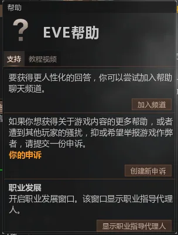
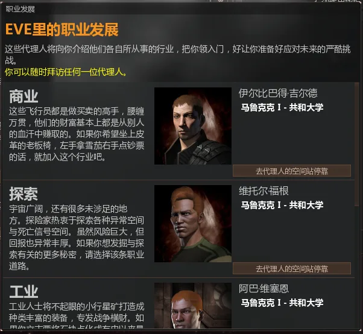
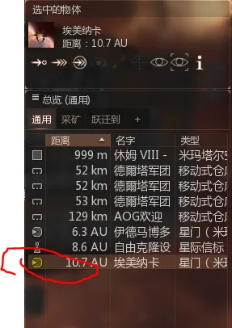
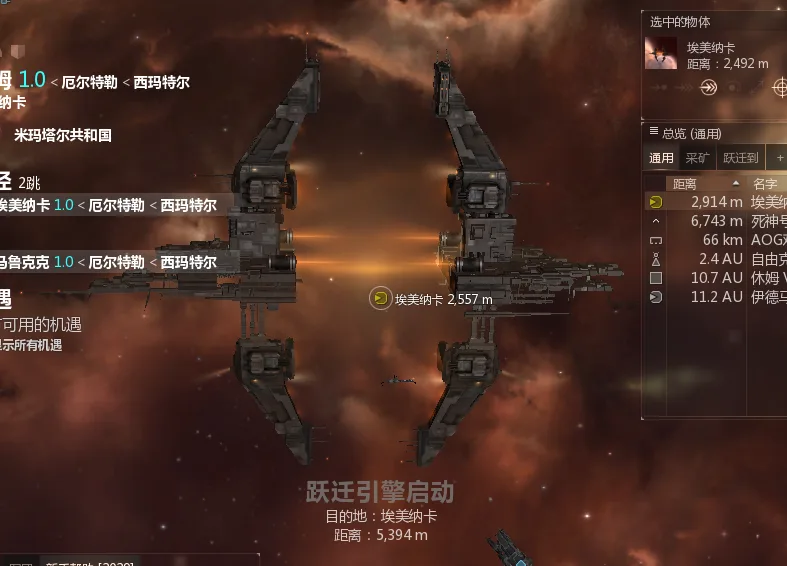
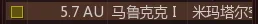
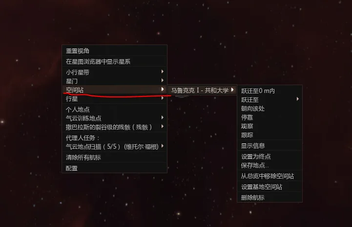
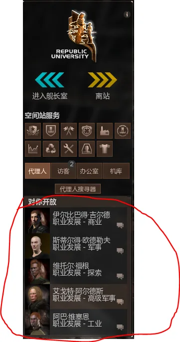

# EVE 新手教程：寻找代理人

:::tip 阅读顺序
建议先看完这一页，再去 [工业与商业代理人](./industry.md) 和 [军事代理人](./military.md)。
:::

## 寻找代理人

欢迎来到 EVE。你进入游戏之后的画面大致会是这样，各族都差不多；右下角偶尔弹出的机遇系统现在可以先不用管。

下面开始说明如何找到职业指导代理人。首先，按下 `F12`。

选择下方的显示职业指导代理人

选择"去代理人的空间站停靠"

然后看右侧总览中，有一个图标变黄了，黄色图标表示你前往终点时需要经过的地点

这时右键黄色图标选择跳跃

这个图标的意思是星门，星系与星系之间用星门连接，你需要用它来穿梭于宇宙，

他会指引你到达你设定的终点

抵达星门，各族星门风格都不一样。

这个图标的意思是空间站，右键他选停靠就可以进站了，

还有一种进站办法，右键太空

出现一个列表，选择停靠，现在注意，这个列表以后你会常用到，包括如何寻找小行星带，

以后会用到，可以注意一下

好抵达空间站后，看右边的列表

可以看到5位代理人与你在一个空间站里，接下来你就可以与他们对话来做职业发展的任务了

值得一提的是，这个游戏与其他游戏不同，选择一位代理人不意味着你永远都会被固定在那个职业里。5 位代理人的任务都可以接，他们会给你新手期需要的技能书、船只和 ISK；只要技能足够，一个玩家也可以同时兼职商人、战士和探险家等多种角色，这也是 EVE 自由度的一部分。

:::info 下一页
继续阅读 [工业与商业代理人](./industry.md) 和 [军事代理人](./military.md)，把职业代理人的主要任务线跑完。
:::
