# 挖坟：开始之前

:::info 页面说明
这一页只保留完全新人最需要的起步内容。读完后，你就能知道先学什么、先开什么船、先碰什么站，以及哪些坑千万别急着踩。
:::

:::details 校订说明
本文已按 2026-04 对机制表述、链接、图片命名和附录格式做过整理；如果文中内容与当前国际服实际机制冲突，以当前游戏内表现为准。
:::

:::tip 阅读顺序
建议先看完本页，再继续阅读 [入门正文](./basics.md)；高危站点、配装表和查表附录统一放在 [进阶与附录](./advanced-and-appendix.md)。如果你想把完整的新手代理人教学也跑一遍，可以并行参考 [EVE 新手教程](./new-player-tutorial.md)。
:::

## 新手起步

### 新手任务与第一次探索

这一节的作用，是把探索代理人任务、探针基础、扫描界面和第一次实际数据/遗迹操作走完整。哪怕你最终主要参考后面的正文主干，这一节依然是最适合完全新人上手的地方。

接下来介绍最后一位代理人-探索代理人的任务

为什么把他放在最后呢，因为探索任务是新手教程中最难的一节

很多新人就死在探索任务中，因此在这里我会详细讲解探索任务

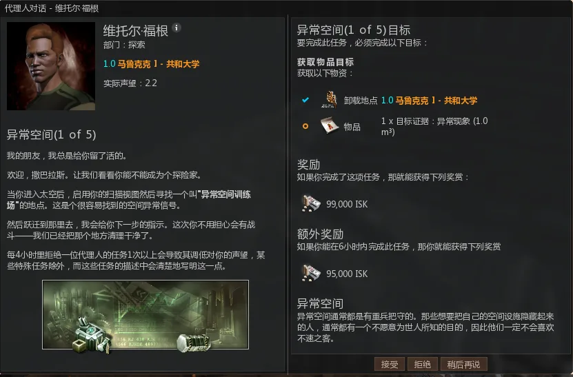 

做这个任务你要先知道如何打开扫描视图，首先，出站

 

选择我用红笔选择的图标

 打开之后出现环状菜单，选择左边的

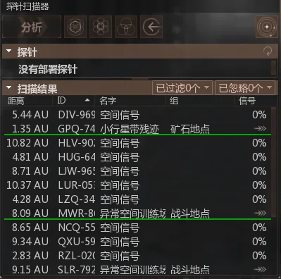 

出现一个列表，可以看到有异常空间和未知的空间信号，

我们要前往任务要求的异常空间训练场

 

点击箭头就可以跳过去了

 在你面前会有个箱子

拿走里边的东西回去交任务吧。

第二步任务

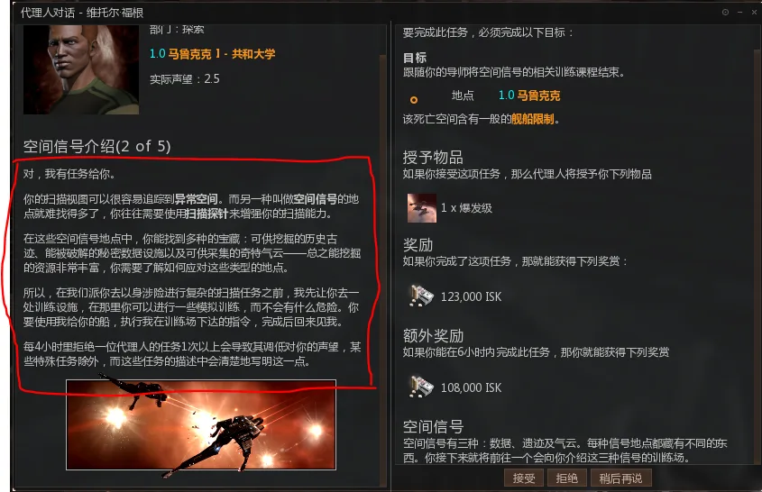 

任务中为你讲解了空间信号的概念，要详细查看。

先前往他给你的目标地点吧

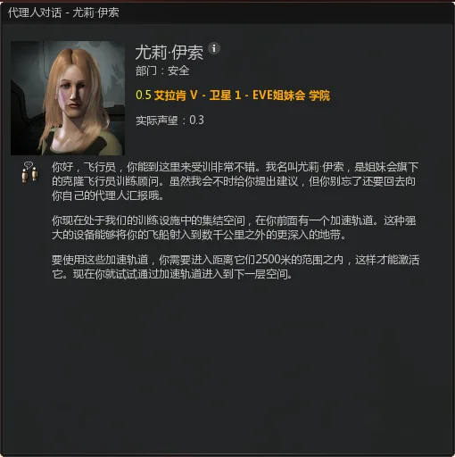 

弹出来一个对话框，这里有之前提到过的加速轨道的详细解释，可以看看

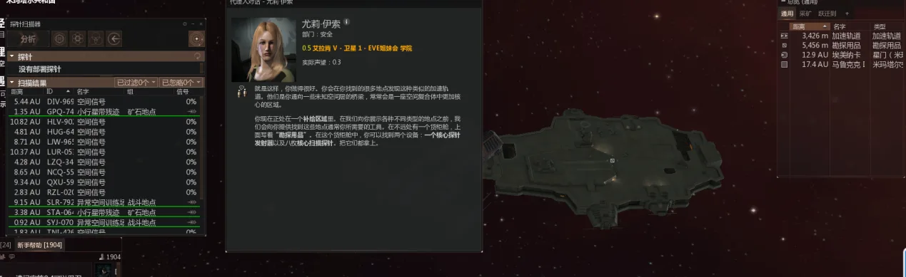 

进入第二层后代理人会要求你拿走你面前箱子里的东西，

 

拿完之后，**会更新提示，代理人为你详细讲解了探针的概念，务必详细看**

看完后，你就可以进第三层了

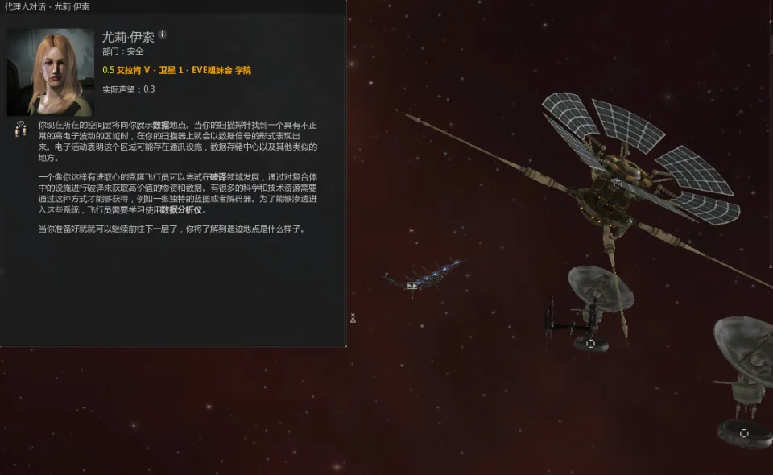 

第三层代理人为你讲解了什么是数据地点，**仔细查看，不然以后你会分不清什么时候用数据分析仪什么时候用遗迹分析仪**

然后进第四层

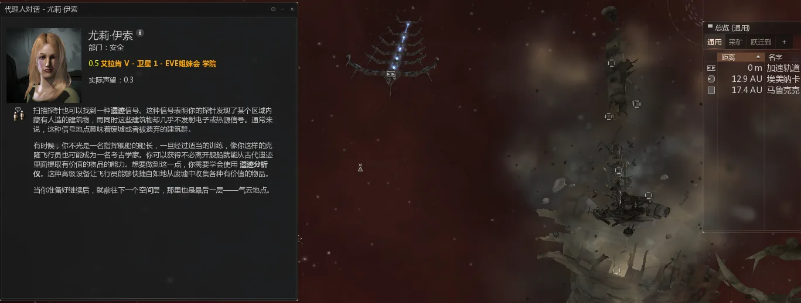 

第四层代理人为你讲解什么是遗迹地点

第五层代理人为你讲解什么是气云地点

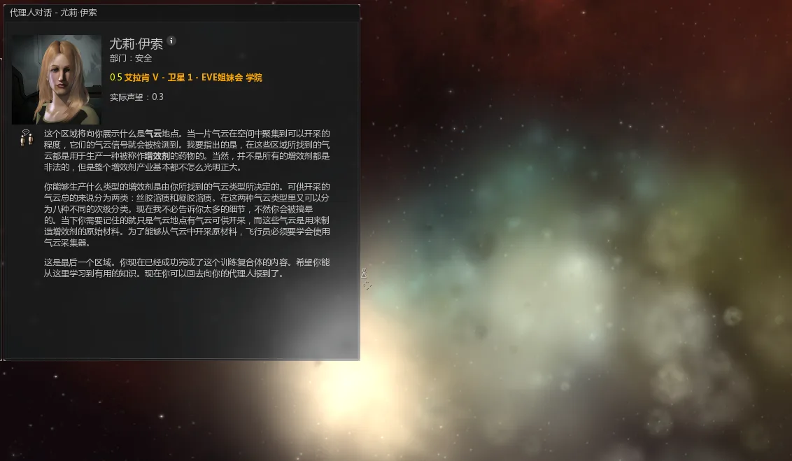 

好了现在可以回去交任务了

这步任务告诉了你未知空间信号可能出现的种类，这些知识你以后会用在如何生存上，所以要认真看

第三步任务

 

这步任务将会由你来实际操作如何扫描出一个空间信号，也是最难的地方，在这里我会对每一个细节进行详细讲解，希望你能认真看

首先，把之前拿到的核心探针发射器还有探针都装配到船上，再装上数据分析仪

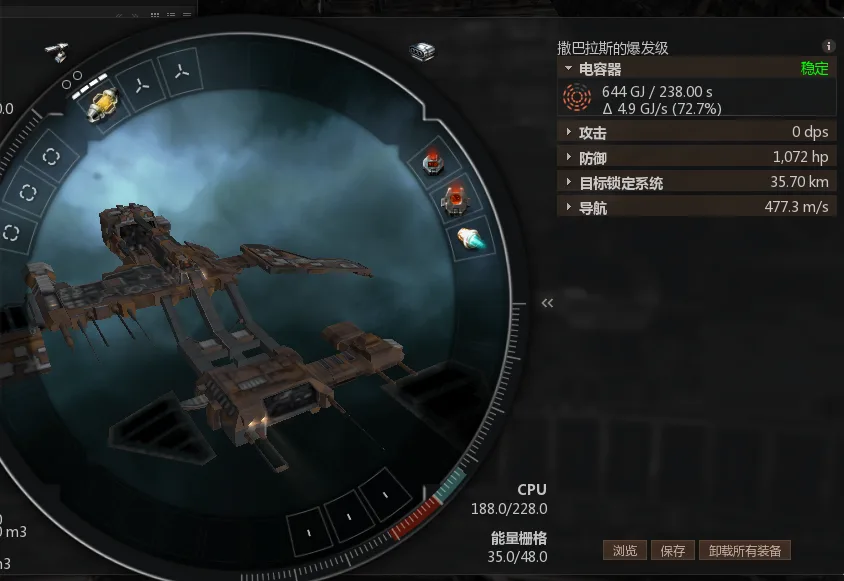 

像这样，然后出站

打开探针扫描器

 

然后发射探针（左键点击核心探针发射器）

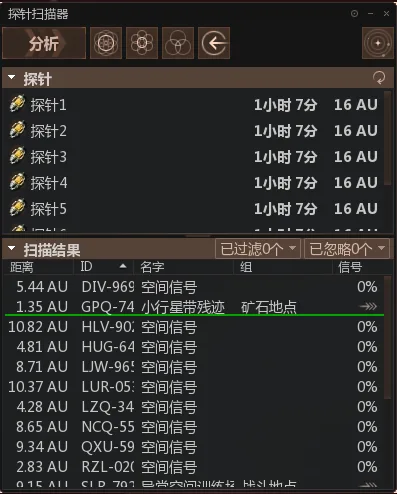 

可以看到本来显示没有部署探针的那一栏出现了8个探针，

 

总览中也有显示

 

然后点击"恒星视图"图标

 

出现了这样一个界面，其中8个蓝圈代表了你的8根探针，那些红色的圈代表未知的空间信号，你可以在黑色地区鼠标左键来回拖动改变视角，鼠标右键可以改变你查看的位置

左键拖动效果： 

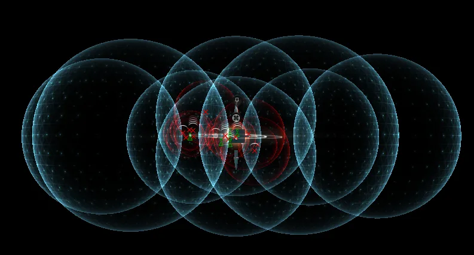 

可以竖着看星系，也可以平着看星系，这些都通过鼠标左键实现

右键效果

：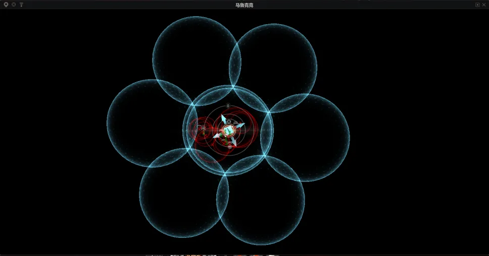 

我可以让他在屏幕中间，

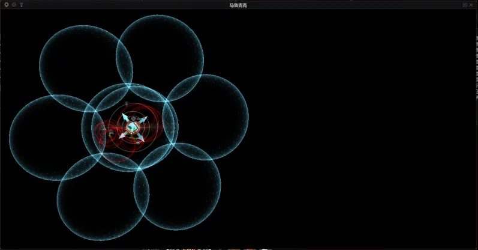 

也可以让他靠左或靠右，这些通过右键来实现

 

左上角这些件可以对探针进行各种操作，

分析键就是扫描

 是精确发射，点击一下

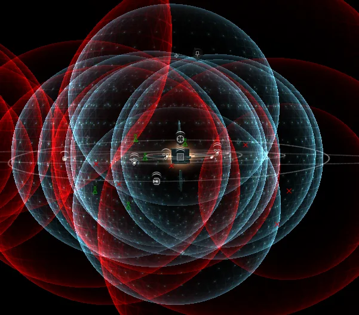 

探针就变成了8个叠在一起的模式

 是分散发射，点击一下，

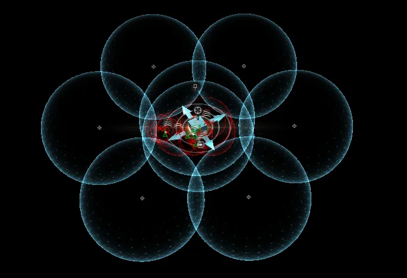 

就又变成了这种形状

 是收回你在太空中的探针

剩下的那个就不提了，基本用不到

熟练使用左右键有助于你提高扫描效率

接下来教你如何调探针的扫描范围

 鼠标放在这些球状的边缘你会发现这些球体会亮起来，然后拖拽，你会发现这些球会根据你的鼠标移动变大变小，因为没法截图所以口头叙述了

现在选择精确式发射

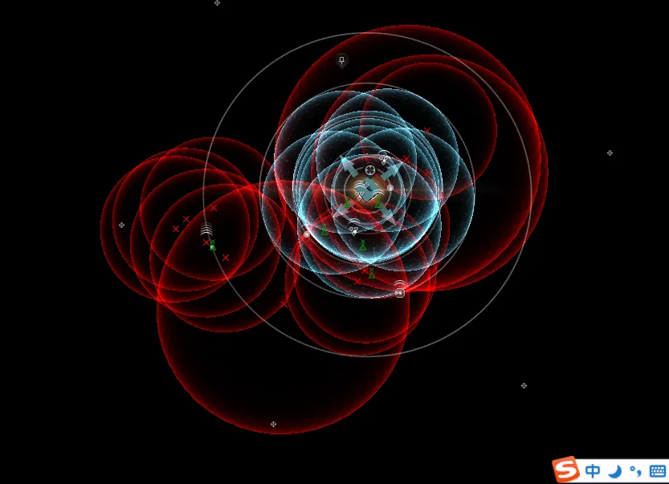 

看着这么多红色的球是不是眼晕，有个很简单的办法能让你盯住一个信号扫描

 

在一堆信号中选择一个（鼠标左键单击一个信号）

 

你会发现红圈只剩下一个，这样看着就顺眼多了，就盯着他扫描吧

 

鼠标移到中间那个方块你会发现方块变红了，这里要注意，不要让周围的那几个箭头变红

这时你就可以同时操控8个球随意移动，现在我们要做的就是，让蓝色的球完全包裹住

红色的球

 

像这样，运用鼠标所有键看看以确保是完全包裹住

确认完成，点击分析键

 

 

这个信号我已经扫出来了67.7%，当信号强度扫到100%时就可以跳过去

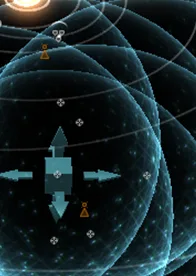 

同时恒星系图中出现了两个地标，这意味着你扫描出现了误差（技能不够的新人最容易出现这种情况）

那么如何判断哪个是真信号呢，这里老司机凭借多年经验交给你比较简单的判断方法

首先，不要动你的探针，使用鼠标左右键来查看信号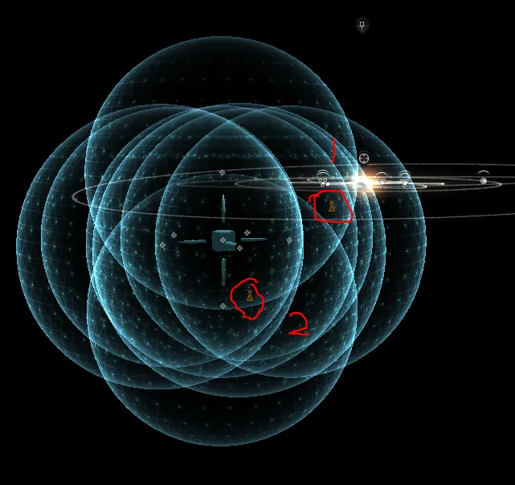 不难发现，1号信号距离你的蓝球球心比较远，2号比较近

 用鼠标左右键换角度看看，也能得出结论

**记住，离球心最远的那个信号一定是真的**

来验证一下吧

 

不断调整你的蓝球大小并移动他，让他包裹信号，然后分析

 

看，扫出来了。可以跳过去了

这里提一下箭头的作用，很简单，每个箭头代表一个可拖动的方向，向往一个固定方向移动时只需要拉动箭头即可，哪个两箭头变成了红色代表你可以把他往哪个方向移动

以上就是扫描的基本教程，刚开始可能很难，但是熟练了对你来说只是小菜一碟

好任务需要我们找到数据点，用我教授的方法继续扫下一个信号吧

（要注意，真正的信号不会像训练中这样好扫的）

 

这里需要注意，探针只能在太空里停留1个小时！，时间到了会消失！

过星门和进空间站等探针会自动收回！

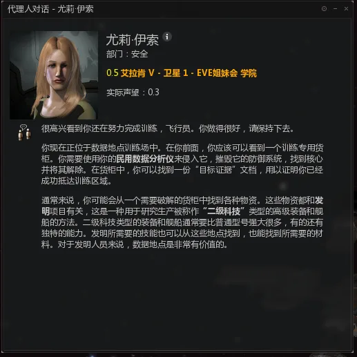 

数据地点的提示，对于做完商业任务的你来说没有难度

 

破译完，捡东西走人

第四步任务

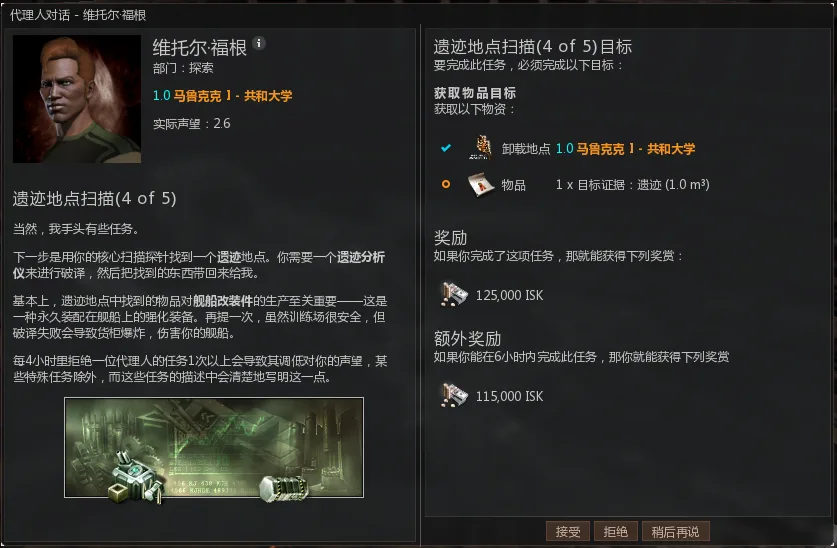 

与第三步步骤基本相同，记得带遗迹分析仪

 

代理人提示

 任务完成。

第5步

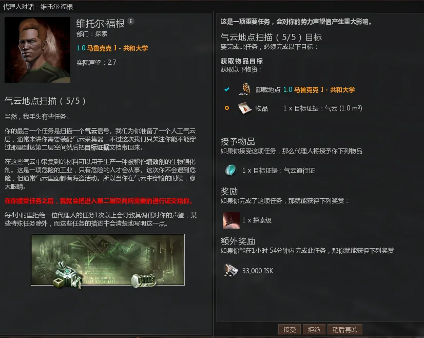 

需要你去扫出气云地点然后进去拿道具，接受任务后你的物品机库里会出现一个气云通行证，带着它你才能进第二层轨道

 

拿东西走人

以上就是所有的探索任务，搭配学到的如何让使用分析仪，你就可以去挖坟了。

到这里恭喜你，最基本的EVE操作你都已经完成了，

平均100人中只有3人能做到这里，你非常了不起，接下里你将要踏入EVE的宇宙中

这宇宙，属于你

### 新人入门补充

这一节把新人最容易踩坑的地方压缩成一份正式正文前的预热清单。

:::tip 新人先记住这 6 条
1. 常规探针扫描从 8AU 开始最稳，新人按 `8AU -> 4AU -> 2AU -> 1AU -> 0.5AU / 0.25AU` 逐步缩圈即可。
2. 25% 用来确认信号类型，75% 看见站点名称，100% 才能保存坐标或跃迁。
3. 遗迹站用遗迹分析仪，数据站用数据分析仪；想稳定挣钱，优先把 `Archaeology / Hacking` 练到能稳定使用 T2 分析仪。
4. 货柜扫描器不是必需品。普通遗迹/数据站更适合完整清掉；时间很紧或风险很高的站点，再考虑挑箱。
5. 高安低安适合练手，真正的收益通常在 00 与 1-3 级虫洞，但前提是你会做安全点、会看本地、会按 D 扫撤离。
6. 当前国际服普通数据/遗迹站破解成功后是直接开箱拿战利品，不会再出现额外散落货柜的流程。

:::

:::warning 新人最容易犯的错
1. 只学会扫针，不学会撤离。扫描只是入场券，生存才决定你能不能把收益带回家。
2. 一开始就上贵船。T1 探索护卫的意义，是用最低成本把“扫描、靠箱、破解、撤离”练成肌肉记忆。
3. 只追求扫描强度，不补分析仪技能。真正经常让新人亏钱的，往往不是扫不出来，而是箱子开不出来。
4. 本地来人还想多贪一箱。普通挖坟的大多数亏损，都不是因为箱子难，而是因为离场慢。

:::

:::info 以当前机制为准
- 关于“破解后飞出许多箱子”的描述已经过时，这部分已删除。
- Ghost Site 的计时逻辑、可见倒计时与撤离判断，请以 [进阶与附录页的「幽灵坟」部分](./advanced-and-appendix.md#幽灵坟-ghost-sites) 为准。
- 更系统的扫描、破译、模块、舰船、生存和高级站点内容，统一看下方正文，不再在这里重复展开。

:::

## 从新人到熟手的过渡建议

这一节重点是让你在进入正文主干前，先建立“什么船该开、什么站该碰、哪些盘面该怎么想”的判断。

#### 舰船路线怎么选

1. T1 探索护卫：最适合练手，便宜，爆了不心疼。四族都能用，谁中槽舒服、谁技能近就先开谁。
2. Astero：适合作为新人到熟手的过渡船，但默认应该建立在你已经能稳定使用隐形、知道何时该贪何时该跑的前提上。
3. Covert Ops 隐侦：如果你的目标是“纯探索效率”，它通常比 Astero 更专业、更便宜，也更符合只挖不打的思路。
4. Stratios / T3C：更像复合用途平台，适合幽灵坟、冬眠者储藏站、战斗气云或兼顾自保/反打，不是普通新人挖坟的第一跳升级。

#### 地点取舍

1. 普通势力遗迹/数据站仍然是最稳定的入门主食。
2. 高安低安可以拿来学流程，但如果目标是稳定赚钱，路线通常会逐步转向 00 和 1-3 级虫洞。
3. 名字里带 `Forgotten / Unsecured` 这类普通冬眠者站点，不要把它们当成普通坟；它们通常意味着有怪、有炮或者完整的 PvE 压力。
4. `Sleeper Cache`、`Ghost Site`、战斗气云这类高价值站点，收益和惩罚都更大，建议在普通坟已经足够熟练以后再碰。

#### 破译时最实用的经验

1. 靠箱子最后 10km 左右就准备关微曲，避免冲出破解距离。
2. 先观察盘面再动手。节点特别密、信息特别差的盘通常更难，不必硬顶第一条路。
3. `Restoration Node` 和 `Virus Suppressor` 的危险度通常最高，能早处理就早处理。
4. `Data Cache` 在“没路可走”前不要急着点，它既可能给你工具，也可能把局势弄得更差。
5. 破译本质上很像扫雷：先铺信息，再决定主攻方向，比一味贴边或一味直冲都稳。

#### 这一节不再重复的内容

- 与正文主干重复的舰船整表、模块整表、扫描整流程和站点总表。
- 明显依赖特定联盟/军团领地环境的 00 地区指引。
- 与当前版本不一致，或者已经在正文里更新过的机制说明。

## 快速上手路线

下面这段适合已经做完新手任务、想尽快开始挖普通坟的人。详细原理和操作仍建议继续看下一页。

这里是快速指南，涉及内容需要通读全文后才能理解。常用网站、产出与配装表统一整理在 [进阶与附录](./advanced-and-appendix.md)。

### 前期

1. 如果你的路线依赖隐形与隐跳，请按 Omega + Cloaking 技能路线规划；Alpha 也能做基础扫描和低成本探索，但生存与效率会明显下降。地狱模式开局的新人如果暂时不上隐形，至少要学会做深空点，4AU 内见到作战针就跳走
2. 如果是挖坟 0 技能用户，条件允许的话，推荐吃 1 罐脑浆，把扫描 Scanning技能下 7 项都点到 3 级，把种族护卫也点到 3 级
3. 买一条种族考古船（推荐苍鹭 Heron）,按照后面的推荐配装思路配好，目前你应该有75+的扫描强度，大部分的坟都能顺利扫出，接下来就可以开始你的探险活动啦

### 后期

4. 根据后文钢板小白配装所需的装备点上相应的技能，Cloaking 点到 4 级，为了上隐秘行动 `Covert Ops Cloaking Device II`。扫描技能下把 `Astrometrics` 点到 4 级，然后点 `Hacking` 到满级，上 T2 数据分析仪，最后 `Archaeology` 点到满级，上 T2 遗迹分析仪（一共大概 4 罐脑浆）
5. 开上小白 Astero。如果还不能使用隐秘行动，非常不建议直接上小白。前期请先拿苍鹭试水高级坟，有了 T2 分析仪后，成功率会大大增加
6. 点 Cybernetics 到 5 上黑镜脑插，补上各种基础工程学技能（重要），后续扫描技能把 Astrometrics 点满
7. 至此你的挖坟技能已经成型，后续可以考虑 T2 隐侦、中白 Stratios 或者金鹏 Tengu，然后开发自己的挖坟套路
