# EVE 新手教程：工业与商业代理人

:::warning 容易卡住的地方
很多任务不是到了地方就能交，而是要先确认任务道具已经在船舱里，或者已经被带回正确的空间站。
:::

## 商业代理人

:::warning 容易卡住的地方
很多商业任务并不是到了地方就能交，而是要先确认任务物品已经在船舱里，或者已经被带回正确的空间站。
:::

接下来开始讲解商业代理人的任务。

第一步

需要注意的是任务会给你道具，在你接任务的空间站的物品机库里，经常有新人找不到任务物品导致即使抵达了卸载地点却无法完成任务

把物品放进你的船里就可以出发啦zwz

抵达卸载的空间站后双击等候你的代理人就可以交任务了，

这时你会发现你没办法在当前空间站里接新任务，因为代理人与你不在一个空间站里，这时你需要返回职业代理人的空间站，担心找不到的话，只需设置终点然后出站一直跟着黄色图标就可以找到

好回到空间站开始第二步任务，

注意看任务目标，做任务前你需要在你的船上装备民用打捞设备

抵达任务地点后进入轨道，然后接近民用运输舰残骸，锁定他，激活打捞器，打捞有一定几率失败，耐心等待

成功后运输舰的残骸就可以打开了，拿走里面的东西，然后回去交任务。

这步任务教会了你如何使用打捞器，打捞器可以用来打捞残骸，这个打捞并不是说把残害里剩下的装备什么的捡回来，而是把残骸化成一些制造用的材料打捞回来，

同时这个任务给了你一艘采矿船-冲锋者级，下一步任务会需要要用到，有了它，你就可以真正意义上的自己通过挖矿赚点钱了。

下面是第三步任务

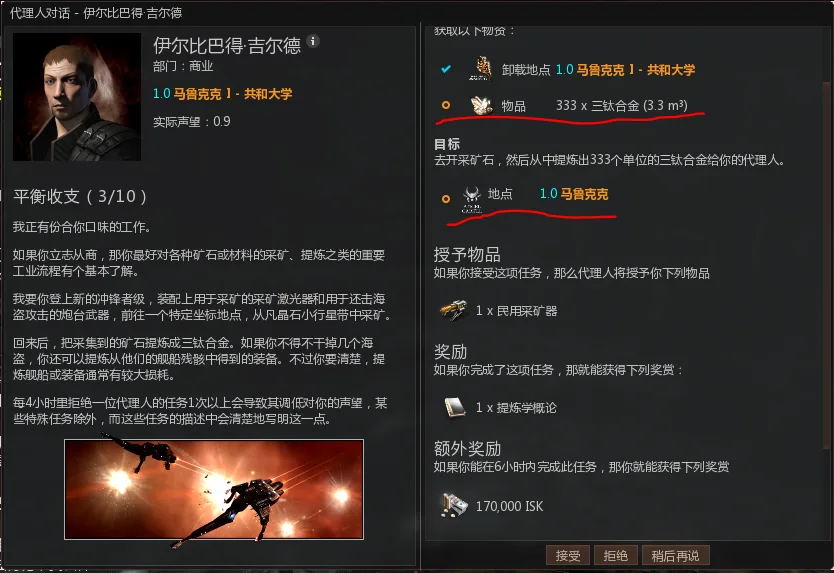

这个任务就需要上一步给你的冲锋者级，给你的冲锋者装上预先给你的民用采矿器，你就可以在太空中挖矿了，

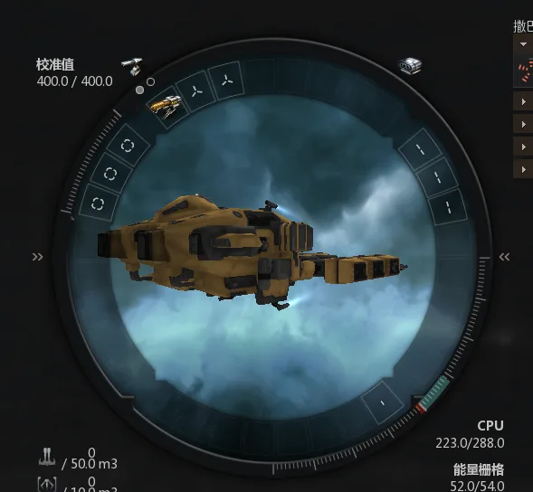

好装配完成，出站吧

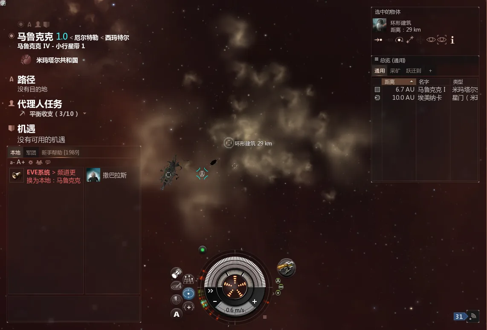

抵达任务地点后，如果你一时没有看到矿石，可以先点击总览里的采矿标签。

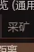

这样总览就会显示矿石了。

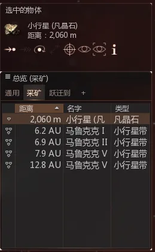
可以看到离你很近的地方有一块凡晶石，锁定它之后激活采矿器，你就可以挖矿了，

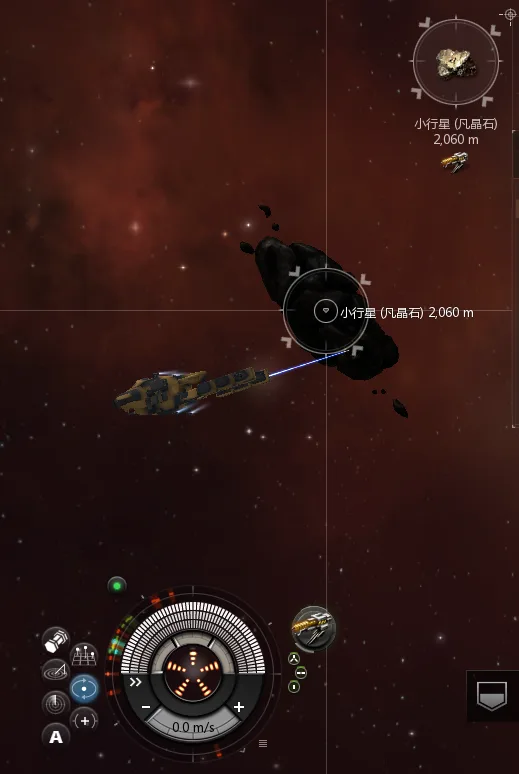

之后你可以打开船舱

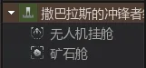

可以看到冲锋者是自带矿石仓的，开采出的凡晶石会储存在这里。

那么如何确定自己挖了多少呢

右键凡晶石，选择显示信息。

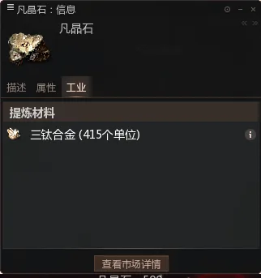

可以看到，你正在开采的凡晶石 1 块可以产出 415 单位三钛合金，也就是说并不用挖太多就可以完成任务。

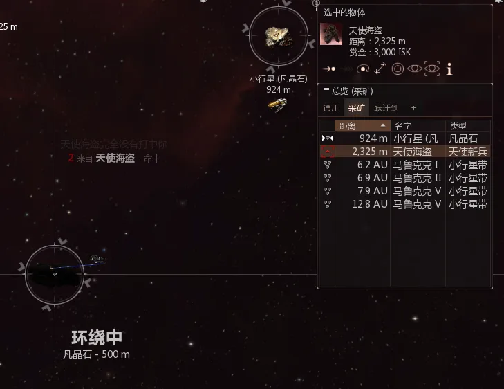

挖矿过程中会刷怪，不过伤害低的可怜，顶着火力强挖就好

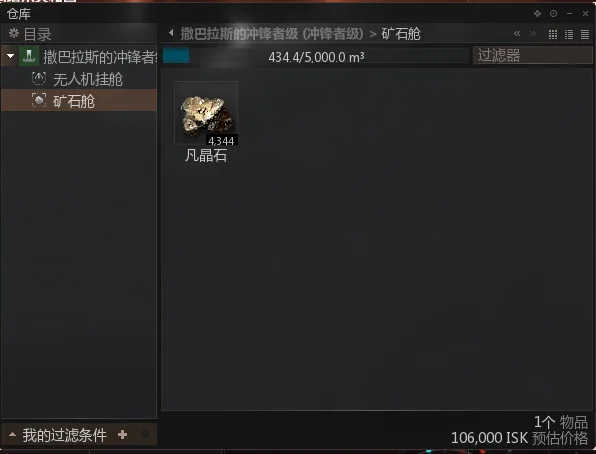

只一小会，就挖了几千块，这时就可以返回空间站了

（采矿总览里是不显示空间站的，只需把总览调到通用一栏即可）

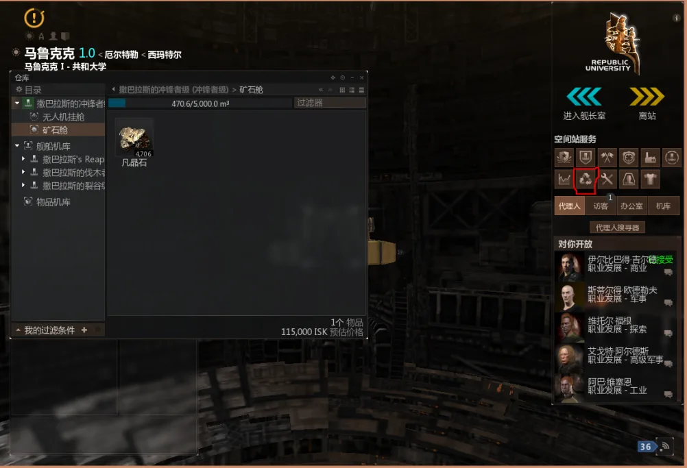

好返回空间站，要注意你开采的只是凡晶石，而凡晶石精炼之后才是三钛合金

这时你需要打开红笔圈选的提炼选项

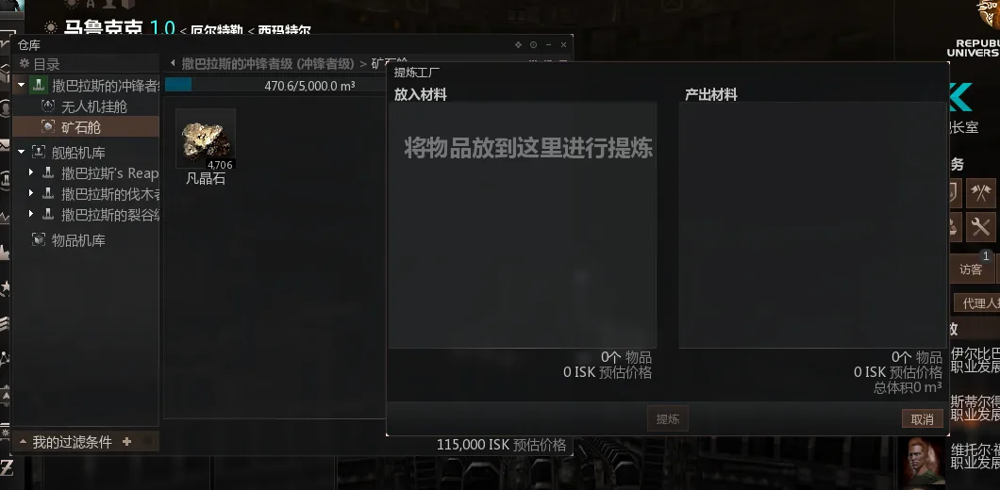

将凡晶石拖进放入材料一栏

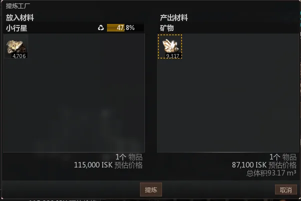

可以看到我挖的这些凡晶石可以产出9000多块三钛合金，已经远大于任务需求，此时只需要点击提炼按钮

提炼的矿石会自动放到你的物品机库里，就可以完成任务了

这个任务会给你一本叫提炼学的技能，想知道一本技能书的作用，只需要右键他然后显示信息，即可查看

接下来第四步

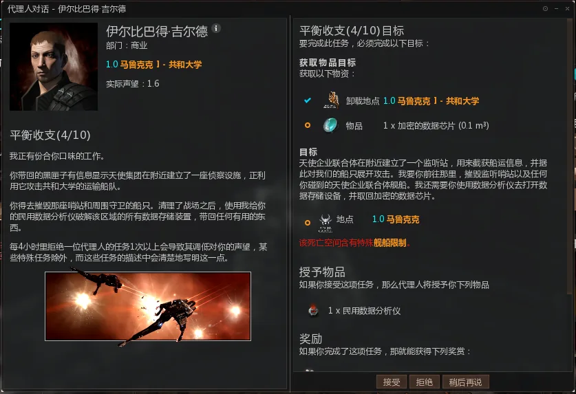

这个任务需要你提前装上民用数据分析仪，记得开着你的打怪船去，不要开冲锋者

落地后进轨道，清理怪，然后可以看到一个箱子

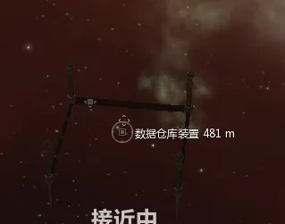

锁定他激活数据分析仪

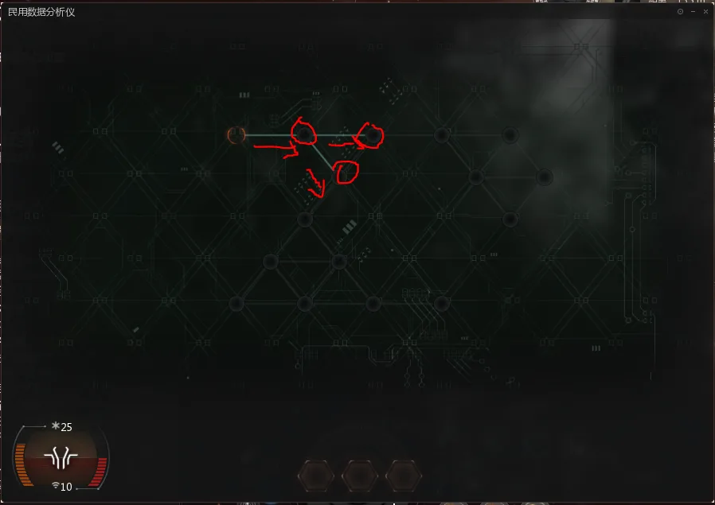

这个就是破译界面，你需要通过玩一个类似扫雷的游戏来破译这个机关

亮起的线通向的圆点表示你可以点击

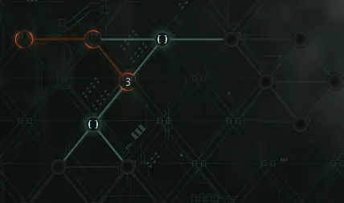

点击之后你会发现上面出现一个数字同时与他相邻的点被点亮，这个数字

代表离它3个点位距离的点可能会出现最终点或者是有助于你破译的道具

值得注意的是，这个点位布局不是唯一的，每次打开都会是新的布局

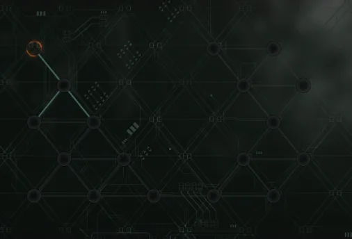

这是我取消破译重新激活后的布局

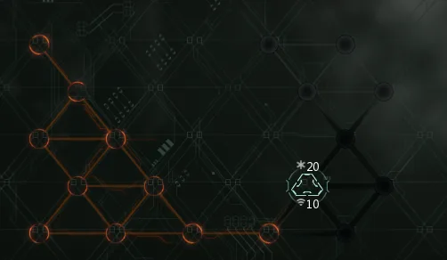
现在我们遇到了阻碍，他的名字叫防火墙，有他在你就无法继续向下点击，这时我们要左键点击它进行攻击

同时在此引进病毒强度与病毒同步率两个概念

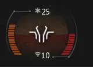
看破译界面左下角，这个就是你所用病毒的信息，

左边的橙色是病毒的同步率，就相当于血量，上边的\*后的数字是详细数值

右边红色的是病毒的强度，相当于攻击力，下边的wifi状图标也是详细数值

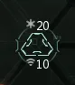
同时可以看到防火墙也有这两个属性，这时点击防火墙

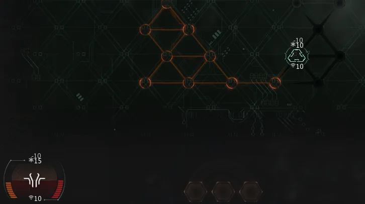

可以看到，点击的瞬间，你的同步率减少10点，防火墙的同步率也减少了10点

防火墙同步率减少的数值就是你的攻击力，你减少的数值也是防火墙的攻击力

好继续点击

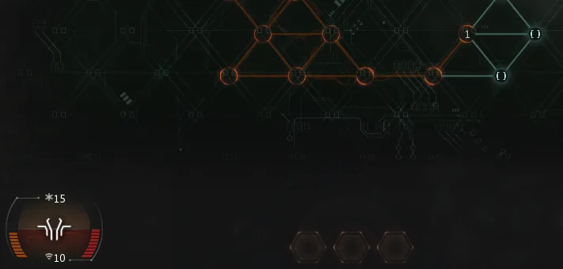

可以看到防火墙消失了，但是你的同步率并没有减少，这是这个游戏的规则之一

如果你的下次攻击能够攻破防火墙，那么你就不会再掉同步率

好继续点击

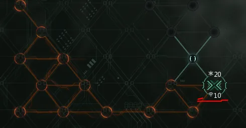

这时可以看到出现了这样的图标，这个就是你需要打开的核心，名字叫系统核心，打开它就算破译成功。

可以看到破译完成后箱子变成空心状代表可以查看里边的东西，

打开后拿走里边的所有东西就可以回去了

这步任务教授了如何使用数据遗迹分析仪（遗迹分析仪与数据分析仪使用方法相同），

学会这些，再加上之后不久要学习的扫描技能，你就可以挖坟了，也是赚钱的一种方式，也很有意思，**但是需要注意的是，与做任务时不同，挖坟时破译箱子只有两次机会，破译失败两次后，箱子会爆炸，但是不用担心，不会对船造成伤害**

接下来是第五步任务

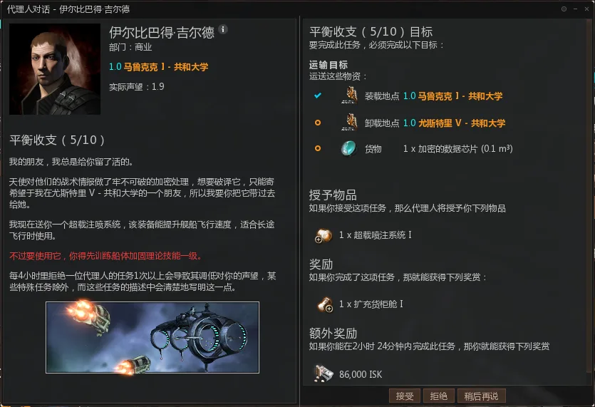

没什么难的，把东西从你在的空间站拉到另一个空间站里，**任务道具在你接任务空间站的**

**物品机库里，很多新手总是找不到任务道具**

ok在目的地交任务，然后再返回职业代理人处接新任务

第六步任务

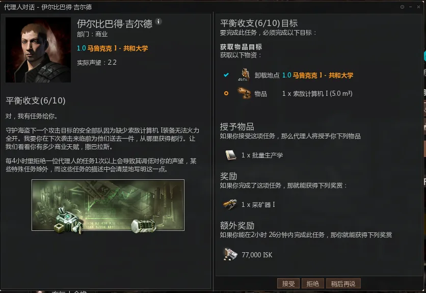

这个任务本身提示不算完整，需要一件索敌计算机来交任务，而系统不会明确告诉你去哪里拿。

弄到它之后，你就需要打开 EVE 的市场。

在左边栏找到这个图标，打开

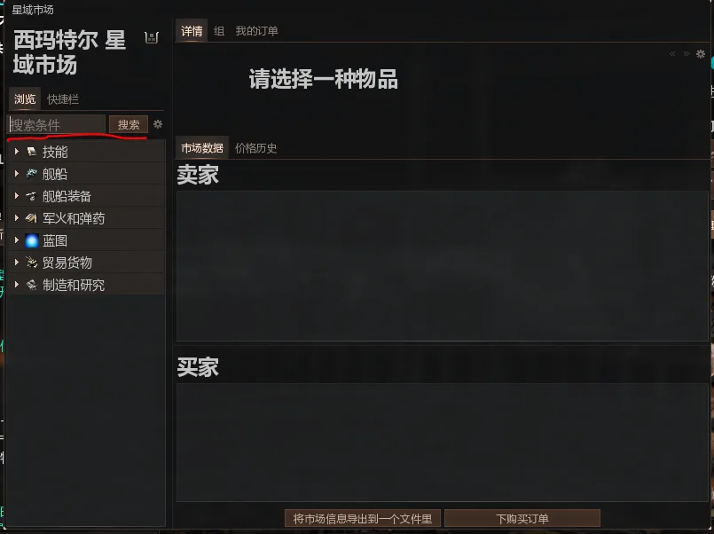

出现了市场界面，在我划红线的里面输入，索敌计算机

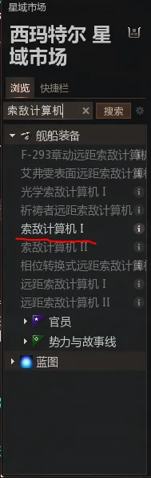

可以看到出现了很多，这些都是索敌计算机，，有的是衍生版本，或T2版本，这里不提，我们需要的是划横线的这个，选择他

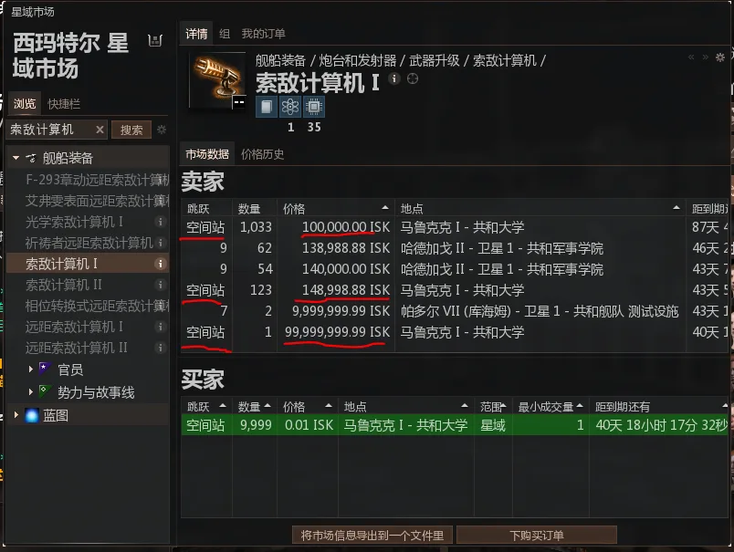

**这时会发现右边出现了信息，用来显示这件装备在哪里有卖。可以看左边的跳跃栏（即第一列红线），显示当前空间站里有 3 个卖单，剩下的分别在 7 跳和 9 跳以外的星系。这里一定要看清楚，如果买到远处的卖单，你还得专门飞过去把装备拿回来。优先买当前空间站里的，同时比较价格，选择最便宜的那一个即可。这里示例里最便宜的是 10 万 ISK。**

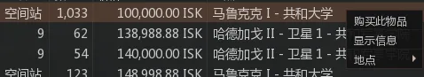

右键-购买此物品

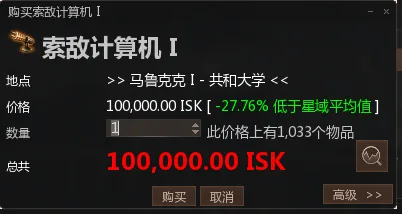

就可以选择购买数量，我们只需要买一个，之后就可以交任务了

第七步

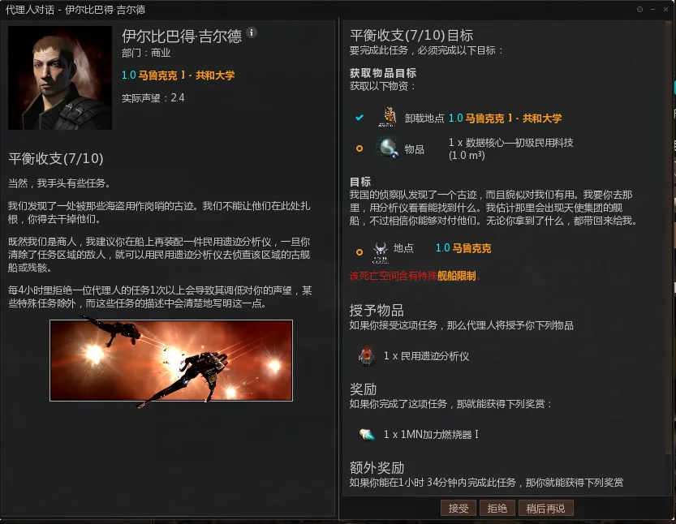

这个任务我们就要用的之前提过的遗迹分析仪，使用方法与数据分析仪大抵相同，你只需要区分一个箱子是遗迹分析仪还是用数据分析仪打开就好

给船装上他给的遗迹分析仪，出站

进入任务地点，逐层清怪

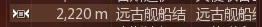

然后对它进行破译

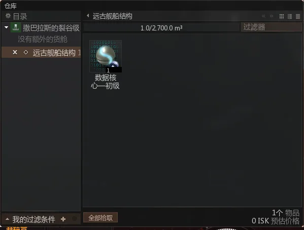

很简单就成功了，带着道具回去交任务吧

第八步

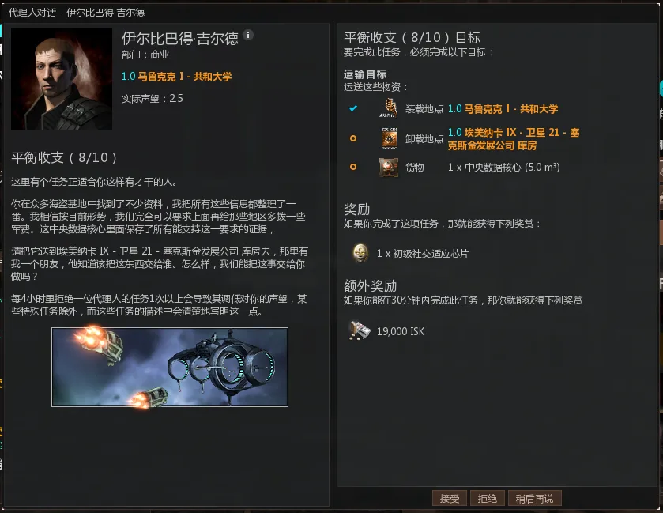

同样是一个运输任务，参考任务5

这个任务会和军事任务一样送你一个脑插。

第九步

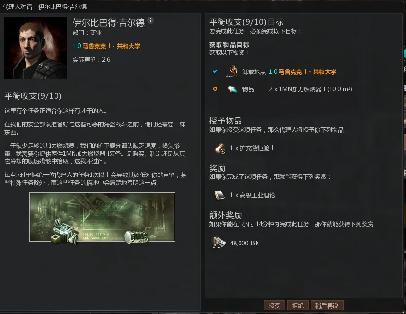

这个任务需要你搞两个1MN加力燃烧器，参考任务6，去市场买就好了

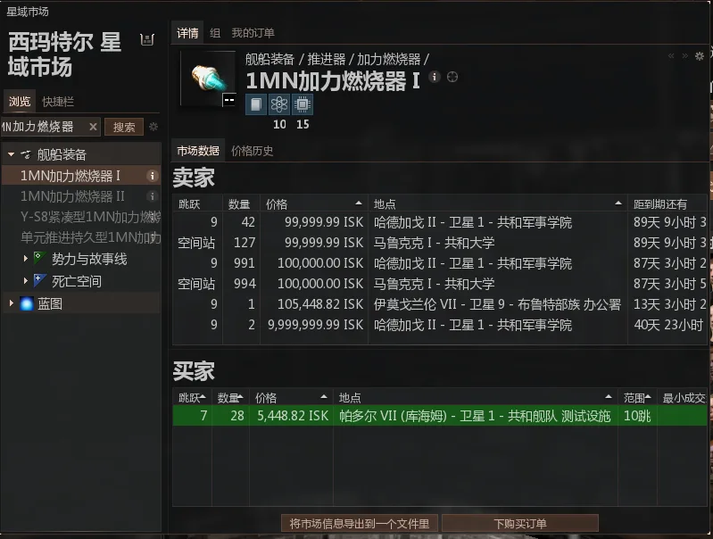

买两个交任务吧，记得买最便宜的，离你最近的，最好是在当前空间站的

最后一步啦，加油

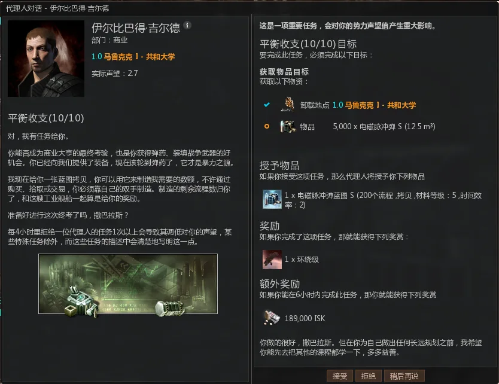

这个任务需要5000发电磁脉冲弹s，你可以选择去市场买，也可以通过他给你的蓝图自己造，我个人建议你选择自己造，这样可以简单了解一下EVE是如何生产的，下边给出步骤

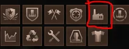
在空间站内右边栏内找到工业选项，打开

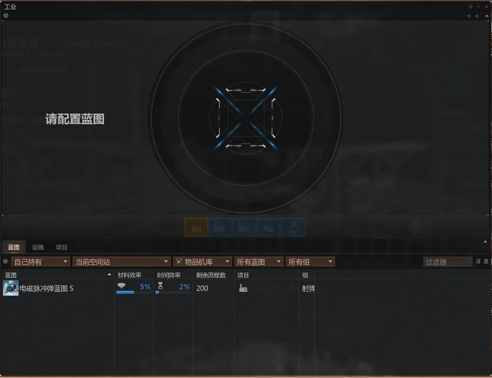

这就是工业制造界面，好，点击下边的蓝图

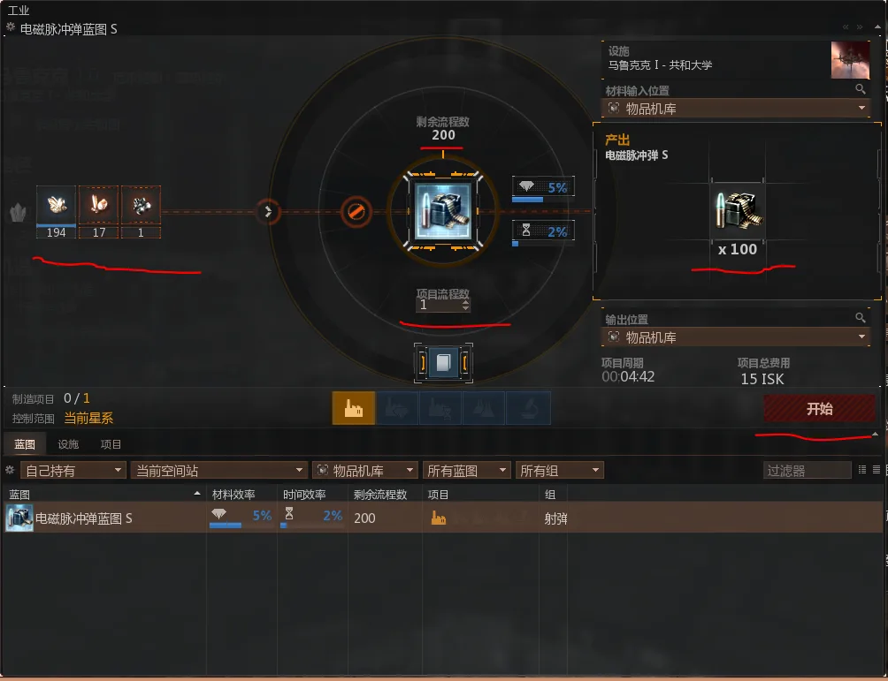

会出现这些界面，可以看到，左边我划红线的地方显示造电磁脉冲弹需要的材料

中间上边划的是这张蓝图剩余的流程数，下边是你可以自由选择造几个流程，

右边显示着你1流程可以产出多少东西，可以看到这张图纸1流程可以生产100发电磁脉冲弹，任务需求是5000发，意味着着我们要造50流程的子弹，

把项目流程数调到50

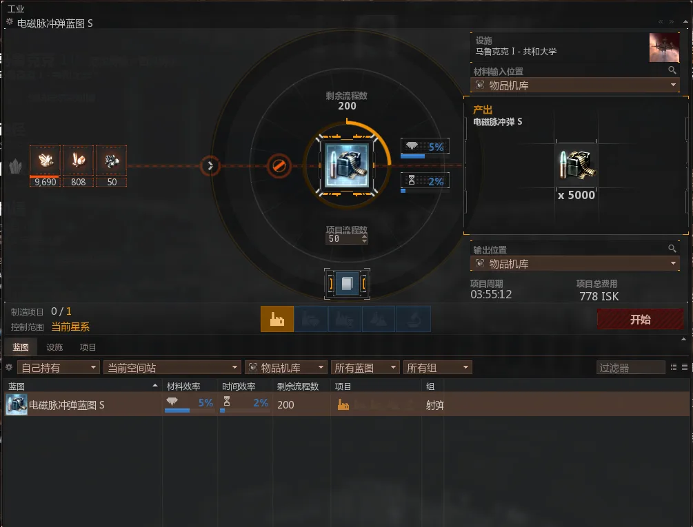

可以看到左边，我们需要的材料远远不够，这时我们就要想办法弄材料，鼠标右键这些材料的详细信息

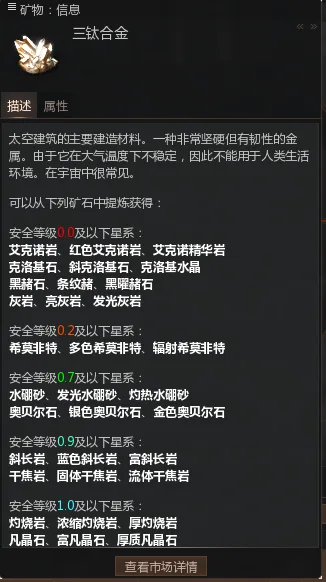

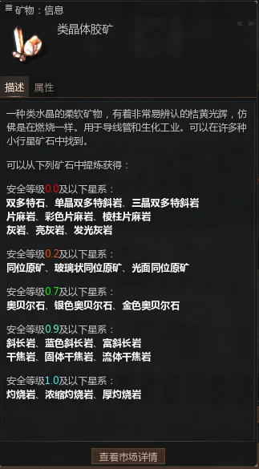

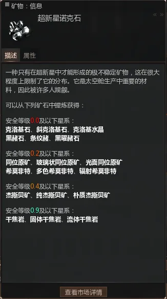

我们需要这三种矿物，我们可以通过挖矿来得到，可以看到，这三种矿物可以在一种叫千焦岩的矿物里被同时挖到，如此一来我们就需要开着冲锋者前往0.9安等的星系寻找，

之前任务中有给你新的采矿器，记得装到冲锋者上

这里提一下安全等级的概念

安等即一个星系的安全等级，他代表着一个星系的治安等级，在游戏界面左上角可以看到

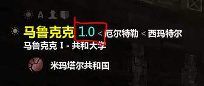

这里对安等进行划分

1.0-0.5（包括0.5）为高安星系，在这些星系里玩家无法随意攻击其他玩家，如果强行攻击就会被警察打死，安全等级越高警察出现的速度就越快（并不绝对，比如高安强暴党）

0.4-0.1（包括0.1）为低安星系，这些星系里玩家可以互相攻击，虽然依旧会违法但是不会出现警察的帮助，如果是在星门口或空间站门口违法攻击会遭到npc岗哨炮的打击。从0.5进入0.4地区统合部会有对话框提示你，不要随便下低安

0.0以下为00星系，在那里没有任何法律，玩家在00地区拥有主权，一切都是玩家说了算，互相攻击不会受到任何惩罚，很危险，不要随便去。

好言归正传，我们继续寻找千焦岩，一般在职业代理人所在的星系附近几跳就可以找到

如果找不到，打开星图查找

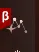
左边栏找到这个图标打开

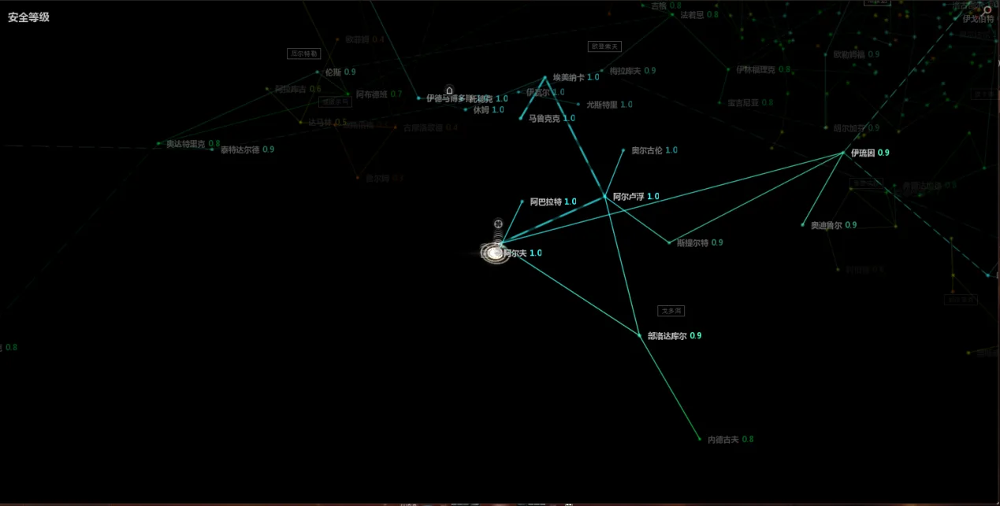

你就可以看到附近星系的安全等级了，选择一个0.9的，设置终点，然后出发吧

好抵达0.9星系，接下来该如何找到千焦岩呢

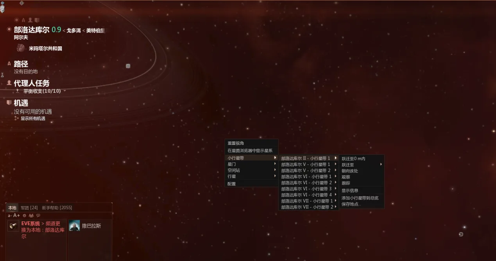

右键太空-小行星带-选择一个-跃迁至0m内

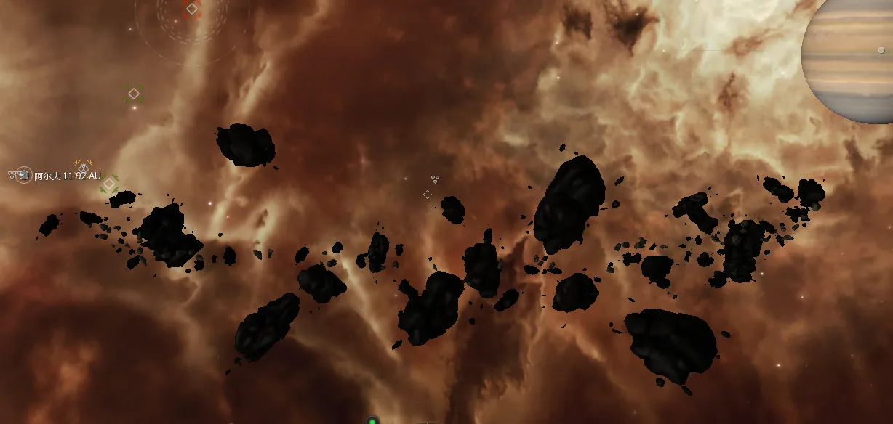

这样我们就抵达了一个充满矿石的小行星带，然后总览选择采矿

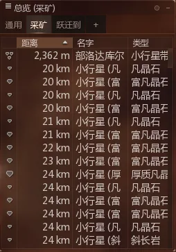

可以看到离你很近有很多矿石，但是似乎并没有我们要的千焦岩，没有千焦岩就无法提炼超新星诺克石，如果这个星系的一个星带里没有这种矿石，那么也代表其他星带里也没有，不要浪费时间，去别的星系看看吧，走远点也没有关系（如果实在找不到，职业代理人所在星系的市场里通常也会有人直接卖超新星诺克石。）

**还有一点是需要注意的在安等0.8以下的星系，小行星带会出怪，安等越低怪越强，冲锋者是可以带无人机的，可以在挖矿时放出无人机来打怪。**

**如果走出太远找不到回去的路怎么办，**

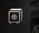
**左边栏找到个人资产**

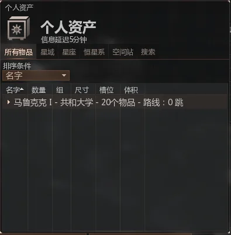

**可以看到，这个空间站里都是你的东西，那一定就是你的代理人空间站了，右键设置终点，就可以回去了。**

下面讲解如何使用无人机和学习技能

先是学习技能，

点击左边栏你的任务头像

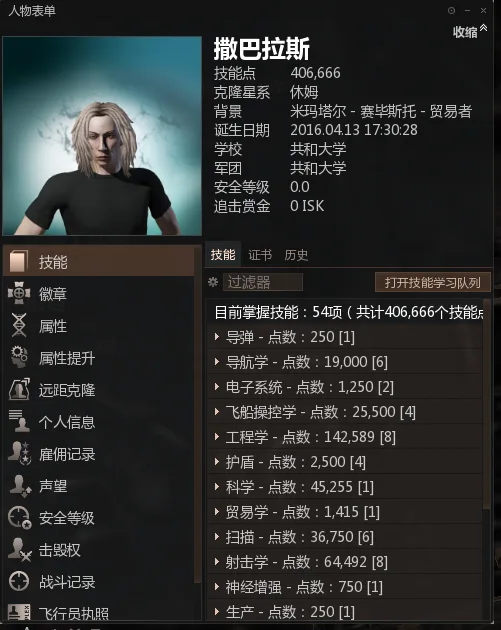

选择左边的技能栏，然后选择右边列表中的

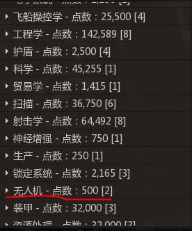

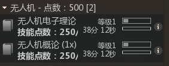
右键当中的无人机概论

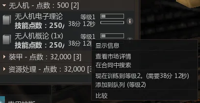
选择现在训练到等级2

这就是学习技能的方法，一次学习的所有技能时间加起来不能大于一天，

其次是关于

无人机首先无人机分为战斗无人机和电子战无人机，这里只提战斗无人机

战斗无人机分为轻无，中无，重无，岗哨

挖矿只需要用到轻无，

无人机概论每升一级你都能多用1个无人机，最多可以同时操控5个，

打开市场，然后寻找无人机（4族轻无的名字分别为大黄蜂，武士，侍僧，地精灵）

同时查看轻型无人机需要的技能

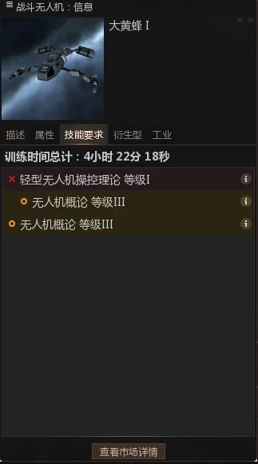
只有技能符合要求才能使用无人机，技能书在职业代理人的站里就可以买到

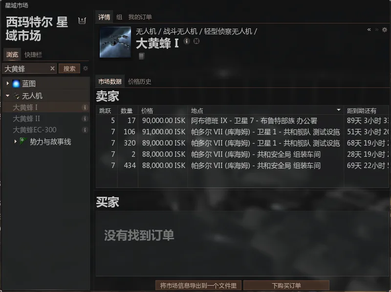
可以看到最近的离我也5跳之外，但是为了飞船的安全也没办法，远也要去啊，买完后

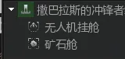
放入无人机挂舱即可

出站之后
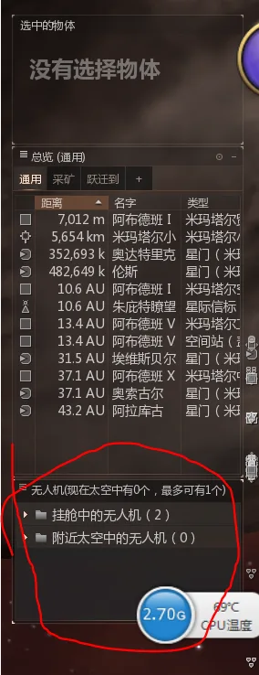
你的界面右边多了一列表，就是你船中的无人机

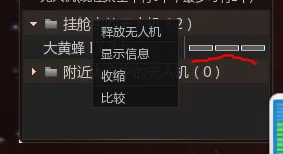
右键释放无人机，

右边三个白条代表无人机的护盾、装甲和结构。怪有时也会攻击无人机；三条都见底后，无人机就会被打爆。

以上就是商业代理人的全部任务。

## 工业代理人

:::tip 阅读方式
这一段和商业代理人有不少步骤是互通的。遇到提炼、制造或运输任务时，可以直接对照上一节的说明来做。
:::

接下来是工业代理人的任务攻略。

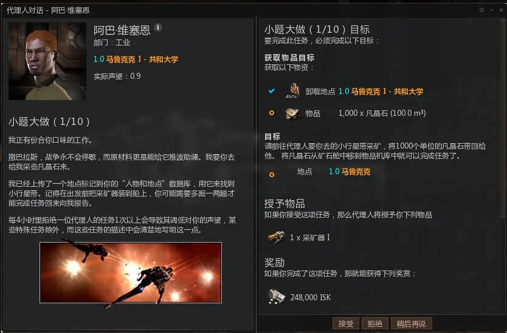

通过作商业代理人的任务相信你应该已经学会了如何挖矿，那么这个任务对你来说轻而易举

出站起跳任务目标的地点，找一块凡晶石开始挖吧，任务需要1000个凡晶石很快就能挖好

第二步任务

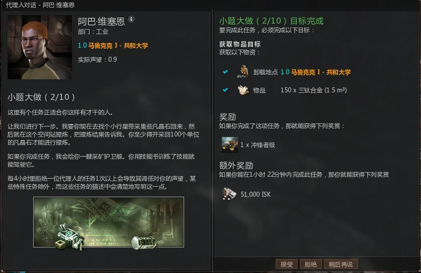

也很简单，如何提炼矿石在商业任务中也有提到过，这里就不说了

第三步任务

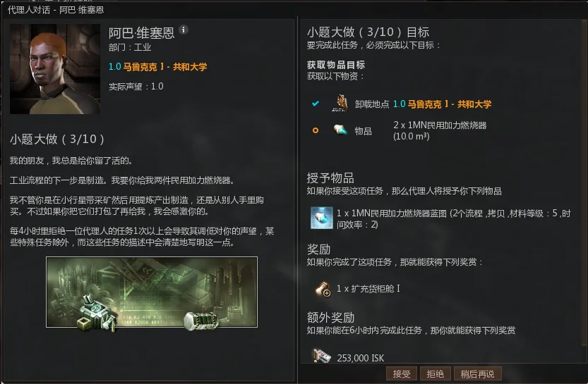

是一个制造任务，商业任务第十步任务就是如何制造，对你来说应该也很简单

制作过程需要花费10分钟，耐心等待，如果你是一边在造子弹一边来做这个工业任务的话，看看空间站里有没有卖成品的？

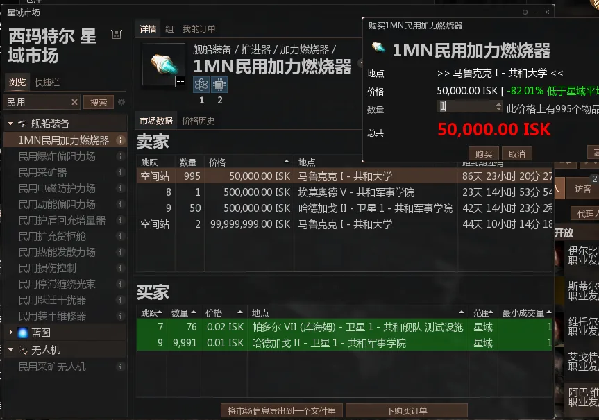

像这样。直接买成品也能完成任务，思路灵活一点会省很多时间。

第四步任务

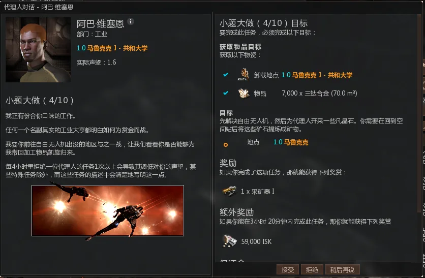

同样是让你去任务地点，清理掉一些怪，开采矿石，这次需要7000单位的三钛合金，

记得多挖点凡晶石回来提炼，

如果你有听我的话有学无人机技能的话，这俩怪对你一点难度都没有，如果没学的话，就先开刷怪船来清理下怪再来挖吧这两个怪打冲锋者还是很疼的。

没什么值得注意的了，直接跳下一步任务

第五步任务

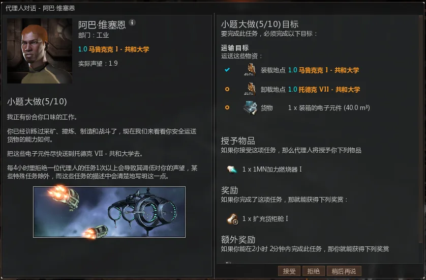

同样是运输任务。到物品机库里找到任务道具，装进船舱后出发即可。

第六步任务

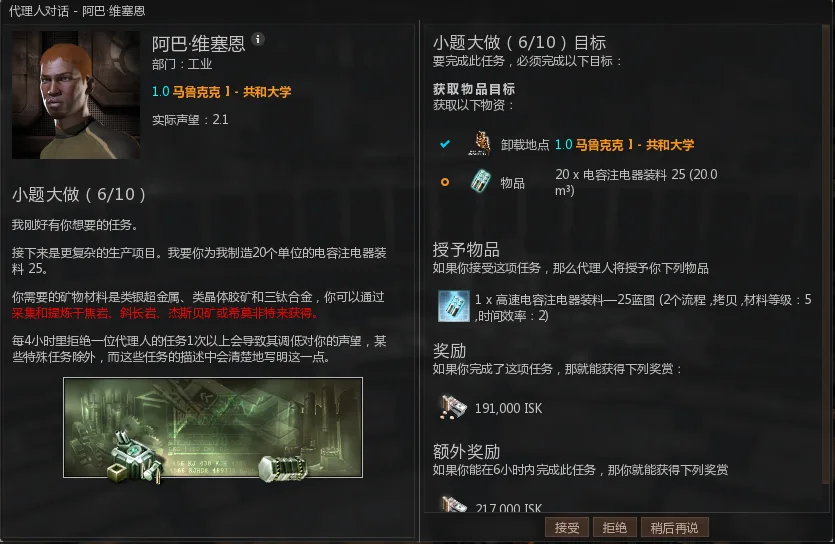

同样需要制造，你在商业中也学过了，这里为了赶时间我就直接买成品了，建议你还是体验一下这个制造过程，很有趣，这里就不详细说明了。

第七步

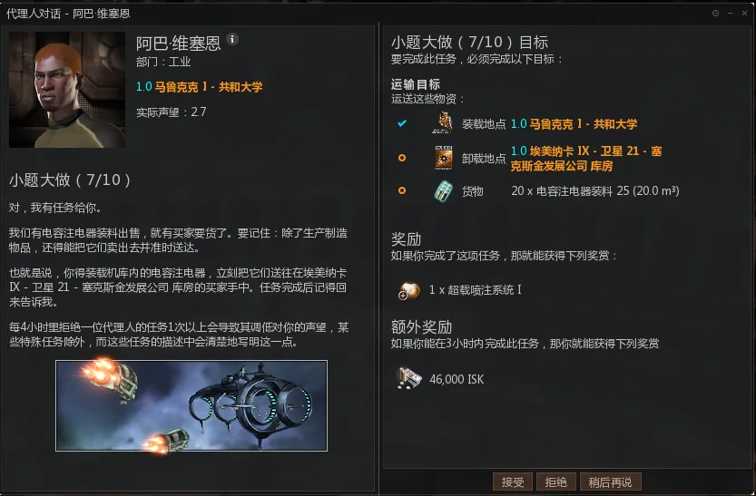

这步任务需要你把在职业代理人站里制造出来的20颗电池运到另一个空间站去。

方法已经提过，也没什么难度

第八步任务

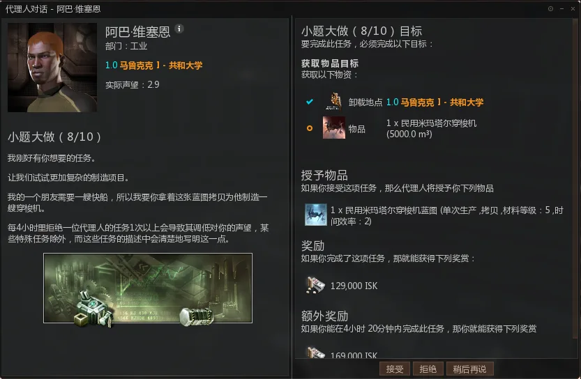

又是一个制造任务，不过这个穿梭机市场里没有现成卖单，只能自己做。耐心等几分钟，很快就能完成。

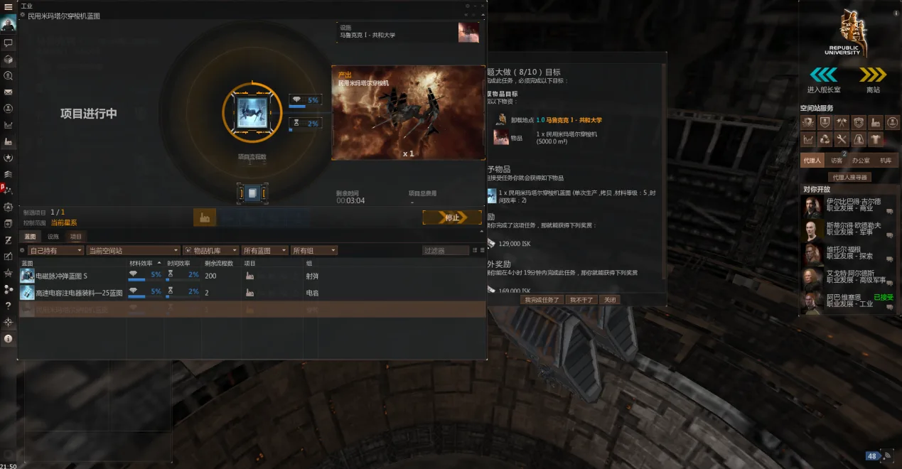

耐心等待然后就完成任务了

第九步任务

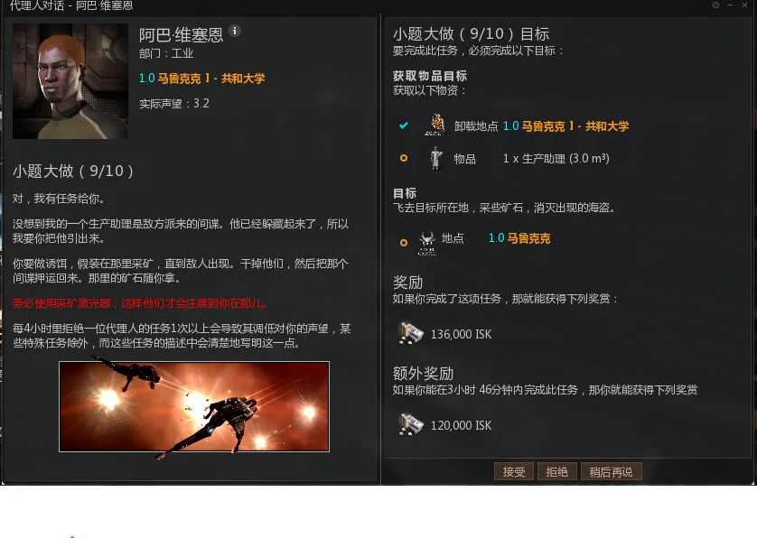

这步任务需要打怪，采矿只是个幌子，你只需要给你的刷怪船卸下一个炮台安装一个采矿器

就可以啦

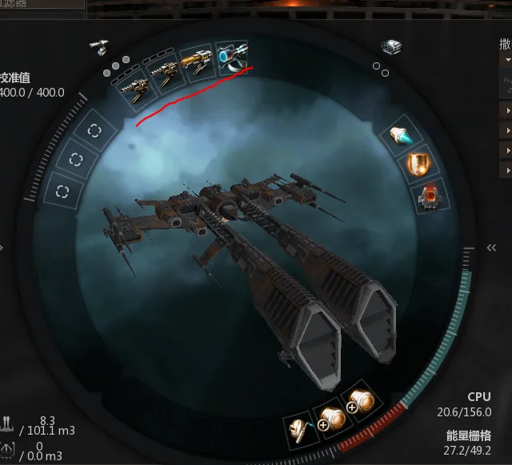
像这样

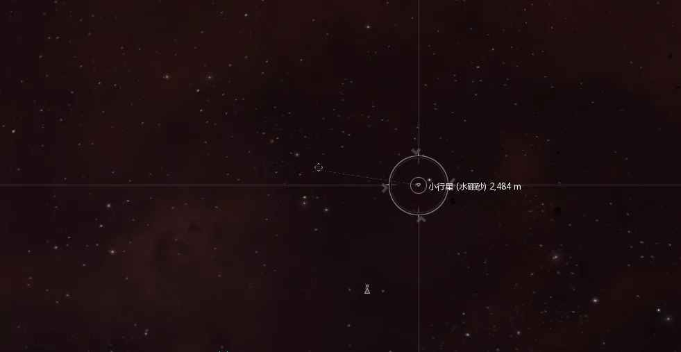

耐心等待怪来

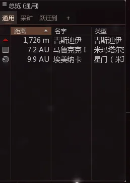
出现了！干掉他

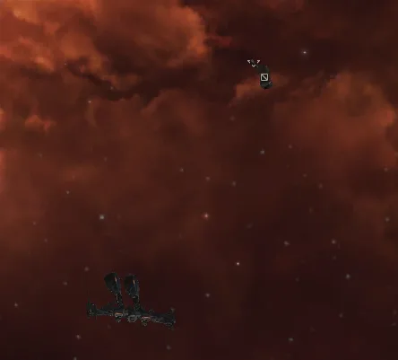
出现一个货柜，打开它

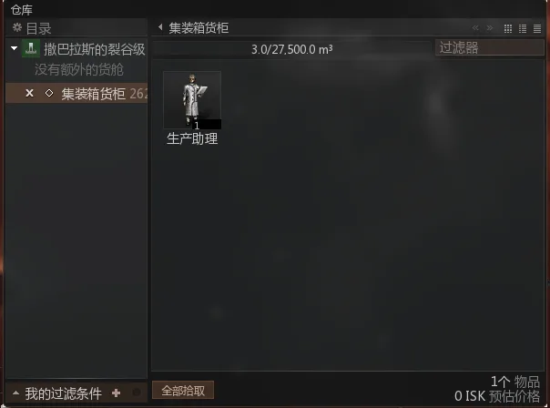

带走回去交任务吧\~

第十步

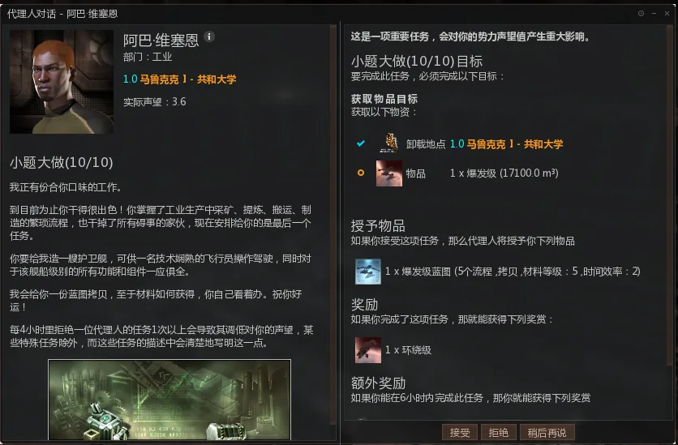

同样的制造任务，整体相对简单。

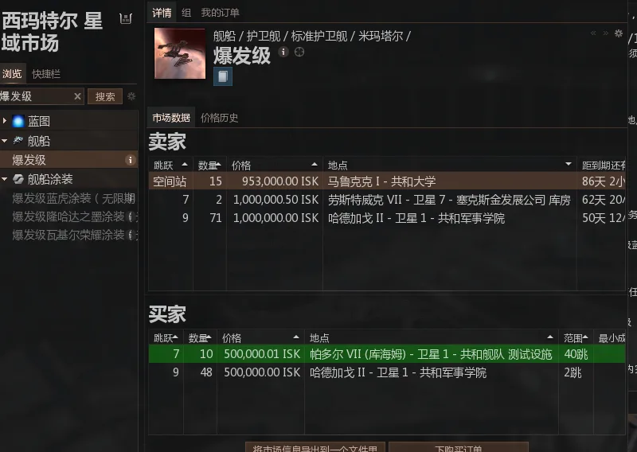

造或者买，按你当前的时间和资金情况选一个即可。

有了商业任务的铺垫之后，工业任务会顺手很多。做到这里，你已经完成整套新手教程的一半了。

:::info 下一页
如果你还没跑军事线，可以看 [军事代理人](./military.md)。如果你已经做完整套职业代理人任务，可以继续看 [挖坟：开始之前](./getting-started.md) 和 [挖坟：入门正文](./basics.md)。
:::
