# EVE 新手教程：军事代理人

:::danger 爆船风险
这条线会明确教你处理战斗、送船、反跳和环境伤害。教程送的船可以拿来练手，但不要把全部身家都堆到一条任务船上。
:::

## 军事代理人

:::tip 任务重点
这一段会带你熟悉接任务、进任务点、锁定、装弹、交任务和基础总览设置。很多后面的内容都会反复用到这里的动作。
:::

这一节介绍军事代理人的任务流程。有了前一节的基础后，接下来重点看如何接任务和完成战斗。

首先，双击军事代理人，会出现以下

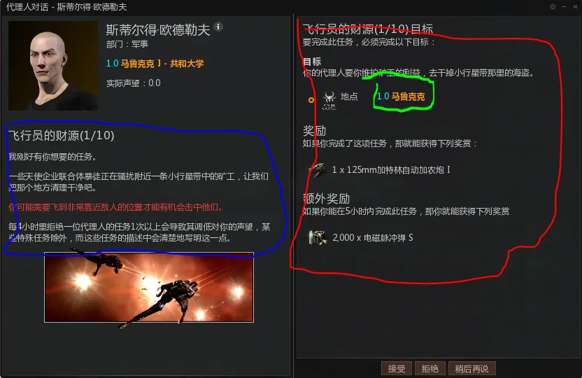

蓝笔圈中的是任务的故事介绍，**其中可能会有重要的提示或要求，务必详细查看。**

红笔圈中的是任务奖励和任务目标。

绿色笔圈中的是你需要到达的任务地点。到达方法类似设置终点；

接下来点击右下角接受，然后离开空间站进入太空，

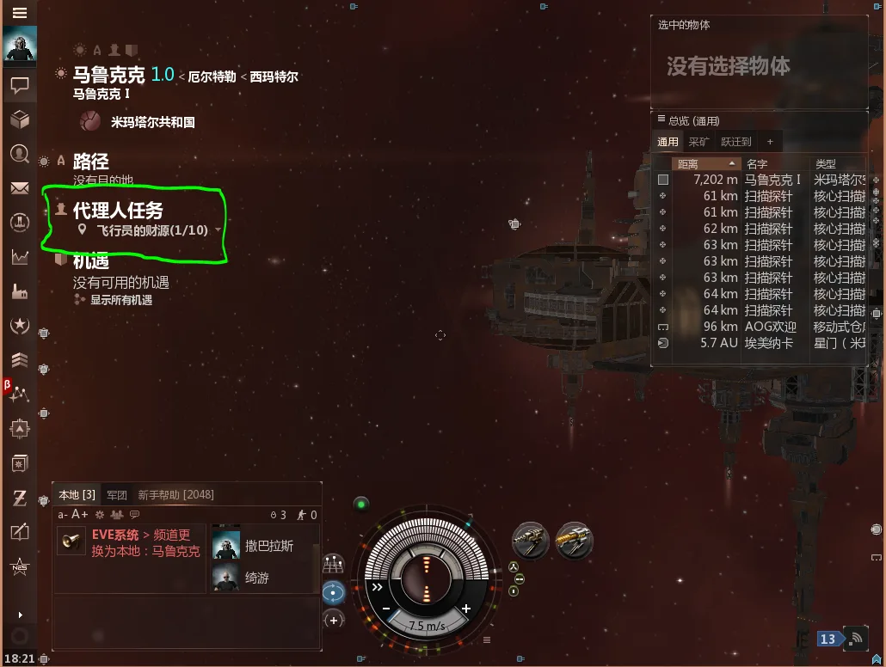

可以看到这个选项，想要到达任务地点，点开任务

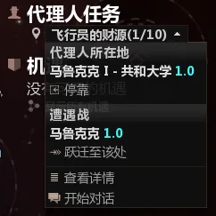

点击跃迁至该处，就可以抵达任务地点。

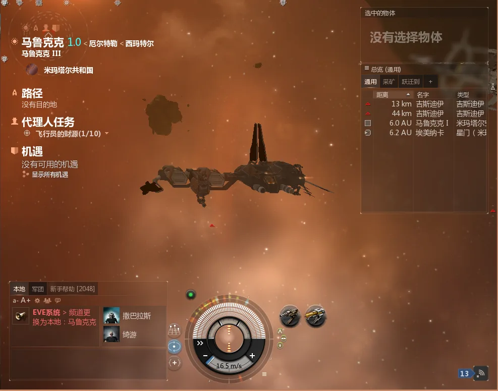

抵达任务地点，根据任务要求，你需要打死右边总览中的怪（就是红色的三角）；

锁定方法两种，第一种右键红色三角，会出现一个列表，选择"锁定目标"；

第二种ctrl+鼠标左键，可以快速锁定

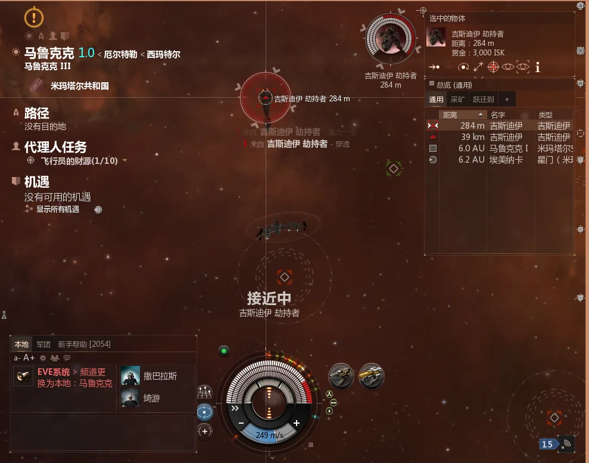

好你已经锁定目标，接下来需要激活武器开火，

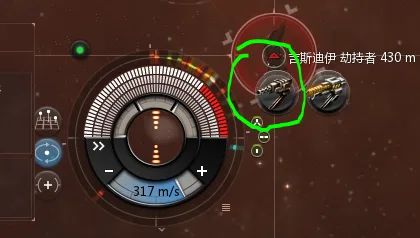

这个就是你船上搭载的武器，只需点击一下即可。，需要注意的是武器是有射程的，因为无法截图我就直接口述，鼠标移到武器上会出现一个框框，上边有介绍武器的伤害与有效射程和最佳射程，只有在射程内才能打到怪，你可以通过右键怪物选择接近或者双击怪物来接近

OK，把怪都清理掉后，你会发现任务前打了个勾，代表任务完成了；

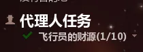

接下来你要返回空间站交任务，这时再次点开任务

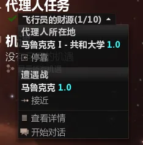

有一个代理人所在地，这时只需选择停靠，就可以到达空间站，

进站后再次双击代理人

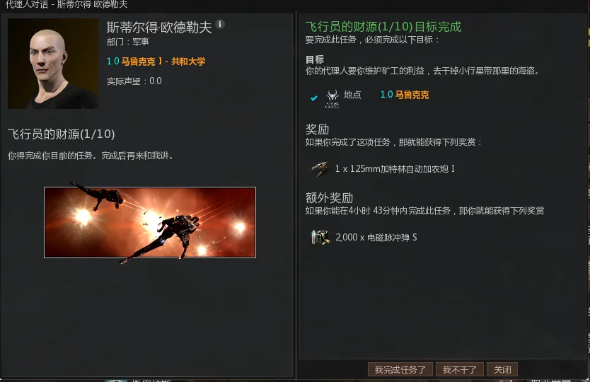

选择"我完成任务了"，就可以获得报酬，这样军事代理人第一步任务就完成了。

然后选择我要执行新任务来进行下一步任务

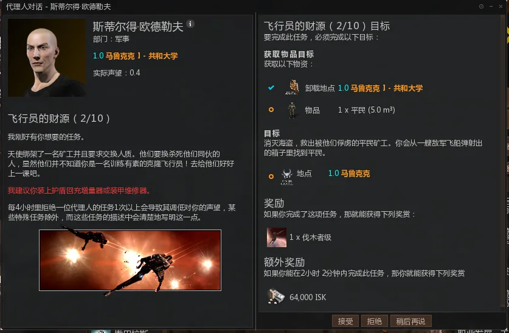

第二部任务是需要你消灭海盗救回矿工，注意红字，这表明任务稍有难度，但是不用担心会爆船什么的，你现在开着的新手船系统会无限送给你，你只需要开着太空舱随便进一个空间站（前提是你这个空间站内没有船），就可以获得一艘新手船，好接下任务出站

之前教授过得步骤就不一一提及了，直接开始做任务。

怪全部消灭后，会出现一个货柜

打开方法，鼠标点住图标，出现环状菜单然后鼠标不松直接向上一划，这个方法同样适用于查看残骸，要注意只有在货柜和残害2500m内才能查看

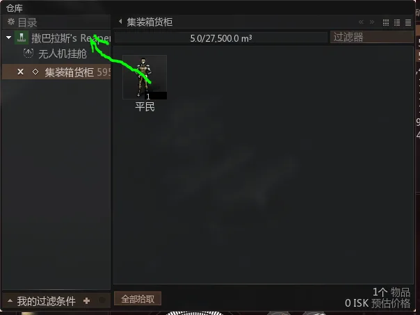

然后把道具拖到你的船舱里就可以返回交任务了

此时任务没有显示完成，你需要将道具带入空间站才算完成

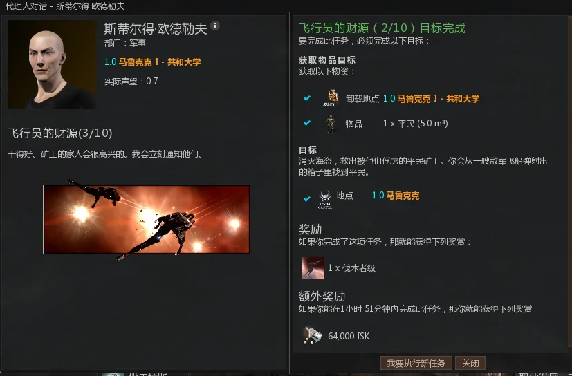

可以看到进入空间站打开代理人才会显示对勾，接下来接第三步任务

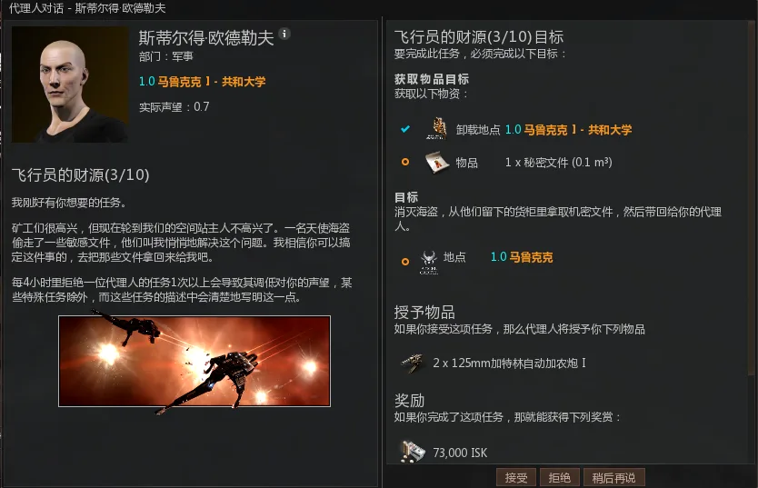

做这个任务的时候你就可以开代理人给你的新船，并且可以装上新的武器了，方法如下

左键绿色菜单

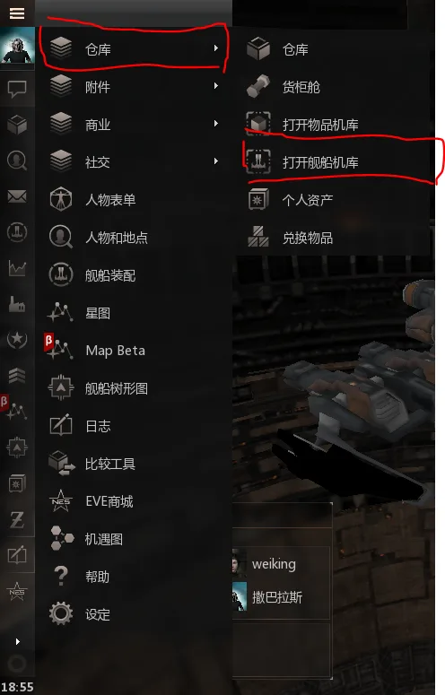

选择红笔圈中的选项，打开

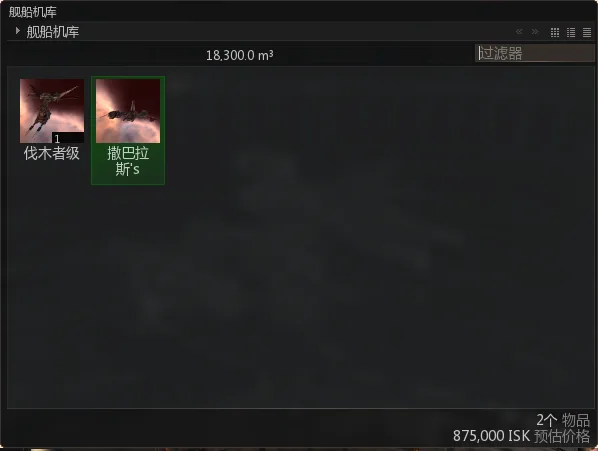

可以看到一艘伐木者级（各族不同），右键

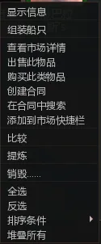
选择组装船只，再右键

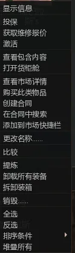
选择激活，你就会发现你已经换了船。

接下来教授如何给船只装上装备

同样是界面左边菜单。

点开这个图标就是装配界面，同时打开下面这个物品机库图标：

然后会出现如下界面。

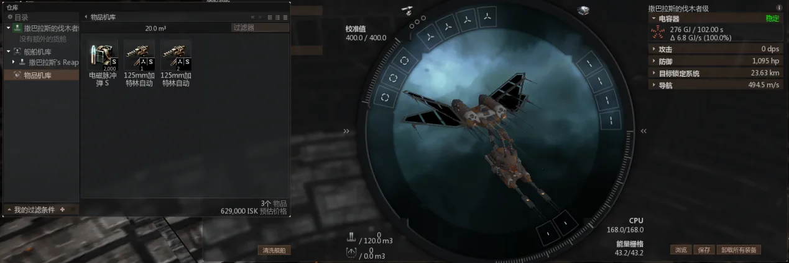

选择机库中的装备，右键炮台，选择装配到当前飞船，或者直接把炮台拖到

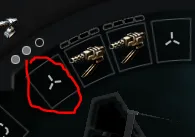
上

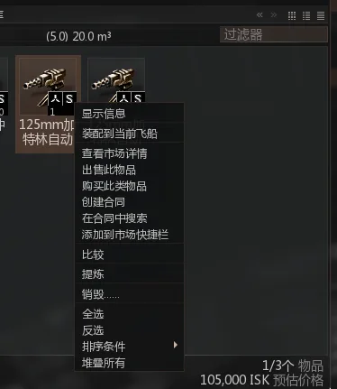

再把子弹拖到船舱里，这样就穿配完成，就可以接任务出站了。

出站后注意，你的炮台会显示成下面这样：

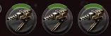

这样的状态表示你的炮台还没有装载弹药，这时，右键
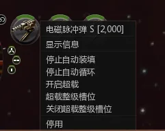
单击电磁脉冲弹，就可以自动装填啦，

这里需要注意，型号相同的武器可以进行编组，只需把一个炮台拖到另一个炮台上。完成后会显示成下面这样：

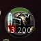

这样就可以进行 3 门炮台的齐射。

现在可以去任务地点做任务了

这个任务怪不需要全打掉，只需要打掉一个冲你过来的"跑跑无人机"，就会掉出货柜，然后捡东西走人。

好接下来是第四步任务

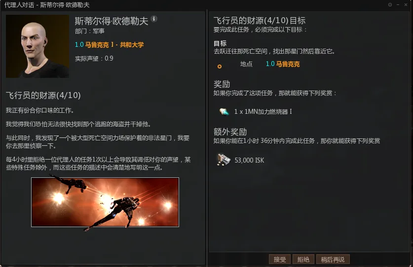

这个任务是要你去任务地点侦查一下，找到星门

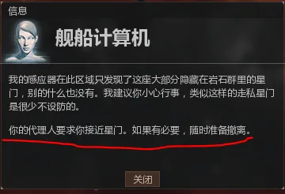

注意弹出的对话框

落地后可以看到

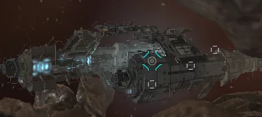
这个就是星门，接近他

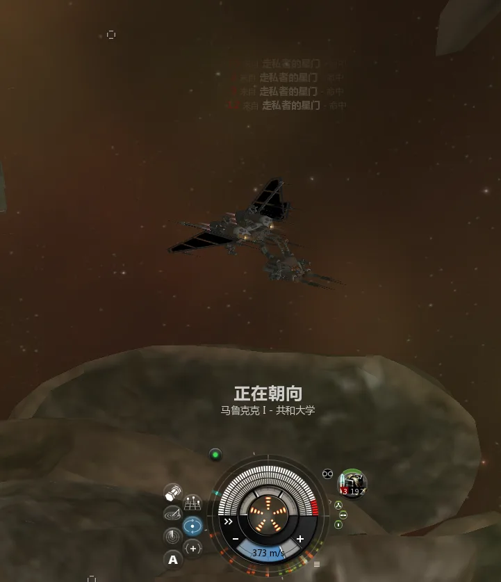

稍等片刻后会被攻击，但是伤害不高，同时任务完成，可以起跳空间站交任务

接下来是第五步任务

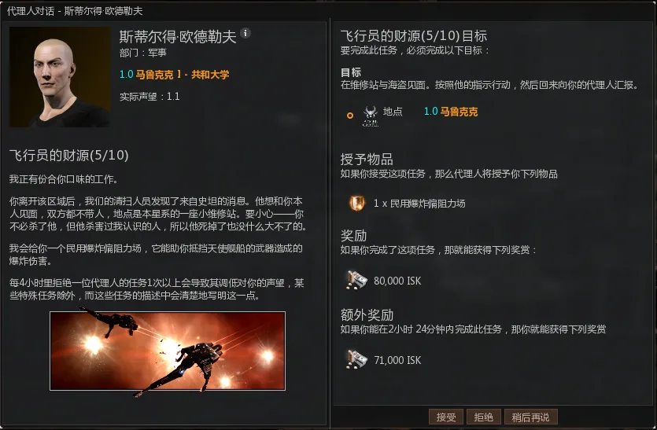

在这之前可以把任务奖励你的加力燃烧器安装在船上，激活他后他能让你的船跑的更快点。

出站起跳任务地点

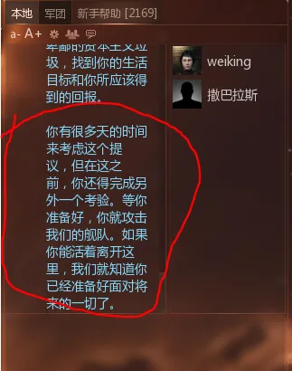

抵达任务地点后，左下角本地频道里会出现任务对话，大体意思就是让你打怪

只需要打一下就算完成任务，可以起跳走了

然后是第六步任务，记得把任务奖励装到飞船上

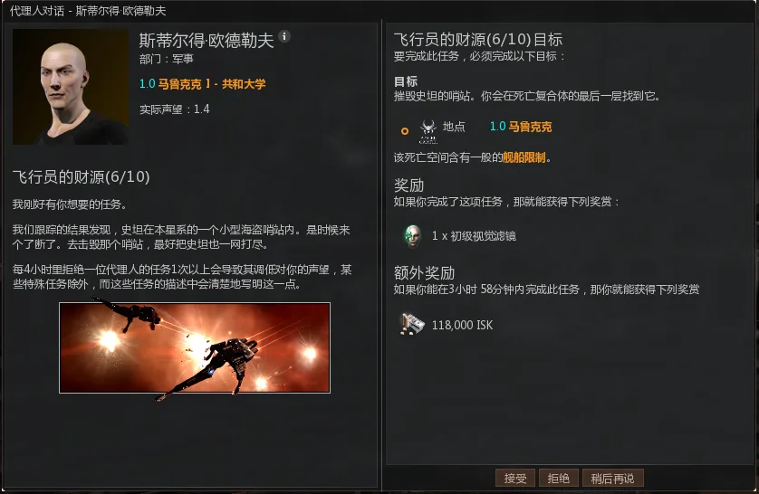

同样是打怪的任务，最后需要你打一个建筑物，

落地后，你面前会有一个加速轨道。

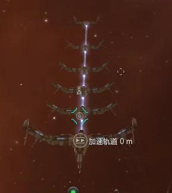

右键激活，或者拉出环状菜单激活后进入轨道。

怪不少但是很简单基本就1，2炮的事，一点点清理完，进入第二层

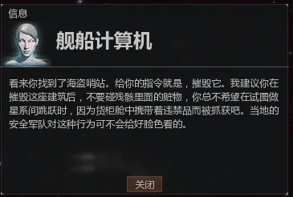

注意对话框

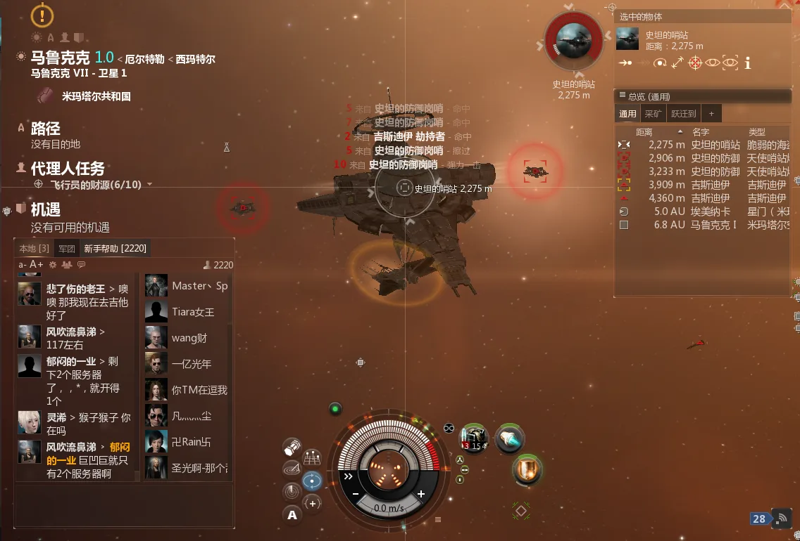

攻击建筑物会刷怪，打完建筑物直接跳走，不要动爆出来的箱子里的东西，会掉声望。

这个任务会给你一个脑插，脑插是可以增加你相关技能学习速度的东西，使用方法，在空间站仓库里找到，右键-植入

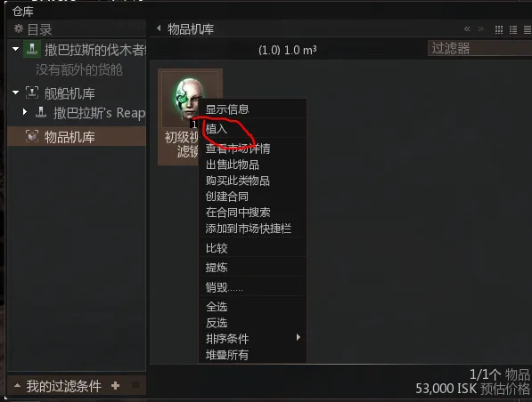

接下来第七步任务

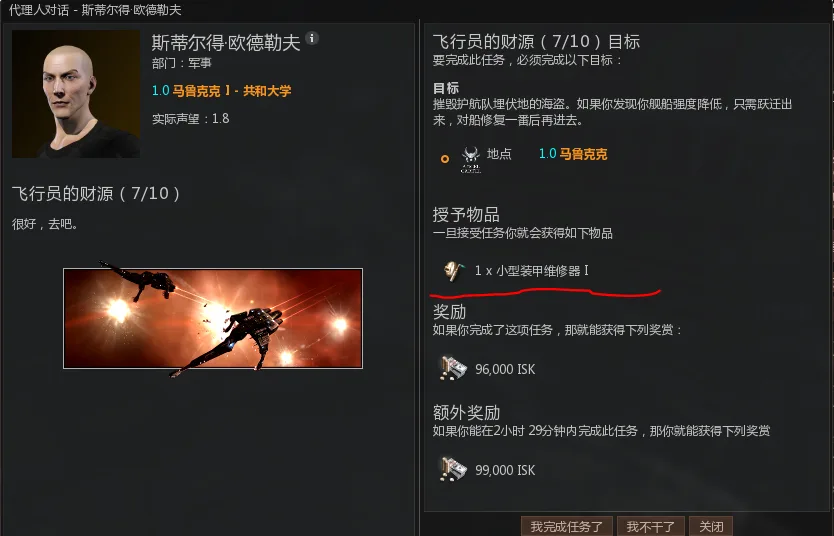

这个任务会预先给你一个装甲维修器，做任务前装上他，战斗中激活他会帮你修复装甲

船的血量分为护盾，装甲，结构三个阶段，被攻击时先掉护盾，然后装甲，结构掉没了你的船就要爆了。

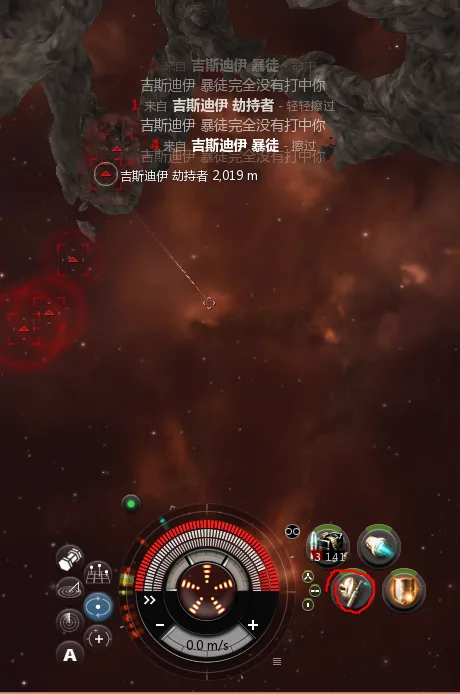

可以看到，我的船已经被打进了装甲，这时激活装甲维修器

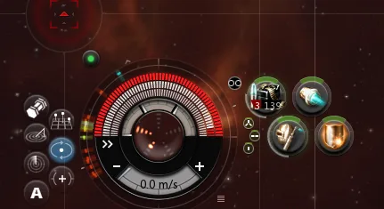

装甲就会被修复，要注意维修装备都十分耗电，注意关注电量；

黄色全部消失代表电量耗尽，电量可以自动回复但远没有维修装备消耗的快

清理掉所有怪后回去交任务。

第八步任务

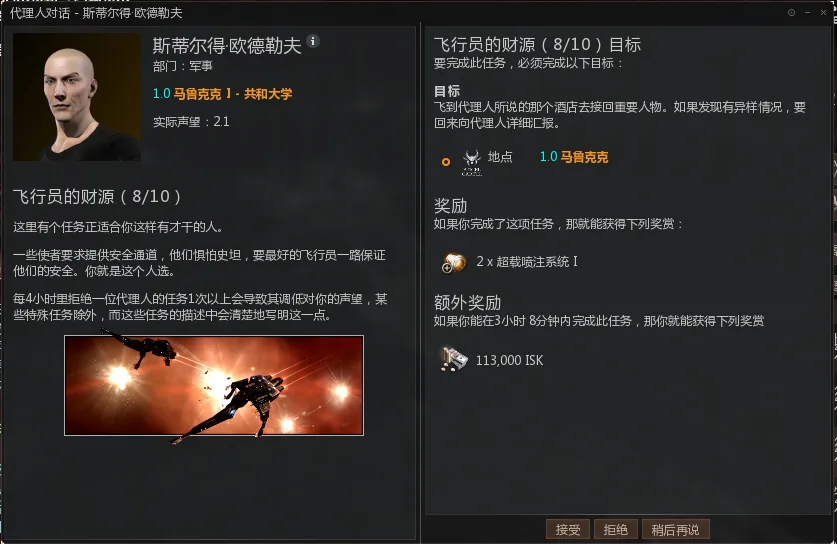

跳跃时弹出的对话框中有重要信息

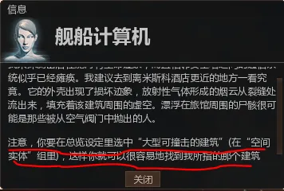

下面简单讲解一下调试总览，

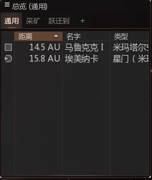
这个就是总览

左键他会出现
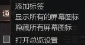

选择打开总览设置

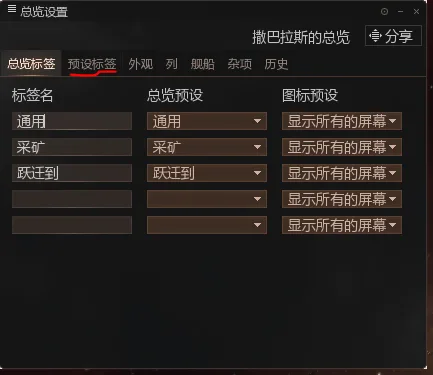
选择预设标签

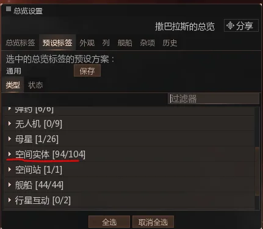
找到空间实体，打开

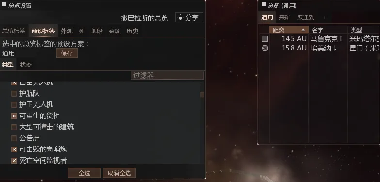

在"大型可撞击建筑"选项左边点一下，现在注意看总览

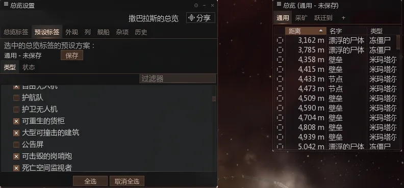

总览里出现了一些东西

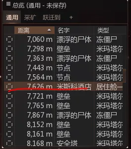
现在在总览中找到并接近他

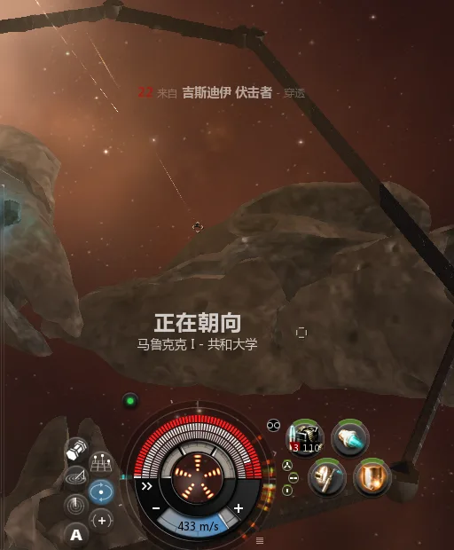

接近后酒店会对你造成伤害，同时刷出几个海盗，不用管，任务已经完成，可以回去了，这时如果你嫌总览东西太多，只需再打开总览把那个大型可撞击建筑点掉

接下来是第九步任务

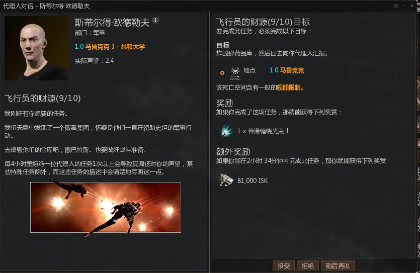

出站起跳，第一层怪都清理掉，然后进第二层，打建筑物（总览记得勾选大型可撞击建筑不然看不见）
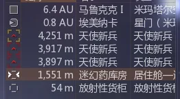

只需打掉迷幻药库房，不要动爆出来的箱子，然后回去交任务

接下来是最后一步

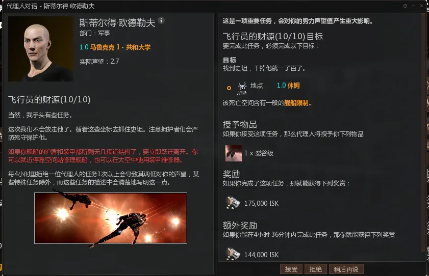

做任务前你会得到新的船，可以开他出去，不过记得把炮台和弹药拆下来装到新船了去，拆装备方法自己摸索，很简单，旧船肚子里的弹药记得也拿出来

这个任务你会发现，任务地点不是在当前星系，需要去别的星系，方法参考你是如何过来的，自己思考。

第一二层没啥说的，清怪就好，第三层记得看提示


你需要打的是停滞缠绕塔楼打爆后目标就会出现，干掉他就完成任务。

以上就是军事代理人的10步任务，做完这些，希望你已经对 EVE 里的基础战斗有一定了解。

## 高级军事代理人

:::danger 高危提醒
这一段会开始引入故意送船、反跳、遥修、网子和气云伤害等 PVP 概念。任务奖励船可以拿来练手，但不要把全部身家堆到一条会被打爆的船上。
:::

接下来介绍高级军事代理人的任务。它会在前面军事任务的基础上，继续补充一些 PVP 和生存概念。


去目标地点干掉所有怪吧


还记得如何打怪么，锁定，接近它直到它进入你的射程内，激活武器开火，右键怪你可以选择环绕他或者保持距离，只需保证他在你的射程内就好，

清理完所有怪，任务就完成了。

第二步


这个任务你的船是必须要被爆掉的，因此，开他提前给你的那艘空船，拿去爆吧反正也没损失


进入轨道后接近远处的建筑物吧，不要管怪


接近建筑物 0 m 后，你的船会引爆建筑物，同时你也会收获自己的第一份击毁记录。


开着太空舱回去交任务即可。

第三步任务


注意看任务说明，需要给你的船装上民用跃迁干扰器，用来阻止飞船跃迁（就是跳走），

俗称反跳，也是 PVP 的常用手段，这里不细说了，只需按照任务要求做。


反跳的距离是 20 km，也就是说在 20 km 时你就可以激活反跳；不同型号的反跳距离也不一样。

要注意，不需要把这个海盗打死，只需要挂一下反跳任务就算完成。

第四步任务


远程护盾回充增量器，俗称"遥修"，指的是通过消耗自己飞船电量来给另一艘船维修，

游戏中有专门的后勤舰来是这件装备的功能最大化，当然所有的船都是可以搭载遥修的

把任务给你的遥修装在飞船上吧


锁定受损的舰船


激活遥修装备


任务完成

第五步任务


这一步有两个需要注意的地方。首先，你需要开任务给你的那条船去做，而且还要击毁一艘敌舰，这意味着你要先在船上装好炮台。同时注意右下角的提醒：**如果承受不起这艘船的损失，就不要把它随便开出去。换句话说，不要把全部身家都压在一条船上，也不要驾驶自己承担不起损失的船。EVE 里爆船是常态，新人尤其要学会控制风险。**

好，闲话说完，开始做任务


落地之后只有一个怪，干掉他


之后会刷出很多怪，但是并不疼


过一会就很疼了，不过不慌，等你船爆了任务就完成了


收获了KM

现在问题来了，你现在手中的武装只有这3个炮，但是都被爆掉了，可以看到我有两门炮留了下来没有随着船消失（KM中绿色的是留下的东西），那么如何把残害里的东西捡回来呢

右键你自己的残骸，选择保存地点


选择提交，然后你就可以回空间站交任务了，交完任务后，再出空间站（记得开条船去，太空舱是捡不了东西的）

右键太空


可以看到你保存的地点

跳过去


可以看到，怪不见了残骸还在，捡东西走人。


这步任务有交给你加力燃烧器和微型跃迁推进器的区别，做任务前记得装上加力燃烧器


进轨道时有提示

可以看到前方有一个球状空间站和一些气云，气云是有伤害的，不要管他，开着加力燃烧器

一路冲过去吧


伤害不是很高


好了冲过去之后任务就完成了

第七步任务


这步任务有介绍艾玛的激光炮与米塔玛尔的射弹炮的区别，记得用他给你的民用加特林磁轨炮去做任务

没什么难度，只有一个怪，打完就可以回去交任务了

第八步任务


同样是打怪任务，你前边应该做过类似的了，看左下角，任务中稍微提到了EVE的会战概念

这里不细说。

在任务地点统合部指挥官会给你指令


进入轨道后


前往解救人质吧


捡完就可以回空间站了

在 PVP 中，要听从指挥官的指令。

第九步任务


在这个任务里提到了网的概念，即"停滞缠绕光束（网子）"，这也是PVP时常用的装备，

他可以降低敌方舰船的速度，从而使自己或友军更好地进行攻击

注意左边的红字哦


接近他，然后在网子的射程范围内激活，不用干掉它任务就完成了，之后会跳出来一艘统合部的战列舰，不要尝试对它开火，后果会很严重。

第十步任务


任务需要你打掉海盗头目，海盗头目是带反跳和网子的，要小心实在不放心，就带个修甲吧，之前任务给过的


准备战斗。


接近他、上网、集火，任务就完成了；其他两个怪是否清理可以按你的情况决定。

这个任务提到了一个东西-跃迁核心稳定器


这里引入干扰强度的概念。

跃迁扰断器的干扰强度是1点，跃迁扰频器是2点

而跃迁核心稳定器的强度是-1点，

也就是说你带了一个跃迁稳定器，别人用一个跃迁绕断器是拦不住你跳走的

如果是带了两个，那么一个扰频器也留不住你。

但是跃迁稳定器是有负面效果的，他会降低你的锁定距离和锁定速度

所以这件装备更适合跑路时使用，打架时不要带它。

以上就是高级军事代理人的任务。做完这些，你应该已经对 EVE 的 PVP 有了基本概念。

:::info 下一步
如果你已经跑完整套职业代理人任务，可以直接继续看 [挖坟：开始之前](./getting-started.md) 与 [挖坟：入门正文](./basics.md)。
:::
