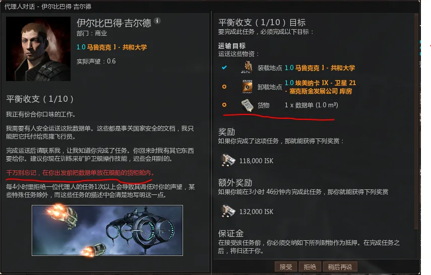
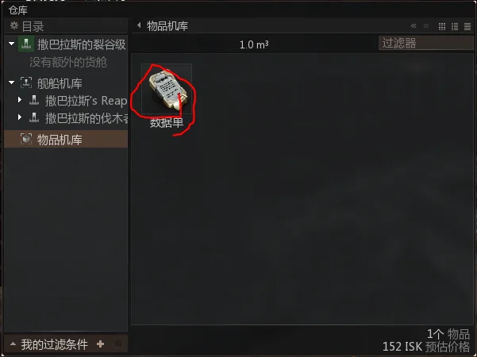
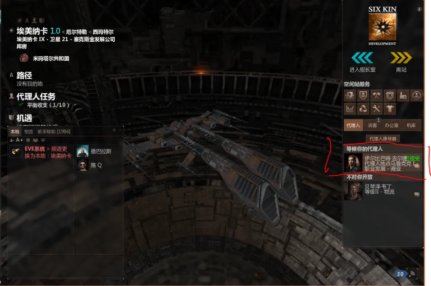
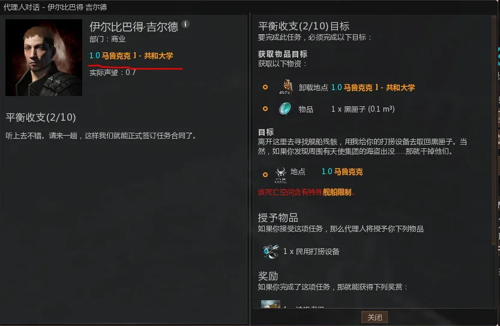
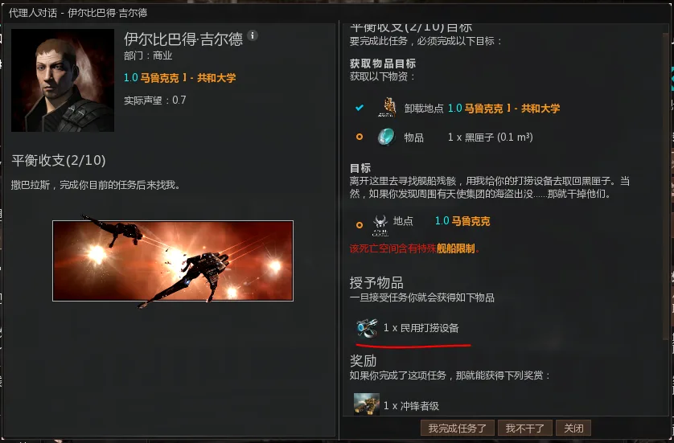
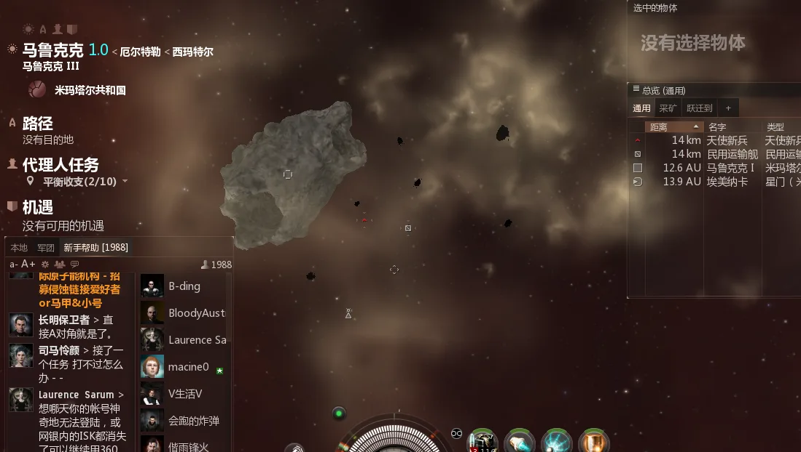
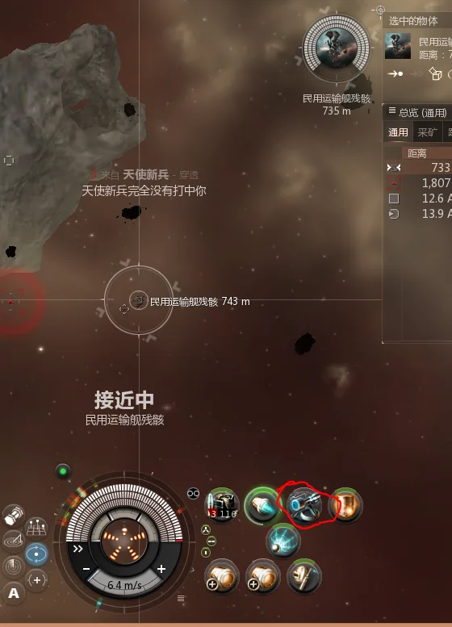
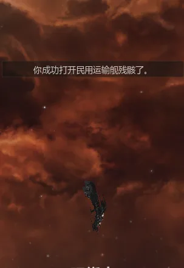
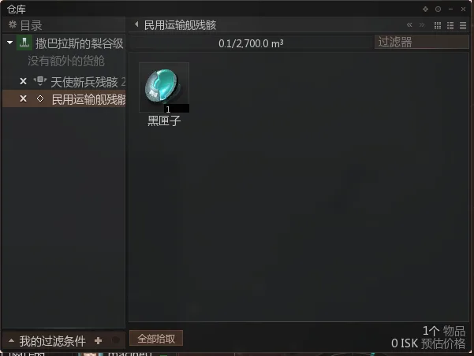

# EVE 新手教程

:::info 页面说明
这一页把五条职业代理人任务整理成一条连续的新手路线，适合第一次进入 EVE 的玩家按顺序照着做。
:::

:::tip 阅读顺序
如果你只想先补探索相关内容，可以先看 [挖坟：开始之前](./getting-started.md)；如果你想把完整的新手引导都跑一遍，这一页可以直接从头跟到尾。
:::

:::warning 新人提醒
教程里送的船、模块和消耗品本身就是拿来练手的，但不要把全部资产都堆到一条任务船上。部分任务会明确教你送船、反跳或进入有环境伤害的区域。
:::

:::details 页面内容
- 寻找代理人：找到职业指导代理人和任务空间站
- 军事代理人：基础战斗、装配、总览与任务地点
- 商业代理人：运输、打捞、市场、采矿与基础制造
- 工业代理人：提炼、制造、运输和任务材料
- 高级军事代理人：反跳、遥修、网子、气云和基础 PVP 概念
:::

## 寻找代理人

欢迎来到 EVE。你进入游戏之后的画面大致会是这样，各族都差不多；右下角偶尔弹出的机遇系统现在可以先不用管。

下面开始说明如何找到职业指导代理人。首先，按下 `F12`。

选择下方的显示职业指导代理人

选择"去代理人的空间站停靠"

然后看右侧总览中，有一个图标变黄了，黄色图标表示你前往终点时需要经过的地点

这时右键黄色图标选择跳跃

这个图标的意思是星门，星系与星系之间用星门连接，你需要用它来穿梭于宇宙，

他会指引你到达你设定的终点

抵达星门，各族星门风格都不一样。

这个图标的意思是空间站，右键他选停靠就可以进站了，

还有一种进站办法，右键太空

出现一个列表，选择停靠，现在注意，这个列表以后你会常用到，包括如何寻找小行星带，

以后会用到，可以注意一下

好抵达空间站后，看右边的列表

可以看到5位代理人与你在一个空间站里，接下来你就可以与他们对话来做职业发展的任务了

值得一提的是，这个游戏与其他游戏不同，选择一位代理人不意味着你永远都会被固定在那个职业里。5 位代理人的任务都可以接，他们会给你新手期需要的技能书、船只和 ISK；只要技能足够，一个玩家也可以同时兼职商人、战士和探险家等多种角色，这也是 EVE 自由度的一部分。

## 军事代理人

:::tip 任务重点
这一段会带你熟悉接任务、进任务点、锁定、装弹、交任务和基础总览设置。很多后面的内容都会反复用到这里的动作。
:::

这一节介绍军事代理人的任务流程。有了前一节的基础后，接下来重点看如何接任务和完成战斗。

首先，双击军事代理人，会出现以下

蓝笔圈中的是任务的故事介绍，**其中可能会有重要的提示或要求，务必详细查看。**

红笔圈中的是任务奖励和任务目标。

绿色笔圈中的是你需要到达的任务地点。到达方法类似设置终点；

接下来点击右下角接受，然后离开空间站进入太空，

可以看到这个选项，想要到达任务地点，点开任务

点击跃迁至该处，就可以抵达任务地点。

抵达任务地点，根据任务要求，你需要打死右边总览中的怪（就是红色的三角）；

锁定方法两种，第一种右键红色三角，会出现一个列表，选择"锁定目标"；

第二种ctrl+鼠标左键，可以快速锁定

好你已经锁定目标，接下来需要激活武器开火，

这个就是你船上搭载的武器，只需点击一下即可。，需要注意的是武器是有射程的，因为无法截图我就直接口述，鼠标移到武器上会出现一个框框，上边有介绍武器的伤害与有效射程和最佳射程，只有在射程内才能打到怪，你可以通过右键怪物选择接近或者双击怪物来接近

OK，把怪都清理掉后，你会发现任务前打了个勾，代表任务完成了；

接下来你要返回空间站交任务，这时再次点开任务

有一个代理人所在地，这时只需选择停靠，就可以到达空间站，

进站后再次双击代理人

选择"我完成任务了"，就可以获得报酬，这样军事代理人第一步任务就完成了。

然后选择我要执行新任务来进行下一步任务

第二部任务是需要你消灭海盗救回矿工，注意红字，这表明任务稍有难度，但是不用担心会爆船什么的，你现在开着的新手船系统会无限送给你，你只需要开着太空舱随便进一个空间站（前提是你这个空间站内没有船），就可以获得一艘新手船，好接下任务出站

之前教授过得步骤就不一一提及了，直接开始做任务。

怪全部消灭后，会出现一个货柜

打开方法，鼠标点住图标，出现环状菜单然后鼠标不松直接向上一划，这个方法同样适用于查看残骸，要注意只有在货柜和残害2500m内才能查看

然后把道具拖到你的船舱里就可以返回交任务了

此时任务没有显示完成，你需要将道具带入空间站才算完成

可以看到进入空间站打开代理人才会显示对勾，接下来接第三步任务

做这个任务的时候你就可以开代理人给你的新船，并且可以装上新的武器了，方法如下

左键绿色菜单

选择红笔圈中的选项，打开

可以看到一艘伐木者级（各族不同），右键

选择组装船只，再右键

选择激活，你就会发现你已经换了船。

接下来教授如何给船只装上装备

同样是界面左边菜单。

点开这个图标就是装配界面，同时打开下面这个物品机库图标：

然后会出现如下界面。

选择机库中的装备，右键炮台，选择装配到当前飞船，或者直接把炮台拖到

上

再把子弹拖到船舱里，这样就穿配完成，就可以接任务出站了。

出站后注意，你的炮台会显示成下面这样：

这样的状态表示你的炮台还没有装载弹药，这时，右键

单击电磁脉冲弹，就可以自动装填啦，

这里需要注意，型号相同的武器可以进行编组，只需把一个炮台拖到另一个炮台上。完成后会显示成下面这样：

这样就可以进行 3 门炮台的齐射。

现在可以去任务地点做任务了

这个任务怪不需要全打掉，只需要打掉一个冲你过来的"跑跑无人机"，就会掉出货柜，然后捡东西走人。

好接下来是第四步任务

这个任务是要你去任务地点侦查一下，找到星门

注意弹出的对话框

落地后可以看到

这个就是星门，接近他

稍等片刻后会被攻击，但是伤害不高，同时任务完成，可以起跳空间站交任务

接下来是第五步任务

在这之前可以把任务奖励你的加力燃烧器安装在船上，激活他后他能让你的船跑的更快点。

出站起跳任务地点

抵达任务地点后，左下角本地频道里会出现任务对话，大体意思就是让你打怪

只需要打一下就算完成任务，可以起跳走了

然后是第六步任务，记得把任务奖励装到飞船上

同样是打怪的任务，最后需要你打一个建筑物，

落地后，你面前会有一个加速轨道。

右键激活，或者拉出环状菜单激活后进入轨道。

怪不少但是很简单基本就1，2炮的事，一点点清理完，进入第二层

注意对话框

攻击建筑物会刷怪，打完建筑物直接跳走，不要动爆出来的箱子里的东西，会掉声望。

这个任务会给你一个脑插，脑插是可以增加你相关技能学习速度的东西，使用方法，在空间站仓库里找到，右键-植入

接下来第七步任务

这个任务会预先给你一个装甲维修器，做任务前装上他，战斗中激活他会帮你修复装甲

船的血量分为护盾，装甲，结构三个阶段，被攻击时先掉护盾，然后装甲，结构掉没了你的船就要爆了。

可以看到，我的船已经被打进了装甲，这时激活装甲维修器

装甲就会被修复，要注意维修装备都十分耗电，注意关注电量；

黄色全部消失代表电量耗尽，电量可以自动回复但远没有维修装备消耗的快

清理掉所有怪后回去交任务。

第八步任务

跳跃时弹出的对话框中有重要信息

下面简单讲解一下调试总览，

这个就是总览

左键他会出现

选择打开总览设置

选择预设标签

找到空间实体，打开

在"大型可撞击建筑"选项左边点一下，现在注意看总览

总览里出现了一些东西

现在在总览中找到并接近他

接近后酒店会对你造成伤害，同时刷出几个海盗，不用管，任务已经完成，可以回去了，这时如果你嫌总览东西太多，只需再打开总览把那个大型可撞击建筑点掉

接下来是第九步任务

出站起跳，第一层怪都清理掉，然后进第二层，打建筑物（总览记得勾选大型可撞击建筑不然看不见）

只需打掉迷幻药库房，不要动爆出来的箱子，然后回去交任务

接下来是最后一步

做任务前你会得到新的船，可以开他出去，不过记得把炮台和弹药拆下来装到新船了去，拆装备方法自己摸索，很简单，旧船肚子里的弹药记得也拿出来

这个任务你会发现，任务地点不是在当前星系，需要去别的星系，方法参考你是如何过来的，自己思考。

第一二层没啥说的，清怪就好，第三层记得看提示

你需要打的是停滞缠绕塔楼打爆后目标就会出现，干掉他就完成任务。

以上就是军事代理人的10步任务，做完这些，希望你已经对 EVE 里的基础战斗有一定了解。

## 商业代理人

:::warning 容易卡住的地方
很多商业任务并不是到了地方就能交，而是要先确认任务物品已经在船舱里，或者已经被带回正确的空间站。
:::

接下来开始讲解商业代理人的任务。

第一步

需要注意的是任务会给你道具，在你接任务的空间站的物品机库里，经常有新人找不到任务

物品导致即使抵达了卸载地点却无法完成任务

把他放进你的船里就可以出发啦。

抵达卸载的空间站后

双击等候你的代理人就可以交任务了，

这时你会发现你没办法在当前空间站里接新任务，因为代理人与你不在一个空间站里，这时你需要返回职业代理人的空间站，担心找不到的话

只需设置终点然后出站一直跟着黄色图标就可以找到

好回到空间站开始第二步任务，

注意看任务目标，做任务前你需要在你的船上装备民用打捞设备

抵达任务地点，进入轨道

接近民用运输舰残骸

锁定他，激活打捞器，打捞有一定几率失败，耐心等待

好成功了

这时运输舰的残骸就可以打开了

拿走里面的东西，然后回去交任务。

这步任务教会了你如何使用打捞器，打捞器可以用来打捞残骸，这个打捞并不是说把残害里剩下的装备什么的捡回来，而是把残骸化成一些制造用的材料打捞回来，

同时这个任务给了你一艘采矿船-冲锋者级，下一步任务会需要要用到，有了它，你就可以真正意义上的自己通过挖矿赚点钱了。

下面是第三步任务

这个任务就需要上一步给你的冲锋者级，给你的冲锋者装上预先给你的民用采矿器，你就可以在太空中挖矿了，

好装配完成，出站吧

抵达任务地点后，如果你一时没有看到矿石，可以先点击总览里的采矿标签。

这样总览就会显示矿石了。

可以看到离你很近的地方有一块凡晶石，锁定它之后激活采矿器，你就可以挖矿了，

之后你可以打开船舱

可以看到冲锋者是自带矿石仓的，开采出的凡晶石会储存在这里。

那么如何确定自己挖了多少呢

右键凡晶石，选择显示信息。

可以看到，你正在开采的凡晶石 1 块可以产出 415 单位三钛合金，也就是说并不用挖太多就可以完成任务。

挖矿过程中会刷怪，不过伤害低的可怜，顶着火力强挖就好

只一小会，就挖了几千块，这时就可以返回空间站了

（采矿总览里是不显示空间站的，只需把总览调到通用一栏即可）

好返回空间站，要注意你开采的只是凡晶石，而凡晶石精炼之后才是三钛合金

这时你需要打开红笔圈选的提炼选项

将凡晶石拖进放入材料一栏

可以看到我挖的这些凡晶石可以产出9000多块三钛合金，已经远大于任务需求，此时只需要点击提炼按钮

提炼的矿石会自动放到你的物品机库里，就可以完成任务了

这个任务会给你一本叫提炼学的技能，想知道一本技能书的作用，只需要右键他然后显示信息，即可查看

接下来第四步

这个任务需要你提前装上民用数据分析仪，记得开着你的打怪船去，不要开冲锋者

落地后进轨道，清理怪，然后可以看到一个箱子

锁定他激活数据分析仪

这个就是破译界面，你需要通过玩一个类似扫雷的游戏来破译这个机关

亮起的线通向的圆点表示你可以点击

点击之后你会发现上面出现一个数字同时与他相邻的点被点亮，这个数字

代表离它3个点位距离的点可能会出现最终点或者是有助于你破译的道具

值得注意的是，这个点位布局不是唯一的，每次打开都会是新的布局

这是我取消破译重新激活后的布局

现在我们遇到了阻碍，他的名字叫防火墙，有他在你就无法继续向下点击，这时我们要左键点击它进行攻击

同时在此引进病毒强度与病毒同步率两个概念

看破译界面左下角，这个就是你所用病毒的信息，

左边的橙色是病毒的同步率，就相当于血量，上边的\*后的数字是详细数值

右边红色的是病毒的强度，相当于攻击力，下边的wifi状图标也是详细数值

同时可以看到防火墙也有这两个属性，这时点击防火墙

可以看到，点击的瞬间，你的同步率减少10点，防火墙的同步率也减少了10点

防火墙同步率减少的数值就是你的攻击力，你减少的数值也是防火墙的攻击力

好继续点击

可以看到防火墙消失了，但是你的同步率并没有减少，这是这个游戏的规则之一

如果你的下次攻击能够攻破防火墙，那么你就不会再掉同步率

好继续点击

这时可以看到出现了这样的图标，这个就是你需要打开的核心，名字叫系统核心，打开它就算破译成功。

可以看到破译完成后箱子变成空心状代表可以查看里边的东西，

打开后拿走里边的所有东西就可以回去了

这步任务教授了如何使用数据遗迹分析仪（遗迹分析仪与数据分析仪使用方法相同），

学会这些，再加上之后不久要学习的扫描技能，你就可以挖坟了，也是赚钱的一种方式，也很有意思，**但是需要注意的是，与做任务时不同，挖坟时破译箱子只有两次机会，破译失败两次后，箱子会爆炸，但是不用担心，不会对船造成伤害**

接下来是第五步任务

没什么难的，把东西从你在的空间站拉到另一个空间站里，**任务道具在你接任务空间站的**

**物品机库里，很多新手总是找不到任务道具**

ok在目的地交任务，然后再返回职业代理人处接新任务

第六步任务

这个任务本身提示不算完整，需要一件索敌计算机来交任务，而系统不会明确告诉你去哪里拿。

弄到它之后，你就需要打开 EVE 的市场。

在左边栏找到这个图标，打开

出现了市场界面，在我划红线的里面输入，索敌计算机

可以看到出现了很多，这些都是索敌计算机，，有的是衍生版本，或T2版本，这里不提，我们需要的是划横线的这个，选择他

**这时会发现右边出现了信息，用来显示这件装备在哪里有卖。可以看左边的跳跃栏（即第一列红线），显示当前空间站里有 3 个卖单，剩下的分别在 7 跳和 9 跳以外的星系。这里一定要看清楚，如果买到远处的卖单，你还得专门飞过去把装备拿回来。优先买当前空间站里的，同时比较价格，选择最便宜的那一个即可。这里示例里最便宜的是 10 万 ISK。**

右键-购买此物品

就可以选择购买数量，我们只需要买一个，之后就可以交任务了

第七步

这个任务我们就要用的之前提过的遗迹分析仪，使用方法与数据分析仪大抵相同，你只需要区分一个箱子是遗迹分析仪还是用数据分析仪打开就好

给船装上他给的遗迹分析仪，出站

进入任务地点，逐层清怪

然后对它进行破译

很简单就成功了，带着道具回去交任务吧

第八步

同样是一个运输任务，参考任务5

这个任务会和军事任务一样送你一个脑插。

第九步

这个任务需要你搞两个1MN加力燃烧器，参考任务6，去市场买就好了

买两个交任务吧，记得买最便宜的，离你最近的，最好是在当前空间站的

最后一步啦，加油

这个任务需要5000发电磁脉冲弹s，你可以选择去市场买，也可以通过他给你的蓝图自己造，我个人建议你选择自己造，这样可以简单了解一下EVE是如何生产的，下边给出步骤

在空间站内右边栏内找到工业选项，打开

这就是工业制造界面，好，点击下边的蓝图

会出现这些界面，可以看到，左边我划红线的地方显示造电磁脉冲弹需要的材料

中间上边划的是这张蓝图剩余的流程数，下边是你可以自由选择造几个流程，

右边显示着你1流程可以产出多少东西，可以看到这张图纸1流程可以生产100发电磁脉冲弹，任务需求是5000发，意味着着我们要造50流程的子弹，

把项目流程数调到50

可以看到左边，我们需要的材料远远不够，这时我们就要想办法弄材料，鼠标右键这些材料的详细信息

我们需要这三种矿物，我们可以通过挖矿来得到，可以看到，这三种矿物可以在一种叫千焦岩的矿物里被同时挖到，如此一来我们就需要开着冲锋者前往0.9安等的星系寻找，

之前任务中有给你新的采矿器，记得装到冲锋者上

这里提一下安全等级的概念

安等即一个星系的安全等级，他代表着一个星系的治安等级，在游戏界面左上角可以看到

这里对安等进行划分

1.0-0.5（包括0.5）为高安星系，在这些星系里玩家无法随意攻击其他玩家，如果强行攻击就会被警察打死，安全等级越高警察出现的速度就越快（并不绝对，比如高安强暴党）

0.4-0.1（包括0.1）为低安星系，这些星系里玩家可以互相攻击，虽然依旧会违法但是不会出现警察的帮助，如果是在星门口或空间站门口违法攻击会遭到npc岗哨炮的打击。从0.5进入0.4地区统合部会有对话框提示你，不要随便下低安

0.0以下为00星系，在那里没有任何法律，玩家在00地区拥有主权，一切都是玩家说了算，互相攻击不会受到任何惩罚，很危险，不要随便去。

好言归正传，我们继续寻找千焦岩，一般在职业代理人所在的星系附近几跳就可以找到

如果找不到，打开星图查找

左边栏找到这个图标打开

你就可以看到附近星系的安全等级了，选择一个0.9的，设置终点，然后出发吧

好抵达0.9星系，接下来该如何找到千焦岩呢

右键太空-小行星带-选择一个-跃迁至0m内

这样我们就抵达了一个充满矿石的小行星带，然后总览选择采矿

可以看到离你很近有很多矿石，但是似乎并没有我们要的千焦岩，没有千焦岩就无法提炼超新星诺克石，如果这个星系的一个星带里没有这种矿石，那么也代表其他星带里也没有，不要浪费时间，去别的星系看看吧，走远点也没有关系（如果实在找不到，职业代理人所在星系的市场里通常也会有人直接卖超新星诺克石。）

**还有一点是需要注意的在安等0.8以下的星系，小行星带会出怪，安等越低怪越强，冲锋者是可以带无人机的，可以在挖矿时放出无人机来打怪。**

**如果走出太远找不到回去的路怎么办，**

**左边栏找到个人资产**

**可以看到，这个空间站里都是你的东西，那一定就是你的代理人空间站了，右键设置终点，就可以回去了。**

下面讲解如何使用无人机和学习技能

先是学习技能，

点击左边栏你的任务头像

选择左边的技能栏，然后选择右边列表中的

右键当中的无人机概论

选择现在训练到等级2

这就是学习技能的方法，一次学习的所有技能时间加起来不能大于一天，

其次是关于

无人机首先无人机分为战斗无人机和电子战无人机，这里只提战斗无人机

战斗无人机分为轻无，中无，重无，岗哨

挖矿只需要用到轻无，

无人机概论每升一级你都能多用1个无人机，最多可以同时操控5个，

打开市场，然后寻找无人机（4族轻无的名字分别为大黄蜂，武士，侍僧，地精灵）

同时查看轻型无人机需要的技能

只有技能符合要求才能使用无人机，技能书在职业代理人的站里就可以买到

可以看到最近的离我也5跳之外，但是为了飞船的安全也没办法，远也要去啊，买完后

放入无人机挂舱即可

出站之后

你的界面右边多了一列表，就是你船中的无人机

右键释放无人机，

右边三个白条代表无人机的护盾、装甲和结构。怪有时也会攻击无人机；三条都见底后，无人机就会被打爆。

以上就是商业代理人的全部任务。

## 工业代理人

:::tip 阅读方式
这一段和商业代理人有不少步骤是互通的。遇到提炼、制造或运输任务时，可以直接对照上一节的说明来做。
:::

接下来是工业代理人的任务攻略。

通过作商业代理人的任务相信你应该已经学会了如何挖矿，那么这个任务对你来说轻而易举

出站起跳任务目标的地点，找一块凡晶石开始挖吧，任务需要1000个凡晶石很快就能挖好

第二步任务

也很简单，如何提炼矿石在商业任务中也有提到过，这里就不说了

第三步任务

是一个制造任务，商业任务第十步任务就是如何制造，对你来说应该也很简单

制作过程需要花费10分钟，耐心等待，如果你是一边在造子弹一边来做这个工业任务的话，看看空间站里有没有卖成品的？

像这样。直接买成品也能完成任务，思路灵活一点会省很多时间。

第四步任务

同样是让你去任务地点，清理掉一些怪，开采矿石，这次需要7000单位的三钛合金，

记得多挖点凡晶石回来提炼，

如果你有听我的话有学无人机技能的话，这俩怪对你一点难度都没有，如果没学的话，就先开刷怪船来清理下怪再来挖吧这两个怪打冲锋者还是很疼的。

没什么值得注意的了，直接跳下一步任务

第五步任务

同样是运输任务。到物品机库里找到任务道具，装进船舱后出发即可。

第六步任务

同样需要制造，你在商业中也学过了，这里为了赶时间我就直接买成品了，建议你还是体验一下这个制造过程，很有趣，这里就不详细说明了。

第七步

这步任务需要你把在职业代理人站里制造出来的20颗电池运到另一个空间站去。

方法已经提过，也没什么难度

第八步任务

又是一个制造任务，不过这个穿梭机市场里没有现成卖单，只能自己做。耐心等几分钟，很快就能完成。

耐心等待然后就完成任务了

第九步任务

这步任务需要打怪，采矿只是个幌子，你只需要给你的刷怪船卸下一个炮台安装一个采矿器

就可以啦

像这样

耐心等待怪来

出现了！干掉他

出现一个货柜，打开它

带走回去交任务吧\~

第十步

同样的制造任务，整体相对简单。

造或者买，按你当前的时间和资金情况选一个即可。

有了商业任务的铺垫之后，工业任务会顺手很多。做到这里，你已经完成整套新手教程的一半了。

## 高级军事代理人

:::warning 高危提醒
这一段会开始引入故意送船、反跳、遥修、网子和气云伤害等 PVP 概念。任务奖励船可以拿来练手，但不要把全部身家堆到一条会被打爆的船上。
:::

接下来介绍高级军事代理人的任务。它会在前面军事任务的基础上，继续补充一些 PVP 和生存概念。

去目标地点干掉所有怪吧

还记得如何打怪么，锁定，接近它直到它进入你的射程内，激活武器开火，右键怪你可以选择环绕他或者保持距离，只需保证他在你的射程内就好，

清理完所有怪，任务就完成了。

第二步

这个任务你的船是必须要被爆掉的，因此，开他提前给你的那艘空船，拿去爆吧反正也没损失

进入轨道后接近远处的建筑物吧，不要管怪

接近建筑物 0 m 后，你的船会引爆建筑物，同时你也会收获自己的第一份击毁记录。

开着太空舱回去交任务即可。

第三步任务

注意看任务说明，需要给你的船装上民用跃迁干扰器，用来阻止飞船跃迁（就是跳走），

俗称反跳，也是 PVP 的常用手段，这里不细说了，只需按照任务要求做。

反跳的距离是 20 km，也就是说在 20 km 时你就可以激活反跳；不同型号的反跳距离也不一样。

要注意，不需要把这个海盗打死，只需要挂一下反跳任务就算完成。

第四步任务

远程护盾回充增量器，俗称"遥修"，指的是通过消耗自己飞船电量来给另一艘船维修，

游戏中有专门的后勤舰来是这件装备的功能最大化，当然所有的船都是可以搭载遥修的

把任务给你的遥修装在飞船上吧

锁定受损的舰船

激活遥修装备

任务完成

第五步任务

这一步有两个需要注意的地方。首先，你需要开任务给你的那条船去做，而且还要击毁一艘敌舰，这意味着你要先在船上装好炮台。同时注意右下角的提醒：**如果承受不起这艘船的损失，就不要把它随便开出去。换句话说，不要把全部身家都压在一条船上，也不要驾驶自己承担不起损失的船。EVE 里爆船是常态，新人尤其要学会控制风险。**

好，闲话说完，开始做任务

落地之后只有一个怪，干掉他

之后会刷出很多怪，但是并不疼

过一会就很疼了，不过不慌，等你船爆了任务就完成了

收获了KM

现在问题来了，你现在手中的武装只有这3个炮，但是都被爆掉了，可以看到我有两门炮留了下来没有随着船消失（KM中绿色的是留下的东西），那么如何把残害里的东西捡回来呢

右键你自己的残骸，选择保存地点

选择提交，然后你就可以回空间站交任务了，交完任务后，再出空间站（记得开条船去，太空舱是捡不了东西的）

右键太空

可以看到你保存的地点

跳过去

可以看到，怪不见了残骸还在，捡东西走人。

这步任务有交给你加力燃烧器和微型跃迁推进器的区别，做任务前记得装上加力燃烧器

进轨道时有提示

可以看到前方有一个球状空间站和一些气云，气云是有伤害的，不要管他，开着加力燃烧器

一路冲过去吧

伤害不是很高

好了冲过去之后任务就完成了

第七步任务

这步任务有介绍艾玛的激光炮与米塔玛尔的射弹炮的区别，记得用他给你的民用加特林磁轨炮去做任务

没什么难度，只有一个怪，打完就可以回去交任务了

第八步任务

同样是打怪任务，你前边应该做过类似的了，看左下角，任务中稍微提到了EVE的会战概念

这里不细说。

在任务地点统合部指挥官会给你指令

进入轨道后

前往解救人质吧

捡完就可以回空间站了

在 PVP 中，要听从指挥官的指令。

第九步任务

在这个任务里提到了网的概念，即"停滞缠绕光束（网子）"，这也是PVP时常用的装备，

他可以降低敌方舰船的速度，从而使自己或友军更好地进行攻击

注意左边的红字哦

接近他，然后在网子的射程范围内激活，不用干掉它任务就完成了，之后会跳出来一艘统合部的战列舰，不要尝试对它开火，后果会很严重。

第十步任务

任务需要你打掉海盗头目，海盗头目是带反跳和网子的，要小心实在不放心，就带个修甲吧，之前任务给过的

准备战斗。

接近他、上网、集火，任务就完成了；其他两个怪是否清理可以按你的情况决定。

这个任务提到了一个东西-跃迁核心稳定器

这里引入干扰强度的概念。

跃迁扰断器的干扰强度是1点，跃迁扰频器是2点

而跃迁核心稳定器的强度是-1点，

也就是说你带了一个跃迁稳定器，别人用一个跃迁绕断器是拦不住你跳走的

如果是带了两个，那么一个扰频器也留不住你。

但是跃迁稳定器是有负面效果的，他会降低你的锁定距离和锁定速度

所以这件装备更适合跑路时使用，打架时不要带它。

以上就是高级军事代理人的任务。做完这些，你应该已经对 EVE 的 PVP 有了基本概念。

:::info 下一步
如果你已经跑完整套新手教程，可以继续看 [挖坟：开始之前](./getting-started.md) 和 [挖坟：入门正文](./basics.md)，把扫描、破解和基础生存路线补齐。
:::
