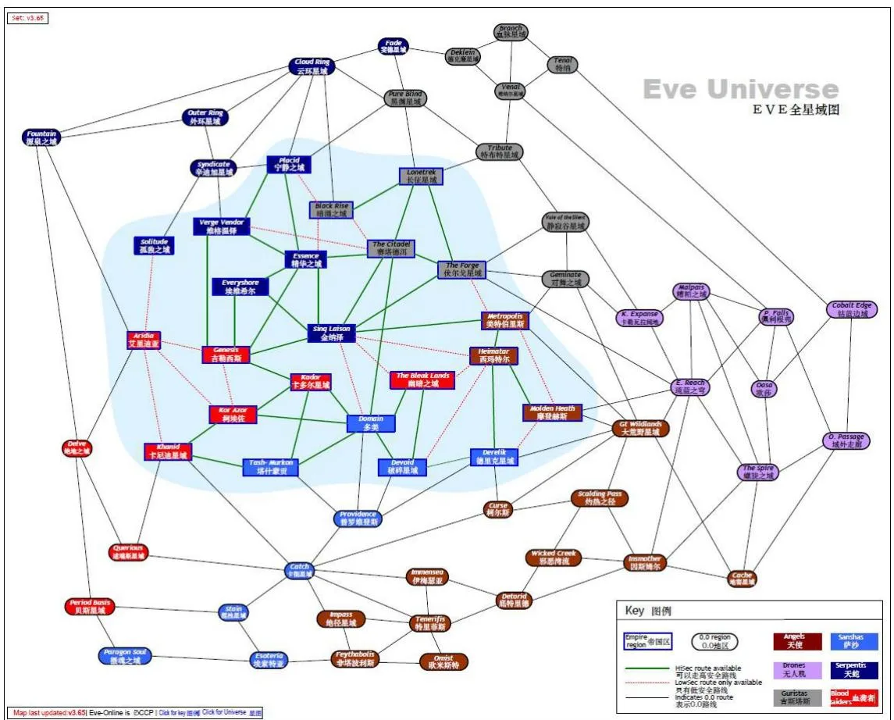
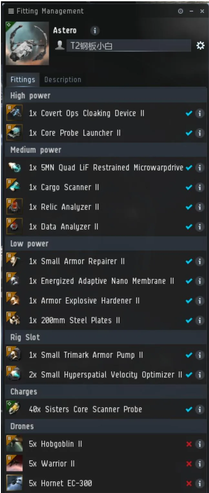
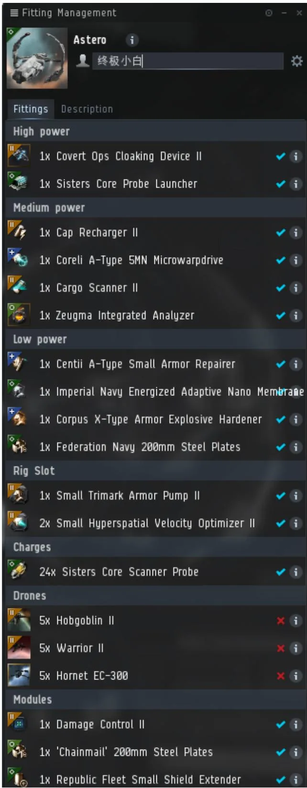

# 挖坟：补充内容

:::info 页面说明
这一页集中放网站、势力图、产出价格参考、推荐配装和伤害/区域查表，适合已经入门后按需回查。
:::

:::tip 使用建议
- 配装部分已经附上可直接复制的纯文本代码块，适合导入支持剪贴板的客户端或粘贴进 Pyfa。
- 价格、掉落和环境数据属于历史经验与参考统计，具体价值请以你所在市场与当前版本为准。
- 如果你是先来查高危站点路线，建议配合 [进阶实践](./advanced-practice.md) 一起看。
:::

## 网站 Websites

:::details 使用建议
这些站点更适合作为回查工具，而不是要求新人第一次阅读时全部点开。
:::

- [EVE 中英互查](https://eve.being.moe/trn/)
  常用词条英汉互查。
- [EVE University Wiki](https://wiki.eveuniversity.org)
  资料最系统的公共攻略站之一，需要一定英文阅读能力。
- [EVEpraisal](http://evepraisal.com/)
  把货柜内容复制进去，可以快速估价。
- [EVE Marketer](https://evemarketer.com/)
  市场查询网站，适合跨地区比价。
- [Anoik.is](http://anoik.is/)
  虫洞信息查询。
- [DOTLAN EveMaps](http://evemaps.dotlan.net/)
  地图、主权、跳桥、星系信息都很实用。
- [Pyfa](https://github.com/pyfa-org/Pyfa)
  专业飞船配装模拟工具。
- [zKillboard](https://zkillboard.com/)
  击杀榜，常用来看配船与路线风险。
- [Verite Space](https://www.verite.space/)
  联盟势力图。
- [台风的攻略大全](https://shimo.im/sheet/MD1KnU9QRV06RYqR)
  玩家整理表，若失效请视作附加资料，不要把它当作唯一来源。

## 海盗势力图 Factional Influence Map



可放大查看,右下图例是名称对照

## 挖坟产出 Loot

:::warning 价格提醒
这一节只适合用来判断“哪些东西值得盯”，不适合当实时价格表。真正卖货前请重新查价。
:::

这里只罗列常被单独记下的高价值产出，和价值大于 10m 的蓝图。注意：

- 下表主要用于提示“哪些物品值得优先盯”，不代表实时价格。
- 2025-07 之后，探索相关掉落与工业链条做过平衡调整，价值波动会比以前更明显。
- 真正卖货前，请用本页“网站”里的市场工具再次核价。

### 普通遗迹

| 物品 | 参考价 |
| --- | --- |
| Capacitor Console 电容器控制台（血袭） | 0.5m |
| Drone Transceiver 无人机调制器（天蛇） | 3m |
| Contaminated Lorentz Fluid 被污染的洛伦兹流体（天蛇） | 0.3m |
| Enhanced Ward Console 加强的防御控制台（古斯塔斯） | 6m |
| Intact Shield Emitter 完好的护盾发生器（古斯塔斯） | 0.6m |
| Impetus Console 推进器控制台（天使） | 1m |
| Single-crystal Superalloy I-beam 单晶体超合金工字钢（天使） | 0.7m |
| Intact Armor Plates 完好的装甲附甲（萨沙） | 6m |
| Contaminated Nanite Compound 受污染的纳米聚合体（萨沙） | 0.1m |
| Logic Circuit 逻辑电路 | 1.3m |
| Power Circuit 能源电路 | 0.5m |
| Power Conduit 能源管道 | 0.7m |
| Trigger Unit 触发机关 | 0.6m |

### 普通数据：势力材料

| 物品 | 参考价 |
| --- | --- |
| Angel Dynamic Calibrator 天使集团动态校准仪 | 20m |
| Blood Raider Power Redistributor 血袭者能量分配器 | 12m |
| Blood Raider Regular Ballistic Control 血袭者有序弹道控制 | 15m |
| Serpentis 3D Scanner Gamut 天蛇 3D 范围扫描 | 5.5m |
| Serpentis Basic Target Guider 天蛇基础目标指示器 | 8m |

### 普通数据：故事线材料

| 物品 | 参考价 |
| --- | --- |
| Sleeper Profound Research Notes 冬眠者渊博的研究笔记 | 70m |
| Sleeper Thermal Regulator 冬眠者温度调节器 | 5.8m |
| Sleeper Virtual Energizer 冬眠者虚拟增效器 | 5m |
| Takmahl Astral Treatment 塔克玛星型公式 | 6m |
| Takmahl Dynamic Gauge 塔克玛动态量尺 | 12m |
| Takmahl Quantum Sphere 塔克玛量子球体 | 6m |
| Talocan Stasis Deflector 塔洛迦停滞偏针仪 | 9m |
| Yan Jung Crystal Cylinder 燕军的晶体柱 | 11m |
| Yan Jung Singularity Fact Sheet 燕军异常数据分析报告 | 45m |
| Yan Jung Tachyon Stetoscope 燕军的光子听诊器 | 49m |

### 普通数据：普通蓝图

| 物品 | 参考价 |
| --- | --- |
| Capital Ancillary Shield Booster 旗舰级辅助护盾回充增量器 | 100m / 流程 |

### 幽灵坟

| 物品 | 参考价/备注 |
| --- | --- |
| Covert Research Tools 隐秘研究工具 | 0.5m；全部箱子 |
| Shattered Villard Wheel 碎裂的维拉德轮 | `Secure Depot` / `Secure Lab`：1.2m |
| 'Wetu' / 'Yurt' Mobile Depot Blueprint 小屋 / 帐篷移动式仓库蓝图 | `Secure Databank` / `Secure Mainframe`：10m / 30m |
| 'Packrat' / 'Magpie' Mobile Tractor Unit Blueprint 林鼠 / 喜鹊移动式牵引装置蓝图 | `Secure Databank` / `Secure Mainframe`：5m / 100m |
| Mid-grade Ascendancy Alpha-Beta Blueprint 中级统御 1-2 号蓝图 | `Secure Depot`：10m |
| Mid-grade Ascendancy Gamma-Epsilon Blueprint 中级统御 3-5 号蓝图 | `Secure Lab`：10m-50m |
| High-grade Ascendancy Alpha-Beta Blueprint / Mid-grade Ascendancy Omega Blueprint 高级统御 1-2 号 / 中级统御 6 号蓝图 | `Secure Databank`：10m |
| High-grade Ascendancy Gamma-Epsilon Blueprint 高级统御 3-5 号蓝图 | `Secure Mainframe`：30m / 130m / 600m |
| High-grade Ascendancy Omega Blueprint 高级统御 6 号蓝图 | `Secure Vault`：超隐约 4000m |

### 冬眠坟：冬眠者组件

| 物品 | 参考价/备注 |
| --- | --- |
| 冬眠者组件 | 卖给 NPC；Jita 2 跳 `Hirtamon` |
| Neural Network Analyzer 神经系统分析仪 | 0.2m |
| Ancient Coordinates Database 古代坐标系数据库 | 1.5m |
| Sleeper Data Library 冬眠者数据库 | 0.5m |
| Sleeper Drone AI Nexus 冬眠者无人机神经节点 | 5m |

### 冬眠坟：偏振蓝图

| 物品 | 参考价/备注 |
| --- | --- |
| Polarized Rocket Launcher 偏振式火箭发射器 | 8m / 流程 |
| Polarized Torpedo Launcher 偏振式鱼雷发射器 | 15m / 流程 |
| Polarized Light Neutron Blaster 偏振式轻型中子疾速炮 | 3m / 流程 |
| Polarized Neutron Blaster Cannon 偏振式中子疾速加农炮 | 4m / 流程 |

### 冬眠坟：故事线蓝图

| 物品 | 参考价/备注 |
| --- | --- |
| 'Thurifer' Large Cap Battery 侍僧大型电容器电池 | 400m |
| 'Smokescreen' Covert Ops Cloaking Device II 烟幕隐秘行动隐形装置 II | 400m |
| 'Peace' Large Remote Armor Repairer 宁静大型远程装甲维修器 | 150m |
| 'Radical' Damage Control 激进者损伤控制 | 100m |
| 'Meditation' Medium Armor Repairer I 冥思中型装甲维修器 I | 80m |
| Limited Expanded 'Archiver' Cargo 档案员有限扩充货柜 | 80m |
| 'Posse' Adaptive Invulnerability Field 民团自适应全能力场 | 80m |
| 'Warhammer' Large EMP Smartbomb I 战锤大型电磁脉冲立体炸弹 I | 80m |
| 'Greaves' Medium Armor Repairer I 油渣中型装甲维修器 I | 50m |
| Heavy 'Moat' Energy Neutralizer 重型城墙能量中和器 | 50m |
| Heavy 'Brave' Capacitor Booster 勇敢者重型电容注电器 | 50m |
| 'Dece' Co-Processor I 平局协处理器 I | 30m |
| 'Full Duplex' Ballistic Control System 全双工弹道控制系统 | 30m |
| Medium 'Strigoi' Energy Nosferatu 中型古墓恶灵掠能器 | 30m |
| 'Censer' Medium Cap Battery 焚炉中型电容器电池 | 30m |
| 'Bailey' 1600mm Steel Plates 壁垒 1600mm 钢附甲板 | 30m |
| 'Interruptive' Warp Disruptor 中断跃迁扰断器 | 20m |
| 1/10/100MN Analog Booster Afterburner 模拟助推加力燃烧器 | `50MN` 约 60m |
| 5/50/500MN Digital Booster Microwarpdrive 数字助推微型跃迁推进器 | 其余约 20m |
| Medium 'Ditch' Energy Neutralizer 中型沟渠能量中和器 | 10m |
| 'Kindred' Gyrostabilizer 宗族回转稳定器 | 10m |

### 气云坟

| 物品 | 参考价/备注 |
| --- | --- |
| Neurotoxin Control 神经毒化控制理论 | 150m |
| Neurotoxin Recover 神经毒化抵抗理论 | 60m |
| Improved XX Booster Reaction Formula 加强型 XX 增效体反应配方 | 20m |
| Strong XX Booster Reaction Formula 超强型 XX 增效体反应配方 | 100m |
| Standard Exile / Mindflood / Blue Pill Booster Blueprint 标准型游离感 / 思维冲击 / 蓝色药丸增效体蓝图 | 5m |
| Improved Exile / Mindflood / Blue Pill Booster Blueprint 加强型游离感 / 思维冲击 / 蓝色药丸增效体蓝图 | 30m |
| Strong Exile / Mindflood / Blue Pill Booster Blueprint 超强型游离感 / 思维冲击 / 蓝色药丸增效体蓝图 | 500m |

## 推荐配装 Fittings

:::tip 配装使用说明
这些配装更适合作为“理解思路”的模板。真要照抄之前，请先确认自己的技能、预算和实际用途。
:::

使用方法：下面几套都整理成了可读的纯文本配装。若你的客户端支持从剪贴板导入，可以直接复制代码块中的内容；若不支持，就按顺序手动装配。


`Heron` 新人挖坟：

```text
[Heron, 新人挖坟]
Inertial Stabilizers I
Inertial Stabilizers I

5MN Microwarpdrive I
Type-E Enduring Cargo Scanner
Relic Analyzer I
Data Analyzer I

Prototype Cloaking Device I
Core Probe Launcher I

Small Gravity Capacitor Upgrade I
Small Gravity Capacitor Upgrade I

Hobgoblin I x7
```

合计约 `3.7m`。新人可以先不上姐妹会针和隐身；扫描强度不够时优先补扫描相关模块，回家跑路时再换更偏逃生的低槽。


`Astero` 钢板小白：

```text
[Astero, 钢板小白]
Damage Control II
Shadow Serpentis Energized Adaptive Nano Membrane
Imperial Navy 200mm Steel Plates
Small Ancillary Armor Repairer

5MN Y-T8 Compact Microwarpdrive
Cargo Scanner II
Data Analyzer II
Relic Analyzer II

Covert Ops Cloaking Device II
Sisters Core Probe Launcher

Small Trimark Armor Pump II
Small Gravity Capacitor Upgrade I
Small Ionic Field Projector II

Hornet EC-300 x5
'Integrated' Hobgoblin x5
```

不含脑插合计约 `160m`。这套大致在 `7k+` 有效左右，技能合格时扫描强度可覆盖常见信号，可上黑镜。


`Astero` T2 钢板小白：

```text
[Astero, T2 钢板小白]
Small Armor Repairer II
Energized Adaptive Nano Membrane II
Armor Explosive Hardener II
200mm Steel Plates II

Data Analyzer II
Cargo Scanner II
Relic Analyzer II
5MN Quad LiF Restrained Microwarpdrive

Covert Ops Cloaking Device II
Core Probe Launcher II

Small Trimark Armor Pump II
Small Hyperspatial Velocity Optimizer II
Small Hyperspatial Velocity Optimizer II

Hobgoblin II x5
Hornet EC-300 x5
Sisters Core Scanner Probe x16
```

合计约 `95m`。需要更高技能，整体打法与“终极小白”相近，但不能稳定硬抗超冬冲击波；爆抗、甲修和船插可以按你的技能与预算微调。



`Astero` 终极小白：

```text
[Astero, 终极小白]
Centii A-Type Small Armor Repairer
Federation Navy 200mm Steel Plates
Imperial Navy Energized Adaptive Nano Membrane
Corpus X-Type Armor Explosive Hardener

Cargo Scanner II
Coreli A-Type 5MN Microwarpdrive
Cap Recharger II
Zeugma Integrated Analyzer

Sisters Core Probe Launcher
Covert Ops Cloaking Device II

Small Trimark Armor Pump II
Small Hyperspatial Velocity Optimizer II
Small Hyperspatial Velocity Optimizer II

Hobgoblin II x5
Warrior II x5
Hornet EC-300 x5
Sisters Core Scanner Probe x24

Damage Control II x1
'Chainmail' 200mm Steel Plates x1
Republic Fleet Small Shield Extender x1
Sisters Core Scanner Probe x24
```

合计约 `650m`。很贵，主要适用于高安开冬眠；廉价低配请看前面的 “T2 钢板小白”，具体使用说明请看 [进阶实践页的“终极小白 The Ultimate Astero”部分](./advanced-practice.md#终极小白-the-ultimate-astero)。



## 伤害数据库 Damage Data Base

以下数据属于历史统计参考，不保证和当前版本逐项完全一致。

隐秘坟守卫伤害：

| 势力 | 单位 | 电 | 动 | 热 | 爆 |
| --- | --- | --- | --- | --- | --- |
| Angel | Lookout | - | 27 | - | 80 |
| Angel | Sentry | - | 35 | - | 103 |
| Angel | Warden | - | 9 | - | 27 |
| Angel | Watcher | - | 49 | - | 145 |
| Sanshas | Lookout | 39+9 | - | 39 | - |
| Sanshas | Sentry | 70+9 | - | 70 | - |
| Sanshas | Warden | 13+9 | - | 13 | - |
| Sanshas | Watcher | 50+9 | - | 50 | - |
| Blood Raiders | Lookout | 54 | - | 54 | - |
| Blood Raiders | Sentry | 99 | - | 99 | - |
| Blood Raiders | Warden | 18 | - | 18 | - |
| Blood Raiders | Watcher | 71 | - | 71 | - |
| Guristas | Lookout | - | - | 117 | - |
| Guristas | Sentry | - | - | 212 | - |
| Guristas | Warden | - | - | 39 | - |
| Guristas | Watcher | - | - | 151 | - |
| Serpentis | Lookout | - | 40 | 66 | - |
| Serpentis | Sentry | - | 72 | 120 | - |
| Serpentis | Warden | - | 14 | 22 | - |
| Serpentis | Watcher | - | 52 | 86 | - |

备注：

- `Sentry` 带 `1` 点反跳，`Watcher` 带 `-60%` 网子。
- 萨莎伤害为炮台加导弹，古斯塔斯伤害为导弹，其他均为炮台。
- 天使的反跳怪和网子怪需要对调理解。

冬眠坟炮塔：

| 名称 | 攻击间隔 | 电 | 热 | 甲/结构 | 甲抗（全抗） | 备注 |
| --- | --- | --- | --- | --- | --- | --- |
| Wakeful Sentry Tower | 15s | 546 | 546 | 7k / 3.5k | 40% | - |
| Vigilant Sentry Tower | 15s | 390 | 390 | 5k / 2.5k | 40% | - |
| Restless Sentry Tower | 15s | 702 | 702 | 11k / 5.5k | 40% | - |
| Impaired Archive Sentry Tower | 12s | 783 | 783 | 13k / 7.5k | 30% | 只出现在超冬电离层 |

备注：游戏内炮塔存在一个老问题。如果周围有一个已经破解过的箱子（箱子或防御单元等），并且炮塔已经锁定你，此时你跃迁出去，所有炮塔会转而开始攻击那个已经破解过的箱子，而且不会转火。

环境伤害：

| 场景 | 伤害 |
| --- | --- |
| 标冬毒雾 | 扩散前 `4x100`，扩散后 `4x250` |
| 超冬电厂毒云（EM） | 稳定前 `600`，稳定后 `25` |
| 超冬 3 层废墟 | `4x100`，有暴击 `800` |
| 超冬 3 层冲击波 | 普通 `4x2x300`，大冲击波 `4x10250/9s` |

## 气云星座 Gas Cloud Regions

### Blue Pill – Amber

Low security space (hot-spot constellation – region): Mivora – The Forge
No security space(hot-spot constellation – region): E-8CSQ – Vale of the Silent

### Crash – Golden

Low security space (hot-spot constellation – region): Umamon – Lonetrek
No security space(hot-spot constellation – region): 09-4XW – Tenal

### Drop – Viridian

Low security space (hot-spot constellation – region): Amevync – Placid
No security space(hot-spot constellation – region): Assilot – Cloud Ring

### Exile – Celadon

Low security space (hot-spot constellation – region): Elerelle – Solitude
No security space(hot-spot constellation – region): Pegasus – Fountain

### Frentix – Lime

Low security space (hot-spot constellation – region): Joas – Derelik
No security space(hot-spot constellation – region): 9HXQ-G – Catch

### Mindflood – Malachite

Low security space (hot-spot constellation – region): Fabai – Aridia
No security space(hot-spot constellation – region): OK-FEM – Delve

### Sooth Sayer – Azure

Low security space (hot-spot constellation – region): Tartatven – Molden Heath
No security space(hot-spot constellation – region): 760-9C – Wicked Creek

### X-instinct – Vermillion

Low security space (hot-spot constellation – region): Hed – Heimatar
No security space(hot-spot constellation – region): I-3ODK – Feythabolis

## 挖坟成就 Achievements

按着下表自行探索，并成功完成这些成就，就是 EVE 挖坟的游戏乐趣！

铜杯：

| 介绍 | 完成度 |
| --- | --- |
| 成功挖了一个普通遗迹 / 数据坟 |  |
| 第一次损挖坟船 |  |
| 第一次去虫洞中挖坟 |  |
| 第一次去敌对区域挖坟 |  |
| 第一次被隐秘坟炸了 |  |
| 第一次进入限冬 |  |
| 第一次进入标冬 |  |
| 第一次进入超冬 |  |
| 成功挖穿限冬 |  |
| 成功挖了低安气云 |  |
| 成功挖了 00 气云 |  |
| 成功挖穿标冬 |  |
| 成功挖穿超冬前 2 层 |  |
| 成功用上黑镜 |  |
| 考古、破解技能达到双 V |  |

银杯：

| 介绍 | 完成度 |
| --- | --- |
| 技能达标，开上 T2 小白 |  |
| 成功挖了战斗气云 |  |
| 在隐秘坟的爆炸下幸存 |  |
| 成功使用暴力开法挖了标冬 |  |
| （隐藏）扫描出寂静战场 |  |
| （隐藏）挖到旗舰注盾 |  |

金杯：

| 介绍 | 完成度 |
| --- | --- |
| 成功无伤撞出超冬雷区 3 个箱子 |  |
| 成功挖光高 / 超隐 4 个箱子 |  |
| 成功挖光超冬第三层所有 10 个箱子 |  |
| （隐藏）挖到高统 6 号 |  |

白金杯：

| 介绍 | 完成度 |
| --- | --- |
| 完成以上所有成就 |  |
| （隐藏）成功使用小白挖穿超冬包括三层（除废墟中的） |  |

## 收尾 Closing

如果你一路读到这里，已经具备把普通挖坟、高危站点和基础自保流程串起来的框架。真正有用的不是死记每条路线，而是慢慢形成自己的判断：什么时候该贪，什么时候该跑，什么时候该换船，什么时候该回家。祝你多出货，少爆船。
