# EVE国际服挖坟完全合并版

这是一篇把下面四份资料整合成一篇单文件教程的版本：

1. `新手教程6-探索代理人`
2. `[新人向]手把手教你学挖坟`
3. `不完全挖坟攻略`
4. `EVE欧服 挖坟攻略 by 南北派专家组`

整理目标不是保留“卷一到卷四”的外壳，而是以现行国际服还能成立的内容为准，做成一条从新手任务、普通挖坟、生存到高级站点的连续阅读路径。体量最大的旧卷四现在只是正文主干来源，卷一到卷三里仍然有价值的内容已经并入前置章节。

说明：

- 当前单文件稿已在 2026-04 做过去重、大纲重排与现行机制校订。
- 图片使用相对路径，直接在仓库里打开 Markdown 即可查看。
- 这一版优先修正文中与现行机制冲突、链接失效、导出损坏与附录可维护性问题。
- 校订时优先参考 EVE University 与 EVE Online 官方支持/补丁说明；如果旧文与现行国际服机制冲突，以本文校订后的表述为准。

## 0 新手起步

### 0.1 新手任务与第一次探索

这一节整理自 `新手教程6-探索代理人`，作用是把探索代理人任务、探针基础、扫描界面和第一次实际数据/遗迹操作走完整。哪怕你最终主要参考后面的正文主干，这一节依然是最适合完全新人上手的地方。

接下来介绍最后一位代理人-探索代理人的任务

为什么把他放在最后呢，因为探索任务是新手教程中最难的一节

很多新人就死在探索任务中，因此在这里我会详细讲解探索任务

{width="5.768055555555556in"
height="3.797257217847769in"}

做这个任务你要先知道如何打开扫描视图，首先，出站

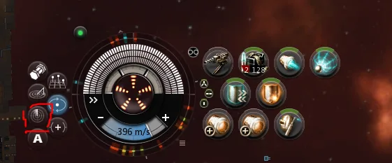{width="5.768055555555556in"
height="2.3944422572178476in"}

选择我用红笔选择的图标

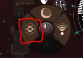{width="1.7833333333333334in"
height="1.2583333333333333in"}打开之后出现环状菜单，选择左边的

{width="4.158333333333333in"
height="4.125in"}

出现一个列表，可以看到有异常空间和未知的空间信号，

我们要前往任务要求的异常空间训练场

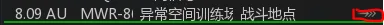{width="4.0in"
height="0.25833333333333336in"}

点击箭头就可以跳过去了

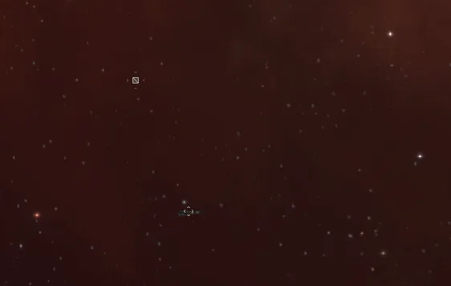{width="4.097166447944007in"
height="2.5935115923009624in"}在你面前会有个箱子

拿走里边的东西回去交任务吧。

第二步任务

{width="5.768055555555556in"
height="3.7306649168853894in"}

任务中为你讲解了空间信号的概念，要详细查看。

先前往他给你的目标地点吧

{width="2.989843613298338in"
height="2.999215879265092in"}

弹出来一个对话框，这里有之前提到过的加速轨道的详细解释，可以看看

{width="5.768055555555556in"
height="1.767671697287839in"}

进入第二层后代理人会要求你拿走你面前箱子里的东西，

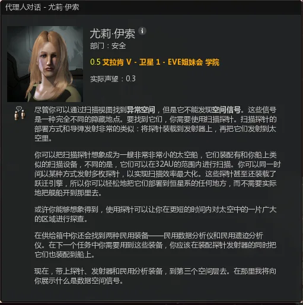{width="3.595833333333333in"
height="3.61834208223972in"}

拿完之后，**会更新提示，代理人为你详细讲解了探针的概念，务必详细看**

看完后，你就可以进第三层了

{width="4.3633552055993in"
height="2.679686132983377in"}

第三层代理人为你讲解了什么是数据地点，**仔细查看，不然以后你会分不清什么时候用数据分析仪什么时候用遗迹分析仪**

然后进第四层

{width="5.768055555555556in"
height="2.1870680227471566in"}

第四层代理人为你讲解什么是遗迹地点

第五层代理人为你讲解什么是气云地点

{width="5.768055555555556in"
height="3.358923884514436in"}

好了现在可以回去交任务了

这步任务告诉了你未知空间信号可能出现的种类，这些知识你以后会用在如何生存上，所以要认真看

第三步任务

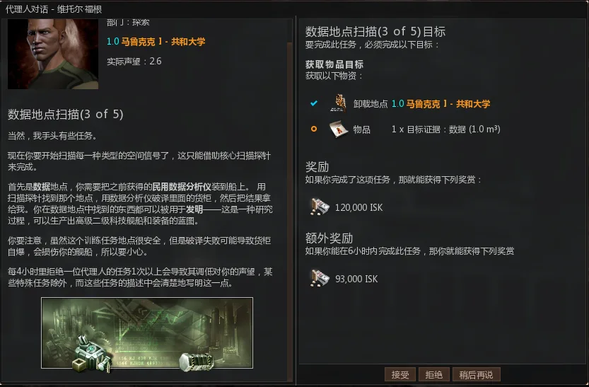{width="5.768055555555556in"
height="3.7899617235345584in"}

这步任务将会由你来实际操作如何扫描出一个空间信号，也是最难的地方，在这里我会对每一个细节进行详细讲解，希望你能认真看

首先，把之前拿到的核心探针发射器还有探针都装配到船上，再装上数据分析仪

{width="3.956788057742782in"
height="2.7228707349081365in"}

像这样，然后出站

打开探针扫描器

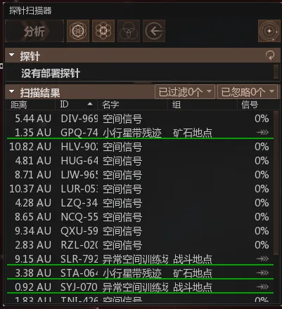{width="3.3585345581802275in"
height="3.6870133420822397in"}

然后发射探针（左键点击核心探针发射器）

{width="3.1656911636045493in"
height="3.944349300087489in"}

可以看到本来显示没有部署探针的那一栏出现了8个探针，

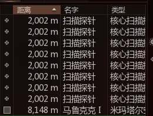{width="2.7083333333333335in"
height="2.05in"}

总览中也有显示

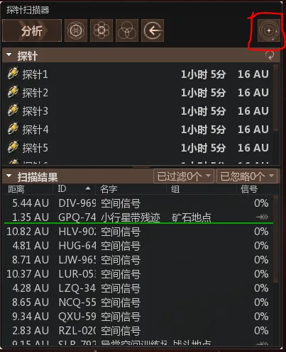{width="3.4560389326334207in"
height="4.258333333333334in"}

然后点击"恒星视图"图标

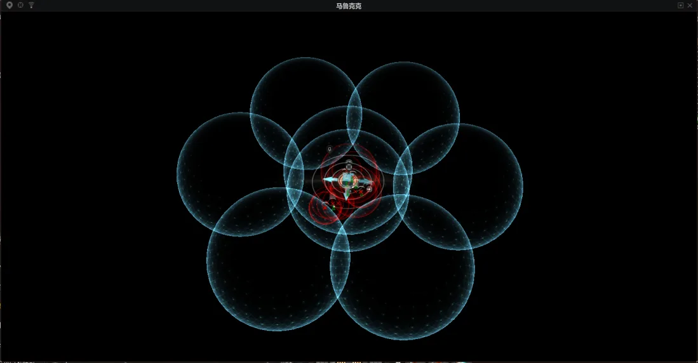{width="4.995833333333334in"
height="2.6019958442694664in"}

出现了这样一个界面，其中8个蓝圈代表了你的8根探针，那些红色的圈代表未知的空间信号，你可以在黑色地区鼠标左键来回拖动改变视角，鼠标右键可以改变你查看的位置

左键拖动效果：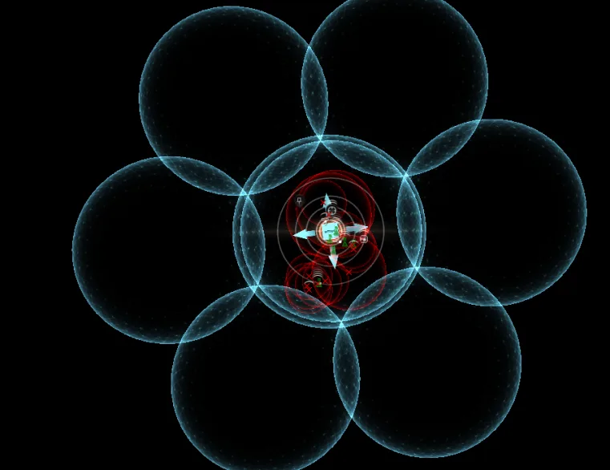{width="3.4604166666666667in"
height="2.6628029308836396in"}

{width="5.768055555555556in"
height="3.113934820647419in"}

可以竖着看星系，也可以平着看星系，这些都通过鼠标左键实现

右键效果

：{width="4.398884514435696in"
height="2.308553149606299in"}

我可以让他在屏幕中间，

{width="3.620833333333333in"
height="1.8922386264216973in"}

也可以让他靠左或靠右，这些通过右键来实现

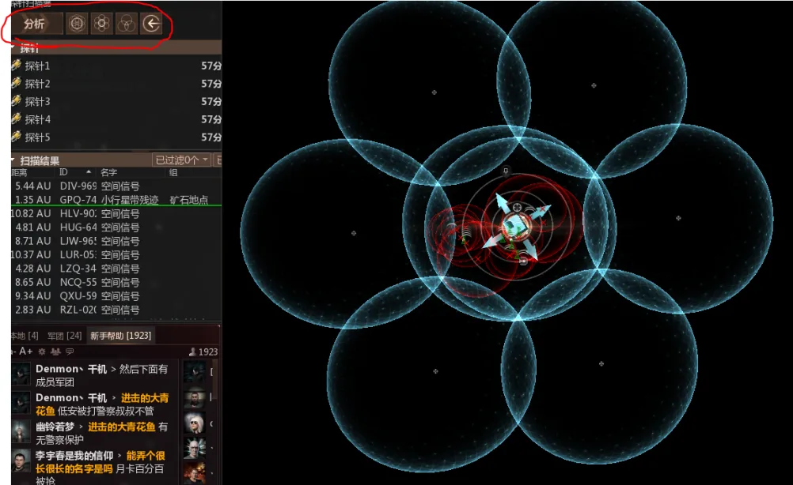{width="4.555650699912511in"
height="2.7915616797900262in"}

左上角这些件可以对探针进行各种操作，

分析键就是扫描

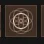{width="0.4583333333333333in"
height="0.4583333333333333in"}是精确发射，点击一下

{width="2.731842738407699in"
height="2.4008213035870516in"}

探针就变成了8个叠在一起的模式

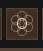{width="0.45in"
height="0.5333333333333333in"}是分散发射，点击一下，

{width="3.754166666666667in"
height="2.5700251531058615in"}

就又变成了这种形状

{width="0.48333333333333334in"
height="0.4583333333333333in"}是收回你在太空中的探针

剩下的那个就不提了，基本用不到

熟练使用左右键有助于你提高扫描效率

接下来教你如何调探针的扫描范围

{width="1.2083333333333333in"
height="2.841666666666667in"}鼠标放在这些球状的边缘你会发现这些球体会亮起来，然后拖拽，你会发现这些球会根据你的鼠标移动变大变小，因为没法截图所以口头叙述了

现在选择精确式发射

{width="5.768055555555556in"
height="4.177822615923009in"}

看着这么多红色的球是不是眼晕，有个很简单的办法能让你盯住一个信号扫描

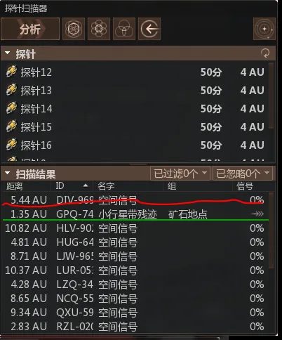{width="3.1906714785651795in"
height="3.8376859142607174in"}

在一堆信号中选择一个（鼠标左键单击一个信号）

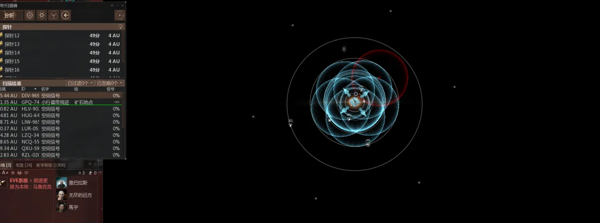{width="5.768055555555556in"
height="2.150929571303587in"}

你会发现红圈只剩下一个，这样看着就顺眼多了，就盯着他扫描吧

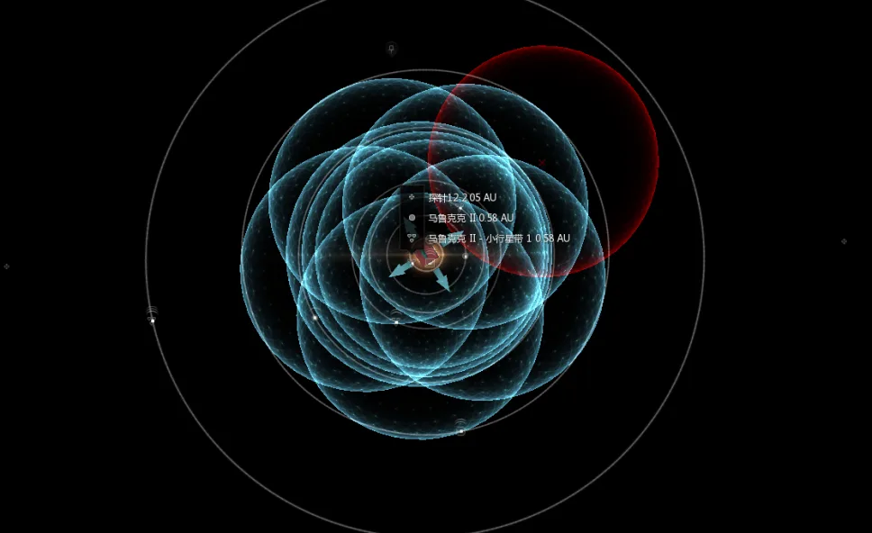{width="4.400621172353456in"
height="2.692257217847769in"}

鼠标移到中间那个方块你会发现方块变红了，这里要注意，不要让周围的那几个箭头变红

这时你就可以同时操控8个球随意移动，现在我们要做的就是，让蓝色的球完全包裹住

红色的球

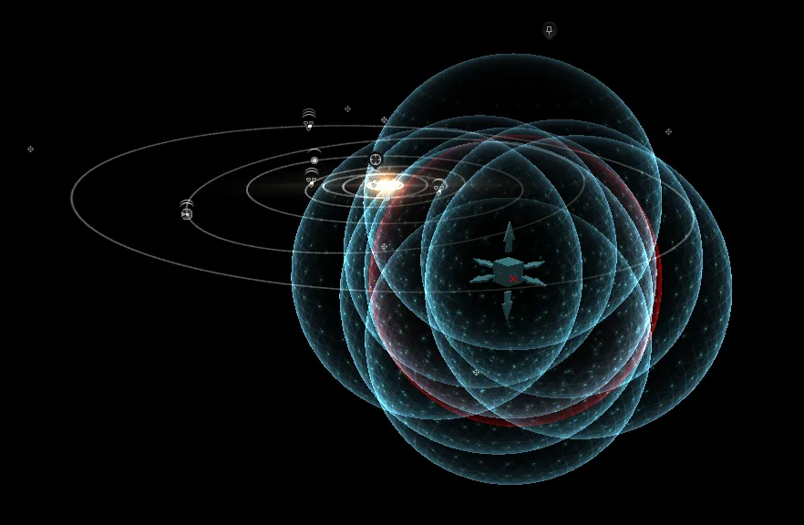{width="4.3375in"
height="2.8313692038495186in"}

像这样，运用鼠标所有键看看以确保是完全包裹住

确认完成，点击分析键

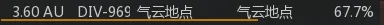{width="4.0in"
height="0.25833333333333336in"}

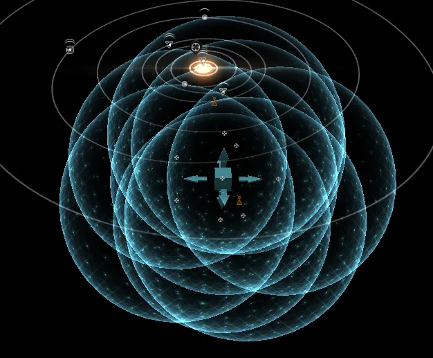{width="5.768055555555556in"
height="4.758829833770779in"}

这个信号我已经扫出来了67.7%，当信号强度扫到100%时就可以跳过去

{width="2.0416666666666665in"
height="2.875in"}

同时恒星系图中出现了两个地标，这意味着你扫描出现了误差（技能不够的新人最容易出现这种情况）

那么如何判断哪个是真信号呢，这里老司机凭借多年经验交给你比较简单的判断方法

首先，不要动你的探针，使用鼠标左右键来查看信号{width="3.629166666666667in"
height="3.4162193788276465in"}不难发现，1号信号距离你的蓝球球心比较远，2号比较近

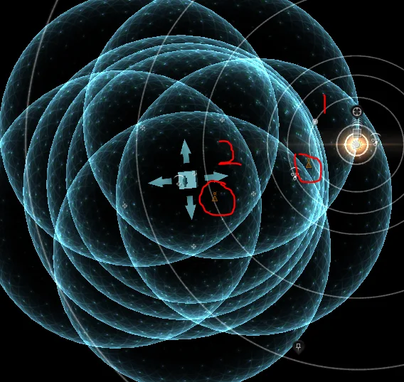{width="3.488279746281715in"
height="3.2966699475065617in"}用鼠标左右键换角度看看，也能得出结论

**记住，离球心最远的那个信号一定是真的**

来验证一下吧

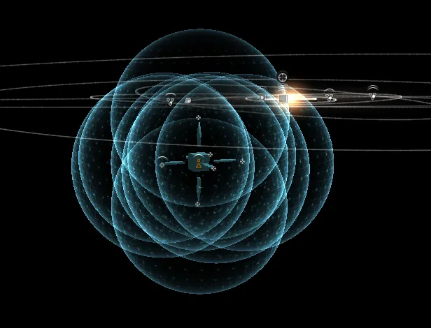{width="4.129166666666666in"
height="3.1531824146981626in"}

不断调整你的蓝球大小并移动他，让他包裹信号，然后分析

{width="4.083333333333333in"
height="0.275in"}

看，扫出来了。可以跳过去了

这里提一下箭头的作用，很简单，每个箭头代表一个可拖动的方向，向往一个固定方向移动时只需要拉动箭头即可，哪个两箭头变成了红色代表你可以把他往哪个方向移动

以上就是扫描的基本教程，刚开始可能很难，但是熟练了对你来说只是小菜一碟

好任务需要我们找到数据点，用我教授的方法继续扫下一个信号吧

（要注意，真正的信号不会像训练中这样好扫的）

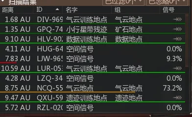{width="4.083333333333333in"
height="2.4916666666666667in"}

这里需要注意，探针只能在太空里停留1个小时！，时间到了会消失！

过星门和进空间站等探针会自动收回！

{width="3.527730752405949in"
height="3.527730752405949in"}

数据地点的提示，对于做完商业任务的你来说没有难度

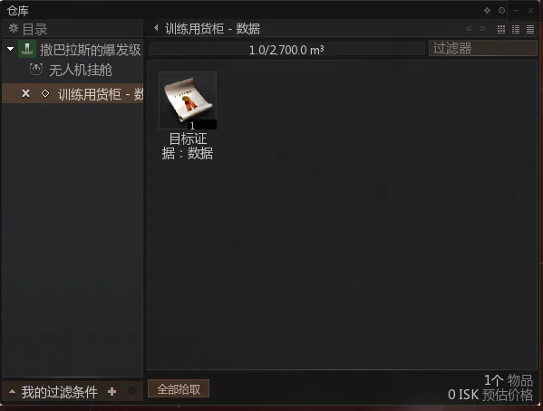{width="2.9625in"
height="2.246595581802275in"}

破译完，捡东西走人

第四步任务

{width="4.748800306211724in"
height="3.1098742344706913in"}

与第三步步骤基本相同，记得带遗迹分析仪

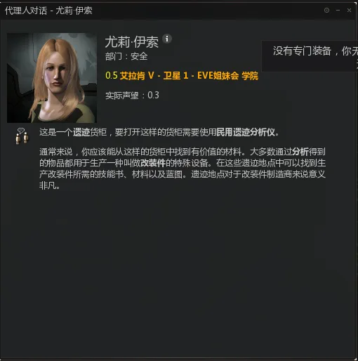{width="3.281738845144357in"
height="3.307457349081365in"}

代理人提示

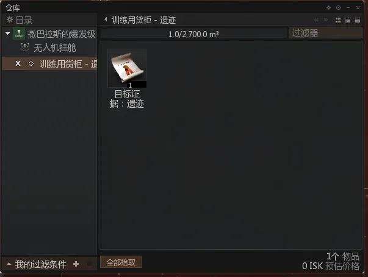{width="2.900067804024497in"
height="2.188513779527559in"}任务完成。

第5步

{width="4.824815179352581in"
height="3.8439720034995624in"}

需要你去扫出气云地点然后进去拿道具，接受任务后你的物品机库里会出现一个气云通行证，带着它你才能进第二层轨道

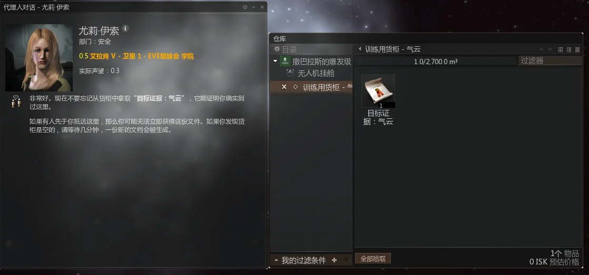{width="5.768055555555556in"
height="2.6983606736657917in"}

拿东西走人

以上就是所有的探索任务，搭配学到的如何让使用分析仪，你就可以去挖坟了。

到这里恭喜你，最基本的EVE操作你都已经完成了，

平均100人中只有3人能做到这里，你非常了不起，接下里你将要踏入EVE的宇宙中

这宇宙，属于你

### 0.2 新人入门补充

这一节把原卷二里最值得保留的“新人先别踩坑”内容压缩进来，作为正式正文前的预热。

#### 先记住这 6 条

1. 常规探针扫描从 8AU 开始最稳，新人按 `8AU -> 4AU -> 2AU -> 1AU -> 0.5AU / 0.25AU` 逐步缩圈即可。
2. 25% 用来确认信号类型，75% 看见站点名称，100% 才能保存坐标或跃迁。
3. 遗迹站用遗迹分析仪，数据站用数据分析仪；想稳定挣钱，优先把 `Archaeology / Hacking` 练到能稳定使用 T2 分析仪。
4. 货柜扫描器不是必需品。普通遗迹/数据站更适合完整清掉；时间很紧或风险很高的站点，再考虑挑箱。
5. 高安低安适合练手，真正的收益通常在 00 与 1-3 级虫洞，但前提是你会做安全点、会看本地、会按 D 扫撤离。
6. 当前国际服普通数据/遗迹站破解成功后是直接开箱拿战利品，不再是早年那种“喷一地小箱子”的旧机制。

#### 新人最容易犯的错

1. 只学会扫针，不学会撤离。扫描只是入场券，生存才决定你能不能把收益带回家。
2. 一开始就上贵船。T1 探索护卫的意义，是用最低成本把“扫描、靠箱、破解、撤离”练成肌肉记忆。
3. 只追求扫描强度，不补分析仪技能。真正经常让新人亏钱的，往往不是扫不出来，而是箱子开不出来。
4. 本地来人还想多贪一箱。普通挖坟的大多数亏损，都不是因为箱子难，而是因为离场慢。

#### 和旧文不同、以当前机制为准的地方

- 卷二原稿里关于“破解后飞出许多箱子”的描述已经过时，这部分已删除。
- Ghost Site 的计时逻辑、可见倒计时与撤离判断，请以正文第 `7.1` 节的更新版说明为准。
- 更系统的扫描、破译、模块、舰船、生存和高级站点内容，统一看下方正文，不再在这里重复展开。

### 0.3 从新人到熟手的过渡建议

这一节把原卷三里仍然泛用的经验合并进来，重点是让你在进入正文主干前，先建立“什么船该开、什么站该碰、哪些盘面该怎么想”的判断。

#### 舰船路线怎么选

1. T1 探索护卫：最适合练手，便宜，爆了不心疼。四族都能用，谁中槽舒服、谁技能近就先开谁。
2. Astero：适合作为新人到熟手的过渡船，但默认应该建立在你已经能稳定使用隐形、知道何时该贪何时该跑的前提上。
3. Covert Ops 隐侦：如果你的目标是“纯探索效率”，它通常比 Astero 更专业、更便宜，也更符合只挖不打的思路。
4. Stratios / T3C：更像复合用途平台，适合幽灵坟、冬眠者储藏站、战斗气云或兼顾自保/反打，不是普通新人挖坟的第一跳升级。

#### 地点取舍

1. 普通势力遗迹/数据站仍然是最稳定的入门主食。
2. 高安低安可以拿来学流程，但如果目标是稳定赚钱，路线通常会逐步转向 00 和 1-3 级虫洞。
3. 名字里带 `Forgotten / Unsecured` 这类普通冬眠者站点，不要把它们当成普通坟；它们通常意味着有怪、有炮或者完整的 PvE 压力。
4. `Sleeper Cache`、`Ghost Site`、战斗气云这类高价值站点，收益和惩罚都更大，建议在普通坟已经足够熟练以后再碰。

#### 破译时最实用的经验

1. 靠箱子最后 10km 左右就准备关微曲，避免冲出破解距离。
2. 先观察盘面再动手。节点特别密、信息特别差的盘通常更难，不必硬顶第一条路。
3. `Restoration Node` 和 `Virus Suppressor` 的危险度通常最高，能早处理就早处理。
4. `Data Cache` 在“没路可走”前不要急着点，它既可能给你工具，也可能把局势弄得更差。
5. 破译本质上很像扫雷：先铺信息，再决定主攻方向，比一味贴边或一味直冲都稳。

#### 这一节刻意不再重复的内容

- 与正文主干重复的舰船整表、模块整表、扫描整流程和站点总表。
- 明显依赖特定联盟/军团领地环境的 00 地区指引。
- 与当前版本不一致，或者已经有更新表述的旧机制说明。

## 来源与校订说明

后面的正文主干主要整理自 `EVE欧服 挖坟攻略 by 南北派专家组`，内容覆盖普通挖坟、生存、幽灵坟、气云考古、冬眠者储藏站、超冬、界面、总览、快捷键、配装和附录。因为它信息量最大，所以这次整合直接以它为骨架，再把前面三份里仍然有效的内容并回来。

### 原稿署名与版本

原稿标题：EVE 国际服 挖坟攻略 / EVE Exploration Guide
作者署名：南北派专家组 / Alisa William
原始版本：Version 1.6，Shanghai, July 2019

### 原稿说明

本文部分数据和内容翻译自 UNIWIKI，部分内容基于早期玩家攻略重新汇总。原稿本来面向 PDF/长图阅读，合并为单文件 Markdown 后，目录、外链和附录已按仓库内阅读方式做了整理。

## 1 阅读指南 Reading Guide

本文从基础介绍到高级坟的挖掘涉及内容极多，需要 3h 以上的阅读时间，并加以多次的实践操作，建议保存后多次翻阅。原稿里“在线版本及更新地址点击这里”这类占位文字在本单文件稿中已移除；可用网站统一整理在附录 8.1。

全部内容基于国际服客户端，使用英文名称以确保准确，汉化用户请对照英汉名称阅读。本文为单文件稿，可直接利用 Markdown 目录和 `Ctrl + F` 搜索需要的条目；若阅读器支持缩放，按 100% 比例查看会更接近原稿排版。

本文包含基础和进阶两个部分，萌新达到入门探索阶段只需几天和少量的技能点数，如果想向高级考古进阶则需要近一个半月的时间以及 250W+的技能点数。

如果你是新人，在浏览下面的内容前，请务必先完成新手任务以了解 EVE 的游戏机制，如何完成请参照其他攻略。

## 2 前言 Introduction

完成了 EVE 四个教学任务，想多尝试下探索方面的内容，又苦于复杂的 EVE 操作系统的萌新。亦或是厌倦了刷怪打架的生活想多尝试其他游戏内容的大佬，这篇文章详细介绍了各种挖坟方面的知识，提供了详细的操作指南，让你能够快速入门挖坟活动。

在各个星系之间漫游，与海盗和其他探索者斗智斗勇，体验扫描、破译和跑生跑死的节奏感，这就是挖坟最迷人的地方。原稿成文较早，本文在尽量保留结构与图片的前提下，已经按 2026-04 可核对的 EVE University / CCP 官方资料做过去重与必要纠偏。

## 3 快速指南 Quick Guide

这里是快速指南，涉及内容需要通读全文后才能理解。附录内有许多实用的网站，请学会活用，能大大提高效率。

### 前期

1. 如果你的路线依赖隐形与隐跳，请按 Omega + Cloaking 技能路线规划；Alpha 也能做基础扫描和低成本探索，但生存与效率会明显下降。地狱模式开局的新人如果暂时不上隐形，至少要学会做深空点，4AU 内见到作战针就跳走
2. 如果是挖坟 0 技能用户，条件允许的话，推荐吃 1 罐脑浆，把扫描 Scanning技能下 7 项都点到 3 级，把种族护卫也点到 3 级
3. 买一条种族考古船（推荐苍鹭 Heron）,按照附录配置配好，目前你应该有75+的扫描强度，大部分的坟都能顺利扫出，接下来就可以开始你的探险活动啦

### 后期

4. 根据附录钢板小白所需的装备点上相应的技能，Cloaking 点到 4 级，为了上隐秘行动 `Covert Ops Cloaking Device II`。扫描技能下把 `Astrometrics` 点到 4 级，然后点 `Hacking` 到满级，上 T2 数据分析仪，最后 `Archaeology` 点到满级，上 T2 遗迹分析仪（一共大概 4 罐脑浆）
5. 开上小白 Astero。如果还不能使用隐秘行动，非常不建议直接上小白。前期请先拿苍鹭试水高级坟，有了 T2 分析仪后，成功率会大大增加
6. 点 Cybernetics 到 5 上黑镜脑插，补上各种基础工程学技能（重要），后续扫描技能把 Astrometrics 点满
7. 至此你的挖坟技能已经成型，后续可以考虑 T2 隐侦、中白 Stratios 或者金鹏 Tengu，然后开发自己的挖坟套路

## 4 入门探索 Basic Exploration

### 4.1 扫描操作 Probing


#### 首先界面布置

1. 按 `Alt + P` 你能打开上图窗口，
2. 点击右上角 Dock，将这个窗口固定在界面上
3. 在 Filtered 里面勾上 Cosmic signal
4. 熟悉界面上的图标及按钮，完成布置

接下来开始扫描，游戏新手教程有教，这里说一些有用的技巧

1. 使用第一种扫描模式，Pinpoint formations
2. 单击星图内红点，或者单击扫描界面的该信号，能够锁定视角
3. 在星图里双击能呈现水平视角，再次双击呈现垂直视角，非常方便锁定位置
4. 第一针用 8AU，如果你的探针强度超过 80，且信号已经分析 20%左右，第二针可以直接拉到 2AU。新手的话 8AU 下针，逐步缩减 4AU、2AU、1AU、0.25AU
5. 当信号呈现，球状和圆盘状时，请将你的扫描区域（最内部，仅仅是外部是不够的）全部包裹住它
6. 信号呈现两点时，看你上一针涨了多少，如果很多说明就是离你目前扫描位置近的点，如果不是就是远点（90%情况为远点）
7. 遇到信号即使把圈缩小到 0.25AU 还是扫描不出来，按住 Ctrl+滚轮拢针，拖动箭头缩小 8 个探针直至几乎重叠成一球形（但不能完全重叠）；还是不行就先记下信号编号和星系，回头换更高强度的配船、脑插，或让更熟练的人来开

8. 建立一个舰队 ， 就能使用数字键直接标记箱子，极大提高效率
9. 扫描度到 25% 可以看出信号类型，如战斗地点、气云地点、数据地点、遗迹地点；到 75% 才能看见扫描信号的具体名称，到 100% 就可以跃迁
10. 记得关闭分析仪的自动循环，右键分析仪，set off

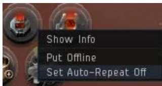

### 4.2 信号类型 Site Types

- 战斗信号：普通异常、部分任务点，以及以 `Digital` 开头的战斗气云。
- 虫洞信号：名称常带 `Unstable Wormhole`，通往虫洞空间或其他地区。
- 气云信号：
  普通可采集气云常以 `Nebula` / `Perimeter` / `Frontier` / `Reservoir` 结尾。
  可控气云常以 `Base` / `Lab` / `Processing Site` / `Facility` 结尾。
  以 `Digital` 开头的是战斗气云，只在 00 出现。
- 势力数据/遗迹站：
  数据站名称常为 `Local/Regional/Central + 势力 + 站名`。
  遗迹站名称常为 `Crumbling/Decayed/Ruined + 势力 + 站名`。
  这是新人最常挖的站点，无怪，分布在各安等与 1-3 级虫洞。
- 幽灵坟（数据）：
  名称常为 `Lesser/Standard/Improved/Superior + 势力 + Covert Research Facility`。
  开箱失败会爆炸；守卫到场后会进入可见倒计时，倒计时结束剩余箱子爆炸。
- 冬眠者储藏站（数据）：
  名称常为 `Limited/Standard/Superior Sleeper Cache`。
  难度高、收益高，详细解法见进阶章节。
- 普通冬眠者数据/遗迹：
  只出现在虫洞中，常见前缀有 `Unsecured` / `Forgotten` 等。
  站内有怪，不建议新人直接碰。
- 无人机数据站：
  例如 `Abandoned Research Complex`。
  出产无人机组件、加强型无人机蓝图，并有几率触发无人机远征。
- 寂静的战场：
  `Silent Battleground`，只在破碎虫洞出现，极其稀有，产出体积大、性价比一般。

### 4.3 扫描地区 Areas

<table><tr><td>区域</td><td>种类</td></tr><tr><td>高安</td><td>冬眠者储藏站(&lt;=0.8)，势力坟，低级幽灵坟</td></tr><tr><td>低安</td><td>冬眠者储藏站，势力坟，低级、标准幽灵坟,气云坟(特定)</td></tr><tr><td>00</td><td>冬眠者储藏站，势力坟，高级幽灵坟,气云坟(特定)</td></tr><tr><td>虫洞</td><td>普通冬眠者坟，势力坟（1-3级和破碎洞），超级幽灵坟，寂静战场(破碎洞)</td></tr></table>

#### 4.3.1 虫洞 Wormhole

在这里简要介绍一下虫洞；更详细的资料建议结合 [EVE University 的 Wormholes 条目](https://wiki.eveuniversity.org/Wormholes) 与 [Anoik.is](http://anoik.is/) 一起看。

虫洞简单理解就是一个可以通向虫洞空间或是其他任意位置的一个星门，虫洞

空间分为 1-6 级，在 1-3 级洞内会刷普通势力坟，而且数量多于高低安 00 地

区，不要去碰洞内的冬眠坟，有怪容易被秒。虫洞内部本地不显示玩家，意味着你需要时刻使用 ALT+D 舰载扫描来确认敌人，并做好逃跑准备。

当你靠近虫洞时能看到它们的名称，如果显示为K162，那么表示这个虫洞是从对面被打开的。

破碎洞的识别方法，随便点击一个星球如果显示是破碎的，那么这个洞即为破碎洞，破碎洞内可能会出现任意种类的信号，不受地区限制。

每当你进入虫洞时，Ctrl+B 保存当前地址，再看一下星系内如果含有许多建筑，说明这个洞住人了，不建议长时间逗留，如果洞内的信号少于 5 个，很大可能被人扫过了。

你可以使用 [Anoik.is](http://anoik.is/) 查询虫洞信息，把左上角的虫洞编号（例如 `J124051`）输入即可。旧文常见的中文镜像目前已经失效，因此本稿不再保留那个链接。

也可以对照下表直接从虫洞介绍中获取信息。

This wormhole seems to lead into {important part} parts of space.

<table><tr><td>Text</td><td>Meaning</td></tr><tr><td>Unknown</td><td>C1/C2/C3</td></tr><tr><td>Dangerous Unknown</td><td>C4/C5</td></tr><tr><td>Deadly Unknown</td><td>C6</td></tr><tr><td>High Security</td><td>高安</td></tr><tr><td>Low Security</td><td>低安</td></tr><tr><td>Null Security</td><td>00</td></tr></table>

This wormhole has not yet begun its natural cycle of decay and should last at least another day

This wormhole is beginning to decay, and probably won't last another day This wormhole is reaching the end of its natural lifetime

<table><tr><td>Text</td><td>Meaning</td></tr><tr><td>not yet begun</td><td>more than 24 hours</td></tr><tr><td>beginning to decay</td><td>between 4 and 24 hours</td></tr><tr><td>reaching the end</td><td>less than 4 hours</td></tr></table>

#### 4.3.2 无人机区 Drone Regions:

无人机区位于星图右上方，请看附录地图，由 8 个星域构成分别为 Cobalt Edge,Perrigen Falls, Malpais, Oasa, Kalevala Expanse, Outer Passage, Etherium Reach, TheSpire

在这些区域内会出现无人机坟。破解无人机坟中的箱子会能获得无人机组件以及加强无人机蓝图，破解成功有几率触发无人机远征（包括空箱子），无人机坟的远征就是再去挖一个新的无人机坟。

同时无人机区的所有隐秘坟信号都为I 级战斗信号，且不存在遗迹信号。

### 4.4 破解 Hacking


上图是一个破解小游戏的图解，Conherence 是你的血量，Strength 是你的攻击，基于章节 2 的建议配置，你目前应该有 70 血量 25 攻击，除了最高难度的红核心，其他难度的破解应该都比较容易。

每走一步会出现 1-5 这样的数字，表示离最近的无害点的距离（工具、隐藏节点、核心）的步数。超过五步也显示 5。 如果点到一个角落出现数字 5 那就不用点了 附近没有有益节点。在攻击力较低的时候推荐沿墙边走，虽然比较慢，但是不会被封死，攻击高了以后尽量走六边形正中间那个点，能快速发现周围的可用节点。

破解策略：系统核心出现在对角的可能性非常大，所以推荐两种走法，第一种红线直接杀对角，需要比较高的攻击，在你确定破解难度后可以马上使用这种

策略。第二种绿线，沿边缘走如果出现防御节点可以从另一个方向继续开始，适合没有时间限制的普通坟，而且还有个优点是能发现核心在近端两个对角的情况。碰到防御节点不需要马上点掉，请换一个方向继续，除非是回血节点。拿到加血道具尽快使用，其他道具妥善保留按下方图解说明使用。

破解的时候不要紧张，更不要手快，因为这个小游戏存在延迟，当你点出核心后可能手快点到后面出了一个防御节点把核心封死。发现自己的血量不够杀死核心时，别忘了多开其他的点，可能出道具。提升破解成功率的最好途径就是提高攻击力，使用 T2 分析仪加上黑镜脑插能到 60 攻，基本一下一个节点，所以请尽快挂出 T2 数据分析仪。


<table><tr><td colspan="3">节点图示</td></tr><tr><td>名称</td><td>图标</td><td>作用</td></tr><tr><td>Data Cache</td><td></td><td>一个隐藏节点，可能会出现道具也可能会出现防御节点，无路可走后再点开</td></tr><tr><td colspan="3">道具</td></tr><tr><td>Self Repair</td><td></td><td>使用后,接下来的3步,随机恢复4-10点同步值,Coherence是没有上限的,所以尽快使用</td></tr><tr><td>Kernel Rot</td><td></td><td>使用后目标血量减半</td></tr><tr><td>Polymorphic Shield</td><td></td><td>抵御两次伤害,如果你先杀死目标,这个效果会保留</td></tr><tr><td>Secondary Vector</td><td></td><td>每回合造成20点伤害,持续3回合,使用时不算做攻击,点其他位置也能照成伤害。使用时点一下工具,再点一下病毒,然后点其他任意地方两次。</td></tr><tr><td colspan="3">防御节点</td></tr><tr><td>Firewall</td><td></td><td>普通防御节点</td></tr><tr><td>Antivirus</td><td></td><td>高攻节点,请配合Polymorphic Shield点掉</td></tr><tr><td>Restoration Node</td><td></td><td>每回合会随机增加一个节点20血量(捡工具也算),不会恢复自己和系统核心,一旦出现马上点掉</td></tr><tr><td>Virus Suppressor</td><td></td><td>降低攻击力15点,会叠加,直到剩10点。如果你起始只有25攻70血,意味着你点出后,很可能杀不掉它,所以请留好Secondary Vector和Kernel Rot</td></tr><tr><td>System Core</td><td></td><td>你的目标,系统核心的颜色表明破解难度,难度影响部分节点的血量和攻击。绿:简单橙:中等红:困难</td></tr></table>

## 5 装备 Equipment

这里列举了和挖坟有关的装备，影响扫描的主要是探针强度和破解攻击力当然还有一些逃生用的装备，配合移动机库可以随时换装弥补技能点不足的短板。

### 5.1 飞船 Ships

| 舰船 | 说明 |
| --- | --- |
| `Heron` 苍鹭 | T1 探索护卫。破解攻击和血量各 `+5`，每级技能提供 `+7.5%` 探针强度。便宜、容错高，适合新人练手。 |
| `Astero` 小白 | 姐妹会护卫。破解攻击和血量各 `+10`，探针强度 `+37.5%`。能装隐秘行动，仍是本文主线里最通用的高级探索船。 |
| `Stratios` 中白 | 姐妹会巡洋。也是 `+10` 破解属性和 `+37.5%` 探针强度，能更稳地硬吃部分高危站点，但成本和操作门槛更高。 |
| `Tengu` 金鹏 | C 族 T3 巡洋。高投入、高上限路线，适合兼顾探索与更复杂 PvE 场景。 |

说明：本文主线仍沿用旧稿常见的 `Heron -> Astero -> Stratios/Tengu` 路线。2025-2026 新增或回归视野的探索相关船只如 `Metamorphosis`、`Odysseus` 暂未展开，主要因为本稿重点仍是通用挖坟流程而非新船全量评测。

### 5.2 高槽 High Slot

新人推荐优先走“普通发射器 + 姐妹会针”的便宜路线；强度不够时，再升级到更好的发射器。

- 探针发射器：
  `Core Probe Launcher I` 无额外加成；
  `Core Probe Launcher II` 提供 `+5%` 探针强度；
  `Sisters Core Probe Launcher` 提供 `+10%` 探针强度。
- 扫描探针：
  `Core Scanner Probe I` 基础强度 `40`；
  `Sisters Core Scanner Probe` 基础强度 `44`；
  常备 `16` 根以上更稳，掉线或长途扫描时不容易断针。
- 隐形装置：
  `Prototype Cloaking Device I` 便宜但减速明显；
  `Improved Cloaking Device II` 稍好一些，但仍不能隐身跃迁；
  `Covert Ops Cloaking Device II` 才能隐身跃迁，开小白基本以它为目标。

补充：解除隐形后会有锁定延迟；隐形状态下，2km 内有物体会被强制显形。

### 5.3 中槽 Medium Slot

挖坟四件套通常是：数据分析仪、遗迹分析仪、微型跃迁推进器、货柜扫描器。

- 推进：
  `5MN Microwarpdrive` 是最常见选择，靠箱、撤离、拉距离都离不开它。
- 货柜扫描：
  `Type-E Enduring Cargo Scanner` 够便宜；
  `Cargo Scanner II` 范围更远、激活更快。
- 数据分析仪：
  `Data Analyzer I` 为 `40 血 / 20 攻`；
  `Data Analyzer II` 为 `60 血 / 30 攻`，是优先级最高的升级之一。
- 遗迹分析仪：
  `Relic Analyzer I` 为 `40 血 / 20 攻`；
  `Relic Analyzer II` 为 `60 血 / 30 攻`。
- 二合一分析仪：
  `Ligature Integrated Analyzer` 与 `Zeugma Integrated Analyzer` 能省一个中槽位，配合技能双加成，常见于高配船。
- 扫描测距阵列：
  `Scan Rangefinding Array` 可临时换装，探针强度 `+5%`。

### 5.4 低槽 Low Slot

对新人来说，低槽优先服务两件事：更快起跳，以及在需要时临时堆抗性。

- 机动：
  `Nanofiber Internal Structure` 和 `Inertial Stabilizers` 都常用；
  前者更偏综合机动，后者更偏压低起跳时间，但会放大信号半径。
- 跃迁核心稳定器：
  适合跑路或回家时临时换装，但不能免疫泡泡，也会明显影响锁定与实战操作。
- 信号放大器：
  正确模块应为低槽的 `Signal Amplifier`，作用是增加锁定距离与锁定速度；它不能提高探针扫描强度，只是让货柜扫描和锁箱更舒服。
- 爆炸抗性：
  `Armor Explosive Hardener II`、`Dark Blood Armor Explosive Hardener`、`Corpus X-Type Armor Explosive Hardener` 都是幽灵坟与超冬雷区常见的关键模块。

### 5.5 船插 Rigs

新人扫描强度不够时，优先上 2 个 `Small Gravity Capacitor Upgrade I`。后期可以按需求替换成以下几类：

- `Small Gravity Capacitor Upgrade`：提高探针强度。
- `Small Ionic Field Projector`：增加锁定距离。
- `Small Signal Focusing Kit`：提高货柜扫描速度。
- `Small Low Friction Nozzle Joints`：进一步压缩起跳时间。
- `Small Hyperspatial Velocity Optimizer`：提高跃迁飞行速度。

补充：T2 船插会消耗更多校准值，上之前先在模拟器里确认。

### 5.6 脑插 Implants

- `Low-grade Virtue` / `Mid-grade Virtue`：主打探针强度。
- `High-grade Ascendancy`：主打跃迁速度。
- `Eifyr and Co. 'Rogue' Warp Drive Speed WS-618`：如果高统 6 太贵，可以用它过渡。
- `Poteque 'Prospector' Astrometric Acquisition AQ-702/706/710`：提高扫描速度。
- `Poteque 'Prospector' Astrometric Rangefinding AR-802/806/810`：提高探针强度。
- `Neural Lace 'Blackglass' Net Intrusion 920-40`：常说的“黑镜”，数据分析仪攻击 `+20`、血量 `-40`，需要 `Cybernetics V`。
- `Poteque 'Prospector' Environmental Analysis EY-1005`：数据和遗迹分析仪血量各 `+5`。

### 5.7 其他 Others

最推荐额外携带的两样东西是：

- `Mobile Depot`：
  可以换装、存货、减少高危站点里的损失；
  跑路回家时，也方便把船换成更偏逃生的配置。
- `Hornet EC-300`：
  ECM 无人机，被抓时有概率帮你争取脱离窗口。

### 5.8 相关技能 Skills

常用基础技能如下：

- `Cybernetics`：IV 级解锁 `+4` 脑插，V 级解锁黑镜和 `10%` 强度插。
- `Spaceship Command`：每级减少 `2%` 起跳时间。
- `Evasive Maneuvering`：每级减少 `5%` 起跳时间。
- `Target Management`：增加锁定目标上限，小白一般到 IV 就够用。
- `Long Range Targeting`：增加锁定距离。
- `Amarr Frigate`：提高 Astero 的装甲抗性。
- `Armor Layering`：减少钢附甲板对机动的负面影响。
- `Armor Compensation`：提高薄膜类抗性模块收益。

## 6 生存 Survival

### 6.1 基本设置 Setting


1.调整总览，至少准备一套“探索/旅行”和一套“PVP/警戒”过滤器。下图是原稿示例，重点不是照抄某个频道预设，而是让你能稳定看到星门、泡泡、敌对舰船、探针与可破解目标。

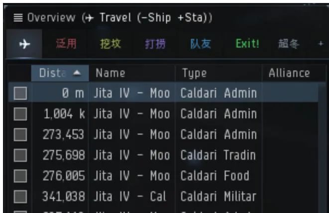

2.调整环绕距离为 2100m，随便点击一个物体，在环绕按钮上右键，即可调整默认环绕距离，注意这个默认距离只能在，下图图示上使用，右键环绕并没有这个选项

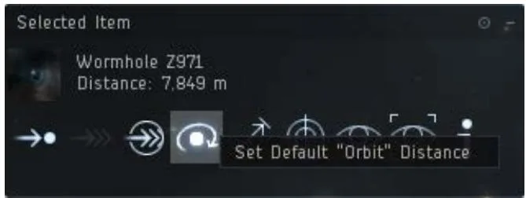


3.设置快捷键，点击左上角 ， 打开设置 Setting，快捷键设置，调整常用的模块到顺手的按键，例如隐身推子探针扫描D 扫描，关键时刻可能救你一命

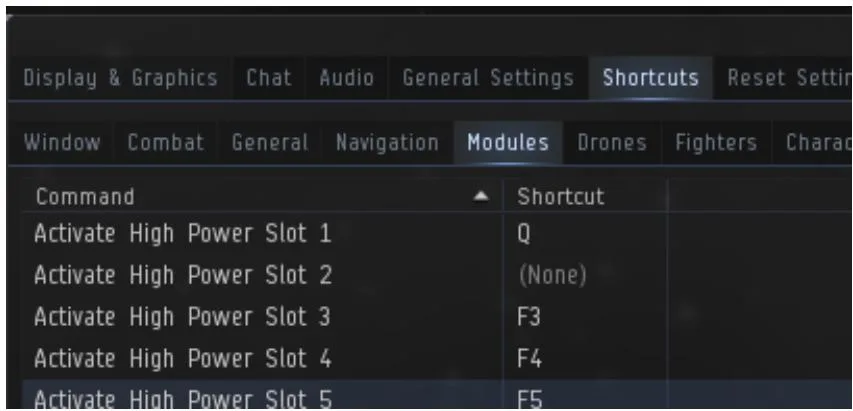

4.设置 D-扫描，Alt+D 打开 D-扫描界面，并将其固定在外部，调整角度为360°，注意 D-扫描的过滤选项是依据你的总览设置，也可独立设置

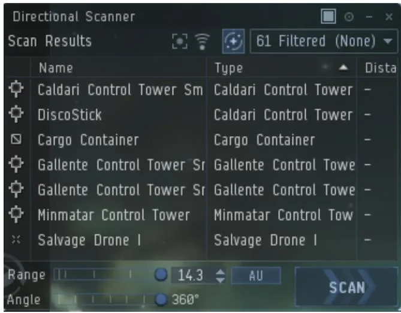

### 6.2 技巧 Tips&Tricks

#### 假隐跳 by 784 fvtr


过门后，对太空随意一个方向双击，如箭头 1。注意屏幕右上角的隐形图标，留意其是否消失，参考图中的箭头 2。隐形图标消失，立刻点开隐形装置，如箭头 3。点开隐形装置后，迅速激活微型跃迁推进器。完成以上操作后，再对太空随意一个方向双击。

（跃迁动作判定为当前船速的 70%即可达到跃迁状态，凭速度感觉跃迁时机）进阶

1. 隐跳操作有三种。第一种隐跳操作为“基础”中讲述的操作。
2. 第二种操作，与第一种操作相近，不同之处在于先激活微型跃迁推进器再点开隐形装置。
3. 第三种操作，先朝向一个卫星，然后激活微型跃迁推进器，再点开隐形装置。等待微型跃迁推进器接近循环过 3/4，关闭隐形，跃迁到目标卫星 0m。

4. 隐形装置要正常运作需要保证舰船 2 公里范围内没有其他物体。如果 2公里范围内有其他物体，不仅无法激活隐形，即使已经处于隐形状态，也会因此退出隐形。
5. 第一种操作和第二种操作适用于在 0.0 被堵门的情况如场景 1。网络状态不好，选择第一种操作。网络状态良好，选择第二种操作。第三种操作适用于没有机动跃迁扰断器和拦截探针的情况如场景 2。
6. 在场景 1,成功实施假隐跳操作后，在敌对不离场的情况下不建议显形。要离开，可以先缓慢飞出跃迁干扰范围，并至少距离敌对舰船 45 公里以上，再提前朝向好，最后，显形跃迁离场。

#### D-扫描的使用

点击 D-扫描面板上的

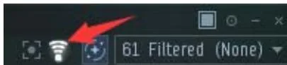

能够显示当前 D-扫描的范围，按默认快捷键 D 能够进行扫描，显示该区域内所有非隐身目标，调整角度缩小扫描范围，多次尝试能获得敌人大概方位。

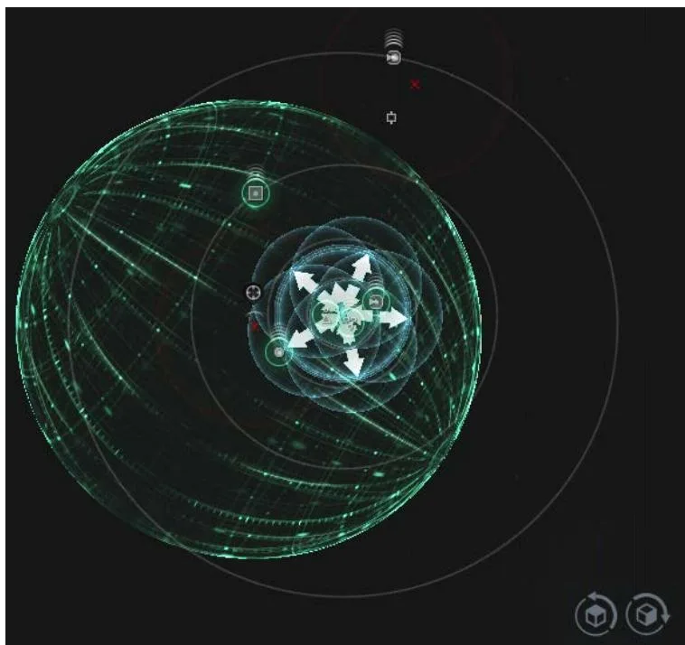

#### 安全点/深空点

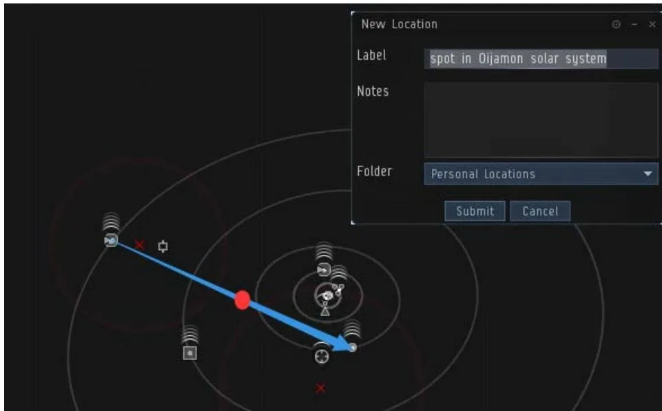

随意选择一个星球跃迁，在跃迁途中按 Ctrl+B 保存位置，上图的红点位置，注意 保存的位置是当你点击了 submit 时自身的位置，所以请留有一定的提前时间。

按照以上方法设置的安全点大部分会靠近星系中心，还是有很大可能性在敌人的 D-扫描范围内，这时我们需要学会设置深空点，当你扫描完某些数据遗迹点或是虫洞，发现它们位于地图外侧，那么这就是一个非常好的深空点，记得保存下来，后期你常去的地图都应该有一个深空点。

还有就是过门安全点，专用于星门在 14AU 以外的星系，这时候如果你要过门，如果有轻拦堵，你是五度不到的，所以提前在这类星门附近做个 150km 以外的安全点很有必要。

### 6.3 逃跑 Escape

以下三种情况，均是基于配备了隐身的 T1 护卫，小白同理操作起来更加方便。在进入危险区域之前，先把身上值钱的东西放到 NPC 空间站内，你可以点击左侧个人财产 ， 看到你寄存的所有物品。

#### 准备过门

当你准备过门时，担心泡泡或是有人守门，先跳到离星门 14.3AU 范围内的任意位置，使用 D-扫描，确定是否有人堵门。如果发现有泡泡或是人数众多>5 或是有战列（炸弹狂魔需要钢板小白才能抗住），那么我建议你放弃冲门。如果发现对面只有 1-2 号人，那么可以一试。

#### 过门后

发现掉泡泡了，不要紧张，此时你有 30s 的隐身时间，打开战术视图，分析出逃生路线，哪里没人朝哪里冲。朝向星空任意位置 ，双击瞬间点隐形马上开微曲（希望你微曲 隐形都记得快捷键 不然来不及别人就锁定你了）这样一轮微曲够你冲出泡泡了，然后再起跳，或者不起跳，静观其变。（或者超载微曲反冲星门，这样最保险）

如果只有几个人守门，可使用假隐跳进阶第三种技巧，遇到轻拦放泡泡解法同上。

#### 在星系中

挖坟前看本地人数，本地如果有人，先使用 D-扫描判断坟点有无蹲子，无法判断的情况下，可以尝试跳 70km 点，确定没人后再尝试挖坟，挖坟过程中请时刻注意总览（切换到 PVP/警戒，调整好你的界面，在破解时也能方便观察总

览），并做 15s 一次 D-扫描，如果你的飞船起跳速度小于 4s 可以只关注总览，一旦发现有人,马上跳向自己的安全点并隐身。（从发现总览上的敌人到他落地锁定你最快大概在 4s 左右，如果他是隐身的蹲子则还要加上 5s 解除隐形锁定延迟）。

反应慢了，敌人已经落地在 30km 内，马上要被锁定，也先别放弃，马上掉头背向遗迹确保 2km 内 没有物品，使用假隐跳进阶第三种技巧，同时点击隐身和推子，因为开启隐身是瞬间丢失锁定目标，但是你需要在推子转到 3/4 之前，调整好自己的位置，并找好跃迁目标。

最坏的结果他们直接跳到了脸上，在 2km 之内，连隐跳操作都无法实施，这时马上超载推子朝向远离敌人的方向，并狂按隐身键，如果成功隐身，同上使用假隐跳脱离。被锁定了，如果对方只带了网子和扰频，你的船成功挨下第一轮输出，凭着护卫的速度，手速够快是能开出他们的扰频范围，一旦发现血条上方的扰频标志消失马上跃迁。

如果很不幸对面带了扰断，你没能逃出来，那只能放出你的 ECM 无人机，祈祷能 E 中一下。同时别忘了一直点击跃迁，确保在爆船后你的蛋可以瞬间跳走。

#### 附装备介绍

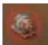

扰断 Warp Disruptor：反跳强度 1 点，能阻止起跳，但是不能关闭微

曲，范围24km（超载28KM），被扰断很容易逃生，反方向超载微曲跑就是了，脱离有效范围就起跳


扰频 Warp Scrambler：反跳强度 2 能阻止起跳（势力扰频是 3 点强

度），能关闭微曲，范围 9km（超载 10.8km），对于带微曲的小白，被扰频基本就完蛋了，但是如果你带了跃迁核心稳定器，比如你带两个稳定强度是 2，

对面扰频强度是 2 那么你就能安全跳走，阻止跃迁必须反跳强度大于稳定强度才能作用 。跃迁稳定核心会减少锁定距离，会严重降低效率，怎么取舍看自己了。注意带跃迁稳定是不能阻止扰频关微曲的。

网子 Stasis Webifier：减少 60%最大速度，小白被网子加扰频了速度只剩不到

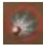

200。通常痴汉都是开剑齿虎上 200 220 280 射弹，射程 10KM（超载

13KM），所以尽量躲避他们的最佳射程能撑一会 不过被抓到了逃生几率很低，两轮就死了，不过可以带 ECM 无人机，虽然 E 住的概率很低，但是能多一点逃生的机会。

## 7 进阶 Advance

以下所有操作均基于附录的钢板小白配置，进坟之前可以把值钱的东西都放到移动机库内并保存坐标，不小心爆船了后记得保存残骸坐标，这样还能回收部分值钱的装备。如果你驾驶中白或者 T3，参考下方提供的所有数据，你能够发现别的方法。主要产出请看附录 8.3。注意冬眠坟出的东西卖给 NPC，打开市场就能查到最近的位置，最好回家之前就顺路卖掉。

这一章默认按文字流程阅读；原稿曾配有视频，但本单文件稿不再保留失效或缺失的合集入口。

### 7.1 幽灵坟 Ghost Sites

幽灵坟一共有 4 种，均为 III 级数据信号；新八区版本按 I 级战斗信号处理。超级隐秘坟只存在于虫洞中。

常见命名形式：`Lesser/Standard/Improved/Superior + 势力 + Covert Research Facility`

幽灵坟一共有 4 个箱子，呈正方形或者半圆弧布置。老攻略常把它写成“从跃迁开始计算的纯隐藏计时器”，这在现在已经不够准确。按 2025 之后的机制，守卫到达前仍有一段随机等待时间；守卫到达后，界面会出现可见倒计时，固定为 30 秒，时间结束后剩余箱子会爆炸。

这意味着跑幽灵坟不能再只靠音乐判断，也不要把“点跃迁后还能贪多久”当成固定数值。更实用的做法是：守卫没到之前尽快完成最值钱的 1-2 箱；守卫一到场，就按界面倒计时决定是否立刻撤离。

箱子破解失败或被打会直接爆炸并造成大量爆炸伤害，等级越高伤害越大，要想抗住只能堆爆抗。除了超隐其他的破解难度通常不算离谱，但因为容错极低，仍建议使用 T2 数据分析仪。因为危险度极高，所以萌新请使用廉价飞船如 Heron，在进入前使用移动机库把所有值钱的东西都保存好。

#### 具体流程

注意：幽灵坟里不要把“先点分析仪试试看，不行就直接跳走”当成保底。中途离场往往意味着你已经浪费了当前窗口，而且很容易和守卫到场或箱子爆炸重叠。切记开推子的时候不要环绕，会冲出破解范围，也等于白白损失当前箱子。

1. 把所有物资包括姐妹会发射器放进移动机库（把甲修覆膜和损控换成爆抗）
2. 隐身状态下起跳，在总览出现箱子的时候解除隐身，落地正好可以锁定（没有隐秘行动时，跃迁至离坟点最近的点，把飞船朝向坟点，再跃迁）
3. 观察总览里四个箱子的名称，先靠近（不需要环绕，保持距离 2100m）名字不一样的那个箱子，记得开一轮推子
4. 在靠近的这段时间内，先启用 3 个爆抗，然后锁定所有的箱子并使用货柜扫描，确定最值钱的那个；建议先在“挖坟产出”里记下幽灵坟常见高价值物品
5. 破解完成以后，如果守卫已经到场并出现倒计时，请按剩余时间决定是否立刻离开。大多数护卫和普通小白配置都不该把判断建立在“再贪一箱也来得及”上
6. 守卫到场后，爆抗小白通常也应优先点隐身并离开；中白这类更耐打的船可以视位置和倒计时决定是否把当前箱子收完

守卫到场后留给你撤离的窗口很短，而且剩余箱子会在倒计时结束时爆炸，不要停留到最后一秒。

#### 小技巧

1. 钢板小白换上 3 个主动爆抗，可以抗住超隐爆炸，看到总览来怪，先点隐身后马上跳走。
2. 可以放出一个无人机，来怪后怪会优先去打无人机，能争取一点时间
3. 可以直接跃迁到 10km 处，能离箱子更近一些

<table><tr><td colspan="5">隐秘坟数据统计表</td></tr><tr><td></td><td>低隐</td><td>标隐</td><td>高隐</td><td>超隐</td></tr><tr><td></td><td></td><td></td><td></td><td></td></tr><tr><td>出现区域</td><td>高安</td><td>低安</td><td>00</td><td>虫洞</td></tr><tr><td></td><td></td><td></td><td></td><td></td></tr><tr><td>纯爆炸伤(半径10km)</td><td>6000</td><td>8000</td><td>10000</td><td>12000</td></tr><tr><td></td><td></td><td></td><td></td><td></td></tr><tr><td>箱子类型及数量</td><td colspan="4">对应产出看附录8.3</td></tr><tr><td>Secure Depot</td><td>3</td><td></td><td></td><td></td></tr><tr><td>Secure Lab</td><td>1</td><td>3</td><td></td><td></td></tr><tr><td>Secure Databank</td><td></td><td>1</td><td>3</td><td></td></tr><tr><td>Secure Mainframe</td><td></td><td></td><td>1</td><td>3</td></tr><tr><td>Secure Vault</td><td></td><td></td><td></td><td>1</td></tr><tr><td></td><td></td><td></td><td></td><td></td></tr><tr><td>刷怪数量,种类随机伤害看附录8.5</td><td>4</td><td>6</td><td>8</td><td>10</td></tr></table>

爆伤计算公式：

实际伤害=坟的爆炸伤害值X（1-船的爆伤抗性）

例子：高隐炸爆伤抗性 88 的小白

实际伤害=10000 X（1 - 0.88）= 1200

也就是说你的护甲值大于 1200，就不会被炸死，当然你也可以把盾和结构计算进去。

### 7.2 气云考古 Gas Sites

部分低安与 00 区域（看附录，热点星系大概率出现气云信号，全星域会小概率出现气云信号，附录之外的其他星域一定找不到气云信号）会出现增效剂对应的气云采集和战斗站点，一般情况下是应该清怪后再开箱子，但是因为箱子不上锁，所以可以做到拉怪去开，主要收益是开出技能书和药丸图。低安的用钢板小白可以不拉怪，直接跳进去开，00 区域必须拉怪。

#### 具体流程

1. 跳 0km 点，在显示距离 2000-8000km 的时候，Ctrl+B 保存位置
2. 落地后，扫描，标记值钱的箱子（00 的话，落地马上朝向保存点开推子，再扫描，并把怪拉到离箱子 40km 以上）
3. 跳到刚才保存的点，修满甲，再跳箱子 0m 位置开箱
4. 重复步骤3，直到开完


低安

<table><tr><td>Gas Processing Site</td><td>III级信号</td></tr><tr><td colspan="2">出产技能书，脑插，标准图，普通反应配方，小概率加强图和加强配方</td></tr><tr><td></td><td></td></tr><tr><td>Chemical Lab</td><td>III级信号</td></tr><tr><td colspan="2">出产技能书，脑插，标准图，普通反应配方，小概率加强图和加强配方</td></tr><tr><td></td><td></td></tr></table>


<table><tr><td>Distribution Base</td><td>IV级信号</td></tr><tr><td colspan="2">包含3-9个箱子，隐身状态下，部分箱子会隐藏。非常注意，在这个站点箱子的位置都在角落里面，很容易导致卡建筑损，所以跳0点以后先调整自身的位置，然后环绕500m观察，确认不会卡住后再去开箱子。有时会刷两艘货运舰，可能掉落蓝图，可以用货柜扫描一下</td></tr><tr><td colspan="2">出产技能书，脑插，标准和加强图，普通和加强反应配方，小概率超强图和超强配方</td></tr><tr><td colspan="2">00区域</td></tr><tr><td></td><td></td></tr><tr><td>Production Facility</td><td>IV级信号（可能为战斗信号）</td></tr><tr><td colspan="2">包含3-9个箱子，有2座毁电塔（毁点范围50km），小白一下毁光，还有精英护卫上反跳，所以请务必拉怪挖，开推子，把怪拉离箱子50km即可。有时会刷出名字唯一的小BOSS（巡洋或战列），可能掉50-200流程的蓝图，可以用货柜扫描一下,有些boss有电子战免疫，会无法被扫描</td></tr><tr><td colspan="2">出产技能书，脑插，标准，加强和超强图，普通，加强和超强反应配方</td></tr><tr><td colspan="2"></td></tr><tr><td>Digital 'Site'</td><td>III/IV级信号（可能为战斗信号）</td></tr><tr><td colspan="2">Digital（数字）打头的战斗气云信号，包含多个轨道，6/10难度毒蜥可打，能开不少箱子，后面详细介绍</td></tr></table>

III 级气云信号以及战斗气云，被打开过后 1 个小时就会消失，IV 级气云会一直保存 3 天，在每天 DT 之后站内的箱子会全部刷新，所以就有了养气云的说法，DT 之前扫一遍后做好位标，DT 之后马上去开。挖气云的确是新人来钱比较快的途径，但是也比较看脸，很多时候扫了一个星域也没有一本书。

#### 7.2.1 战斗气云 Combat Gas Sites

战斗气云名称及分布地区

<table><tr><td>名称</td><td>地区</td></tr><tr><td>Digital Matrix</td><td>Feythabolis</td></tr><tr><td>Digital Network</td><td>Wicked Creek</td></tr><tr><td>Digital Complex</td><td>Delve</td></tr><tr><td>Digital Plexus</td><td>Vale of the Silent</td></tr><tr><td>Digital Convolution</td><td>Tenal</td></tr><tr><td>Digital Circuitry</td><td>Catch</td></tr><tr><td>Digital Compound</td><td>Fountain</td></tr><tr><td>Digital Tessellation</td><td>Cloud Ring</td></tr></table>

各地区的战斗气云的结构基本相似，这里以特纳的 Digital Convolution 为例，介绍小白如何挖战斗气云。感谢 EVO 3016 和 784 fvtr 提供的思路和资料。

整体难度 6/10 差不多，毒蜥就可以全清，T3C 能扛怪挖掉。

##### 第一层

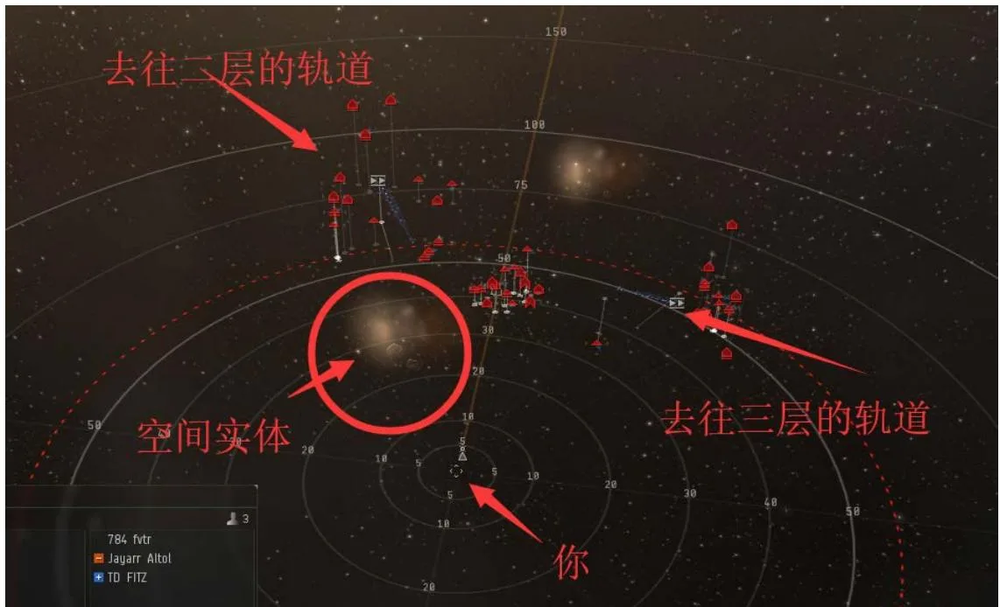

激活轨道后，你在第一层可以看到左右有两个轨道，分别通往第二第三层，第二层出产技能书，第三层出产标准药丸蓝图。直接开推子冲第二层轨道即可。如果觉得抗不住，可以隐身开推子一轮再慢慢爬过去，注意空间实体，手动控制方向折返一下。

##### 第二层

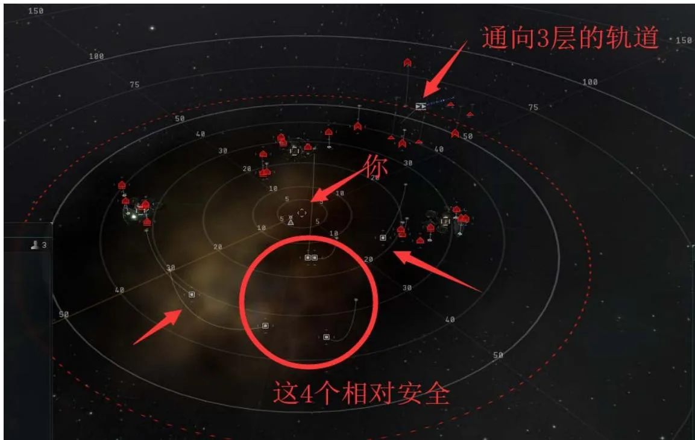

落地后环绕红圈中的箱子，并迅速扫描，除了中间 4 个箱子，左右两边单独标出的箱子，去挖后对应的怪会暴动， 也就差不多低安气云的伤害，注意看本地信息这里可能刷增援，4 个反跳护卫和 4 个战巡，小白可以直接放无人机捏掉反跳护卫，但是会触发暴动，需要跳出去再回来，就只有四个战巡在打你，轻松抗。那个 3 层轨道基本无视，小白建议从 1 层过去。

如果你是蓝药，黄药以及电容药的区域，可以去第三层看看，其他药丸区域挖了书层就够了。

##### 第三层

落地后边上就是一群怪，需要马上开推子反向拉怪，这层的护卫也有反跳，把大部分的怪拉至远离落地点 30km 以上，跳出去再回来，开推子靠近箱子，扫描，开箱子。如果你是上述的 3 种药丸之一，推荐你去第四层，大概率出超强蓝图。激活第四层的轨道需要把第三层的怪清光，怪物数量和第三层近似，也有反跳护卫。

PS：开了箱子 1 小时后信号才消失，DT 之前清掉的怪不会刷新，所以可以养。

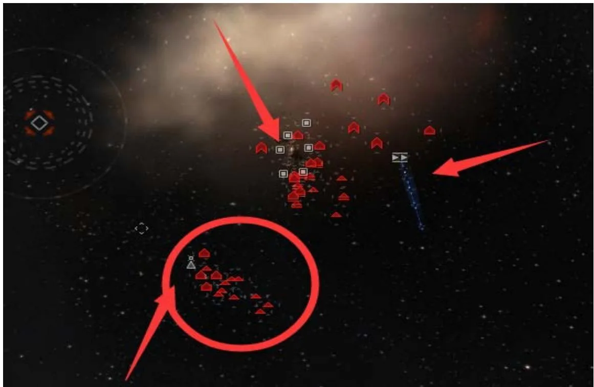

### 7.3 受限的冬眠者储藏站 Limited Sleeper Caches

受限的冬眠者储藏站是一个四级数据站点，只限制护卫等级船只进入，收益在 20m 左右，需要 `85+`（拢针）的扫描强度，大部分为红色难度核心，整体难度较为简单。


上图为限冬的整体俯视图，绿的和黄的云是有伤害的，对无抗性的船是100DPS。左下的球状立场会阻止你靠近箱子。

<table><tr><td>名称</td><td>注解</td><td>成功</td><td>失败</td></tr><tr><td>Remote Defense Grid Unit</td><td>远处</td><td>关闭球状立场</td><td>1. 什么都没有发生
2. 爆炸，造成1225伤害</td></tr><tr><td>Remote Pressure Control Unit</td><td>身边那个</td><td>关闭黄云的伤害
2-3分钟</td><td>造成200伤害</td></tr><tr><td>2x Unstable Plasma Chambers</td><td colspan="3">外观是一个罐子，高速靠近(&gt;100m/s)7-10km可能会爆炸，造成500伤害，生成一片新的毒云</td></tr></table>

#### 具体流程

小心开船即可

### 7.4 标准的冬眠者储藏站 Standard Sleeper Caches

标准的冬眠者储藏站是一个四级数据站点，收益在 60m-200m 之间，需要 `95+`（拢针）的扫描强度，大部分为红色难度核心，除了物品箱子其他均需要数据分析仪，建议使用 T2 分析仪。新手如果暂时开不了，最稳妥的做法是先记下坐标，换更高强度配置后再回来，或者交给更熟练的朋友处理。标冬被人开过的应对方法请看章节末。

#### 7.4.1 新手流程 Basic Guide

##### 流程概览

1. 破解超浪发生器，进门扫一下3 个箱子，除了最远处那个，有值钱的可以开掉，然后破解 Remote Defense Grid Unit 把炮台移过来
2. 破解 3 个坐标箱子，放到高能盒子里面，激活轨道前往后部
3. 落地后，环绕并破解边上的 Remote Defense Grid Unit，成功后放无人机打掉远处的炮台，然后开箱子
4. 保存当前位置，跃迁出去再跳回来，回到物流区，破解远处的那个MangledStorage Depot，然后破解刷出来的警报单元

破解成功：开掉那个完整的盒子，前往牵引光束区

破解失败：马上垂直向下开推子，至 120km 处离开毒雾范围。然后避开毒雾前往牵引光束边上的轨道，进入第二层，看第 6 步

5. 切向靠近牵引光束区的炮塔，并用无人机打掉，破解 Remote Defense GridUnit 并手动失败，直到触发警报。垂直向下开推子，至 80km 处离开毒雾范围。出现轨道后进入第二层

6. 到达第二层，靠近信标，直到看见 10km 外的 Remote Defense Grid Unit，破解。扫描刷出来的箱子，先破解最值钱的 2 个，然后去破解 Self-DestructCan，成功破解后可以去破解另 2 个箱子

#### 7.4.2 各区域介绍 Sections Introduction

说明：下面这一节是按区域拆开的详细解法，建议和前面的新手流程对照着看。

超浪发生器 Hyperfluct Generator

需要：数据分析仪

成功：出现轨道

失败：2 分钟倒计时，结束之前没能成功破解，自毁（没有伤害）

进门之前先介绍一下警报机制

警报等级：破解失败会提升一个警报等级。警报等级分1-5 级每一级都可能出

现守护者，上升到第 5 级一定出现守护者。

守护者Guardian：不是怪，是一种范围伤害的毒雾。出现前本地聊天框会有提示，一旦出现右图红字中的30s 倒计时，请马上垂直向下打开推子离开。毒雾出现时范围30km，30s 后扩散，扩散后范围70km 左右，伤害

Alarmraised to level 5.Guardianscan activate when alarm level rises. Elevated alarmGuardians willdeptoy in 30 seconds to clear out area The Guardian Extermination Units have deployed.They have started discharging corrosive materials to clean up the area. Be very careful when maneuvering close to them and note that the corrosive materials will build up over time. The clouds of corrosive material are about to expand. One of the Guardian Extermination Units seemsto be malfunctioning.

4x100/s 全伤，扩散后 4x250/s 全伤。攻击建筑 Sleeper Enclave 会马上触发警报刷守护者，任何情况刷毒雾后，在牵引光束位置都会出现前往第二层的轨道，并且跃迁进入点会移动到靠近轨道的毒雾外部。

##### 第一层

分 3 个区域 1.物流区 2.牵引光束区 3.后部

##### 物流区

红圈为 3 个坐标盒子，蓝圈为高低能量盒，右下为最远处的 MangledStorage Depot

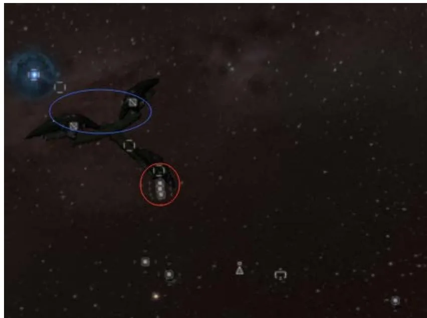

<table><tr><td>名称</td><td>注解</td><td>成功</td><td>失败</td></tr><tr><td>Mangled Storage Depot</td><td>图片右下角推荐去二层前再开</td><td>刷出一个报警单元，必须1分钟内破解，不然刷守护者。开了这个后高低能轨道会失效。</td><td>无惩罚</td></tr><tr><td>Defense Alarm Unit</td><td>1分钟时限</td><td>出一个完整的箱子</td><td>触发警报</td></tr><tr><td>Mangled Storage Depot</td><td></td><td>顺利打开</td><td>无惩罚</td></tr><tr><td>Dented storage depot</td><td></td><td>冬眠信号消失，离开站或是隐身2分钟后，这个坟会消失</td><td>无惩罚</td></tr><tr><td>Remote Defense Grid Unit</td><td></td><td>将远处的一个炮台关闭并启动牵引光束旁的一个炮台</td><td>提升一个警报等级</td></tr><tr><td>3X Coordinate
Plotting Devices</td><td>坐标盒子,
破解后不需
要打开</td><td>Z-Axis Calibration Coordinate
Y-Axis Calibration Coordinate
X-Axis Calibration Coordinate</td><td>可能提升
一个警报
等级</td></tr><tr><td>Low Power can</td><td>打开放入3</td><td>激活通向牵引光束的轨道</td><td></td></tr><tr><td>High Power can</td><td>个坐标</td><td>激活通向后部的轨道</td><td>推荐</td></tr></table>

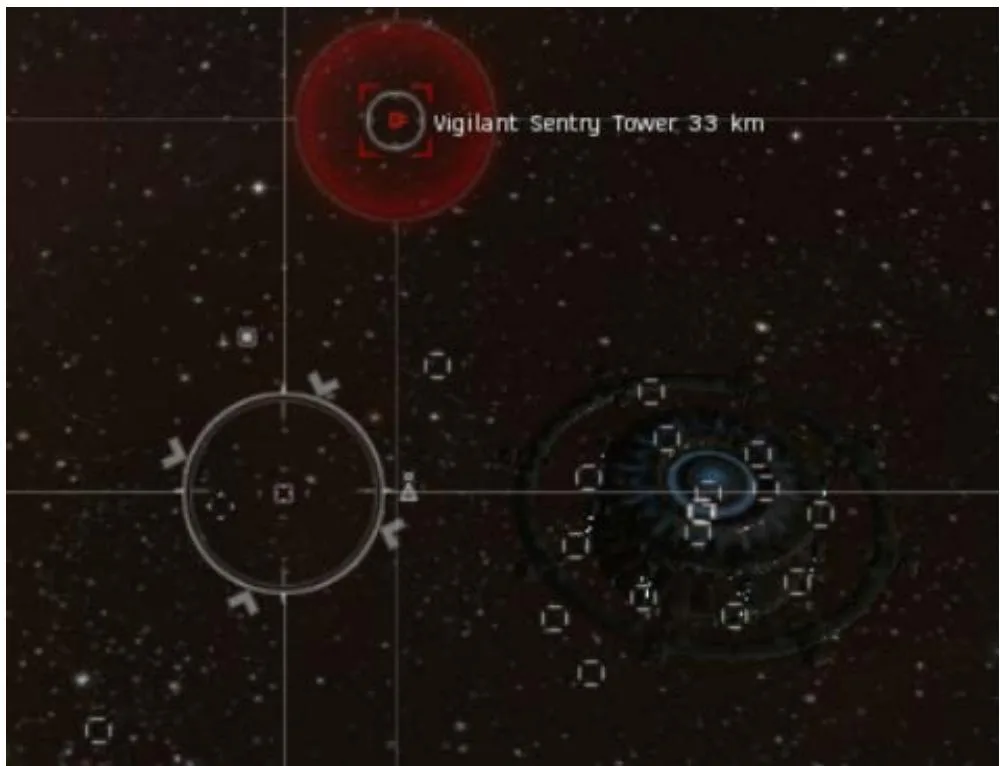
后部

通过高能轨道来到后部，图中目前锁定的是要开的控制单元，远处是要打的炮台，右边上是隐藏箱子。

<table><tr><td>名称</td><td>注解</td><td>成功</td><td>失败</td></tr><tr><td>Remote Defense Grid Unit</td><td>落地后环绕，马上破解</td><td>关闭左侧靠近的那个炮台，激活牵引光束区域的炮台</td><td>提升一个警报等级</td></tr><tr><td>3 x Sentry Tower
Restless/ Vigilant/
Wakeful</td><td colspan="3">基本打不中，关闭一个后，开推子切向靠近远的那个，环绕，并用无人机打掉</td></tr><tr><td>6x Impenetrable
Storage Depots</td><td>靠近后出现</td><td>顺利打开</td><td>无惩罚</td></tr></table>

##### 牵引光束区

前往第二层的轨道会出现在牵引光束的边上

如果你是通过低能量轨道来的，会激活附近的一个炮塔

<table><tr><td>名称</td><td>注解</td><td>成功</td><td>失败</td></tr><tr><td>Remote Defense Grid Unit</td><td></td><td>关闭附近的那个炮台</td><td>提升一个警报等级</td></tr><tr><td>Restless Sentry Tower</td><td colspan="3">靠近会触发的炮塔</td></tr><tr><td>Tractor Beam Unit</td><td></td><td>把后部隐藏的箱子拉过来</td><td>无惩罚</td></tr></table>

##### 第二层

这里的自毁和势力坟是一样的，不会造成伤害！

<table><tr><td>名称</td><td>注解</td><td>成功</td><td>失败</td></tr><tr><td>Remote Defense Grid Unit</td><td>靠近信标 &lt;2km出现</td><td>刷出 4 个盒子，和 1 个自毁重置盒子，并 3 分钟自毁倒计时</td><td>无惩罚</td></tr><tr><td>4X Storage Depot</td><td></td><td>顺利打开</td><td>无惩罚</td></tr><tr><td>Self-Destruct Can</td><td>自毁 没有伤害</td><td>自毁时间重置为 3 分钟</td><td>自毁时间重置为 1 分钟</td></tr></table>

#### 7.4.3 进阶流程 Advanced Walkthrough

中白/钢板小白强开流程（用了 bug，速度快，需要一定的有效；原稿另有视频版）

1. 进门扫一下先开最值钱的箱子，再开远处的 Mangled Storage Depot，然后开 Defense Alarm Unit 以及刷出来的 Pristine Storage Depot
2. 开 Remote Defense Grid Unit，并手动失败触发警报，躲开毒雾
3. 到中点，扛着炮台快速打开 Remote Defense Grid Unit 然后进入第二层
4. 开完第二层后保存位置，跳出去再回来，去开牵引光束 Tractor Beam Unit，再开拉过来的箱子，炮塔不会打你（会打刚才开掉的那个防御单元）

#### 养标冬

不开 Dented，Intact 和 Mangled 的箱子信号不会消失，DT 后用牵引拉过来的 6个后部箱子会刷新，你就能多开6 个箱子，同样第二层的箱子也会刷新。

#### 标冬被人开过后怎么处理

跳进去后，看中点是否被毒云覆盖，如果有毒云，说明这个标冬开爆过了一个维护期，里面的毒云是没有伤害的，可以按照正常的标冬程序开。如果没有毒云覆盖，说明这个标冬是当天开爆的，毒云不能进，但是可以用上方的强开流程来，开掉后部的箱子然后去2 层。近点的箱子就不要想了。

### 7.5 超级的冬眠者储藏站 Superior Sleeper Caches

超级的冬眠者储藏站是一个五级数据站点，收益在 120m-300m 之间，需要

105+（拢针）的扫描强度，几乎全部为红色难度核心，除了物品箱子其他均需

要数据分析仪，强烈建议使用黑镜+T2 分析仪。新手如果扫到该信号但没有把握，

最好先记位标，换装或换船后再回来，不要拿普通练手船硬顶。

超冬可分为 4 部分，电离室风险较大。超冬被人开过的应对方法请看章节末。

#### 7.5.1 新手流程 Basic Guide

##### 流程概览

1. 破解超浪发生器，无论落在哪个位置都回电厂近点开始
2. 破解中点的 Solray Observational Unit，将获得的盘子放到对应名字的盒子里
3. 扫描气云中的盒子，开掉值钱的，去近点轨道前往炮塔层
4. 用保持距离，先破解左边的防御单元（失败请马上离开），成功后马上开推子到右边破解维修单元
5. 待所有炮塔都消失后，再过去开那 9 个盒子
6. （电离室有一个箱子可以无风险开）

##### 可选

7. 回到电厂，放下移动机库把货舱东西全部放入以及姐妹会的发射器，换上爆抗，别忘了带上甲修材料，并保存位置
8. 前往远点破解修正单元，回到中点前往地雷区，起跳之前启用爆抗
9. 地雷区攻略请看章节7.5.5

10. 雷区破解完后跳出去，再跳回来，保存好刚才开出的东西后，前往炮塔层，破解超浪发射器，前往电离室，轨道如需要充能请看章节 7.5.4
11. 电离室攻略请看章节 7.5.6

说明：下面开始是超冬各区域的分拆说明，建议和 7.5.1 的流程对照阅读。

#### 7.5.2 入口 Entry

超浪发生器 Hyperfluct Generator

需要：数据分析仪

成功：出现轨道

失败：2 分钟倒计时，结束之前没能成功破解，自毁（没有伤害）

激活轨道可能会跃迁到以下 3 个位置，请激活边上的轨道，返回恒星能量发电厂近点处开始挖坟流程

1. 电厂近点
2. 电厂远点，激活边上的轨道回到近点
3. 炮塔层，激活边上的轨道回到电厂近点

#### 7.5.3 恒星能量发电厂 Solray Power Plant

电厂分为 3 个点：近点、中点、远点。各点都被黄色毒雾包围，稳定前约为 `600/s` 的纯 EM 伤害。

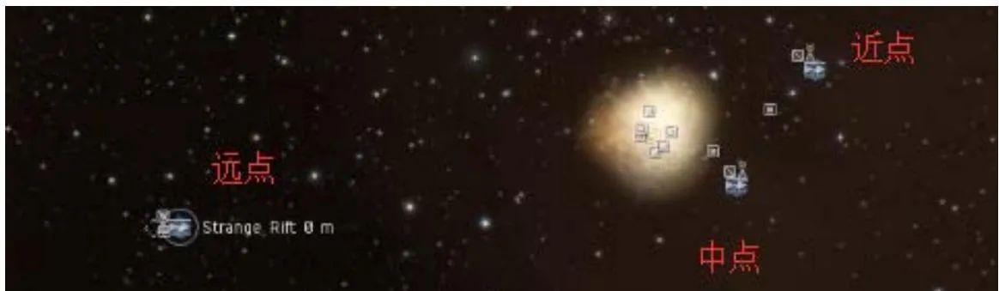

<table><tr><td>名称</td><td>注解</td><td>成功</td><td>失败</td></tr><tr><td colspan="4">近点</td></tr><tr><td>Solar Grammar Alignment Unit</td><td></td><td colspan="2">对应放入 Modulate Disc</td></tr><tr><td>Spatial Rift</td><td>近点</td><td colspan="2">前往“炮塔层”</td></tr><tr><td colspan="4">中点</td></tr><tr><td>Dented storage depot</td><td></td><td>冬眠信号消失,离开站或是隐身2分钟后,这个坟会消失</td><td>无惩罚</td></tr><tr><td>Solray Observational Unit</td><td>需要打开</td><td>获得任意一个 Modulate Discs Infrared/Radio/Gamma</td><td>无惩罚</td></tr><tr><td>Solar Grammar Infrared Unit</td><td></td><td colspan="2">对应放入 Infrared Modulate Disc</td></tr><tr><td>Spatial Rift</td><td>中点</td><td colspan="2">前往远点远点校准后:前往“地雷区”</td></tr><tr><td>6x Storage Depot</td><td></td><td colspan="2">放入对应的 Alignment Discs 后毒雾伤害减低至 25/s,毒雾范围 13-17KM,破解失败无惩罚</td></tr><tr><td colspan="4">远点</td></tr><tr><td>Solray Radio Alignment Unit</td><td></td><td colspan="2">对应放入 Radio Modulate Disc</td></tr><tr><td>Remote Reroute Unit</td><td></td><td>校准中点轨道 Spatial Rift</td><td>无惩罚</td></tr><tr><td>Spatial Rift</td><td>远点</td><td colspan="2">校对单元成功:回到中点,校对单元失败:到达炮塔层中心,触发炮塔</td></tr></table>

#### 7.5.4 炮塔层 Sentries on Duty

在敌方的炮塔全部消失之前，不要过红线，也不要放无人机过线，防御单元一旦失败炮塔层就开废了。


<table><tr><td>名称</td><td>注解</td><td>成功</td><td>失败</td></tr><tr><td>Spatial Rift</td><td></td><td colspan="2">回到电厂中点</td></tr><tr><td>2xWakeful+Vigilant+Restless SentryTower</td><td></td><td colspan="2">不要超过防御单元与维修单元之间的红线就不会攻击你。单炮塔伤害400-700，暴击会到1500+</td></tr><tr><td>Remote DefenseGrid Unit</td><td>这个开
失败了
炮塔层
就只能
放弃</td><td>离你最近的炮塔会变成友方帮你打其他炮塔
这个炮塔只能被维修单元修，
不能被玩家修</td><td>本地显示45s倒计时，时间到后会再刷16个炮台，无论是否破解成功</td></tr><tr><td>Sentry RepairStation</td><td>可以不
破解</td><td>为友方炮塔维修。高有效的船在成功破解维修单元后，可以</td><td>无惩罚</td></tr><tr><td></td><td></td><td>过线,硬抗两轮伤害后,所有炮塔会立刻自毁。</td><td></td></tr><tr><td>9x Storage Depot</td><td></td><td>顺利打开</td><td>无惩罚</td></tr><tr><td>3x Unstable Plasma Chambers</td><td>蓝圈</td><td colspan="2">被攻击会爆炸,为轨道充能。100000 点爆炸伤害,爆炸后还会产生毒云,并在 60s 后刷炮台</td></tr><tr><td>Hyperflux Generator</td><td>位于盒子中间</td><td>1. 出现前往“电离室”的轨道2. 无法开启,轨道需要充能。引爆那 3 个罐子为轨道充能</td><td>无惩罚</td></tr><tr><td>Vessel Rejuvenation Battery</td><td>蓝圈</td><td>为你提供 10s 的无敌,配合攻击引爆罐子,充能轨道</td><td>无惩罚</td></tr></table>

备注：炮塔层也可以使用那个空箱子 BUG，即使被开爆了，如果你能硬抗炮塔开掉一个箱子，跃迁出去再回来，你会发现所有炮塔都只会打那个箱子

三层轨道充能思路：先放出无人机，这边破解恢复单元，点出核心别急着点掉，让无人机去攻击罐子，在飞到半路时点掉核心。充能轨道后，这时你只有 60 秒时间去重新破解超浪轨道，成功与否 60 秒后都会刷出 16 个炮台。这个维护打开后会大幅减低罐子的伤害至 400 点左右，无法用来炸别人船。

#### 7.5.5 地雷区 Mine Room

雷区如果你有 3w+的有效可以趟过去，但是需要 10W+有效才能抗住破解失败在落地之前可能会吃到伤害。如果操作得当，可以无伤开。

地雷区机制：落地之后，靠近隐藏的防御单元，破解后会显示部分地雷，滚轮放大并移动视角才能看见显示的地雷，存在隐藏的地雷，地雷的位置是固定

的。同时也会显示部分盒子，雷区一共 3 个盒子，位置是固定的，没有显示的盒子，手动驾驶飞船靠近 10km 内就会出现，位置请参考后图。

靠近地雷 10km 内会触发爆炸，单颗伤害分为 2000，3000，4500，5500，

6000，7500 这几种，纯爆炸伤害，一次触发会引爆 1-3 颗地雷，速度过快的情况下会出现连续触发 2 次的情况（4 颗雷）。钢板小白如果能稳定维持 `88%+` 爆抗，一般不会被直接炸死。3 个箱子的位置如后图所示，以信标为原点，手动控制飞船就能把箱子撞出来。

<table><tr><td>名称</td><td>注解</td><td>成功</td><td>失败</td></tr><tr><td>Remote Defense Grid Unit</td><td>10km内出现</td><td>显示 1-3 个盒子，显示部分地雷位置</td><td>引爆所有地雷 20-25 颗</td></tr><tr><td>3xStorage Depot</td><td></td><td>顺利打开</td><td>无惩罚</td></tr></table>

#### 地雷区攻略方法

无伤雷区路线（原稿提到有流程视频，这里仅保留文字步骤）：

注意：从信标处起跳，避免吃到地雷，撞出箱子及时停船。

落地后靠近信标，刷出防御单元后靠近并破解（非必须，失败必死）。

撞 Dented 箱子沿刻度线开 1 轮推子即可。

撞 Pristine 箱子，调整视角到 100KM 刻度线在最外围，双击低槽第四个位置的右下方为舰船方向，开 2 轮推子。

撞 Intact 箱子，需要在信标处先垂直上升至 5700m-6100m，然后调整视角到100KM 刻度线在最外围，双击右侧 30KM 刻度数字为舰船方向，开 2 轮推子。

注意3 个箱子离信标的距离，一旦发现自己到了这个距离还没撞出箱子，请立刻停船原路返回信标处，再重新尝试。


操作示意图

小白抗地雷方法

注意： 技能不足的情况下 55 爆抗只能超载 4 轮，如果装备双 64 爆抗，不需要超载。全部使用保持距离。被雷炸到后马上停船维修好血量再前进。

上双爆抗，低槽请按右图所示摆放，确保4 次超载不会超坏其他装备，点击图

示的小圆圈能直接将低槽全部预超载，并在下一次循环开始超载。


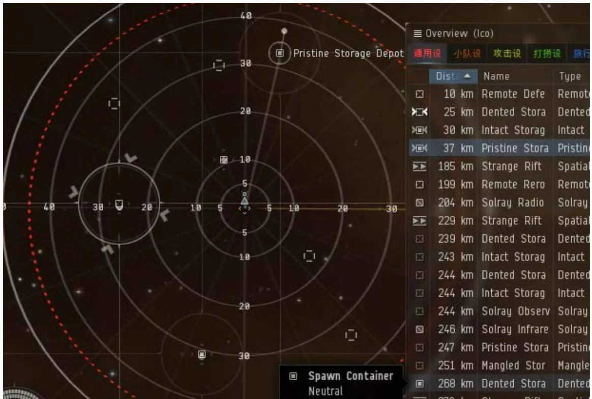
雷区箱子分布图


上俯视图
下侧视图

#### 7.5.6 电离室 The Archive

电离室分布着很多残骸，残骸被毒云包裹靠近会造成伤害（全伤 4x100/s），可

能会出现暴击 800 伤害，小白不要靠近，直线前往 Defense Targeting

Augmentation 不会碰到废墟毒云

<table><tr><td>名称</td><td>注解</td><td colspan="2">成功</td><td>失败</td></tr><tr><td>Defense Targeting Augmentation</td><td></td><td colspan="2">大幅降低炮塔的命中率</td><td>刷炮塔</td></tr><tr><td>3X Cerebrum Maintenance Chambers</td><td></td><td colspan="2">顺利打开</td><td>刷炮塔</td></tr><tr><td>4x Impaired Archive Sentry Tower</td><td></td><td colspan="3">出现条件：1.破解失败 2.激活 Cerebrum 后每个炮塔伤害在 700 左右，12s 一轮</td></tr><tr><td>Central Archive Cerebrum</td><td></td><td colspan="3">放入 3 个 Intravenous Oscillation Fluid 激活建议先放入另两种物品各 3 份</td></tr><tr><td>10x Storage Depot</td><td></td><td>顺利打开</td><td colspan="2">无惩罚</td></tr><tr><td>3xVessel Rejuvenation Battery</td><td></td><td>顺利打开, 刷 90s 的恢复云, 1s 修满</td><td colspan="2">无惩罚</td></tr></table>

电离室的机制：在 `Cerebrum` 激活之后就会开始倒计时，90 秒后第一波冲击到达。之后随着逗留时间越长，冲击波出现得越频繁，每次持续 5 秒。

除了第一波是“本地提示出现后 90 秒到达”，后续冲击波的时间间隔并不固定，前几波常见为 20-40 秒，也可能出现多波冲击波（最多 3 波）同时到达的情况。前 3 波大概率仍是单冲击波。

激活 6 分 30 秒后会出现 `colossal wave`，伤害约为普通冲击波的 3 倍。普通冲击波每秒造成四属性总计约 `2400/s`，持续 5 秒，总伤约 `12000`。

激活后会逐渐刷出箱子，半分钟后 9 个箱子全部出现，激活同时也会出现恢复单元，一共有 3 个恢复单元，第二个恢复单元大概在 2m20s 出现，第三个大概在 4m30s 出现，单元破解成功后会提供 90s 的无敌，但是范围只有 5000m。目

注：目前资料显示只有区域①的恢复单元有效。


箱子的分布图示：每 3 个箱子（红圈）围绕 1 个恢复单元（蓝圈），另有 1 个箱子刷在远处废墟旁。有一定几率某个箱子被炮塔替换，也有一定几率某个箱子变成空箱子。

三个区域的风险大致如下：

1. 区域 1：无明显地形风险，靠近任何箱子都相对安全。
2. 区域 2：最外侧的箱子和维护单元较安全，内部 2 个箱子紧贴废墟。
3. 区域 3：最外侧箱子较安全，维护单元和内部 2 个箱子都紧贴废墟。

另外，在 3 个区域外，远处废墟里的那个箱子距离废墟空间实体不到 500m

#### 电离室的攻略方法

在电离室内使用推子请小心，务必提前停船，防止冲进废墟

激活之前：在进来后先去破解那个远处防御单元，破解成功后，先手动失败一个罐子刷出炮塔，环绕罐子炮塔是打不中小白的，再成功破解那个箱子，这时会刷一个完整箱子，可以去开掉。然后跳出去再回来（注意：如果你在炮塔层充能了，那么炮塔层会刷出炮塔，不能再进入），你会发现炮塔全部在打刚才破解的防御单元（和之前标冬是同一个 BUG）

一共丢 3 个液体到端脑内就能够将其完全激活，建议先丢 3 个齿轮再丢 3 个纳米，能大概率不刷新的炮塔和空箱子，不是每次都有足额的另外两种材料，可以提前备好。

在激活之前，把保持距离设置为2200m，环绕半径设置为1000m，关闭推子的自动循环。

##### 激活之后

风险提示：确保你在激活之前，把身上所有值钱的东西都保存到移动机库中。如果本地出现 15s 倒计时，没时间去开维护，请果断离开。

1. 只开 2-3 个最值钱的（风险系数中；原稿另有视频版）：在激活之后，开一轮推子靠近区域 1 的箱子，保持距离即可（如果新刷了炮塔，请环绕），同时扫描区域 1 的箱子，并开掉最值钱的那个，然后破解维护单元，不急着点掉核心。此时扫描剩下的箱子标记 2 个值钱的，本地出现冲击波提示后点掉核心，等待冲击波结束后马上靠近标记的盒子开掉，注意本地的冲击波提示，开掉后返回区域 1 的维护单元，待第二波冲击波过去后，再去开另一个盒子。

##### 抗冲击波开

使用双钢板小白/钢板中白（有效超过 12060 即可硬吃一波冲击波，小白上 2 个T2 三角插，修换成钢板。以下操作均基于前 3 波冲击波为单冲击波，一旦出现双冲击波请躲在维护云中或是马上离开）

2. 最大化开箱（风险系数大）：在激活之后，马上开推子靠近最近的维护单元，保持距离即可（如果之前没处理掉炮塔，环绕维护单元 1000m），同时扫描单元边上的 3 个箱子，确定最值钱的。开完那个箱子后，马上锁定区域 2 的箱子并确定最值钱的，先开推靠近那个安全箱子，等速度降下来后再靠近目标箱子并保持距离，这里会需要硬吃第一波冲击波。开完这个箱子后马上回区域 1 的维护单元并开掉，如果在维护开掉之前本地出现新的冲击波倒计时请马上离开。在维护云里面扫描区域 3 的箱子并确定值钱的 2 个，如果区域 1 的箱子还有值钱的可以在此时开掉。算好时间等第二波冲击波过去后，马上开推靠近区域 3 的维护单元并保持距离，先破解目标的 2 个箱子后，再去拾取物品。如果是两个内侧箱子，在捡完一个后必须先返回区域 3 的外侧箱子再去另一个，否则会吃到废墟伤害。同时注意本地的冲击波提示，抗完第三波冲击波就要离开了。一共可以开区域 1 的 2 个、区域 2 的 1 个、区域 3 的 2 个，共计 5 个。

3.小白全开（未成功实践，推荐先用全 T2 装测试，熟悉手法，第一位成功者，赠送 10 罐大脑浆）

激活后先开推靠近区域 1 边上的废墟，距离 13km 时停船减速，靠近并破解区域 1 的第一个箱子，然后靠近（不是保持距离）区域 2 的安全箱子，破解后再

去破解上方的内侧箱子并保持距离，注意你和箱子的距离稳定后再打开箱子，不然超过 2500m 打开箱子，系统会自动给出靠近指令，导致冲入废墟。这里硬抗第一波冲击波。手速快且第一个冲击波还没来时，你可以把下方另一个内侧箱子也直接开掉，随后马上回到区域 1 的维护单元并开掉，再开推靠近区域 3 的安全箱子，之后保持距离并破解右侧箱子，中间需要硬吃第二波冲击波。到这里为止，如果经验和手速都到位，通常可以稳开 `1 + 3 + 2 = 6` 个；剩下的 3 个就更看运气了。

如果此时维修云已经结束，注意第三波冲击波的同时去开区域 3 最后那个箱子。如果你的开箱速度够快，可以快速回到区域 1 的维修云修满血，开掉区域 1 最后那个箱子（维护需要坚持到第三个冲击波），然后再靠近区域 3 最后那个箱子保持距离。如果运气好第四波仍是单冲击波，你就有机会完成小白挖穿超冬的打法。从激活到第五个冲击波提示一般只有 250-300 秒左右，你需要在这段时间内开掉共 10 个箱子。

##### 4. 金鹏全开（原稿提到有有效抗视频）

有效抗：核心思路是在 6 分 30 秒的大冲击波来之前挖光，而在此之前的冲击波总数基本不会超过 8 个，所以将船只的有效堆到 10W 以上，就能硬抗大冲击波之前的所有冲击波。

普通装：皮中 A，皮 C 全抗，皮 X 电抗，大盾扩，可以抗下冲击波，在下一波来之前修好，出现多冲击波适度超载修盾，在大冲波来之前离开。

#### 7.5.7 最效率流程 Fast Walkthrough

1. 远点：破解防御单元，激活轨道，到近点，激活轨道。

近点：激活轨道

炮塔层：不动

2. 炮塔层，放下移动机库保存位置，开防御和维护单元，然后走轨道回到电厂中点，
3. 破解观测单元，拿盘子，扫描气云中的箱子并标记
4. 盒子在边上，放好盘子，并开掉气云里面的箱子盒子在远点，盒子在近点，继续按流程
5. 激活中点轨道（远点放盘子），并破解防御单元，然后激活轨道回到近点（近点放盘子）
6. 激活轨道去炮塔层，换上双爆抗，然后开箱，之后激活轨道回到中点（开气云里面的箱子 ），前往雷区
7. 开完雷区，跳出去后回来，到炮塔层换装，前往 3 层电离室，触发炮塔，并开掉那个完整箱子
8. 3 层开完后，跳出去，再跳回来回收移动机库

#### 超冬被人开过后怎么处理

请不要盲目进入轨道，可能会被秒。建议先去 [zKillboard](https://zkillboard.com/) 按星系查询最近几天的击毁记录；如果近期明显有人被炮塔击毁，通常说明炮塔层已经被开爆了，请看情况二。极小可能有人开爆炮塔层后幸存，最保险的方法仍是维护以后再进入。

1. 电厂被人开错了

萌新可能会搞错对应盘子的位置，检查一下 3 个放盘子的盒子，如果名字都为Unaligned 那么就是盘子被放错了，小白只能放弃，或者用中白顶着毒云开

##### 2. 炮塔层被人开爆了

看门口的超浪发生器是不是满的，如果满的说明已经过了一个维护周期，炮塔层的警戒炮塔会隐藏。注意，你一旦进入就会触发警报 3-5s 刷出炮塔，但是你可以马上激活身边的轨道回到电厂，开那儿的箱子（如果上个人还没开掉的话）。或者再次破解超浪，刷一个到电厂的轨道。如果超浪是空的，那么就不要进去了，22 个秒锁炮塔在等着你，总之炮塔层肯定是开不了的。（8500+有效的小白，一般不会被秒，冒险可以尝试进入，落地起跳回电厂）

### 7.6 进阶技巧 Advanced Tips

为了提升挖坟效率，本章节将介绍一些进阶技巧。

#### 7.6.1 一针判定信号 One Probing

by 十月

以 120 强度为例，用 `8AU` 针扫完之后看信号强度。

信号强度在 `8.6+` 时，一般为 II 级及以下信号。

信号强度在 `5-8.5` 时，一般为 III 级信号。

信号强度在 `3-5` 时，一般为 IV 级信号。

信号强度在 `2%` 以下时，多半是冬眠者储藏站信号。

如果碰上两点，则按当前强度大致乘 `2` 估算；碰上圆圈按 `4` 估算。若碰上球形且强度低于 `1%`，就重新定位一次再判断。

##### 我们常见的信号

III 级信号常见为隐秘研究设施（`Covert Research`）、气云（含部分带炮塔气云）和 `Nebula` 星云。

IV 级信号为 2 个冬眠者储藏站（Sleeper Cache）、1 个气云（低安无炮台，00有毁电），还有普通势力小船坞（Shipyard、Den）跟 1 个普通势力遗迹（采矿场）

V 级信号只有一种超冬，以及虫洞里的寂静战场。

在国际服把考古玩熟以后，很多人只重点扫这 3 种信号，对 I、II 级信号就直接忽略。常见做法是进一个星系后先扔一次 `8AU` 针，把 `8.6` 以上的结果右键清掉，再继续扫剩下的信号。高安赶路时，也可以在星门之间顺手扔一次 `8AU` 针看看有没有幽灵坟或超冬。

##### 不用针判定信号

冬眠者储藏站一般在行星 6AU 外

隐秘研究设施一般在行星 5AU 左右

普通气云遗迹数据信号都在行星 4AU 内

所以一般来说，超高级的信号圆圈范围越大，而且这个圆圈经常不会包围行星。如果找多了你就能进星系一眼看出一个信号会是超冬。还有一种深空虫洞，经常离行星6AU 外。像下面这样一个8au 圈都杠不住,而且没包围行星，多半是超冬。

以后如果碰上扫死亡的定位IV 级信号，不能确定名字，叫他跳最近行星，看下距离，如果在 4AU 内，就是小船坞(shipyard)，如果是 5AU 外，一般是标冬。

左图为超冬信号大小，右图的两种方法都可以清除不需要的结果。

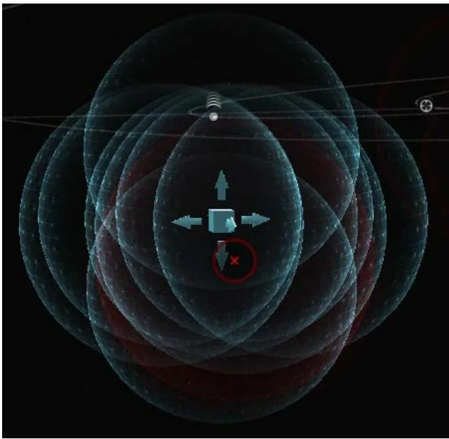


#### 7.6.2 快捷键设置 Shortcut

这里罗列了挖坟常用的快捷键，并提供了推荐键位。熟练使用快捷键是高效挖坟的保证，也是小白挖穿超冬三层的必要前提。大部分快捷键是按住以后再用鼠标选择目标才能发挥作用。

<table><tr><td>名称</td><td>功能</td><td>推荐键位</td></tr><tr><td colspan="3">Combat</td></tr><tr><td>Approach</td><td>靠近</td><td>无</td></tr><tr><td>Directional Scan</td><td>舰载扫描</td><td>X</td></tr><tr><td>Dock/Jump/Activate gate</td><td>停泊/跃迁/激活星门</td><td>Alt</td></tr><tr><td>Keep at Range</td><td>保持距离</td><td>C</td></tr><tr><td>Lock target</td><td>锁定目标，用鼠标可框选</td><td>Ctrl</td></tr><tr><td>Unlock target</td><td>解锁目标，用鼠标可框选</td><td>Shift</td></tr><tr><td>Orbit</td><td>环绕</td><td>V</td></tr><tr><td>Refresh Probe Scan</td><td>使用探针扫描，没探针会自动放</td><td>Z</td></tr><tr><td>Tag item from sequence: 1 through 9</td><td>标记目标从数字 1-9顺序标记，需要开舰队</td><td>1</td></tr><tr><td>Tag item as: A</td><td>标记目标为 A，排除不值钱箱子</td><td>2</td></tr><tr><td colspan="3">Navigation</td></tr><tr><td>Save Location</td><td>保存位置</td><td>Ctrl-B</td></tr><tr><td>Stop Ship</td><td>停船</td><td>Ctrl-Space</td></tr><tr><td colspan="3">Modules</td></tr><tr><td>Activate Medium High Slot 1</td><td>启用高槽 1，隐身</td><td>Q</td></tr><tr><td>Activate Medium Power Slot 1</td><td>启用中槽 1，推子</td><td>Space</td></tr><tr><td>Activate Medium Power Slot 2</td><td>启用中槽 2，货柜扫描</td><td>A</td></tr><tr><td>Activate Medium Power Slot 3</td><td>启用中槽 3，数据/一体分析仪</td><td>S</td></tr><tr><td>Activate Medium Power Slot 4</td><td>启用中槽 4，遗迹分析仪</td><td>D</td></tr></table>

#### 7.6.3 界面布置 Interface

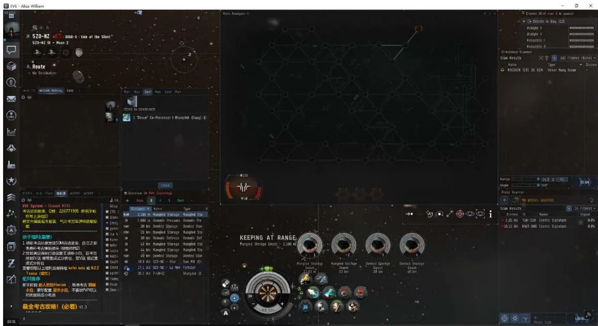

上图是我推荐的标准挖坟界面布置图，基于 1080p 分辨率显示器，如果是 768p分辨率可以把左侧的聊天框去掉，并把仪表盘移走。所有的窗口设置完成后，再次打开还会保存在固定的位置。

##### 要点

1. 把锁定目标栏移动到下方的仪表盘上部，找到右图所示的圆点即可拖动调整位置
2. 把舰扫和探针扫描窗口拿出来

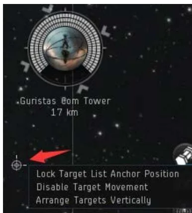

找到右图这个正方形，点击后就会把这个窗口放在主界面上，然后点击边上的 pin 按钮，将其固定。


3. 把物品选择栏移动到一个位置，使那一排的按钮正好位于锁定栏的上方，破解界面的下方，看前图，方便破解后快速开箱捡取物品。

##### 快速捡取箱子设置

先打开背包，点击左上的小齿轮，勾选右图的这个选项，这样每次点开箱子不会自动打开背包。

然后把打开的箱子界面调整到右图所示的位置，并让 `Loot All` 的按钮尽量覆盖在物品选择栏的“打开箱子”按钮附近，这样就能做到开箱后快速拿走物品，而且拿完后这个窗口会自动关闭。

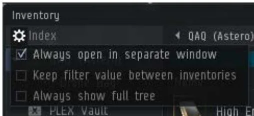


#### 7.6.4 总览设置 Overview

普通挖坟直接使用一套你自己调过的探索总览即可，关键是稳定显示星门、天体、玩家舰船、探针、普通箱子、冬眠箱子与炮塔。

如何设置总览请自行百度。

总览需要设置 2 种，一是主界面中

的总览栏，二是直接显示目标的

brackets。

挖坟总览，推荐只显示可停泊建

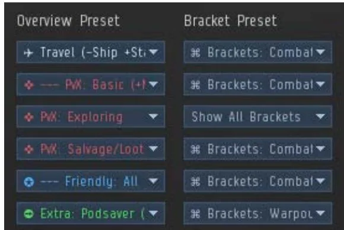

筑，星门，太阳，玩家飞船以及普通箱子，冬眠箱子和炮塔。

然后再设置 brackets，日常我推荐用显示全部。

可选：小白挖穿超冬 3 层的时候为了提高锁定效率可以特别做一个专门的设置

只显示冬眠箱子和炮塔，然后直接 Ctrl+鼠标框选所有箱子，记得在起跳 3 层之前切换至这个配置。

##### 普通坟的箱子


##### 冬眠坟的箱子


##### 冬眠坟中的空间实体以及信标


##### 冬眠坟中的炮塔

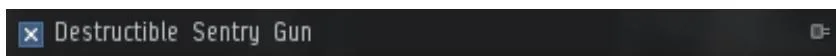

##### 冬眠坟中可以放东西的箱子


#### 7.6.5 终极小白 The Ultimate Astero

这里介绍附录 8.4 配装“终极小白”的使用方法。使用这套配装前，确保你的 A 族护卫、扫描、甲抗、工程、盾抗等关键技能都在 IV 级以上，否则会出现续航或有效不足的问题；如果技能足够高，可以适当降低部分装备等级。

这套配置的优点在于，你不需要再换装爆抗，而且双超空间插大大提升跃迁速度，还能上高统一套达到 12AU/s 的跃迁速度。如果不打算硬抗超冬 3 层冲击波，除了爆抗都可以换成 T2 的，货舱里面的损控，盾扩，钢板也不需要带。

幽灵坟：启用爆抗后应该有 80%的爆抗，足够抗下高隐且不进结构，如果是超隐，解除隐身后先预超载爆抗，不启用，直到必要时，快捷键启用即可抗下。

低安气云：边修边开，不需要跳出去00 气云：照旧

限和标冬：无脑开，标冬可直接硬抗炮塔开牵引

超冬雷区：打开爆抗即可

超冬三层：把修和爆抗换装成损控和钢板，把回电换成盾扩。确保这里你有超过 12050 的有效。

备注：如果追求最极限，可以把那个


甲插也可以换成超空间，把联邦钢板换成深渊钢板；大致需要 `720+` 甲量和 `-0.2` 以上的 PG 余量。然后把货柜扫描换成盾扩，在 A 护卫 V 的技能下应该有 `12050+` 的有效血量。

## 8 附录 Appendix

### 8.1 网站 Websites

- [EVE 中英互查](https://eve.being.moe/trn/)
  常用词条英汉互查。
- [EVE University Wiki](https://wiki.eveuniversity.org)
  资料最系统的公共攻略站之一，需要一定英文阅读能力。
- [EVEpraisal](http://evepraisal.com/)
  把货柜内容复制进去，可以快速估价。
- [EVE Marketer](https://evemarketer.com/)
  市场查询网站，适合跨地区比价。
- [Anoik.is](http://anoik.is/)
  虫洞信息查询。旧文常见的中文镜像 `wormhole.sinaapp.com` 已长期失效，这里不再保留。
- [DOTLAN EveMaps](http://evemaps.dotlan.net/)
  地图、主权、跳桥、星系信息都很实用。
- [Pyfa](https://github.com/pyfa-org/Pyfa)
  专业飞船配装模拟工具。
- [zKillboard](https://zkillboard.com/)
  击杀榜，常用来看配船与路线风险。
- [Verite Space](https://www.verite.space/)
  联盟势力图。旧的 `sov.space` 入口已不再可靠。
- [台风的攻略大全](https://shimo.im/sheet/MD1KnU9QRV06RYqR)
  玩家整理表，若失效请视作附加资料，不要把它当作唯一来源。

### 8.2 海盗势力图 Factional Influence Map


可放大查看,右下图例是名称对照

### 8.3 挖坟产出 Loot

这里只罗列了旧稿里常被单独记下的高价值产出，和价值大于 10m 的蓝图。注意：

- 下表主要保留“哪些物品 historically 值得优先盯”的经验，不再代表实时价格。
- 2025-07 之后，探索相关掉落与工业链条做过平衡调整，价值波动会比旧稿时代更明显。
- 真正卖货前，请用附录 8.1 里的市场工具再次核价。

<table><tr><td>名称</td><td colspan="2">市价/个</td></tr><tr><td colspan="3">普通遗迹</td></tr><tr><td>Capacitor Console 电容器控制台(血袭)</td><td colspan="2">0.5m</td></tr><tr><td>Drone Transceiver 无人机调制器(天蛇)</td><td colspan="2">3m</td></tr><tr><td>Contaminated Lorentz Fluid 被污染的洛伦兹流体(天蛇)</td><td colspan="2">0.3m</td></tr><tr><td>Enhanced Ward Console 加强的防御控制台(古斯塔斯)</td><td colspan="2">6m</td></tr><tr><td>Intact Shield Emitter 完好的护盾发生器(古斯塔斯)</td><td colspan="2">0.6m</td></tr><tr><td>Impetus Console 推进器控制台(天使)</td><td colspan="2">1m</td></tr><tr><td>Single-crystal Superalloy I-beam单晶体超合金工字钢(天使)</td><td colspan="2">0.7m</td></tr><tr><td>Intact Armor Plates 完好的装甲附甲(萨沙)</td><td colspan="2">6m</td></tr><tr><td>Contaminated Nanite Compound受污染的纳米聚合体(萨沙)</td><td colspan="2">0.1m</td></tr><tr><td>Logic Circuit 逻辑电路</td><td colspan="2">1.3m</td></tr><tr><td>Power Circuit 能源电路</td><td colspan="2">0.5m</td></tr><tr><td>Power Conduit 能源管道</td><td colspan="2">0.7m</td></tr><tr><td>Trigger Unit 触发机关</td><td colspan="2">0.6m</td></tr><tr><td colspan="3">普通数据</td></tr><tr><td colspan="3">势力材料</td></tr><tr><td>Angel Dynamic Calibrator 天使集团动态校准仪</td><td>20m</td><td></td></tr><tr><td>Blood RAider Power Redistributor 血袭者能量分配器</td><td>12m</td><td></td></tr><tr><td>Blood RAider Regular Ballistic Control 血袭者有序弹道控制</td><td>15m</td><td></td></tr><tr><td>Serpentis 3D Scanner Gamut 天蛇 3D 范围扫描</td><td>5.5m</td><td></td></tr><tr><td>Serpentis Basic Target Guider 天蛇基础目标指示器</td><td>8m</td><td></td></tr><tr><td>故事线材料</td><td></td><td></td></tr><tr><td>Sleeper Profound Research Notes 冬眠者渊博的研究笔记</td><td>70m</td><td></td></tr><tr><td>Sleeper Thermal Regulator 冬眠者温度调节器</td><td>5.8m</td><td></td></tr><tr><td>Sleeper Virtual Energizer 冬眠者虚拟增效器</td><td>5m</td><td></td></tr><tr><td>Takmahl Astral Treatment 塔克玛星型公式</td><td>6m</td><td></td></tr><tr><td>Takmahl Dynamic Gauge 塔克玛动态量尺</td><td>12m</td><td></td></tr><tr><td>Takmahl Quantum Sphere 塔克玛量子球体</td><td>6m</td><td></td></tr><tr><td>Talocan Stasis Deflector 塔洛迦停滞偏针仪</td><td>9m</td><td></td></tr><tr><td>Yan Jung Crystal Cylinder 燕军的晶体柱</td><td>11m</td><td></td></tr><tr><td>Yan Jung Singularity Fact Sheet 燕军异常数据分析报告</td><td>45m</td><td></td></tr><tr><td>Yan Jung Tachyon Stetoscope 燕军的光子听诊器</td><td>49m</td><td></td></tr><tr><td>普通蓝图</td><td></td><td></td></tr><tr><td>Capital Ancillary Shield Booster 旗舰级辅助护盾回充增量器</td><td>100m/流程</td><td></td></tr><tr><td colspan="3"></td></tr><tr><td colspan="3">幽灵坟</td></tr><tr><td>Covert Research Tools 隐秘研究工具</td><td colspan="2">0.5m 全部箱子</td></tr><tr><td>Shattered Villard Wheel碎裂的维拉德轮</td><td colspan="2">Secure Depot/Lab1.2m</td></tr><tr><td>'Wetu'/'Yurt' Mobile Depot Blueprint小屋/帐篷移动式仓库蓝图</td><td colspan="2">Secure Databank/Secure Mainframe10m/30m</td></tr><tr><td>'Packrat'/'Magpie'Mobile Tractor Unit Blueprint林鼠/喜鹊移动式牵引装置蓝图</td><td colspan="2">Secure Databank/Secure Mainframe5m/100m</td></tr><tr><td>Mid-grade Ascendancy Alpha - Beta Blueprint中级统御 1-2 号蓝图</td><td colspan="2">Secure Depot10m</td></tr><tr><td>Mid-grade Ascendancy Gamma - Epsilon Blueprint中级统御 3-5 号蓝图</td><td colspan="2">Secure Lab10m-50m</td></tr><tr><td>High-grade Ascendancy Alpha - Beta BlueprintMid-grade Ascendancy Omega Blueprint高级统御 1-2 号蓝图,中级统御 6 号蓝图</td><td colspan="2">Secure Databank10m</td></tr><tr><td>High-grade Ascendancy Gamma - Epsilon Blueprint高级统御 3-5 号蓝图</td><td colspan="2">Secure Mainframe30m/130m/600m</td></tr><tr><td>High-grade Ascendancy Omega Blueprint高级统御 6 号蓝图</td><td colspan="2">Secure Vault 超隐4000m</td></tr><tr><td colspan="3"></td></tr><tr><td colspan="3">冬眠坟</td></tr><tr><td>冬眠者组件</td><td colspan="2">请卖给 NPCJita 2 跳 Hirtamon</td></tr><tr><td>Neural Network Analyzer 神经系统分析仪</td><td colspan="2">0.2m</td></tr><tr><td>Ancient Coordinates Database 古代坐标系数据库</td><td colspan="2">1.5m</td></tr><tr><td>Sleeper Data Library 冬眠者数据库</td><td colspan="2">0.5m</td></tr><tr><td>Sleeper Drone AI Nexus 冬眠者无人机神经节点</td><td colspan="2">5m</td></tr><tr><td>偏振蓝图</td><td colspan="2"></td></tr><tr><td>Polarized Rocket Launcher偏振式火箭发射器</td><td colspan="2">8m/流程</td></tr><tr><td>Polarized Torpedo Launcher 偏振式鱼雷发射器</td><td colspan="2">15m/流程</td></tr><tr><td>Polarized Light Neutron Blaster 偏振式轻型中子疾速炮</td><td colspan="2">3m/流程</td></tr><tr><td>Polarized Neutron Blaster Cannon 偏振式中子疾速加农炮</td><td colspan="2">4m/流程</td></tr><tr><td>故事线蓝图</td><td colspan="2">估值波动较大</td></tr><tr><td>'Thurifer' Large Cap Battery 侍僧大型电容器电池</td><td colspan="2">400m</td></tr><tr><td>'Smokescreen' Covert Ops Cloaking Device II烟幕隐秘行动隐形装置II</td><td colspan="2">400m</td></tr><tr><td>'Peace' Large Remote Armor Repairer宁静大型远程装甲维修器</td><td colspan="2">150m</td></tr><tr><td>'Radical' Damage Control 激进者损伤控制</td><td colspan="2">100m</td></tr><tr><td>'Meditation' Medium Armor Repairer I冥思中型装甲维修器I</td><td colspan="2">80m</td></tr><tr><td>Limited Expanded 'Archiver' Cargo 档案员有限扩充货柜</td><td colspan="2">80m</td></tr><tr><td>'Posse' Adaptive Invulnerability Field 民团自适应全能力场</td><td colspan="2">80m</td></tr><tr><td>'Warhammer' Large EMP Smartbomb I战锤大型电磁脉冲立体炸弹I</td><td colspan="2">80m</td></tr><tr><td>'Greaves' Medium Armor Repairer I 油渣中型装甲维修器I</td><td colspan="2">50m</td></tr><tr><td>Heavy 'Moat' Energy Neutralizer重型城墙能量中和器</td><td colspan="2">50m</td></tr><tr><td>Heavy 'Brave' Capacitor Booster 勇敢者重型电容注电器</td><td colspan="2">50m</td></tr><tr><td>'Dece' Co-Processor I 平局协处理器 I</td><td colspan="2">30m</td></tr><tr><td>'Full Duplex' Ballistic Control System 全双工弹道控制系统</td><td colspan="2">30m</td></tr><tr><td>Medium 'Strigoi' Energy Nosferatu 中型古墓恶灵掠能器</td><td colspan="2">30m</td></tr><tr><td>'Censer' Medium Cap Battery 焚炉中型电容器电池</td><td colspan="2">30m</td></tr><tr><td>'Bailey' 1600mm Steel Plates 壁垒 1600mm 钢附甲板</td><td colspan="2">30m</td></tr><tr><td>'Interruptive' Warp Disruptor 中断跃迁扰断器</td><td colspan="2">20m</td></tr><tr><td>1/10/100MN Analog Booster Afterburner</td><td colspan="2"></td></tr><tr><td>1/10/100MN 模拟助推加力燃烧器</td><td colspan="2">50推60m</td></tr><tr><td>5/50/500MN Digital Booster Microwarpdrive</td><td colspan="2" rowspan="2">其余20m</td></tr><tr><td colspan="2">5/50/500MN 数字助推微型跃迁推进器</td></tr><tr><td>Medium 'Ditch' Energy Neutralizer 中型沟渠能量中和器</td><td colspan="2">10m</td></tr><tr><td>'Kindred' Gyrostabilizer 宗族回转稳定器</td><td colspan="2">10m</td></tr><tr><td colspan="3"></td></tr><tr><td colspan="3">气云坟</td></tr><tr><td>Neurotoxin Control 神经毒化控制理论</td><td colspan="2">150m</td></tr><tr><td>Neurotoxin Recover 神经毒化抵抗理论</td><td colspan="2">60m</td></tr><tr><td>Improved XX Booster Reaction Formula</td><td colspan="2"></td></tr><tr><td>加强型 XX 增效体反应配方</td><td colspan="2">20m</td></tr><tr><td>Strong XX Booster Reaction Formula</td><td colspan="2"></td></tr><tr><td>超强型 XX 增效体反应配方</td><td colspan="2">100m</td></tr><tr><td>Standard Exile/ Mindflood/ Blue Pill Booster Blueprint</td><td colspan="2"></td></tr><tr><td>标准型游离感/思维冲击/蓝色药丸增效体蓝图</td><td colspan="2">5m</td></tr><tr><td>Improved Exile/ Mindflood/ Blue Pill Booster Blueprint</td><td colspan="2"></td></tr><tr><td>加强型游离感/思维冲击/蓝色药丸增效体蓝图</td><td colspan="2">30m</td></tr><tr><td>Strong Exile/ Mindflood/ Blue Pill Booster Blueprint</td><td colspan="2"></td></tr><tr><td>超强型游离感/思维冲击/蓝色药丸增效体蓝图</td><td colspan="2">500m</td></tr></table>

### 8.4 推荐配装 Fittings

使用方法：下面几套都整理成了可读的纯文本配装。若你的客户端支持从剪贴板导入，可以直接复制代码块中的内容；若不支持，就按顺序手动装配。

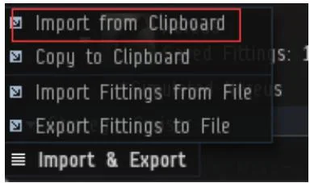

`Heron` 新人挖坟：

```text
[Heron, 新人挖坟]
Inertial Stabilizers I
Inertial Stabilizers I

5MN Microwarpdrive I
Type-E Enduring Cargo Scanner
Relic Analyzer I
Data Analyzer I

Prototype Cloaking Device I
Core Probe Launcher I

Small Gravity Capacitor Upgrade I
Small Gravity Capacitor Upgrade I

Hobgoblin I x7
```

合计约 `3.7m`。新人可以先不上姐妹会针和隐身；扫描强度不够时优先补扫描相关模块，回家跑路时再换更偏逃生的低槽。

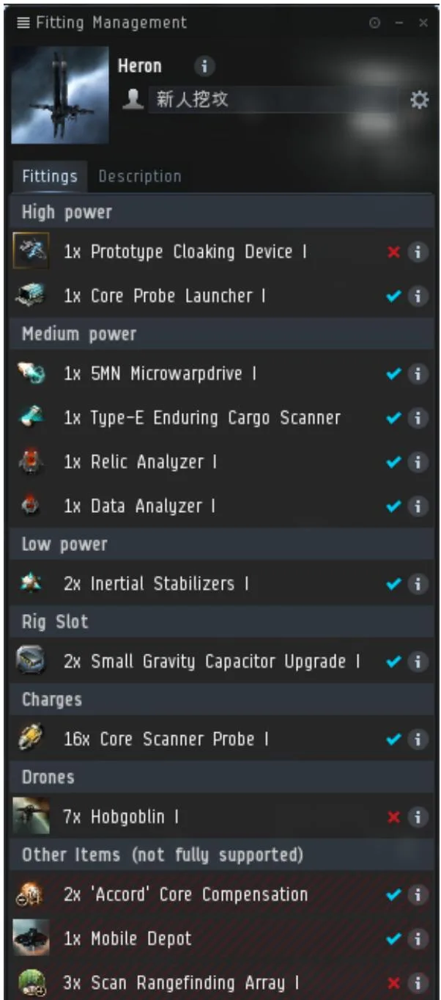

`Astero` 钢板小白：

```text
[Astero, 钢板小白]
Damage Control II
Shadow Serpentis Energized Adaptive Nano Membrane
Imperial Navy 200mm Steel Plates
Small Ancillary Armor Repairer

5MN Y-T8 Compact Microwarpdrive
Cargo Scanner II
Data Analyzer II
Relic Analyzer II

Covert Ops Cloaking Device II
Sisters Core Probe Launcher

Small Trimark Armor Pump II
Small Gravity Capacitor Upgrade I
Small Ionic Field Projector II

Hornet EC-300 x5
'Integrated' Hobgoblin x5
```

不含脑插合计约 `160m`。这套大致在 `7k+` 有效左右，技能合格时扫描强度可覆盖常见信号，可上黑镜。

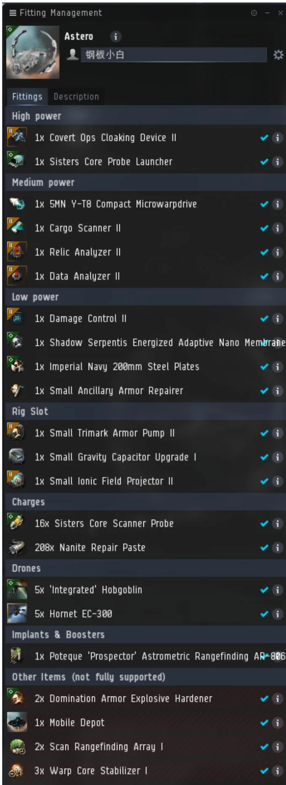

`Astero` T2 钢板小白：

```text
[Astero, T2 钢板小白]
Small Armor Repairer II
Energized Adaptive Nano Membrane II
Armor Explosive Hardener II
200mm Steel Plates II

Data Analyzer II
Cargo Scanner II
Relic Analyzer II
5MN Quad LiF Restrained Microwarpdrive

Covert Ops Cloaking Device II
Core Probe Launcher II

Small Trimark Armor Pump II
Small Hyperspatial Velocity Optimizer II
Small Hyperspatial Velocity Optimizer II

Hobgoblin II x5
Hornet EC-300 x5
Sisters Core Scanner Probe x16
```

合计约 `95m`。需要更高技能，整体打法与“终极小白”相近，但不能稳定硬抗超冬冲击波；爆抗、甲修和船插可以按你的技能与预算微调。


`Astero` 终极小白：

```text
[Astero, 终极小白]
Centii A-Type Small Armor Repairer
Federation Navy 200mm Steel Plates
Imperial Navy Energized Adaptive Nano Membrane
Corpus X-Type Armor Explosive Hardener

Cargo Scanner II
Coreli A-Type 5MN Microwarpdrive
Cap Recharger II
Zeugma Integrated Analyzer

Sisters Core Probe Launcher
Covert Ops Cloaking Device II

Small Trimark Armor Pump II
Small Hyperspatial Velocity Optimizer II
Small Hyperspatial Velocity Optimizer II

Hobgoblin II x5
Warrior II x5
Hornet EC-300 x5
Sisters Core Scanner Probe x24

Damage Control II x1
'Chainmail' 200mm Steel Plates x1
Republic Fleet Small Shield Extender x1
Sisters Core Scanner Probe x24
```

合计约 `650m`。很贵，主要适用于高安开冬眠；廉价低配请看前面的 “T2 钢板小白”，具体使用说明请看章节 7.6.5。


### 8.5 伤害数据库 Damage Data Base

数据主要摘录自 `games.chruker.dk/eve_online` 等旧资料库，属于历史统计参考，不保证和当前版本逐项完全一致。

<table><tr><td colspan="5">隐秘坟的怪</td></tr><tr><td>势力</td><td colspan="4">DPS</td></tr><tr><td></td><td>电</td><td>动</td><td>热</td><td>爆</td></tr><tr><td></td><td colspan="4">Angel</td></tr><tr><td>Lookout</td><td></td><td>27</td><td></td><td>80</td></tr><tr><td>Sentry</td><td></td><td>35</td><td></td><td>103</td></tr><tr><td>Warden</td><td></td><td>9</td><td></td><td>27</td></tr><tr><td>Watcher</td><td></td><td>49</td><td></td><td>145</td></tr><tr><td></td><td colspan="4">Sanshas</td></tr><tr><td>Lookout</td><td>39+9</td><td></td><td>39</td><td></td></tr><tr><td>Sentry</td><td>70+9</td><td></td><td>70</td><td></td></tr><tr><td>Warden</td><td>13+9</td><td></td><td>13</td><td></td></tr><tr><td>Watcher</td><td>50+9</td><td></td><td>50</td><td></td></tr><tr><td></td><td colspan="4">Blood Raiders</td></tr><tr><td>Lookout</td><td>54</td><td></td><td>54</td><td></td></tr><tr><td>Sentry</td><td>99</td><td></td><td>99</td><td></td></tr><tr><td>Warden</td><td>18</td><td></td><td>18</td><td></td></tr><tr><td>Watcher</td><td>71</td><td></td><td>71</td><td></td></tr><tr><td></td><td colspan="4">Guristas</td></tr><tr><td>Lookout</td><td></td><td></td><td>117</td><td></td></tr><tr><td>Sentry</td><td></td><td></td><td>212</td><td></td></tr><tr><td>Warden</td><td></td><td></td><td>39</td><td></td></tr><tr><td>Watcher</td><td></td><td></td><td>151</td><td></td></tr><tr><td></td><td colspan="4">Serpentis</td></tr><tr><td>Lookout</td><td></td><td>40</td><td>66</td><td></td></tr><tr><td>Sentry</td><td></td><td>72</td><td>120</td><td></td></tr><tr><td>Warden</td><td></td><td>14</td><td>22</td><td></td></tr><tr><td>Watcher</td><td></td><td>52</td><td>86</td><td></td></tr><tr><td colspan="5">备注:1. Sentry (1 点反跳), Watcher (-60%网子)2. 萨莎伤害为炮台+导弹,古斯塔斯伤害为导弹,其他均为炮台3. 天使的反跳和网子怪互换一下</td></tr></table>

<table><tr><td colspan="6">冬眠坟炮塔</td></tr><tr><td colspan="2"></td><td colspan="2">攻</td><td colspan="2">防(无盾无结构抗性)</td></tr><tr><td colspan="2">攻击间隔15s</td><td>电</td><td>热</td><td>甲/结构</td><td>甲抗(全抗)</td></tr><tr><td colspan="2">Wakeful Sentry Tower</td><td>546</td><td>546</td><td>7k/3.5k</td><td>40%</td></tr><tr><td colspan="2">Vigilant Sentry Tower</td><td>390</td><td>390</td><td>5k/2.5k</td><td>40%</td></tr><tr><td colspan="2">Restless Sentry Tower</td><td>702</td><td>702</td><td>11k/5.5k</td><td>40%</td></tr><tr><td colspan="2">该炮塔只出现在超冬电离层</td><td colspan="2">攻击间隔12s</td><td></td><td></td></tr><tr><td colspan="2">Impaired Archive Sentry Tower</td><td>783</td><td>783</td><td>13k/7.5k</td><td>30%</td></tr><tr><td colspan="6">备注:游戏内的炮塔均存在一个BUG,当周围有一个破解过的箱子(箱子或是防御单元之类的),并且炮塔已经锁定你了,此时你跃迁出去,会发现所有炮塔转而开始攻击那个破解过的箱子,且不会转火。</td></tr><tr><td colspan="6">环境伤害</td></tr><tr><td></td><td>标冬毒雾</td><td colspan="2">超冬电厂毒云(EM)</td><td>超冬3层废墟</td><td>超冬3层冲击波</td></tr><tr><td>伤害全伤/s</td><td>扩散前4x100扩散后4x250</td><td colspan="2">稳定前600稳定后25</td><td>4x100有暴击800</td><td>普通4x2x300大4x10250/9s</td></tr></table>

### 8.6 气云星座 Gas Cloud Regions

#### Blue Pill – Amber

Low security space (hot-spot constellation – region): Mivora – The Forge
No security space(hot-spot constellation – region): E-8CSQ – Vale of the Silent

#### Crash – Golden

Low security space (hot-spot constellation – region): Umamon – Lonetrek
No security space(hot-spot constellation – region): 09-4XW – Tenal

#### Drop – Viridian

Low security space (hot-spot constellation – region): Amevync – Placid
No security space(hot-spot constellation – region): Assilot – Cloud Ring

#### Exile – Celadon

Low security space (hot-spot constellation – region): Elerelle – Solitude
No security space(hot-spot constellation – region): Pegasus – Fountain

#### Frentix – Lime

Low security space (hot-spot constellation – region): Joas – Derelik
No security space(hot-spot constellation – region): 9HXQ-G – Catch

#### Mindflood – Malachite

Low security space (hot-spot constellation – region): Fabai – Aridia
No security space(hot-spot constellation – region): OK-FEM – Delve

#### Sooth Sayer – Azure

Low security space (hot-spot constellation – region): Tartatven – Molden Heath
No security space(hot-spot constellation – region): 760-9C – Wicked Creek

#### X-instinct – Vermillion

Low security space (hot-spot constellation – region): Hed – Heimatar
No security space(hot-spot constellation – region): I-3ODK – Feythabolis

### 8.7 挖坟成就 Achievements

按着下表自行探索，并成功完成这些成就，就是 EVE 挖坟的游戏乐趣！

<table><tr><td></td><td>介绍</td><td>完成度</td></tr><tr><td colspan="3">铜杯</td></tr><tr><td></td><td>成功挖了一个普通遗迹/数据坟</td><td></td></tr><tr><td></td><td>第一次损挖坟船</td><td></td></tr><tr><td></td><td>第一次去虫洞中挖坟</td><td></td></tr><tr><td></td><td>第一次去敌对区域挖坟</td><td></td></tr><tr><td></td><td>第一次被隐秘坟炸了</td><td></td></tr><tr><td></td><td>第一次进入限冬</td><td></td></tr><tr><td></td><td>第一次进入标冬</td><td></td></tr><tr><td></td><td>第一次进入超冬</td><td></td></tr><tr><td></td><td>成功挖穿限冬</td><td></td></tr><tr><td></td><td>成功挖了低安气云</td><td></td></tr><tr><td></td><td>成功挖了00气云</td><td></td></tr><tr><td></td><td>成功挖穿标冬</td><td></td></tr><tr><td></td><td>成功挖穿超冬前2层</td><td></td></tr><tr><td></td><td>成功用上黑镜</td><td></td></tr><tr><td></td><td>考古,破解技能达到双V</td><td></td></tr><tr><td colspan="3">银杯</td></tr><tr><td></td><td>技能达标,开上T2小白</td><td></td></tr><tr><td></td><td>成功挖了战斗气云</td><td></td></tr><tr><td></td><td>在隐秘坟的爆炸下幸存</td><td></td></tr><tr><td></td><td>成功使用暴力开法挖了标冬</td><td></td></tr><tr><td></td><td>(隐藏) 扫描出寂静战场</td><td></td></tr><tr><td></td><td>(隐藏) 挖到旗舰注盾</td><td></td></tr><tr><td colspan="3">金杯</td></tr><tr><td></td><td>成功无伤撞出超冬雷区3个箱子</td><td></td></tr><tr><td></td><td>成功挖光高/超隐4个箱子</td><td></td></tr><tr><td></td><td>成功挖光超冬第三层所有10个箱子</td><td></td></tr><tr><td></td><td>(隐藏) 挖到高统6号</td><td></td></tr><tr><td colspan="3">白金杯</td></tr><tr><td></td><td>完成以上所有成就</td><td></td></tr><tr><td></td><td>(隐藏) 成功使用小白挖穿超冬包括三层(除废墟中的)</td><td></td></tr></table>

### 8.8 原作者后记 Postscript

以下内容保留原作者当年收尾时的口吻，仅做少量错字、标点和排版整理。它反映的是原稿作者当时的状态，不代表这份单文件稿之后不能继续由他人校订。

在一本正经地写了这么多内容后，终于可以留个章节，聊聊我自己的想法。EVE 真的是一个有趣的游戏，单挖坟这一项就够玩很久，但是困难的上手体验阻止了很多人来享受这份快乐。我写这份攻略的原因，也是因为当时没有一个合适的挖坟攻略，所以就心血来潮写了一份挖坟入门攻略。没想到挺受大家喜爱，于是越写越多，从整合群里大佬们的攻略，到翻译 EVEUni 的内容，最后编写了原创经验和技巧，我玩 EVE 的主要动力也渐渐变成了写这份攻略。从 0.9 版到现在的 1.6 版，这份攻略倾注了我大量的心血，共 93 页、近 3w 字，花费了 1100 多个小时的编写时间。一年的时间过去了，也该告一段落了，谢谢各位的支持，谢谢南北派这个大家庭的帮助，谢谢！

Q：为什么用这种正式格式？

A：写这份攻略的时候正好是在我国外留学写论文的时期，所以强迫症发作就直接按论文格式来了。

Q：为什么文章里都是英文？

A：因为我玩的就是英文客户端，所以很多东西根本不知道中文名称叫什么，不过后来已经给大部分文字补了中文名称。

Q：为什么写的这么笼统/宏观？

A：我希望看这份攻略的朋友，在看完后能够自行找到解法，或者说能够明白这些机关的原理，从而可以应对不同的情况。不过我也提供了视频攻略，可以有个直观的了解。

Q：还计划更新这个攻略吗？

A：我目前已经 AFK 了，后续应该不会再弄这份攻略了，不过还是欢迎各位的纠错，我还是会抽空更改的，主要内容应该不会变更了。如果有人愿意接手的话，请私聊我。

Q：还有什么未完成的目标吗?

A：超冬小白挖光的目标没有达成，只做到了挖 8 个，电离层的机关没弄明白。当然还有高统 6 号。某些稀少坟的攻略没有来得及做，例如“燕军遗迹”。
